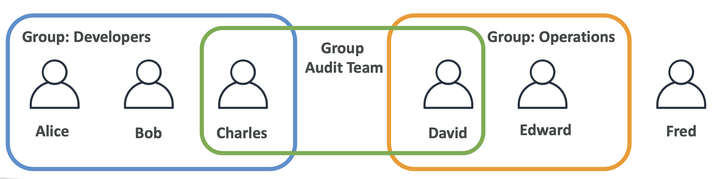
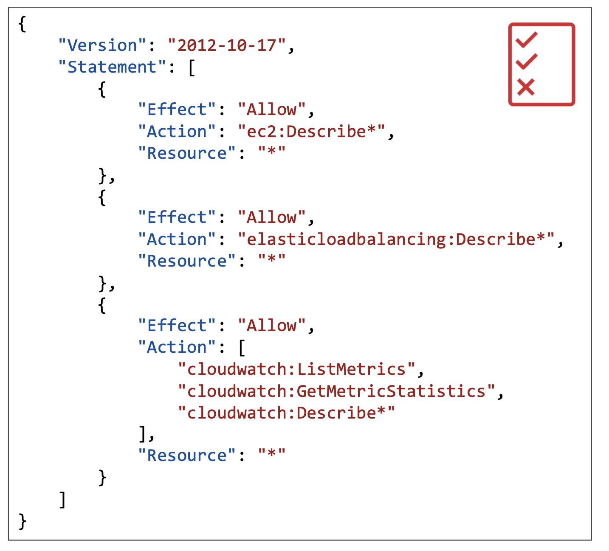
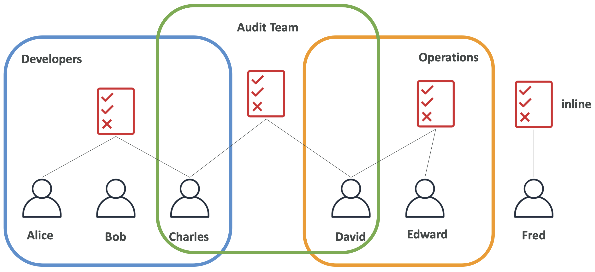
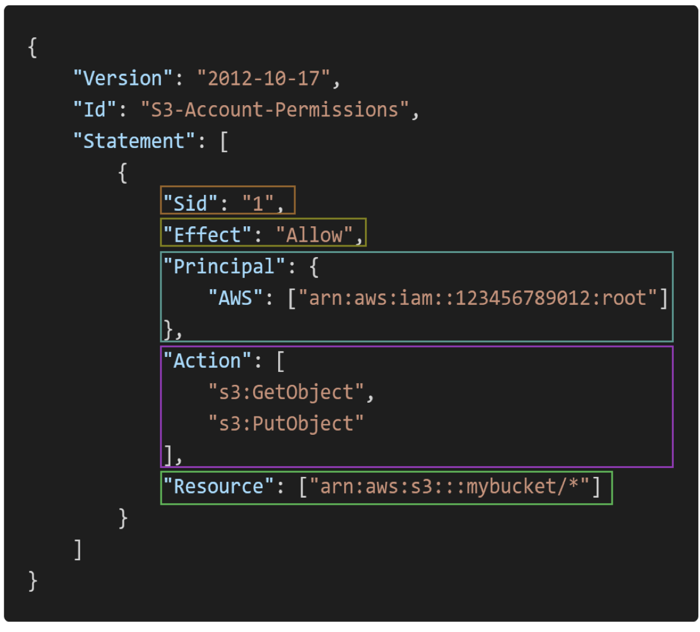

# IAM: Users & Groups

- IAM = Identity and Access Management, **Global service**
- **Root account** created by default, shouldn’t be used or shared
- **Users** are people within your organization, and can be grouped
- **Groups** only contain users, not other groups
- Users don’t have to belong to a group, and user can belong to multiple groups
- We create user and groups to allow them to use AWS accounts and for that we need to give them permissions.
- When creating IAM users you can create tags to associate with it.

# IAM: Permissions

- **Users or Groups** can be assigned JSON documents called policies
- These policies define the **permissions** of the users
- In AWS you apply the **least privilege principle**: don’t give more permissions than a user needs

# IAM Policies inheritance

# IAM Policies Structure 

- Consists of
    - **Version**:policy language version,always include“2012-10- 17”
    - **Id**:an identifier for the policy (optional)
    - **Statement**:one or more individual statements (required)
- Statements consists of
    - **Sid**:an identifier for the statement(optional)
    - **Effect**:whether the statement allows or denies access (Allow, Deny)
    - **Principal**:account/user/role to which this policy applied to
    - **Action**:list of actions this policy allows or denies
    - **Resource**:list of resources to which the actions applied to
    - **Condition**:conditions for when this policy is in effect (optional)

# IAM – Password Policy

- Strong passwords = higher security for your account
- In AWS, you can setup a password policy:
    - Set a minimum password length
    - Require specific character types: including uppercase letters, lowercase letters, numbers, non-alphanumeric characters
- Allow all IAM users to change their own passwords
- Require users to change their password after some time (password expiration)
- Prevent password re-use

# Multi Factor Authentication - MFA

- Users have access to your account and can possibly change configurations or delete resources in your AWS account
- You want to **protect your Root Accounts and IAM users**
- MFA = password you know + security device you own
- Main **benefit** of MFA: if a password is stolen or hacked, the account is not compromised
- **MFA Device options**: Virtual MFA (Google Authenticator, Authy) (Support for multiple tokens on a single device) + Universal 2nd Factor (U2F) Security key (YubiKey by Yubico, Key Fob by Gemalto, KeyFob for GovCloud US by SurePassID - 3rd party) (Support for multiple root and IAM users using a single security key)

# How can users access AWS ?

- To access AWS, you have three options:
    - **AWS Management Console** (protected by password + MFA)
    - **AWS Command Line Interface** (CLI): protected by access keys
    - **AWS Software Developer Kit** (SDK) - for code: protected by access keys
- Access Keys are generated through the AWS Console
- Users manage their own access keys
- **Access Keys are secret, just like a password. Don’t share them**
- Access Key ID ~= *username*
- Secret Access Key ~= *password*

# AWS CLI

- A tool that enables you to interact with AWS services using commands in your command-line shell
- Direct access to the public APIs of AWS services
- You can develop scripts to manage your resources

# AWS SDK

- Language-specific APIs (set of libraries)
- Enables you to access and manage AWS services programmatically
- Embedded within your application
- Supports
    - SDKs(JavaScript,Python,PHP,.NET,Ruby,Java,Go,Node.js, C++)
    - Mobile SDKs (Android, iOS, ...)
    - IoT Device SDKs (Embedded C, Arduino, ...)
- Example: AWS CLI is built on AWS SDK for Python named Boto

# AWS CloudShell

- Alternative to using the terminal to issue commands against AWS.
- CloudShell is not available in all regions. Can try in us-east-1.
- All commands start with keyowrd *aws* and by default run in the same region you are currently in but can specify another region with "--region"
- All files created within this shell environment will stay there until deleted.
- There is a feature to upload/download files in CloudShell.

# IAM Roles for Services

- Some AWS service will need to perform actions on your behalf
- To do so, we will assign **permissions** to AWS services with **IAM Roles**
- IAM roles will be like users but they are intended for AWS services and not physical users/people.
- Common roles:
    - EC2 Instance Roles
    - Lambda Function Roles
    - Roles for CloudFormation

# IAM Security Tools

- **IAM Credentials Report (account-level)**
    - a report that lists all your account's users and the status of their various credentials
- **IAM Access Advisor (user-level)**
    - Access advisor shows the service permissions granted to a user and when those services were last accessed.
    - You can use this information to revise your policies