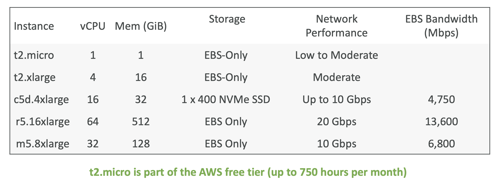
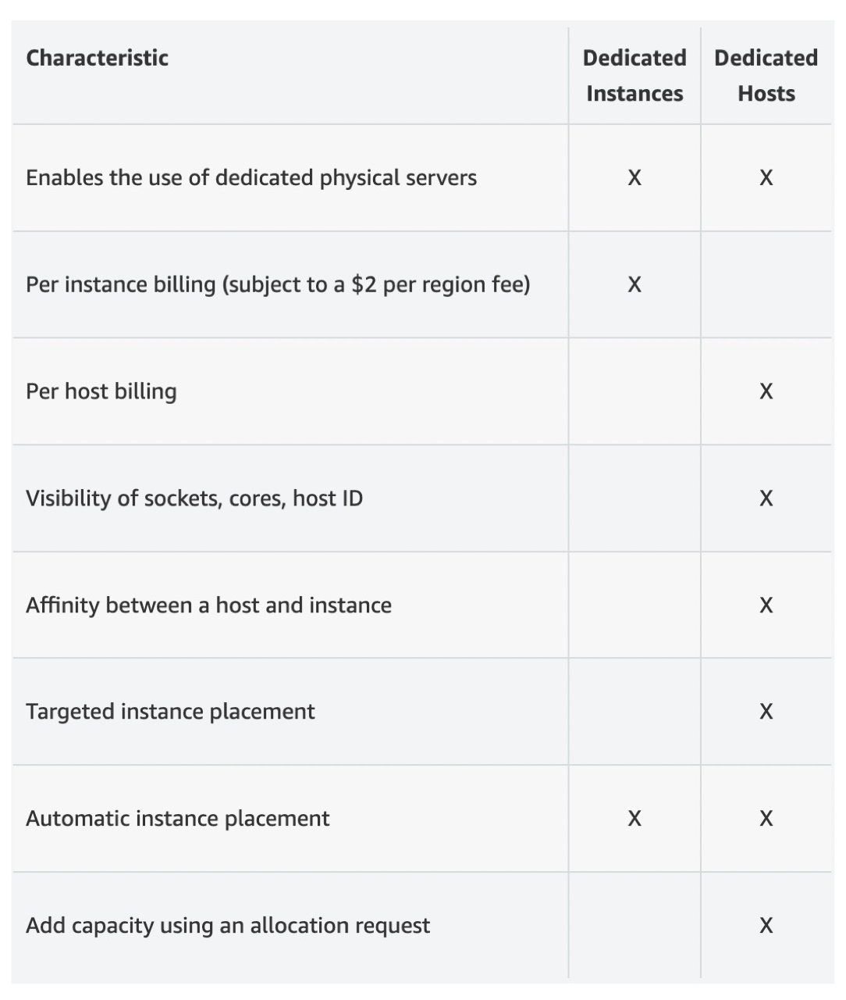
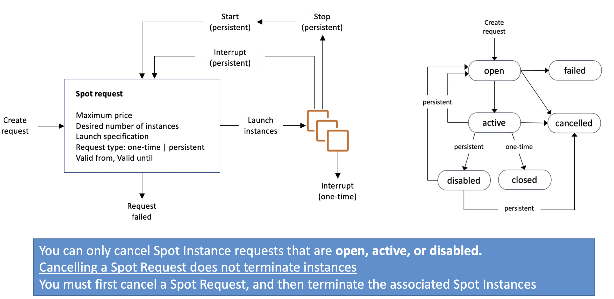
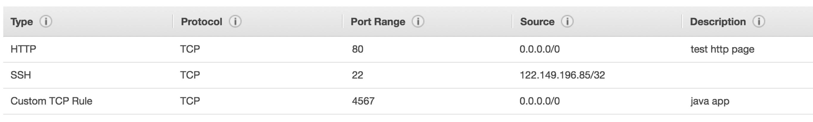
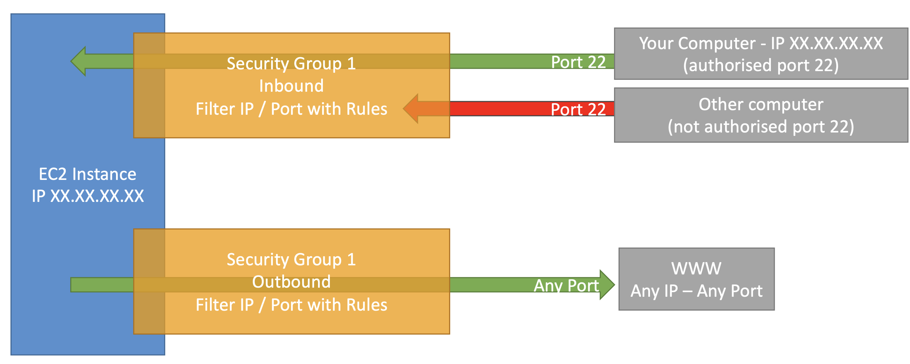
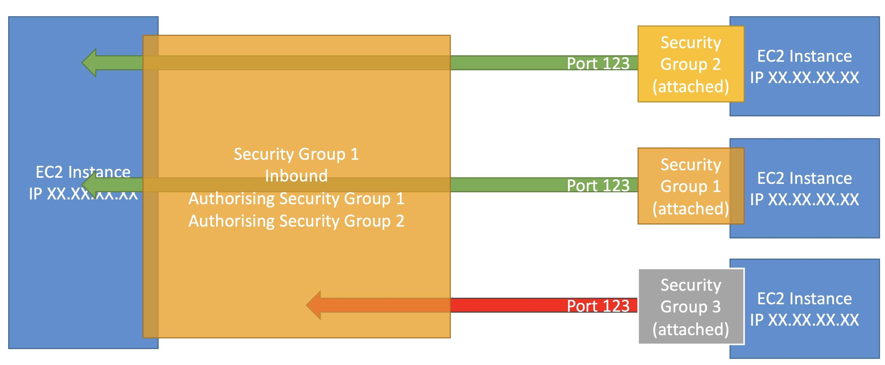

# EC2

- EC2 = Elastic Compute Cloud = Infrastructure as a Service
- It mainly consists in the capability of : 
    - Renting virtual machines (**EC2**)
    - Storing data on virtual drives (**EBS**)
    - Distributing load across machines (**ELB**)
    - Scaling the services using an auto-scaling group (**ASG**)

- **EC2 sizing & configuration options**

    - Operating System (**OS**): Linux, Windows or Mac OS
    - How much compute power & cores (**CPU**)
    - How much random-access memory (**RAM**)
    - How much storage space:
        - Network-attached (**EBS & EFS**)
        - hardware (**EC2 Instance Store**)
    - Network card: speed of the card, Public IP address
    - Firewall rules: **security group**
    - Bootstrap script (configure at first launch): **EC2 User Data**

- **EC2 User Data**
    - It is possible to bootstrap our instances using an EC2 User data script.
    - **bootstrapping** means launching commands when a machine starts
    - That script is **only run once** at the instance **first start**
    - By explicitly configuring the instance, user data can be executed every time an instance is re-started
    - EC2 user data is used to automate boot tasks such as:
        - Installing updates
        - Installing software
        - Downloading common files from the internet
        - Anything you can think of
    - Can pass two types of user data - **shell scripts and cloud-init directives**
    - Can also pass this data into the launch wizard as plain text or as a file.
    - The EC2 User Data Script runs with the **root user**
    - You can't change the user data if the instance is running (even by using root user credentials), but you can view it.

- **Notes**
    - In order to use SSH to access your EC2 instance, create a key pair and attach it to the instance when creating it
    - As a n/w rule in the security group, created by the console directly called launch-wizard-1, we need to allow SSH from anywhere.
    - Also we can allow HTTP traffic from the internet if we want to.
    - For EBS volumes attached with the EC2 instance you can enable delete on termination option.
    - If you stop and then restart the instance the Public IP may change, Private IP will remain same
    - Never enter your IAM API key, the Access Key ID and the Secret Access key into an EC2 Instance (with aws configure command) instead use IAM roles.

# EC2 Instance 

- AWS has the following naming convention: **m5.2xlarge**
    - m: instance class
    - 5: generation (AWS improves them over time)
    - 2xlarge: size within the instance class

- **Tenancy**
    - defines how EC2 instances are distributed across physical hardware and affects pricing. There are three tenancy options available:
        - **Shared (default)** — Multiple AWS accounts may share the same physical hardware.
        - **Dedicated Instance (dedicated)** — Your instance runs on single-tenant hardware.
        - **Dedicated Host (host)** — Your instance runs on a physical server with EC2 instance capacity fully dedicated to your use, an isolated server with configurations that you can control.

- **EC2 Instance Types – General Purpose**
    - Great for a diversity of workloads such as web servers or code repositories
    - Balance between:
        - Compute
        - Memory
        - Networking
    - Ex: t2.micro

- **EC2 Instance Types – Compute Optimized**
    - Great for compute-intensive tasks that require high performance processors:
        - Batch processing workloads
        - Media transcoding
        - High performance web servers
        - High performance computing (HPC)
        - Scientific modeling & machine learning
        - Dedicated gaming servers

- **EC2 InstanceTypes – Memory Optimized**
    - Fast performance for workloads that process large data sets in memory
    - Use cases:
        - High performance, relational/non-relational databases
        - Distributed web scale cache stores
        - In-memory databases optimized for BI (business intelligence)
        - Applications performing real-time processing of big unstructured data

- **EC2 InstanceTypes – Storage Optimized**
    - Great for storage-intensive tasks that require high, sequential read and write access to large data sets on local storage
    - Use cases:
        - High frequency online transaction processing (OLTP) systems
        - Relational & NoSQL databases
        - Cache for in-memory databases (for example, Redis)
        - Data warehousing applications
        - Distributed file systems

- **EC2 Instance Types - example**

- **EC2 Instance Connect**
    - Connect to your EC2 instance within your browser with SSH
    - No need to use your key file that was downloaded
    - Will upload a temporary SSH key to establish a connection.
    - The “magic” is that a temporary key is uploaded onto EC2 by AWS
    - **Works only out-of-the-box with Amazon Linux 2**
    - Need to make sure the port 22 is still opened!
    - Need to use the default ec2-user

# EC2 Instances Purchasing Options

- **1. On Demand** - short workload, predictable pricing, pay by second
    - Pay for what you use:
        - Linux or Windows - billing per second, after the first minute
        - All other operating systems - billing per hour
    - Has the highest cost but no upfront payment
    - No long-term commitment
    - Recommended for **short-term** and **un-interrupted workloads**, where you can't predict how the application will behave

- **2. Reserved Instances** - (1 & 3 years)- Reserved Instances (long workloads), Convertible Reserved Instances (long workloads with flexible instances)
    - Up to **72%** discount compared to On-demand
    - You reserve a specific instance attributes (**Instance Type, Region,Tenancy, OS**)
    - **Reservation Period** – **1 year** (+discount) or **3 years** (+++discount)
    - **Payment Options – No Upfront (+), Par tial Upfront (++), All Upfront (+++)**
    - **Reserved Instance’s Scope – Regional or Zonal** (reserve capacity in an AZ)
    - Recommended for steady-state usage applications (think database)
    - You can buy and sell in the Reserved Instance Marketplace
    - **Convertible Reserved Instance**
        - Can change the EC2 instance type, instance family, OS, scope and tenancy
        - Up to 66% discount

- **3. Savings Plans** - (1 & 3 years) –commitment to an amount of usage, long workload
    - Get a discount based on long-term usage (up to 72% - same as RIs)
    - Commit to a certain type of usage ($10/hour for 1 or 3 years)
    - Usage beyond EC2 Savings Plans is billed at the On-Demand price
    - Locked to a specific instance family & AWS region (e.g., M5 in us-east-1)
    - Flexible across:
        - Instance Size (e.g., m5.xlarge, m5.2xlarge)
        - OS (e.g., Linux, Windows)
        - Tenancy (Host, Dedicated, Default)

- **4. Spot Instances** – short workloads, cheap, can lose instances (less reliable)
    - Can get a **discount of up to 90%** compared to On-demand
    - Instances that you can “lose” at any point of time if your max price is less than the current spot price
    - The **MOST cost-efficient** instances in AWS
    - **Useful for workloads that are resilient to failure**
        - Batch jobs
        - Data analysis
        - Image processing
        - Any distributed workloads
        - Workloads with a flexible start and end time
    - **Not suitable for critical jobs or databases**

- **5. Dedicated Hosts** – book an entire physical server, control instance placement
    - A physical server with EC2 instance capacity fully dedicated to your use
    - Allows you address **compliance requirements** and **use your existing server- bound software licenses** (per-socket, per-core, per—VM software licenses)
    - Purchasing Options:
        - **On-demand** – pay per second for active Dedicated Host
        - **Reserved** - 1 or 3 years (No Upfront, Partial Upfront,All Upfront)
    - **The most expensive option**
    - Useful for software that have complicated licensing model (BYOL – Bring Your Own License)
    - Or for companies that have strong regulatory or compliance needs

- **6. Dedicated Instances** – no other customers will share your hardware
    - Instances run on hardware that’s dedicated to you
    - May share hardware with other instances in same account
    - No control over instance placement (can move hardware after Stop / Start)

- **7. Capacity Reservations** – reserve capacity in a specific AZ for any duration
    - Reserve **On-Demand** instances capacity in a specific AZ for any duration
    - You always have access to EC2 capacity when you need it
    - **No time commitment** (create/cancel anytime), **no billing discounts**
    - Combine with Regional Reserved Instances and Savings Plans to benefit from billing discounts
    - You’re charged at On-Demand rate whether you run instances or not
    - Suitable for short-term, uninterrupted workloads that needs to be in a specific AZ
    

- **Choosing the Instance Type**
    - **On demand**: coming and staying in resort whenever we like, we pay the full price
    - **Reserved**: like planning ahead and if we plan to stay for a long time, we may get a good discount.
    - **Savings Plans**: pay a certain amount per hour for certain period and stay in any room type (e.g., King, Suite, Sea View, ...)
    - **Spot instances**: the hotel allows people to bid for the empty rooms and the highest bidder keeps the rooms.You can get kicked out at any time
    - **Dedicated Hosts**: We book an entire building of the resort
    - **Capacity Reservations**: you book a room for a period with full price even you don’t stay in it

- **EC2 Spot Instance Requests**
    - Can get a discount of up to 90% compared to On-demand
    - Define **max spot price** and get the instance while **current spot price < max**
    - The hourly spot price varies based on offer and capacity
    - If the current spot price > your max price you can choose to **stop or terminate** your instance with a **2 minutes grace period**.
    - Other strategy: **Spot Block**
        - “block” spot instance during a specified time frame (1 to 6 hours) without interruptions
        -  In rare situations, the instance may be reclaimed
        - Is deprecated now.
    - **Used for batch jobs, data analysis, or workloads that are resilient to failures.**
    - **Not great for critical jobs or databases**
    - Spot prices vary on AZ.

# How to terminate spot instance

(If the request type is **persistent**, that means that we want this number of instances to be valid as long as the spot request is valid from to valid until. That means that if somehow your instances do get stopped or interrupted based on the spot price, then your spot request will go back into action and when things can be validated, AWS will restart spot instances for you)  
(If you want to cancel a spot request, it needs to be in the **open state, the active state, or the disabled state**)  
(That means that basically it's not failed, it's not canceled, or it's not closed)  
(When you want to cancel a spot request, it's not going to terminate any instances)  
(It is still your responsibility to **terminate these instances** and not the responsibility of AWS)  
(So if you want to terminate spot instances for good and not have them relaunch, you need to first cancel the spot request and then you terminate the associated spot instances)  
(Because if you were to terminate the spot instances first, it goes back into the spot request, and then re-launch the instance)  

# Recover your instance

If an instance becomes unreachable because of an underlying hardware failure or a problem that requires AWS involvement to repair, the instance is automatically recovered.
- A recovered instance is **identical to the original instance**, including the instance ID, private IP addresses, Elastic IP addresses, and all instance metadata.
- If the impaired instance has a public IPv4 address, the instance retains the public IPv4 address after recovery. 
- If the impaired instance is in a placement group, the recovered instance runs in the placement group. 
- During instance recovery, the instance is **migrated as part of an instance reboot, and any data that is in-memory is lost**.

# Spot Fleets
- Spot Fleets = set of Spot Instances + (optional) On-Demand Instances
- The Spot Fleet will try to meet the target capacity with price constraints
    - Define possible launch pools: instance type (m5.large), OS, Availability Zone
    - Can have multiple launch pools, so that the fleet can choose the best and most appropriate launch pool.
    - Spot Fleet stops launching instances when reaching capacity or max cost
- Strategies to allocate Spot Instances:
    - **lowestPrice**: from the pool with the lowest price (cost optimization, short workload)
    - **diversified**: distributed across all pools (great for availability, long workloads)
    - **capacityOptimized**: pool with the optimal capacity for the number of instances
    - **priceCapacityOptimized (recommended)**: pools with highest capacity available, then select the pool with the lowest price (best choice for most workloads)
- <u>Spot Fleets allow us to automatically request Spot Instances with the lowest price</u>
-  A very simple spot instance request where you know exactly the type of instance you want and the AZ you want Vs using a spot fleet and saying, "you can choose all these instance types and all these AZ, and what I need is to get the lowest price, for ex"

- Spot instances can be taken back by AWS with two minutes of notice, so spot instances cannot be reliably used for running application which needs to run for up to 8 hours. Spot blocks can only be used for a span of up to 6 hours.

# Security Groups

- Security Groups are the fundamental of network security in AWS
- They control how traffic is allowed into or out of our EC2 Instances.
- Security groups only contain **allow** rules
- Security groups rules can reference by IP or by security group
- Security groups are acting as a “firewall” on EC2 instances
- They regulate:
    - Access to Ports
    - Authorised IP ranges – IPv4 and IPv6
    - Control of inbound network (from other to the instance)
    - Control of outbound network (from the instance to other)

- Rules: 
    - 1 -By default, security groups allow all outbound traffic. 
    - 2 -Security group rules are always permissive; you can't create rules that deny access. 
    - 3 -Security groups are stateful

- **Security Groups**

- **Reference other security groups**

- **Good to Know**
    - Can be attached to multiple instances
    - Locked down to a **region / VPC** combination
    - Does live “outside” the EC2 – if traffic is blocked the EC2 instance won’t see it
    - *It’s good to maintain one separate security group for SSH access*
    - If your application is not accessible (**time out**), then it’s a security group issue
    - If your application gives a “**connection refused**“ error, then it’s an application error or it’s not launched
    - All inbound traffic is **blocked** by default
    - All outbound traffic is **authorised** by default