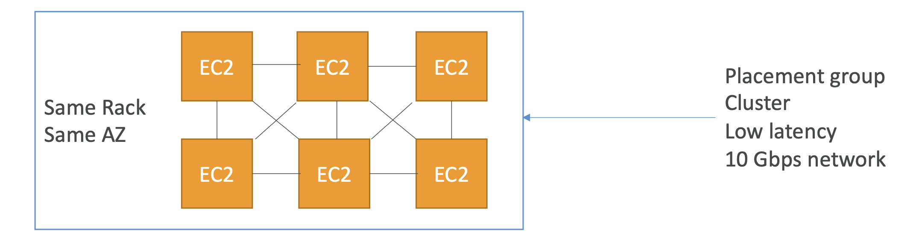
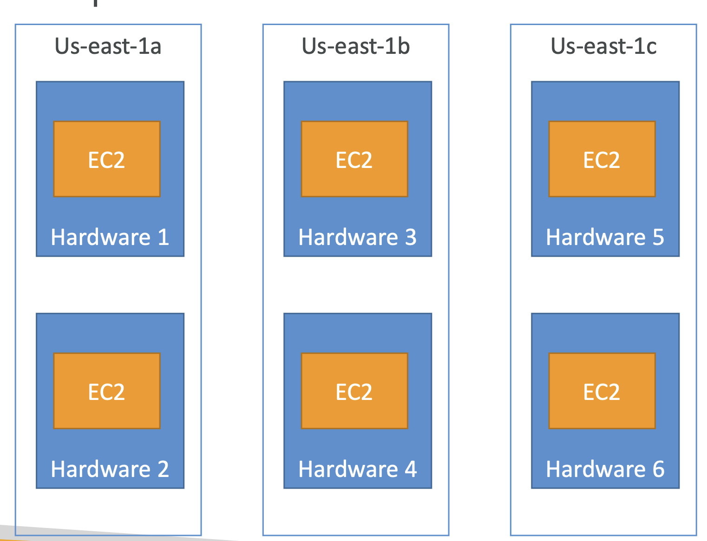
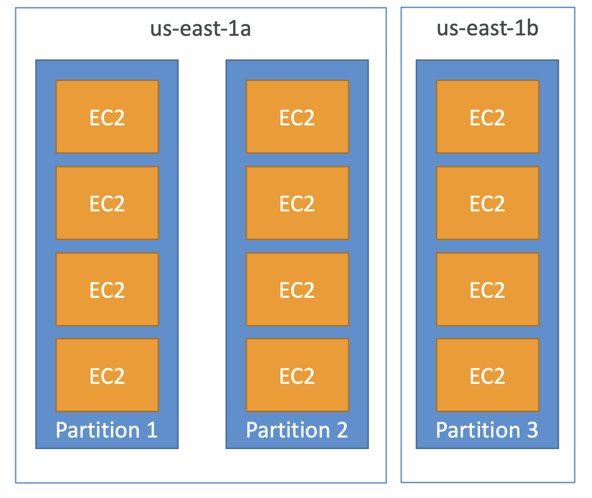
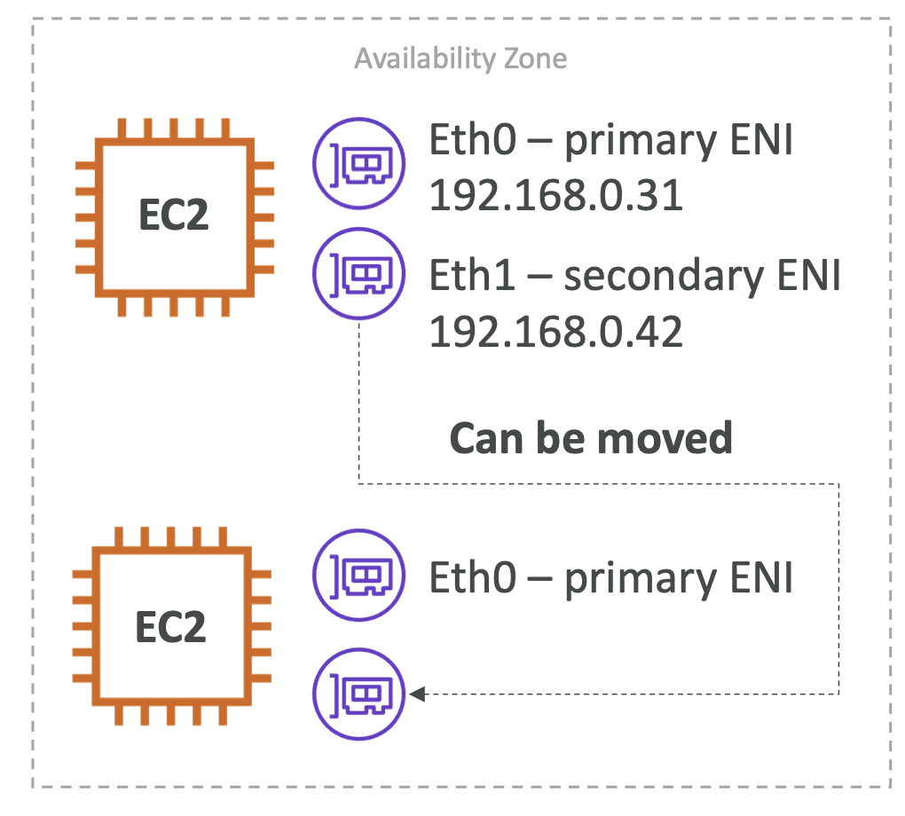
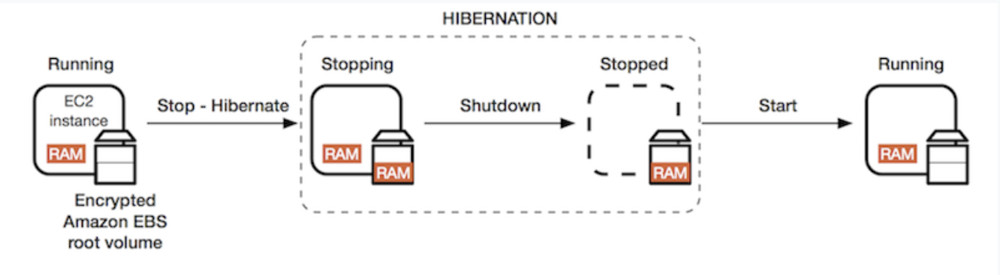
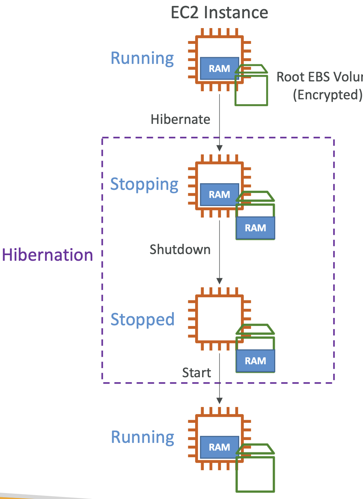

# Elastic IPs

- When you stop and then start an EC2 instance, it can change its public IP.
- If you need to have a fixed public IP for your instance, you need an Elastic IP
- An Elastic IP is a public IPv4 IP you own as long as you don’t delete it
- You can attach it to one instance at a time
- With Elastic IP addresses, you are charged as long as you don't use them. So we need to attach it as soon as possible, otherwise we will be charged.
-  With an Elastic IP address, you can **mask the failure of an instance** or software by rapidly remapping the address to another instance in your account.
- You can only have 5 Elastic IP in your account (you can ask AWS to increase that).
- Overall, **try to avoid using Elastic IP**:
    - They often reflect poor architectural decisions
    - Instead, use a random public IP and register a DNS name to it
    - Or, as we’ll see later, use a Load Balancer and don’t use a public IP (best)

- **Public Vs Private (IPv4)**

    - By default, your EC2 machine comes with:
        - A private IP for the internal AWS Network
        - A public IP, for the WWW.
    - When we are doing SSH into our EC2 machines:
        - We can’t use a private IP, because we are not in the same network (of AWS)
        - We can only use the public IP.
    - If your machine is stopped and then started, the public IP can change

# Placement Groups

- Sometimes you want control over the EC2 Instance placement strategy
- That strategy can be defined using placement groups
- Use placement groups to influence the placement of a group of interdependent instances to meet the needs of your workload
- If there are insufficient unique hardware to fulfill the request then the request fails and can be retried later.
- When you create a placement group, you specify one of the following strategies for the group:
    - **Cluster** — clusters instances into a low-latency group in a single Availability Zone (high performance, high risk) (Can span multiple AZ in the same Region)
    - **Spread** — spreads instances across underlying hardware (max 7 instances per group per AZ)
    - **Partition** — spreads instances across many different partitions (which rely on different sets of racks) within an AZ. Scales to 100s of EC2 instances per group (Hadoop, Cassandra, Kafka) (They are spread but still not isolated from failure but partitions are isolated) (Can have partitions in multiple AZ in the same region)

- **Placement Groups - Cluster**

    
    - **Pros**: Great network (10 Gbps bandwidth between instances with Enhanced Networking enabled - recommended)
    - **Cons**: If the rack fails, all instances fails at the same time
    - **Use case**:
        - Big Data job that needs to complete fast
        - Application that needs extremely low latency and high network throughput
    - A cluster placement group can span peered VPCs in the same Region

- **Placement Groups - Spread**
    
    - **Pros**:
        - Can span across Availability Zones (AZ)
        - Reduced risk of simultaneous failure
        - EC2 Instances are on different physical hardware
    - **Cons**:
        - Limited to 7 instances per AZ per placement group (Applications cannot be very very big)
    - **Use case**:
        - Application that needs to maximize high availability
        - Critical Applications where each instance must be isolated from failure from each other

- **Placement Groups - Partition**
    
    - Up to 7 partitions per AZ
    - Can span across multiple AZs in the same region
    - Up to 100s of EC2 instances
    - Each partition represent a rack in AWS.
    - The instances in a partition do not share racks with the instances in the other partitions
    - A partition failure can affect many EC2 but won’t affect other partitions
    - EC2 instances get access to the partition information as metadata
    - <u>Use cases</u>: (applications that can be partition aware to distribute data and servers across partitions) HDFS, HBase, Cassandra, Kafka  

# Elastic Network Interfaces (ENI)
- Logical component in a VPC that represents a virtual network card
- Gives EC2 Instances access to the network and are outside the EC2
- The ENI can have the following attributes:
	- Primary private IPv4, one or more secondary IPv4
	- One Elastic IP (IPv4) per private IPv4
	- One Public IPv4
	- One or more security groups
	- A MAC address
- You can create ENI independently and attach them on the fly (move them) on EC2 instances for failover
- Bound to a specific availability zone (AZ)
- No need to delete ENI s they dont cost anything.

(We have an AZ and an EC2 instance with the primary ENI eth0 attached)  
(Secondary ENI eth1 will give another private IPv4)  
(Eth1 can be moved from one EC2 to another)  

# EC2 Hibernate
- We know we can stop, terminate instances
	- **Stop** – the data on disk (EBS) is kept intact in the next start
	- **Terminate** – any EBS volumes (root) also set-up to be destroyed is lost. If you set your root volume to be destroyed with your instance it will be destroyed, but any volume not set to be destroyed when your instance terminates will be kept.
    
- On start, the following happens:
	- First start: the OS boots & the EC2 User Data script is run
	- Following starts: the OS boots up
	- Then your application starts, caches get warmed up, and that can take time!
- Introducing **EC2 Hibernate**:
	- The in-memory (RAM) state is preserved
	- The instance boot is much faster! (the OS is not stopped / restarted)
	- Under the hood: the RAM state is written to a file in the root EBS volume
    - The processes that were previously running on the instance are resumed
    - Previously attached data volumes are reattached and the instance retains its instance ID
	- The root EBS volume must be encrypted
    - The EBS volume should have enough space to contain the RAM
	- **Use cases**:
		- Long-running processing
		- Saving the RAM state
		- Services that take time to initialize
        - Speeding up the application start time
    

  
(When hibernation starts, the instance will go into stopping state and RAM will be dumped into the EBS volume)  
(Then the instance shuts down and the RAM disappears)  
(When the instance is started RAM is going to be loaded from disk to the EC2 instance memory)  
(In case of hibernate, the system is still up and not down)  

- **Good To Know**

- **Supported Instance Families** – C3, C4, C5, I3, M3, M4, R3, R4,T2,T3, ...
- **Instance RAM Size** – must be less than 150 GB.
- **Instance Size** – not supported for bare metal instances.
- **AMI** – Amazon Linux 2, Linux AMI, Ubuntu, RHEL, CentOS & Windows... 
- **Root Volume** – must be EBS, encrypted, not instance store, and large
- Available for **On-Demand, Reserved and Spot Instances**
- An instance can **NOT** be hibernated more than 60 days