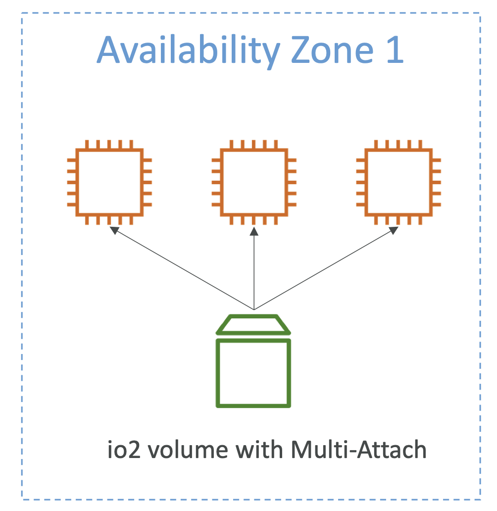
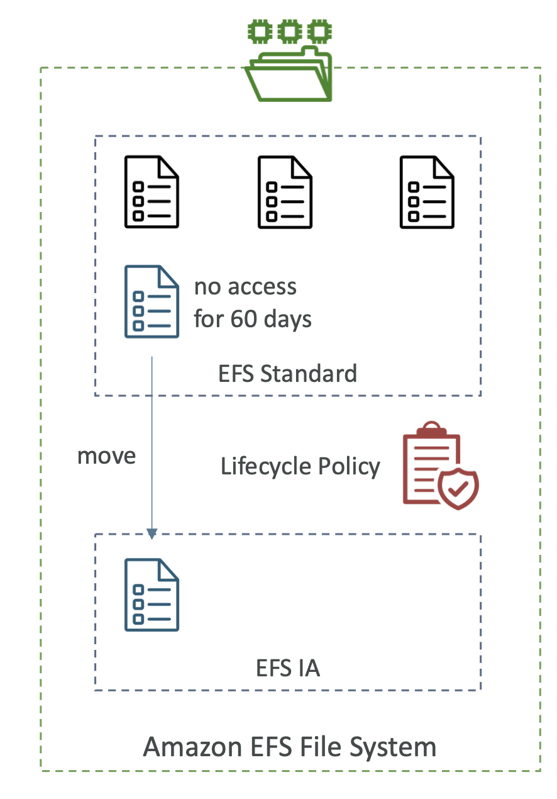

# EBS Volume

- **An EBS (Elastic Block Store) Volume is a network drive you can attach to your instances while they run**
- It allows your instances to persist data, even after their termination
- They can only be mounted to one instance at a time (mostly but then there is Multi-attach feature for some EBS)
- They are bound to a specific availability zone
- Analogy:Think of them as a “network USB stick”
- Free tier: 30 GB of free EBS storage of type General Purpose (SSD) or Magnetic per month

- It’s a **network drive** (i.e. not a physical drive)
	- It uses the network to communicate the instance, which means there might be a bit of latency
	- It can be detached from an EC2 instance and attached to another one quickly
- It’s **locked to an Availability Zone** (AZ)
	- An EBS Volume in us-east-1a cannot be attached to us-east-1b
	- To move a volume across, you first need to snapshot it
- Have a **provisioned capacity** (size in GBs, and IOPS)
	- You get billed for all the provisioned capacity
	- You can increase the capacity of the drive over time

(EBS Volumes attached to EC2 instances, One instance can have many EBS attached)  
(EBS volumes are bound to AZ so in another AZ we need to create another EBS volume)  
(We can also have EBS volumes which are not attached to any instance)  

- **EBS – Delete on Termination attribute**
	- Controls the EBS behaviour when an EC2 instance terminates
	- By default, the root EBS volume is deleted (attribute enabled)
	- By default, any other attached EBS volume is not deleted (attribute disabled)
	- This can be controlled by the AWS console / AWS CLI
	- **Use case: preserve root volume when instance is terminated**
    

# EBS Snapshots

- Make a backup (snapshot) of your EBS volume at a point in time
- Not necessary to detach volume to do snapshot, but recommended
- Can copy snapshots across AZ or Region

(To move a snapshot from one AZ to another, we can take a snapshot and then restore it on the other AZ)  

- **EBS Snapshots Features**

	- **EBS Snapshot Archive**
		- Move a Snapshot to an ”archive tier” that is 75% cheaper
		- Takes within 24 to 72 hours for restoring the archive (restoring is not immidiate)

	- **Recycle Bin for EBS Snapshots**
		- Setup rules to retain deleted snapshots so you can recover them after an accidental deletion
		- Specify retention (from 1 day to 1 year)

	- **Fast Snapshot Restore (FSR)**
		- Force full initialization of snapshot to have no latency on the first use ($$$)

# EBS Volume Types

- EBS Volumes come in 6 types
    - **gp2 / gp3 (SSD)**: General purpose SSD volume that balances price and performance for a wide variety of workloads
    - **io1 / io2 (SSD)**: Highest-performance SSD volume for mission-critical low-latency or high-throughput workloads
    - **st1 (HDD)**: Low cost HDD volume designed for frequently accessed, throughput- intensive workloads
    - **sc1 (HDD)**: Lowest cost HDD volume designed for less frequently accessed workloads

- EBS Volumes are characterized in Size | Throughput | IOPS (I/O Ops Per Sec)
- When in doubt always consult the AWS documentation – it’s good!
- Only gp2/gp3 and io1/io2 can be used as boot volumes
- Solid state drive (SSD) backed volumes optimized for transactional workloads involving frequent read/write operations with small I/O size, where the dominant performance attribute is IOPS.
- Hard disk drive (HDD) backed volumes optimized for large streaming workloads where throughput (measured in MiB/s) is a better performance measure than IOPS.
- Throughput Optimized HDD (st1) and Cold HDD (sc1) volume types CANNOT be used as a boot volume

- **EBS Volume Types Use cases**
    - **1. General Purpose SSD**
        - Cost effective storage, low-latency
        - System boot volumes,Virtual desktops, Development and test environments
        - 1 GiB - 16TiB
        - **gp3**:(newer)
            - Baseline of 3,000 IOPS and throughput of 125 MiB/s
            - Can increase IOPS up to 16,000 and throughput up to 1000 MiB/s independently
        - **gp2**:
            - Small gp2 volumes can burst IOPS to 3,000
            - Size of the volume and IOPS are linked, max IOPS is 16,000
            - 3 IOPS per GB, means at 5,334 GB we are at the max IOPS
    - **2. Provisioned IOPS (PIOPS) SSD**
        - Critical business applications with sustained IOPS performance
        - Or applications that need more than 16,000 IOPS
        - Great for **databases workloads** (sensitive to storage perf and consistency)
        - **io1/io2** (4 GiB - 16 TiB):
            - Max PIOPS: **64,000 for Nitro EC2** instances & 32,000 for other
            - Can increase PIOPS independently from storage size
            - io2 have more durability and more IOPS per GiB (at the same price as io1)
        - **io2 Block Express** (4 GiB – 64 TiB):
            - Sub-millisecond latency
            - Max PIOPS: 256,000 with an IOPS:GiB ratio of 1,000:1
        - Supports EBS Multi-attach
    - **3. Hard Disk Drives (HDD)**
        - Cannot be a boot volume
        - 125 GiB to 16TiB
        - **Throughput Optimized HDD (st1)**
            - Big Data, Data Warehouses, Log Processing
            - Max throughput 500 MiB/s – max IOPS 500
        - **Cold HDD (sc1)**:
            - For data that is infrequently accessed
            - Scenarios where lowest cost is important
            - Max throughput 250 MiB/s – max IOPS 250

- **EBS Multi-Attach – io1/io2 family**

    - Attach the same EBS volume to multiple EC2 instances in the same AZ
    - Each instance has full read & write permissions to the high-performance volume
    - **Use case**:
        - Achieve **higher application availability** in clustered Linux applications (ex:Teradata)
        - Applications must manage concurrent write operations
    - **Up to 16 EC2 Instances at a time**
    - Must use a file system that’s cluster-aware (not XFS, EXT4, etc...)
    - **Multi-attach feature is available only from within an AZ**

# EBS Encryption

- When you create an encrypted EBS volume, you get the following:
    - Data at rest is encrypted inside the volume
    - All the data in flight moving between the instance and the volume is encrypted
    - All snapshots are encrypted
    - All volumes created from the snapshot
- Encryption and decryption are handled transparently (you have nothing to do)
- Encryption has a minimal impact on latency
- EBS Encryption leverages keys from **KMS (AES-256)**
- Copying an unencrypted snapshot allows encryption
- Snapshots of encrypted volumes are encrypted
- To encrypt an unencrypted EBS volume
    - 1 Create an EBS snapshot of the volume
    - 2 Encrypt the EBS snapshot ( using copy )
    - 3 Create new ebs volume from the snapshot ( the volume will also be encrypted )
    - 4 Now you can attach the encrypted volume to the original instance
- When creating snapshot also you can enable ecryption.

# EFS

- EFS – Elastic File System
- Managed NFS (network file system) that can be mounted on many EC2
- EFS works with EC2 instances in multi-AZ
- Highly available, scalable, expensive (3x gp2), pay per use

(Multiple instances from a particluar AZ and Multiple AZs connected to the same EFS)  
(EFS will also need to have a security group attached)  

- **Use cases**: content management, web serving, data sharing,Wordpress
- Uses NFSv4.1 protocol
- Uses security group to control access to EFS
- **Compatible with Linux based AMI (not Windows)**
- Encryption at rest using KMS
- POSIX file system (~Linux) that has a standard file API
- File system scales automatically, pay-per-use, no capacity planning!
- Default security groups will be attached to the EFS volumes allowing inbound traffic from NFS protocol on port 2049 with the source as the security group of the EC2 instance. Allows NFS traffic from the EC2 instance.

- **EFS - Performance & Storage Classes**

    - **EFS Scale**
        - 1000s of concurrent NFS clients, 10 GB+ /s throughput
        - Grow to Petabyte-scale network file system, automatically
    - **Throughput Mode**
        - **Bursting** – 1TB = 50MiB/s + burst of up to 100MiB/s
        - **Provisioned** – set your throughput regardless of storage size, ex: 1 GiB/s for 1 TB storage
        - **Elastic** (recommended)– automatically scales throughput up or down based on your workloads
            - Upto 3GiB/s for reads and 1GiB/s for writes
            - Used for unpredictable workloads 
    - **Performance Mode (set at EFS creation time)**
        - **General Purpose (default)** – latency-sensitive use cases (web server, CMS, etc...) (If you chose the throughput mode as Elastic then this is the only option for Performance mode)
        - **Max I/O**– higher latency, throughput, highly parallel (big data, media processing)

- **EFS – Storage Classes**

    - **Storage Tiers (lifecycle management feature – move file after N days)**
        - Standard: for frequently accessed files
        - Infrequent access (EFS-IA): cost to retrieve files, lower price to store. Enable EFS-IA with a Lifecycle Policy
    - **Availability and durability**
        - Regional (Standard): Multi-AZ, great for prod (default)
        - One Zone: One AZ, great for dev, backup enabled by default, compatible with IA (EFS One Zone-IA)
    - Over 90% in cost saving
    
    (If few files are accessed less frequently like no access for 60 days, then we can set a lifecycle policy)  
    (The policy can move files to EFS-IA which will lower the cost)  
    (You can set at the time of creation when you want to move such files back from the IA, Never or on First Access)  

- **EBS Vs EFS**

    - EBS volumes...
        - one instance (except multi-attach io1/io2)
        - are locked at the Availability Zone (AZ) level
        - gp2: IO increases if the disk size increases
        - io1: can increase IO independently
    - To migrate an EBS volume across AZ
        - Take a snapshot
        - Restore the snapshot to another AZ
        - EBS backups use IO and you shouldn’t run them while your application is handling a lot of traffic
    - Root EBS Volumes of instances get terminated by default if the EC2 instance gets terminated. (you can disable that)
    
    - EFS ...
        - Mounting 100s of instances across AZ
        - EFS share website files (WordPress)
        - Only for Linux Instances (POSIX)
        - EFS has a higher price point than EBS
        - Can leverage EFS-IA for cost savings
    

# AMI

- AMI = Amazon Machine Image
- AMI are a customization of an EC2 instance
	- You add your own software, configuration, operating system, monitoring...
	- Faster boot / configuration time because all your software is pre-packaged
- AMI are built for a **specific region** (and can be copied across regions)
- When AMI is copied from one Region to another, it automatically creates a snapshot in other Region because AMIs are based on the underlying snapshots.
- An Amazon EC2 instance can be launched from either an instance store-backed AMI or an Amazon EBS-backed AMI.
- You can launch EC2 instances from:
	- **A Public AMI**: AWS provided
	- **Your own AMI**: you make and maintain them yourself
	- **An AWS Marketplace AMI**: an AMI someone else made (and potentially sells)

- **AMI Process (from an EC2 instance)**

	- Start an EC2 instance and customize it
	- Stop the instance (for data integrity)
	- Build an AMI – this will also create EBS snapshots
	- Launch instances from other AMIs

# EC2 Instance Store

- EBS volumes are **network drives** with good but “limited” performance
- **<u>If you need a high-performance hardware disk, use EC2 Instance Store</u>**
- EC2 instance is a VM but obviously attached to a real hardware server, and some of these servers have disk space attached. Special type of EC2 instance can leverage Instance store, which is the hard drive attached to the physical server.
- **Better I/O performance and throughput**
- EC2 Instance Store lose their storage if they’re stopped (**ephemeral**) hence cannot be used as a durable long term place to store your data.(For long term storage use EBS)
- **Good for buffer / cache / scratch data / temporary content**
- Risk of data loss if hardware fails
- Backups and Replication are your responsibility
- These are high performance hardware attached volume for your EC2 instance.
- Instance store volumes are included as part of the instance's usage cost.
- The virtual devices for instance store volumes are ephemeral[0-23]

# Notes

- A test file of size 1 gigabytes, is copied into S3 and EBS volume with gp2 with 100 GB of provisioned storage and also into EFS. What is the correct order of the storage charges incurred for the test file on these three storage types?
    - Answer: Cost of test file storage on Amazon S3 Standard < Cost of test file storage on Amazon EFS < Cost of test file storage on Amazon EBS
        - With Amazon EBS Elastic Volumes, you pay only for the resources that you use. The Amazon EFS Standard Storage pricing is $0.30 per GB per month. Therefore the cost for storing the test file on EFS is $0.30 for the month.

        - For Amazon EBS General Purpose SSD (gp2) volumes, the charges are $0.10 per GB-month of provisioned storage. Therefore, for a provisioned storage of 100GB for this use-case, the monthly cost on EBS is $0.10*100 = $10. This cost is irrespective of how much storage is actually consumed by the test file.

        - For S3 Standard storage, the pricing is $0.023 per GB per month. Therefore, the monthly storage cost on S3 for the test file is $0.023.