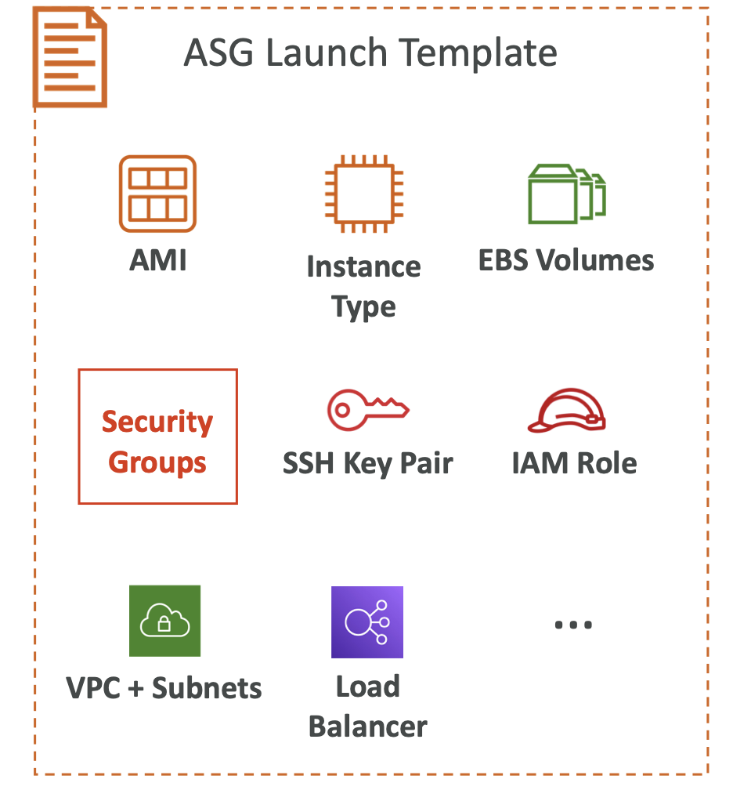
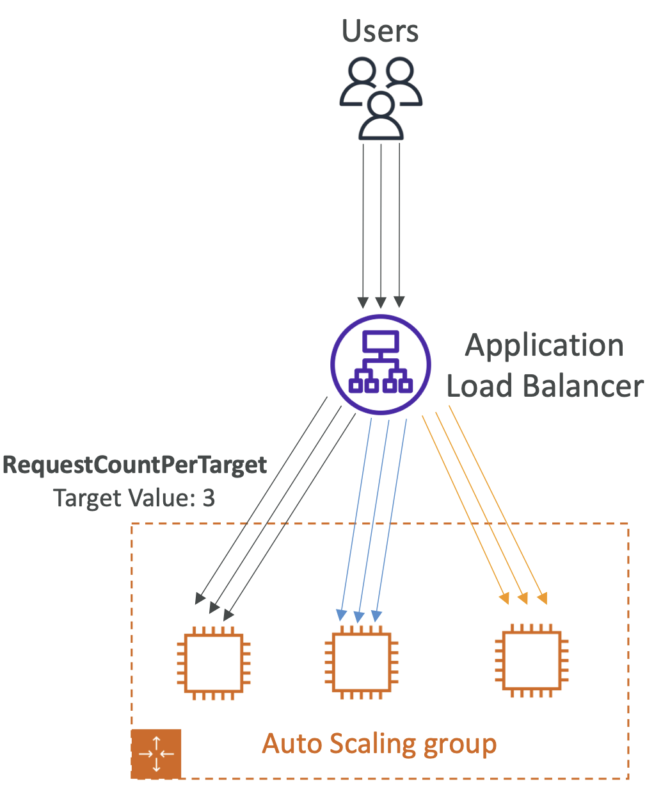
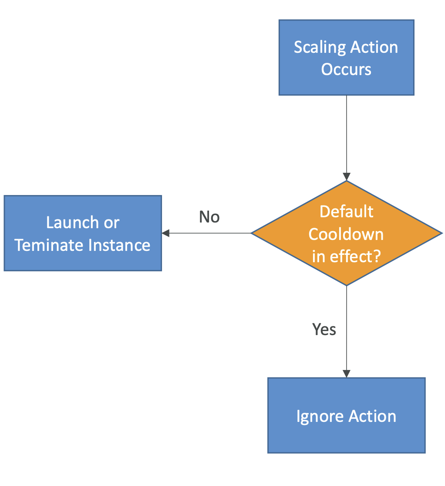

# ASG

- The goal of an Auto Scaling Group (ASG) is to:
    - Scale out (add EC2 instances) to match an increased load
    - Scale in (remove EC2 instances) to match a decreased load
    - Ensure we have a minimum and a maximum number of EC2 instances running
    - Automatically register new instances to a load balancer
    - Re-create an EC2 instance in case a previous one is terminated (ex: if unhealthy)
- ASG are free (you only pay for the underlying EC2 instances)
- EC2 Auto Scaling groups are regional constructs. They can span AZ, but not regions.
- LB health checks can be passed to ASG and then ASG can terminate instances if deemed unhealthy.
- When using LB with ASG, when ASG scales the LB spreads the load accordingly.
- A **Launch Template** (older “Launch Configurations” are deprecated)
    - AMI + InstanceType
    - EC2 User Data
    - EBS Volumes
    - Security Groups
    - SSH Key Pair
    - IAM Roles for your EC2 Instances
    - Network + Subnets Information
    - Load Balancer Information
- Min Size / Max Size / Initial Capacity
- Scaling Policies

    - A launch template is an instance configuration template that an Auto Scaling group uses to launch Amazon EC2 instances. 
    - It is not possible to modify a launch configuration once it is created.
    - To modify the ASG to use different instance type or change other parameters, create a new launch configuration with changes.
    - Then modify the Auto Scaling group to use this new launch configuration.
    - Lastly to clean-up, just delete the old launch configuration as it is no longer needed.
- Defining a launch template instead of a launch configuration allows you to have multiple versions of a template.
- With launch templates, you can provision capacity across multiple instance types using both On-Demand Instances and Spot Instances to achieve the desired scale, performance, and cost
- You cannot use a launch configuration to provision capacity across multiple instance types using both On-Demand Instances and Spot Instances.

- **CloudWatch Alarms & Scaling**

    - It is possible to scale an ASG based on CloudWatch alarms
    - An alarm monitors a metric (such as **Average CPU**, or a **custom metric**)
    - <u>Metrics such as Average CPU are computed for the overall ASG instances</u>
    - Based on the alarm:
        - We can create scale-out policies (increase the number of instances)
        - We can create scale-in policies (decrease the number of instances)

- **Dynamic Scaling Policies**

    - **Target Tracking Scaling**
        - Most simple and easy to set-up
        - Example: I want the average ASG CPU to stay at around 40%
    - **Simple / Step Scaling**
        - When a CloudWatch alarm is triggered (example CPU > 70%), then add 2 units
        - When a CloudWatch alarm is triggered (example CPU < 30%), then remove 1
        - Simple scaling is based on a single scaling adjustment, with a cooldown period between each scaling activity.
        - Step scaling is based on a set of scaling adjustments, known as step adjustments, that vary based on the size of the alarm breach.
        - With step scaling the policy can continue to respond to additional alarms, even while a scaling activity or health check replacement is in progress.(no cooldown period)(all alarms that are breached are evaluated)
- **Scheduled Actions**
    - Anticipate a scaling based on known usage patterns
    - Example: increase the min capacity to 10 at 5 pm on Fridays
    - Can create a maximum of 125 scheduled actions per Auto Scaling group
    - can create scheduled actions on a recurring schedule.
- **Predictive scaling**
    - continuously forecast load and schedule scaling ahead
    - Predictive Scaling only generates schedules for EC2 instances.
- If you are scaling based on a metric that increases or decreases proportionally to the number of instances in an Auto Scaling group, we recommend that you use target tracking scaling policies. Otherwise, we recommend that you use step scaling policies.

- **Good metrics to scale on**
    - **CPUUtilization**: Average CPU utilization across your instances
    - **RequestCountPerTarget**: to make sure the number of requests per EC2 instances is stable
    - **Average Network In / Out** (if your application is network bound)
    - **Any custom metric** (that you push using CloudWatch)

    

- **Scaling Cooldowns**

    - After a scaling activity happens, you are in the **cooldown period (default 300 seconds)**
    - During the cooldown period, the ASG will not launch or terminate additional instances (to allow for metrics to stabilize)
    - Advice: Use a ready-to-use AMI to reduce configuration time in order to be serving request fasters and reduce the cooldown period
    

- **What can I scale with AWS Auto Scaling?**
    - EC2 Auto Scaling groups
    - ECS services (currently ECS services cannot be discovered using resource tags)
    - EC2 Spot Fleets
    - DynamoDB throughput capacity
    - Aurora replicas for Amazon Aurora
- AWS Auto Scaling will scan your selected AWS CloudFormation stack (Application stack) or resources with the specified tags to identify the supported AWS resource types that can be scaled.

- **Temporarily remove instances from ASG**
    - Put an instance that is in the `InService` state into the `Standby` state, update or troubleshoot the instance, and then return the instance to service.
    - Instances that are on **standby** are still part of the Auto Scaling group, but they do not actively handle load balancer traffic.
    - Can put the instances on standby, update the software, and then put the instances back in service.
    - Does not perform health checks on instances that are in a standby state.

- **Default termination policy**
    - 1 -Determine which Azs have the most instances and at least one instance that is not protected from scale-in. 
    - 2 -Determine which instances to terminate to align the remaining instances to the allocation strategy for the On-Demand or Spot Instance
    - 3 -Determine whether any of the instances use the oldest launch template or configuration:
        - 3a. Determine whether any of the instances use the oldest launch template unless there are instances that use a launch configuration. 
        - 3b. Determine whether any of the instances use the oldest launch configuration. 
    - 4 -After applying all of the above criteria, if there are multiple unprotected instances to terminate, determine which instances are closest to the next billing hour.

- **Auto Scaling group lifecycle hook**
    - Lifecycle hooks enable you to perform custom actions as the Auto Scaling group launches or terminates instances. 
    - For example, you could install or configure software on newly launched instances, or download log files from an instance before it terminates.

- **Why didn’t Amazon EC2 Auto Scaling terminate an unhealthy instance?**
    - Health check grace period
    - Suspended processes such as HealthCheck, ReplaceUnhealthy, or Terminate affects this.
    - Instance state in the EC2 console 
        -  does not immediately terminate instances with an Impaired status
        - Delay or not terminate instances that fail to report data for status checks. This usually happens when there is insufficient data for the status check metrics in Amazon CloudWatch.
    - Instance state in Auto Scaling groups - does not perform health checks on instances in the Standby state.
        - Terminate an instance if it is waiting for a lifecycle hook to complete
        - Waiting for an ELB connection draining period to complete
    - ELB health checks - ELB settings can affect health checks and instance replacements.

- **Suspend and resume a process**
    - `Launch`—Adds instances to the Auto Scaling group when the group scales out
    - `Terminate`—Removes instances
    - `AddToLoadBalancer`—Adds instances to the attached load balancer target group
    - `AlarmNotification`—Accepts notifications from CloudWatch alarms
    - `AZRebalance`—Balances the number of instances in the group evenly across all of the specified AZ when the group becomes unbalanced
    - `HealthCheck`—Checks the health of the instances and marks an instance as unhealthy/healthy
    - `InstanceRefresh`—Terminates and replaces instances using the instance refresh feature
    - `ReplaceUnhealthy`—Terminates instances that are marked as unhealthy and then creates new instances to replace them
    - `ScheduledActions`—Performs the scheduled scaling actions that you create or that are created for you 
    - **Considerations**
        - Suspending a process affects all instances in ASG. Ex, you can suspend the `HealthCheck` and `ReplaceUnhealthy` processes to reboot instances without EC2 Auto Scaling terminating the instances based on its health checks. If you need EC2 Auto Scaling to perform health checks on remaining instances, then use the **standby** feature instead of the suspend-resume feature
        - If you suspend the `Launch` and `Terminate`, or `AZRebalance` and then you make changes to your ASG, for ex, by detaching instances or changing the AZ that are specified, your group can become unbalanced between AZ. If that happens, after you resume the suspended processes, EC2 Auto Scaling gradually redistributes instances evenly between the Availability Zones.
        - Suspending `AlarmNotification` allows you to temporarily stop the group's target tracking, step, and simple scaling policies without deleting the scaling policies or their associated CloudWatch alarms. To temporarily stop individual scaling policies instead, **Disable the scaling policy**.