# Elastic Load Balancer

- **What is load balancing?**

    - Load Balances are servers that forward traffic to multiple servers (e.g., EC2 instances) downstream
    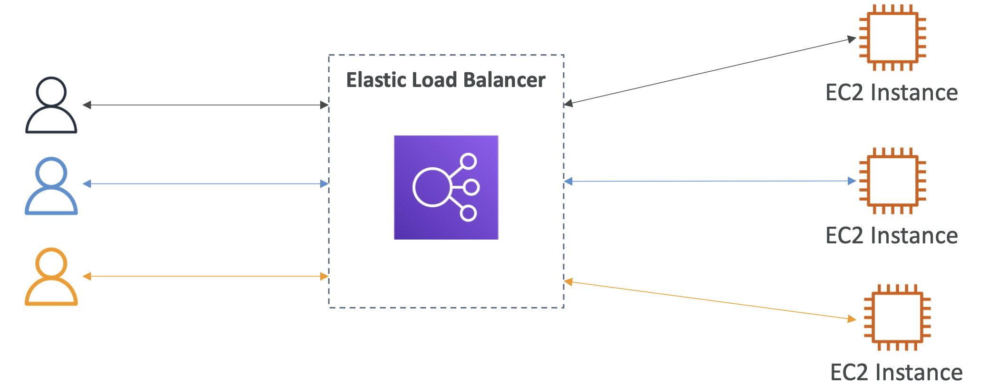
    - Spread load across multiple downstream instances
    - Expose a single point of access (DNS) to your application • Seamlessly handle failures of downstream instances
    - Do regular health checks to your instances
    - Provide SSL termination (HTTPS) for your websites
    - Enforce stickiness with cookies
    - High availability across zones
    - Separate public traffic from private traffic

- **Why use an Elastic Load Balancer?**
    - An Elastic Load Balancer is a **managed load balancer**
	    - AWS guarantees that it will be working
	    - AWS takes care of upgrades, maintenance, high availability
	    - AWS provides only a few configuration knobs
    - It costs less to setup your own load balancer but it will be a lot more effort on your end
    - It is integrated with many AWS offerings / services
	    - EC2, EC2 Auto Scaling Groups, Amazon ECS
	    - AWS Certificate Manager (ACM), CloudWatch
	    - Route53, AWS WAF, AWS Global Accelerator

- You must ensure that your load balancer can communicate with registered targets **on both the listener port and the health check port**.
- You must verify that the security groups associated with the load balancer allow traffic on both port in both directions. 

- **Types of load balancer on AWS**

    - AWS has **4 kinds of managed Load Balancers**
    - **Classic Load Balancer** (v1 - old generation) – 2009 – CLB
	    - HTTP, HTTPS, TCP, SSL(secureTCP)
    - **Application Load Balancer** (v2 - new generation) – 2016 – ALB
	    - HTTP, HTTPS, WebSocket
    - **Network Load Balancer** (v2 - new generation) – 2017 – NLB
	    - TCP, TLS(secureTCP), UDP
    - **Gateway Load Balancer** – 2020 – GWLB
	    - Operates at layer 3 (Network layer) – IP Protocol
    - Overall, it is recommended to use the newer generation load balancers as they provide more features
    - Some load balancers can be setup as internal (private) or external (public) ELBs

# Health Checks

- Health Checks are crucial for Load Balancers
- They enable the load balancer to know if instances it forwards traffic to are available to reply to requests
- The health check is done on a port and a route (/health is common)
- If the response is not 200 (OK), then the instance is unhealthy

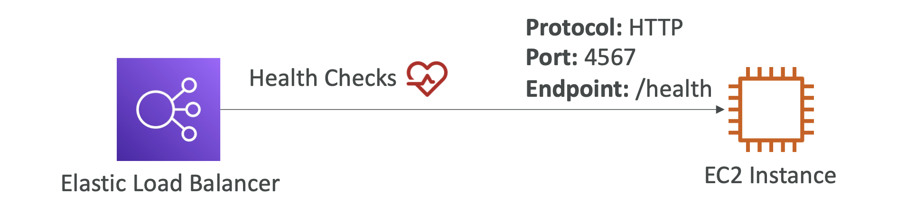

# Load Balancer Security Groups

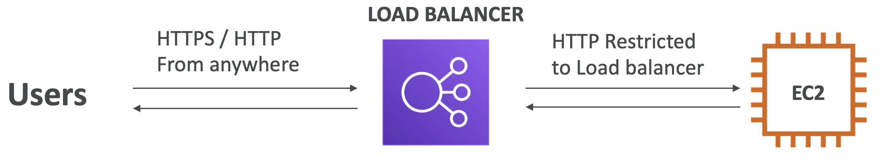  
(Users can access load balancer using HTTP or HTTPS)  
(EC2 instances should only allow traffic coming from the load balancer)  
  
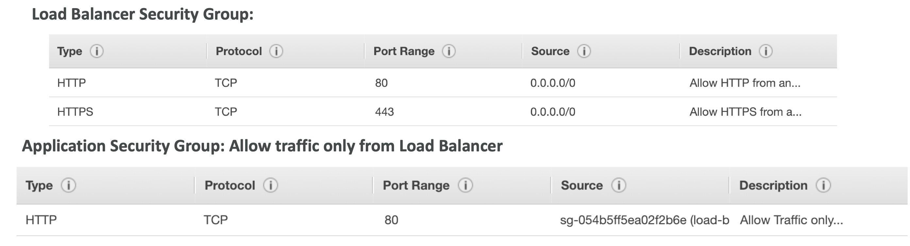  
(For the LB security group, Port 80 and 43 is opened for 0.0.0.0/0 which means anywhere)  
(For the EC2 or Application security group, port 80 is opened for security group of the LB)

# Application Load Balancer

- Application load balancers is Layer 7 (HTTP)
- Load balancing to multiple HTTP applications across machines (target groups)
- Load balancing to multiple applications on the same machine (ex: containers)
- Support for HTTP/2 and WebSocket
- Support redirects (from HTTP to HTTPS for example)
- Routing tables to different target groups:
    - Routing based on path in URL (example.com/**users** & example.com/**posts**)
    - Routing based on hostname in URL (**one.example.com** & **other.example.com**)
    - Routing based on Query String, Headers (example.com/users?**id=123&order=false**)
- ALB are a great fit for micro services & container-based application (example: Docker & Amazon ECS)
- Has a port mapping feature to redirect to a dynamic port in ECS
- In comparison, we’d need multiple Classic Load Balancer per application
- We can create multiple rules within the ALB and the rules take effect in order of priority i.e highest priority wins.

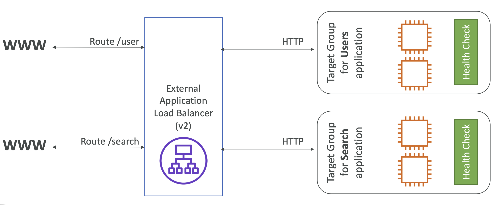
  (First target group is going to route for /user and the second target group which is for the search application will be routed through the rules for /search routes)  
  (Based on the route in the ALB, the traffic is routes correctly to 2 different applications)  
  
- **Target Groups**
    - EC2 instances (can be managed by an Auto Scaling Group) – HTTP
    - ECS tasks (managed by ECS itself) – HTTP
    - Lambda functions – HTTP request is translated into a JSON event
    - IP Addresses – must be private IPs
    - ALB can route to multiple target groups
    - Health checks are at the target group level

- **Query Strings/Parameters Routing**
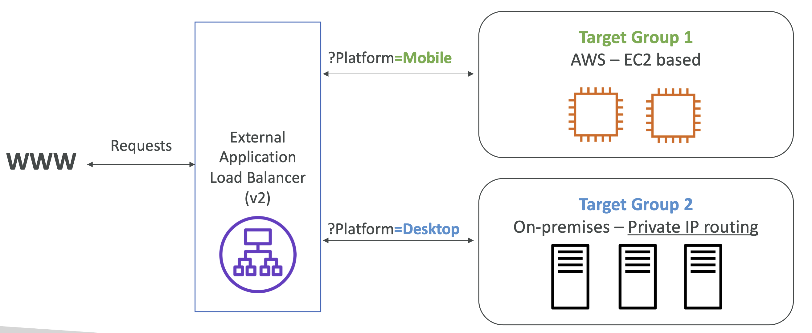
(First target group has EC2 instances and the other is private, on-prem servers. The private IP of the servers will be specified in the target group)  
(Suppose we want to send the first target group on mobile-based traffic and the second target group on desktop-based traffic)  
(For this we can use **query string or parameters routing**)  
(For mobile based traffic we can check for ?Platform=Mobile in the URL that the clients are using and ?Platform=Desktop for the other)  

- **Good to Know**

    - Fixed hostname (XXX.region.elb.amazonaws.com)
    - The application servers don’t see the IP of the client directly
        - The true IP of the client is inserted in the header X-Forwarded-For
        - We can also get Port (X-Forwarded-Port) and proto (X-Forwarded-Proto)
    
    (When client IP talks to the Load Balancer, it performs a **connection termination**, and when the LB talks to the application or EC2 instance, its going to use the **Load Balancer IP** which is Private IP into the EC2)  
    (For the EC2 instance to know the origin client IP it will look into the extra header in the HTTP request called X-Forwarded-Port)  

# Network Load Balancer (v2)

- Network load balancers (Layer 4) allow to:
    - **Forward TCP & UDP traffic to your instances**
    - Handle millions of request per seconds
    - Less latency ~100 ms (vs 400 ms for ALB)
- **NLB has one static IP per AZ, and supports assigning Elastic IP** (helpful for whitelisting specific IP)
- Expose you application with a set of static or Elastic IPs. If your application needs to be accessed only by a few IPs then NLB is the right answer.
- For each AZ you enable for the NLB, AWS assigns an IPv4 address or you can use Elastic IP instead for each AZ.
- NLB are used for extreme performance, TCP or UDP traffic
- Not included in the AWS free tier

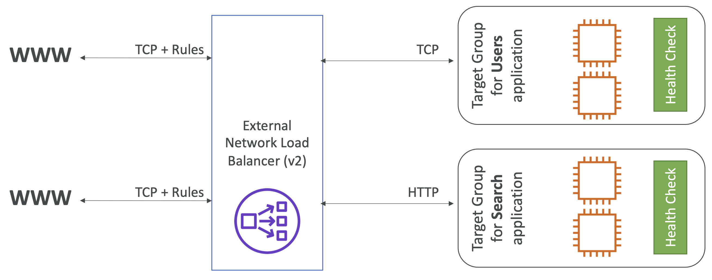
(Looks very similar like ALB but with few differences, in the backend we can use TCP or HTTP and in the front end use only TCP)  

- **Target Groups**
    - EC2 instances
    - IP Addresses – must be private IPs - must be hard coded - Can be a mix of private IPs of the EC2 and private IP of server in the Data centre
    - Application Load Balancer
    - **<u>Health Checks support the TCP, HTTP and HTTPS Protocols</u>**

    - After the load balancer receives a connection request, it selects a target from the target group for the default rule
    - If you specify targets using an **instance ID**, traffic is routed to instances using the **primary private IP address** specified in the primary network interface for the instance.
    - The load balancer rewrites the destination IP address from the data packet before forwarding it to the target instance.
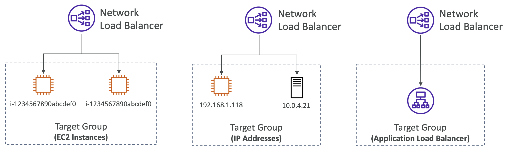  
(The purpose of having an NLB in front of an ALB can be when you need fixed IP addresses which can be provided by the NLB and then ALB can have all the rules which can be created around handling HTTP traffic)  

# Gateway Load Balancer

- Deploy, scale, and manage a fleet of 3rd party network virtual appliances in AWS
- Example: Firewalls, Intrusion Detection and Prevention Systems, Deep Packet Inspection Systems, payload manipulation, ...
- Operates at Layer 3 (Network Layer) – IP Packets
- Combines the following functions:
    - **Transparent Network Gateway** – single entry/exit for all the traffic
    - **Load Balancer** – distributes traffic to your virtual appliances
- Uses the **GENEVE** protocol on port 6081
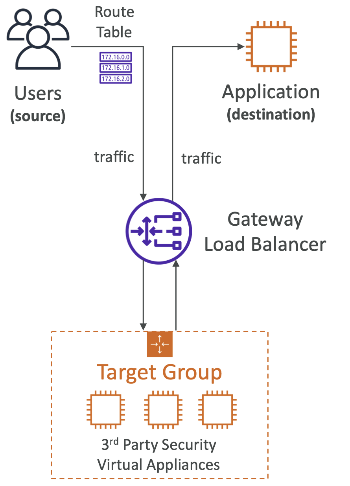  
(Users access the Application using say a LB but if you want to inspect the n/w traffic before being sent the application)  
(If you actually deployed third party virtual appliance for inspecting traffic, which are basically bunch of EC2 instances where all the traffic goes for inspection)  
(Behind the table the route tables for your VPC needs to be updated, and then all user traffic is diverted to the GLB)  
(GLB will then spread the traffic among the target group of virtual appliances)  
(The appliances will analyze the traffic, for ex if its firewall then intruder detection and so on)  
(If the appliance are happy with the traffic then it will be send back to GLB or it will be dropped as needed)  
(Then GLB will forward it to the Application)  
(For the application all this is transparent and all the traffic has come from the GLB)  

- **Target Groups**
    - EC2 instances
    - IP Addresses – must be private IPs
    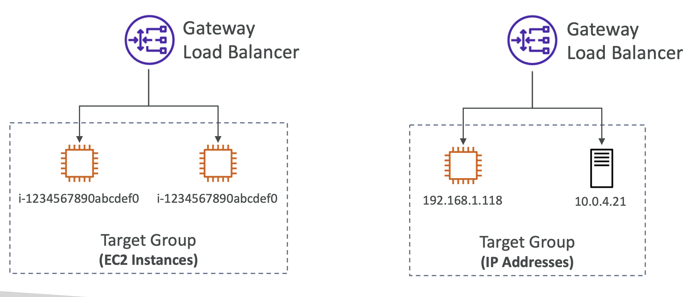

# Sticky Sessions (Session Affinity)

- It is possible to implement stickiness so that the same client is always redirected to the same instance behind a load balancer
- This works for Classic Load Balancer, Application Load Balancer, and Network Load Balancer
- For both CLB & ALB, the “cookie” used for stickiness has an expiration date you control
- **Use case**: make sure the user doesn’t lose his session data
- Enabling stickiness may bring imbalance to the load over the backend EC2 instances
- The request will send the cookie to achieve the stickiness.

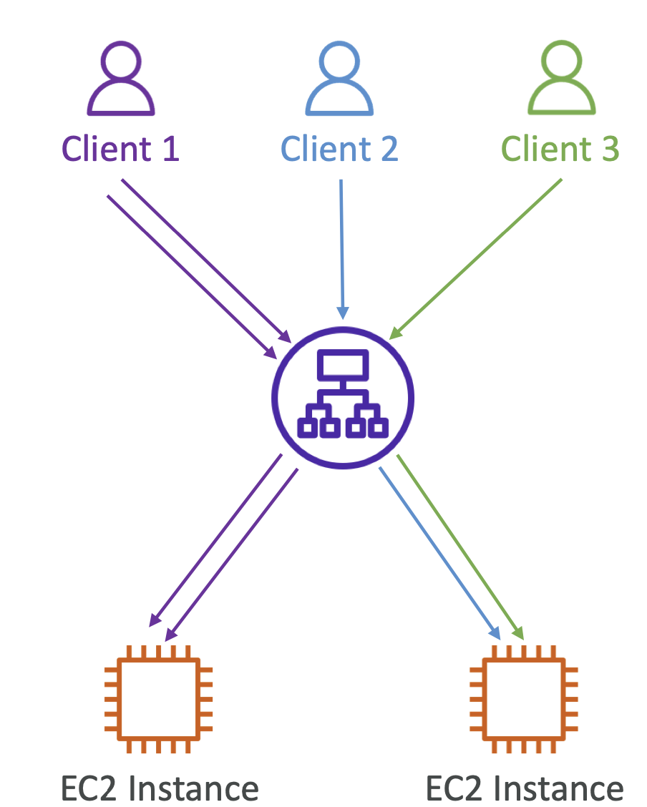

- **Cookie Names**
    - **1. Application-based Cookies**
        - Custom cookie
            - Generated by the target (or application itself)
            - Can include any custom attributes required by the application
            - Cookie name must be specified individually for each target group
            - Don’t use **AWSALB, AWSALBAPP, or AWSALBTG** (reserved for use by the ELB)
        - Application cookie
            - Generated by the load balancer
            - Cookie name is **AWSALBAPP**
    - **2. Duration-based Cookies**
        - Cookie generated by the load balancer
        - Will have an expiry based on the duration generated by the LB
        - Cookie name is AWSALB for ALB, AWSELB for CLB

- **Cross-Zone Load Balancing**
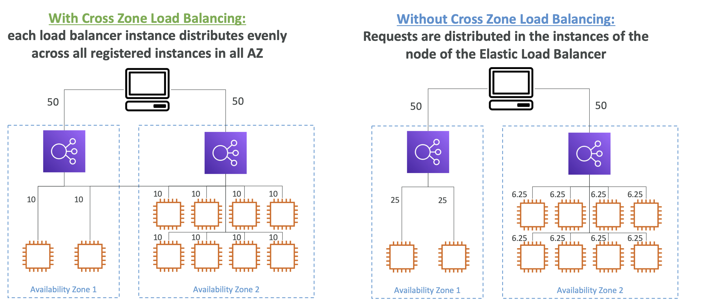

- **Application Load Balancer**
    - Enabled by default (can be disabled at the Target Group level)
    - No charges for inter AZ data
- **Network Load Balancer & Gateway Load Balancer**
    - Disabled by default
    - You pay charges ($) for inter AZ data if enabled
- **Classic Load Balancer**
    - Disabled by default
    - No charges for inter AZ data if enabled

# Load Balancer - Encryption

- The load balancer uses an X.509 certificate (SSL/TLS server certificate)
- You can manage certificates using ACM (AWS Certificate Manager)
- You can create upload your own certificates alternatively
- HTTPS listener:
    - You must specify a default certificate
    - You can add an optional list of certs to support multiple domains
    - Clients can use **SNI (Server Name Indication)** to specify the hostname they reach
    - Ability to specify a security policy to support older versions of SSL /TLS (legacy clients)
    - Specify the location of the certificates for ex ACM or IAM (not recommended) or Import it.

- **SSL – Server Name Indication (SNI)**
    - SNI solves the problem of loading **multiple SSL certificates onto one web server** (to serve multiple websites)
    - It’s a “newer” protocol, and requires the client to **indicate** the hostname of the target server in the initial SSL handshake
    - The server will then find the correct certificate, or return the default one
    - Note:
        - Only works for ALB & NLB (newer generation), CloudFront
        - Does not work for CLB (older gen)
        - ALB and NLB Supports multiple listeners with multiple SSL certificates and uses SNI to make it work.

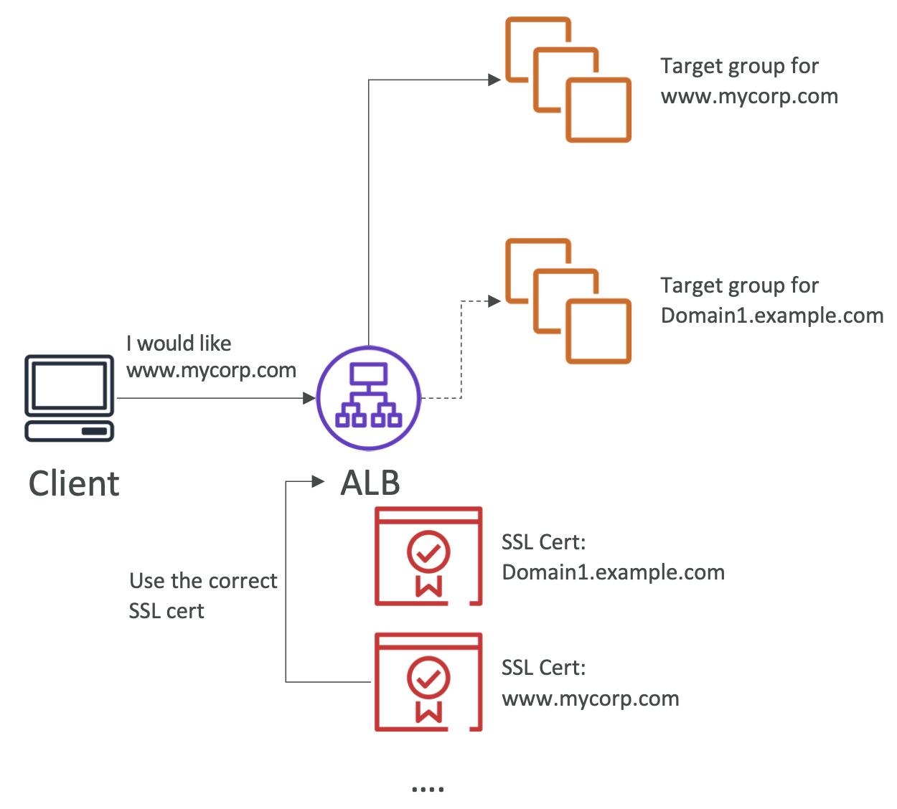

# Connection Draining

- Different names:
    - Connection Draining – for CLB
    - Deregistration Delay – for ALB & NLB
- Time to complete “in-flight requests” while the instance is de-registering or unhealthy
- Stops sending new requests to the EC2 instance which is de-registering
- Between 1 to 3600 seconds (default: 300 seconds)
- Can be disabled (set value to 0)
- Set to a low value if your requests are short
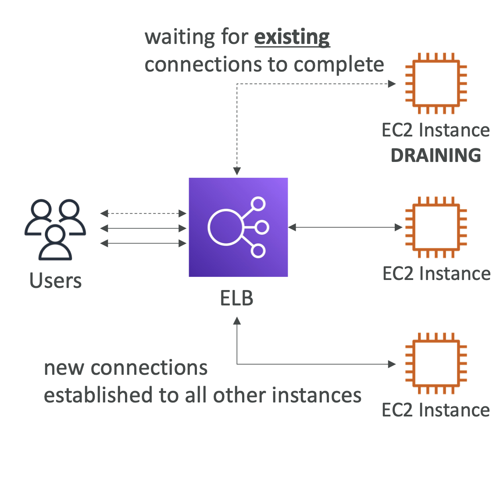  
(Users that are connected to the draining instance are going to be given rnough time called the draining period to complete their existing request)  
(Once everything is done all connections will be shut down)  
(If new users connect to the ELB then the request will be established with other EC2 instances while the instance is draining)  

# ASG

- The goal of an Auto Scaling Group (ASG) is to:
    - Scale out (add EC2 instances) to match an increased load
    - Scale in (remove EC2 instances) to match a decreased load
    - Ensure we have a minimum and a maximum number of EC2 instances running
    - Automatically register new instances to a load balancer
    - Re-create an EC2 instance in case a previous one is terminated (ex: if unhealthy)
- ASG are free (you only pay for the underlying EC2 instances)
- LB health checks can be passed to ASG and then ASG can terminate instances if deemed unhealthy.
- When using LB with ASG, when ASG scales the LB spreads the load accordingly.
- A **Launch Template** (older “Launch Configurations” are deprecated)
    - AMI + InstanceType
    - EC2 User Data
    - EBSVolumes
    - Security Groups
    - SSH Key Pair
    - IAM Roles for your EC2 Instances
    - Network + Subnets Information
    - Load Balancer Information
- Min Size / Max Size / Initial Capacity
- Scaling Policies

    - A launch template is an instance configuration template that an Auto Scaling group uses to launch Amazon EC2 instances. 
    - It is not possible to modify a launch configuration once it is created.
    - To modify the ASG to use different instance type or change other paramters, create a new launch configuration with changes.
    - Then modify the Auto Scaling group to use this new launch configuration.
    - Lastly to clean-up, just delete the old launch configuration as it is no longer needed.
- Defining a launch template instead of a launch configuration allows you to have multiple versions of a template.
- With launch templates, you can provision capacity across multiple instance types using both On-Demand Instances and Spot Instances to achieve the desired scale, performance, and cost
- You cannot use a launch configuration to provision capacity across multiple instance types using both On-Demand Instances and Spot Instances.
- 

- **CloudWatch Alarms & Scaling**

    - It is possible to scale an ASG based on CloudWatch alarms
    - An alarm monitors a metric (such as **Average CPU**, or a **custom metric**)
    - <u>Metrics such as Average CPU are computed for the overall ASG instances</u>
    - Based on the alarm:
        - We can create scale-out policies (increase the number of instances)
        - We can create scale-in policies (decrease the number of instances)

- **Dynamic Scaling Policies**

    - **TargetTracking Scaling**
        - Most simple and easy to set-up
        - Example: I want the average ASG CPU to stay at around 40%
    - **Simple / Step Scaling**
        - When a CloudWatch alarm is triggered (example CPU > 70%), then add 2 units
        - When a CloudWatch alarm is triggered (example CPU < 30%), then remove 1
    - **Scheduled Actions**
        - Anticipate a scaling based on known usage patterns
        - Example: increase the min capacity to 10 at 5 pm on Fridays
- **Predictive scaling**
        - continuously forecast load and schedule scaling ahead

- **Good metrics to scale on**
    - **CPUUtilization**: Average CPU utilization across your instances
    - **RequestCountPerTarget**: to make sure the number of requests per EC2 instances is stable
    - **Average Network In / Out** (if your application is network bound)
    - **Any custom metric** (that you push using CloudWatch)

    

- **Scaling Cooldowns**

    - After a scaling activity happens, you are in the **cooldown period (default 300 seconds)**
    - During the cooldown period, the ASG will not launch or terminate additional instances (to allow for metrics to stabilize)
    - Advice: Use a ready-to-use AMI to reduce configuration time in order to be serving request fasters and reduce the cooldown period
    