# RDS

- RDS stands for Relational Database Service
- It’s a managed DB service for DB use SQL as a query language.
- It allows you to create databases in the cloud that are managed by AWS
    - Postgres
    - MySQL
    - MariaDB
    - Oracle
    - Microsoft SQL Server
    - Aurora (AWS Proprietary database)

- **RDS versus deploying DB on EC2**

    - RDS is a managed service:
        - Automated provisioning, OS patching
        - Continuous backups and restore to specific timestamp (Point in Time Restore)!
        - Monitoring dashboards
        - Read replicas for improved read performance
        - Multi AZ setup for DR (Disaster Recovery)
        - Maintenance windows for upgrades
        - Scaling capability (vertical and horizontal)
        - Storage backed by EBS (gp2 or io1)
    - BUT you can’t SSH into your instances (We dont have access to the actual EC2 instances)

- **Storage Auto Scaling**

    - Helps you increase storage on your RDS DB instance dynamically
    - When RDS detects you are running out of free database storage, it scales automatically
    - Avoid manually scaling your database storage
    - You have to set **Maximum Storage Threshold** (maximum limit for DB Storage)
    - Automatically modify storage if:
        - Free storage is less than 10% of allocated storage
        - and Low-storage lasts at least 5 minutes
        - and 6 hours have passed since last modification
    - Useful for applications with **unpredictable workloads**
    - Supports all RDS database engines (MariaDB, MySQL,PostgreSQL, SQL Server, Oracle)
    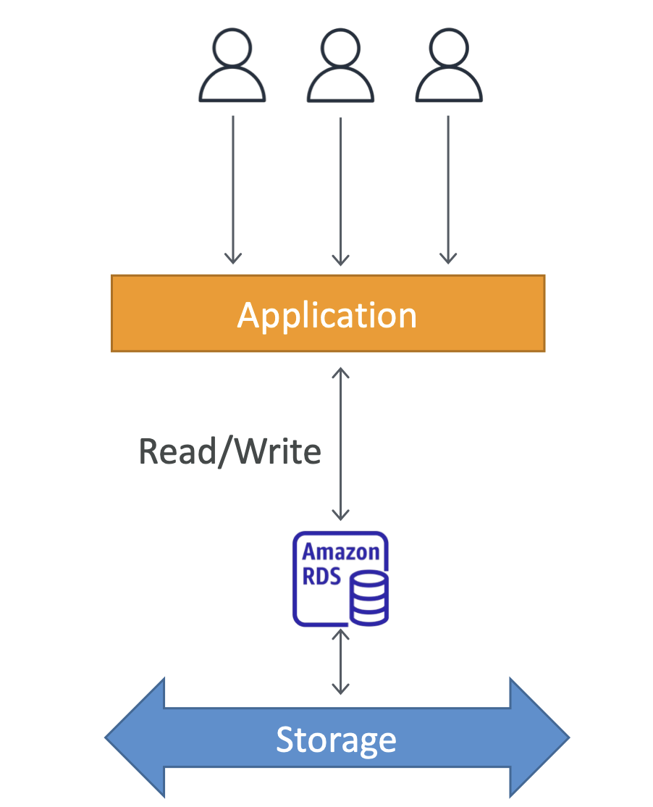

- **Read Replicas for read scalability**

    - Up to 15 Read Replicas
    - Within AZ, Cross AZ or Cross Region
    - Replication is **ASYNC**, so reads are eventually consistent
    - Replicas can be promoted to their own DB (Once promoted they are out of the replication mechanism)
    - Applications must update the connection string to leverage read replicas

    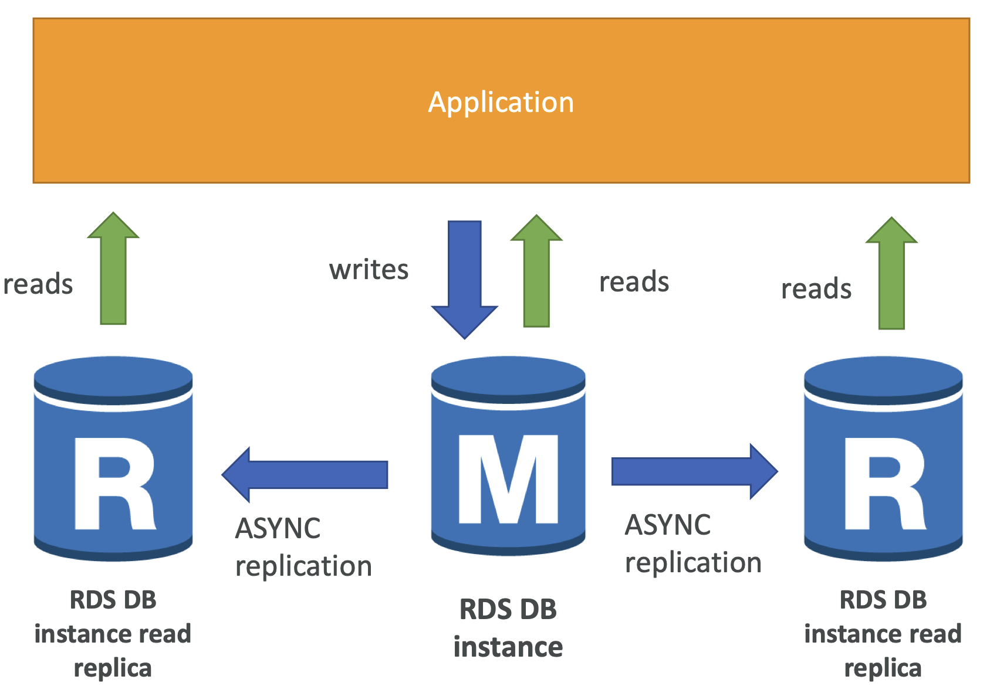

- **Read Replicas – Use Cases**

    - You have a production database that is taking on normal load
    - You want to run a reporting application to run some analytics. This can overload the the DB and slow down the production application.
    - You create a Read Replica to run the new workload there and the Reporting/Analytics application can read from replica.
    - The production application is unaffected
    - Read replicas are used for SELECT (=read) only kind of statements (not INSERT, UPDATE, DELETE)
    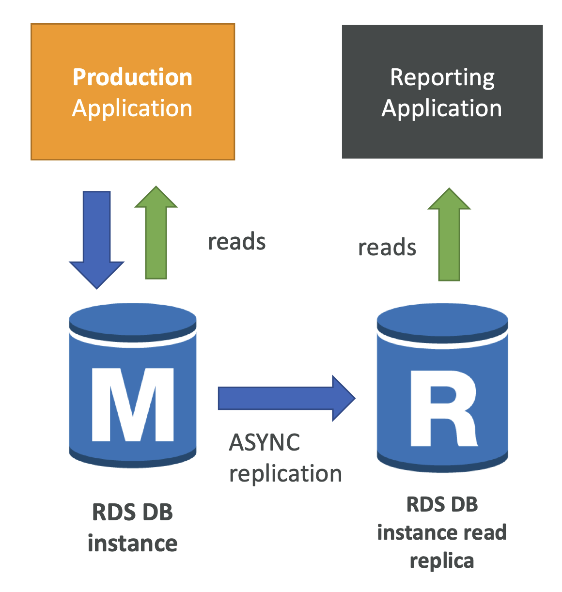

- **RDS Read Replicas – Network Cost**

    - In AWS there’s a network cost when data goes from one AZ to another
    - **For RDS Read Replicas within the same region(can be different AZ in same region), you don’t pay that fee**
    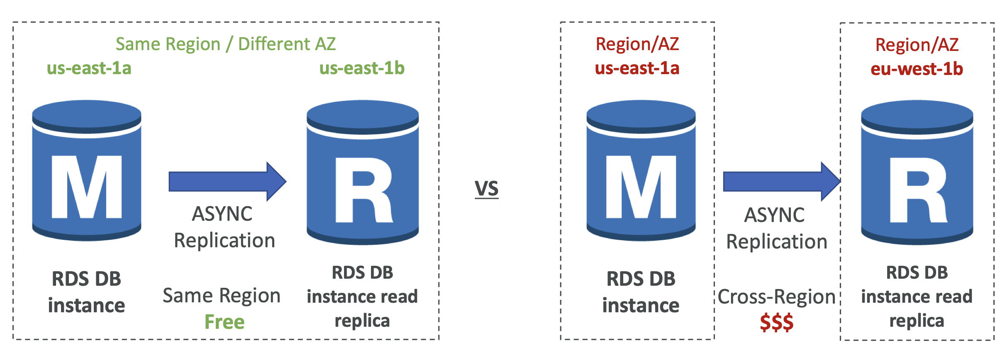

- **RDS Multi AZ (Disaster Recovery)**

    - **SYNC** replication (Every single change is replicated. So a change is accepted only if the replication is comeplete)
    - One DNS name – automatic app failover to standby
    - Increase **availability**
    - Failover in case of loss of AZ, loss of network, instance or storage failure
    - No manual intervention in apps
    - Not used for scaling
    - <u>Note:The Read Replicas be setup as Multi AZ for Disaster Recovery (DR)</u>
    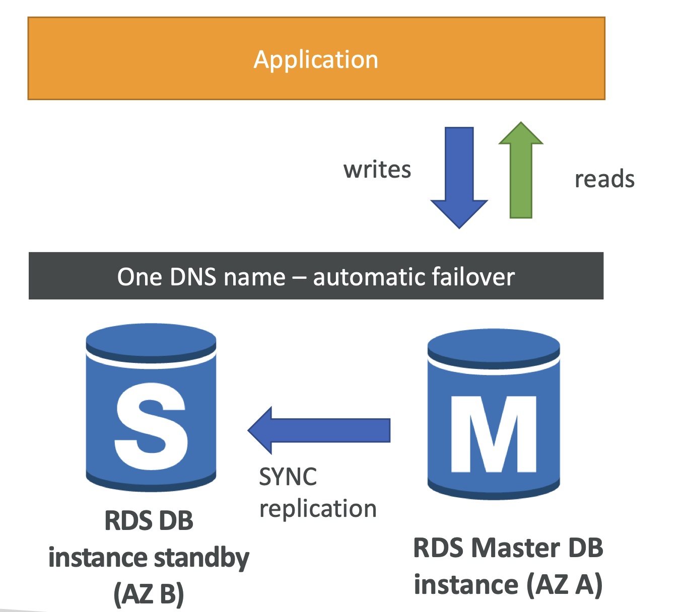

- **RDS – From Single-AZ to Multi-AZ**

    - Zero downtime operation (no need to stop the DB)
    - Just click on “modify” for the database (option available for the DB)
    - The following happens internally:
        - A snapshot is taken
        - A new DB is restored from the snapshot in a new AZ
        - Synchronization is established between the two databases
    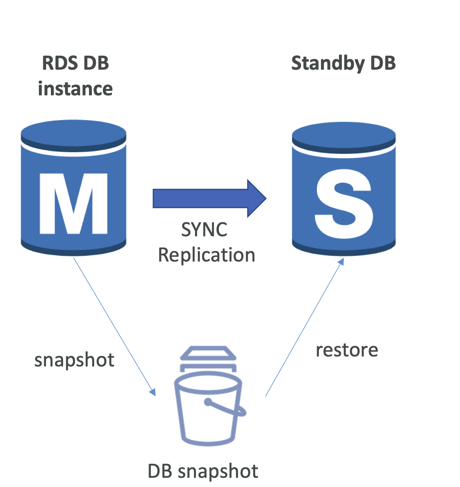

- **Notes**
    - For connectivity, while creating a DB there is an option for "compute resource", which makes sure there is connectivity between EC2 and your RDS database. You dont have to handle security groups in this case. AWS will configure all that for you.
    - If your connection to DB is not successful confirm if you DB is public and/or check the security group settings.

- **RDS Custom**

    - **Managed Oracle and Microsoft SQL Server Database with OS and database customization**
    - RDS: Automates setup, operation, and scaling of database in AWS
    - Custom: access to the underlying database and OS so you can 
        - Configure settings
        - Install patches
        - Enable native features
        - Access the underlying EC2 Instance using **SSH or SSM Session Manager**
    - **De-activate Automation Mode** to perform your customization, better to take a DB snapshot before
    - RDS vs. RDS Custom
        - RDS: entire database and the OS to be managed by AWS
        - RDS Custom: full admin access to the underlying OS and the database
    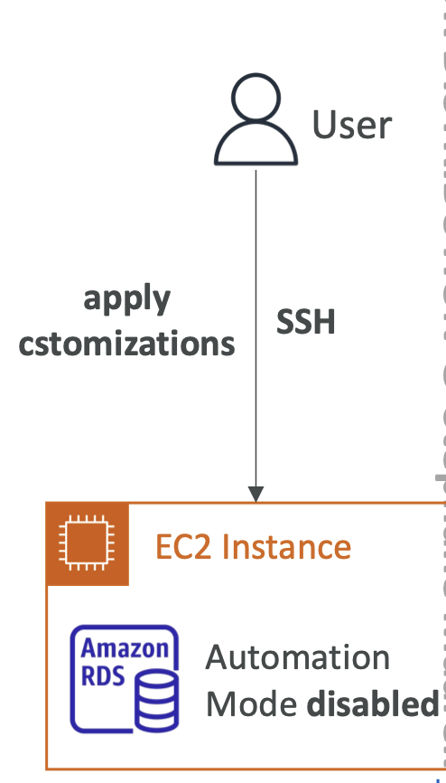

- **Amazon RDS Proxy**
    - Fully managed database proxy for RDS
    - Allows apps to pool and share DB connections established with the database
    - **Improving database efficiency by reducing the stress on database resources (e.g., CPU, RAM) and minimize open connections (and timeouts)**
    - Serverless, autoscaling, highly available (multi-AZ)
    - **Reduced RDS & Aurora failover time by up 66%**
    - Supports RDS (MySQL, PostgreSQL, MariaDB, MS SQL Server) and Aurora (MySQL, PostgreSQL)
    - No code changes required for most apps
    - **Enforce IAM Authentication for DB, and securely store credentials in AWS Secrets Manager**
    - **RDS Proxy is never publicly accessible (must be accessed from VPC)**
    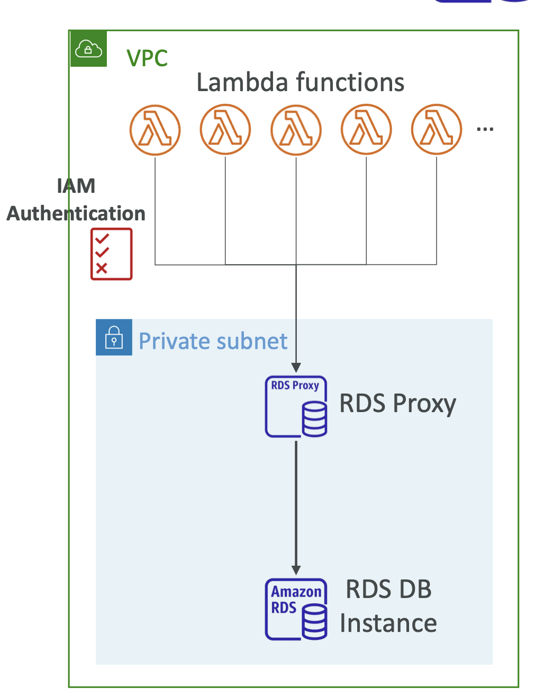
    (Instead of having every single application connect to your RDS database instance, they will be instead connecting to the proxy, the proxy will pool the connections together into less connections to the RDS DB instance)  
    (Instead of apps connecting directly to RDS and handling failiver themselves, The proxy will handle failover for the apps, therefore improving time for failover by 66%)  
    (RDS Proxy can also be used as a means to enforce IAM authentication to your DB)  
    (Lambda functions can multiply and disappear fast, and opening connections to your DB, they will create a problem with oprn connections and timeouts and here RDS proxy can be good use case)

# Amazon Aurora

- Aurora is a proprietary technology from AWS (not open sourced)
- Postgres and MySQL are both supported as Aurora DB (that means your drivers will work as if Aurora was a Postgres or MySQL database)
- Aurora is “AWS cloud optimized” and claims 5x performance improvement over MySQL on RDS, over 3x the performance of Postgres on RDS
- Aurora storage automatically grows in increments of 10GB, up to 128 TB.
- Aurora can have up to 15 replicas and the replication process is faster than MySQL (sub 10 ms replica lag)
- Failover in Aurora is instantaneous. It’s HA (High Availability) native.
- Aurora costs more than RDS (20% more) – but is more efficient

- **Aurora High Availability and Read Scaling**
    - 6 copies of your data across 3 AZ:
        - 4 copies out of 6 needed for writes
        - 3 copies out of 6 need for reads
        - Self healing with peer-to-peer replication
        - Storage is striped across 100s of volumes
    - One Aurora Instance takes writes (master)
    - Automated failover for master in less than 30 seconds
    - Master + up to 15 Aurora Read Replicas serve reads
    - **Support for Cross Region Replication**
    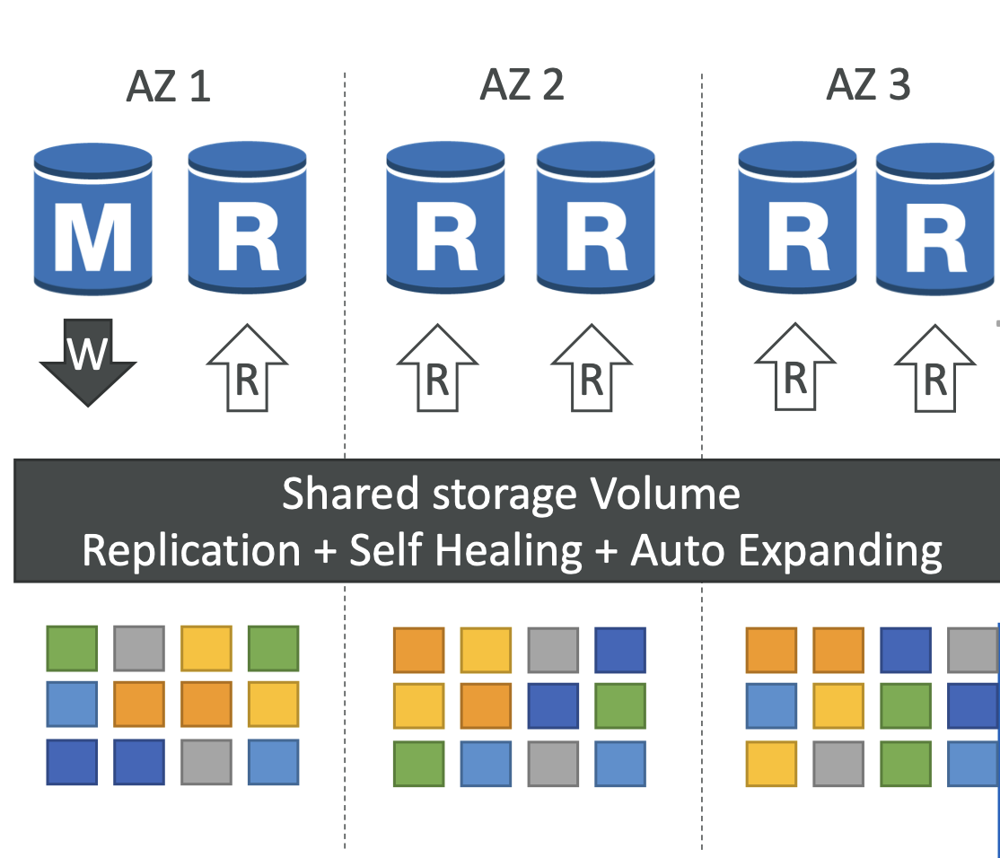  
    (Each small square in the diagram represents data and if you count there will be 6 copies of each colour, each data being writted in 6 copies in 3 different AZ)  
    (Each copy goes on different volumes, stripped across volumes, but shared by all)  

- **Aurora DB Cluster**
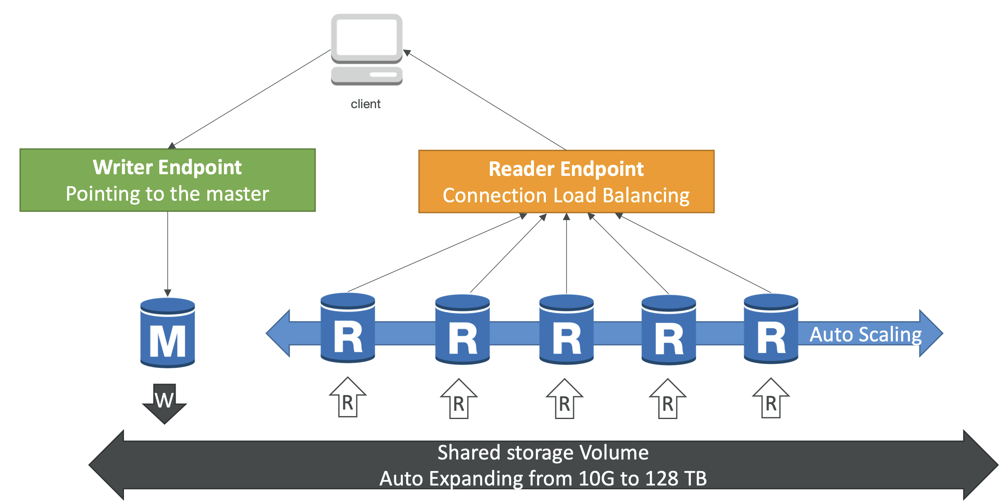  
(Write Endpoint always points to the Master DB)  
(Reader Endpoint helps with connection load balancing and it connects automatically to all read replicas)  
(<u>Load balancing happens at the connection level and not statement level</u>)  
(The Master always writes to the shared volume which is shared across all the DB instances)  
(There is auto scaling enabled for the replicas)  

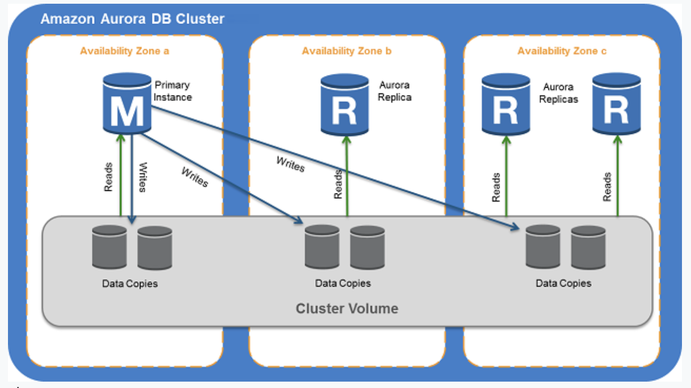
- An Amazon Aurora DB cluster consists of one or more DB instances and a cluster volume that manages the data for those DB instances.
- An Aurora cluster volume is a virtual database storage volume that spans multiple Availability Zones (AZs), with each Availability Zone (AZ) having a copy of the DB cluster data. Two types of DB instances make up an Aurora DB cluster:
    - Primary DB instance – Supports read and write operations, and performs all of the data modifications to the cluster volume. Each Aurora DB cluster has one primary DB instance.
    - Aurora Replica – Connects to the same storage volume as the primary DB instance and supports only read operations. Each Aurora DB cluster can have up to 15 Aurora Replicas in addition to the primary DB instance. Aurora automatically fails over to an Aurora Replica in case the primary DB instance becomes unavailable. You can specify the failover priority for Aurora Replicas. Aurora Replicas can also offload read workloads from the primary DB instance.

- **Features of Aurora**
    - Automatic fail-over
    - Backup and Recovery
    - Isolation and security
    - Industry compliance
    - Push-button scaling
    - Automated Patching with Zero Downtime
    - Advanced Monitoring
    - Routine Maintenance
    - Backtrack: restore data at any point of time without using backups(go back to point in time.)

- **Aurora Replicas - Auto Scaling**
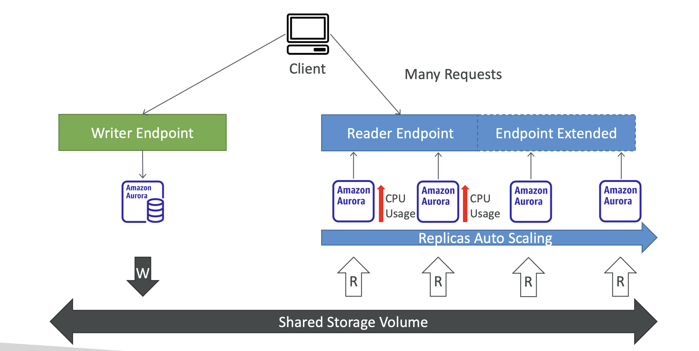
(Replicas auto scaling enabled, and when they scale the reader endpoint is also extended.)  

- **Aurora – Custom Endpoints**
    - Define a subset of Aurora Instances as a Custom Endpoint
    - Example: Run analytical queries on specific replicas
    - The Reader Endpoint is generally not used after defining Custom Endpoint
    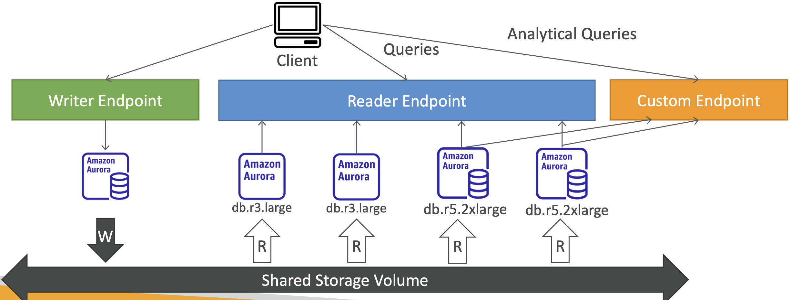
    (Here we have 2 different kind of replicas, some db.r3.large and some db.r5.2xlarge, so some read replicas are bigger than others)  
    (Here we can define a subset of instances as Custom Endpoints to do for ex analytical queries because they are big and powerful instances)  
    (In practical setting, the reader endpoint is not used anymore when custom endpoints are there, and multiple custom endpoints is setup)  

- **Aurora Serverless**

    - Automated database instantiation and auto- scaling based on actual usage
    - Good for infrequent, intermittent or unpredictable workloads
    - No capacity planning needed
    - Pay per second, can be more cost-effective
    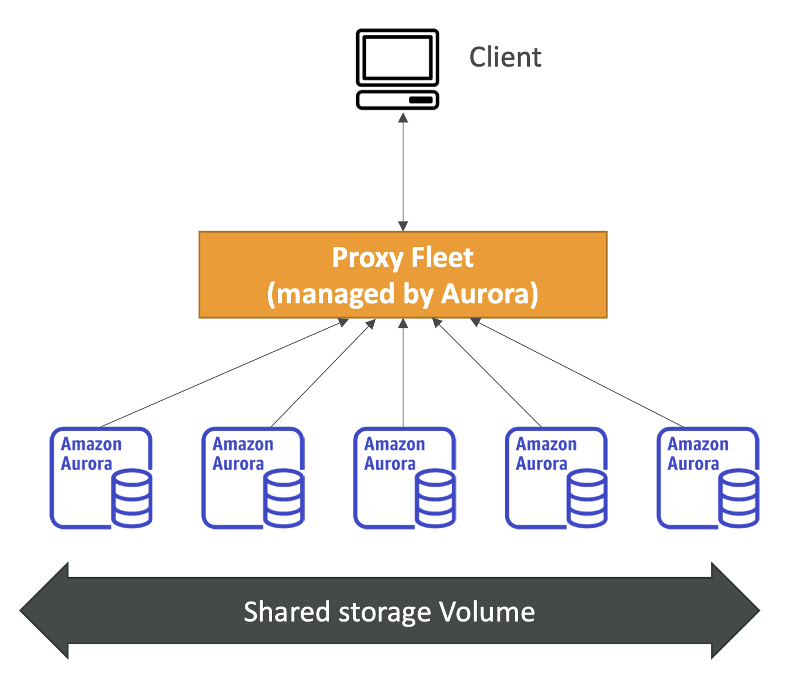

- **Aurora Multi-Master**
    - In case you want **continuous write availability** for the writer nodes
    - Every node does R/W - vs promoting a Read Replica as the new master
    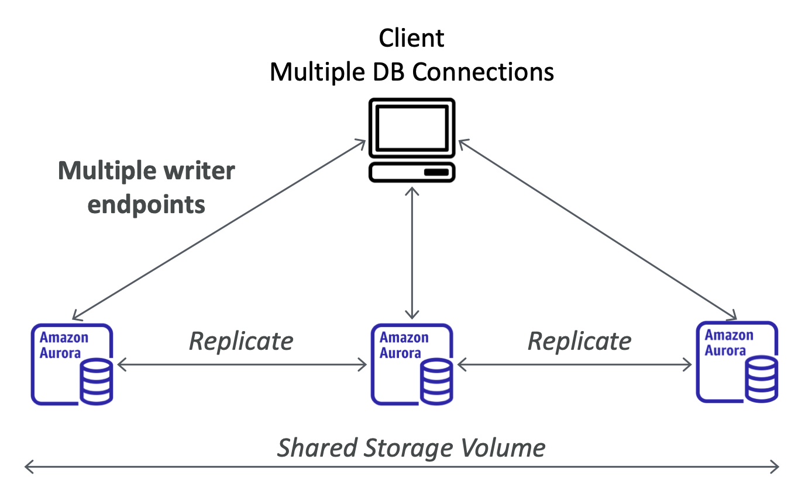

- **Global Aurora**
    - **Aurora Cross Region Read Replicas**:
        - Useful for disaster recovery
        - Simple to put in place
    - **Aurora Global Database (recommended)**:
        - 1 Primary Region (read / write)
        - Up to 5 secondary (read-only) regions, replication lag is less than 1 second
        - Up to 16 Read Replicas per secondary region
        - Helps for decreasing latency
        - Promoting another region (for disaster recovery) has an RTO of < 1 minute
        - **Typical cross-region replication takes less than 1 second**
    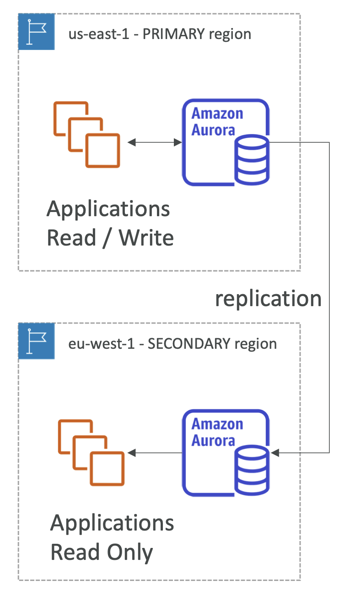

- **Aurora Machine Learning**
    - Enables you to add ML-based predictions to your applications via SQL
    - Simple, optimized, and secure integration between Aurora and AWS ML services
    - Supported services
        - Amazon SageMaker (use with any ML model)
        - Amazon Comprehend (for sentiment analysis)
    - You don’t need to have ML experience
    - Use cases: fraud detection, ads targeting, sentiment analysis, product recommendations
    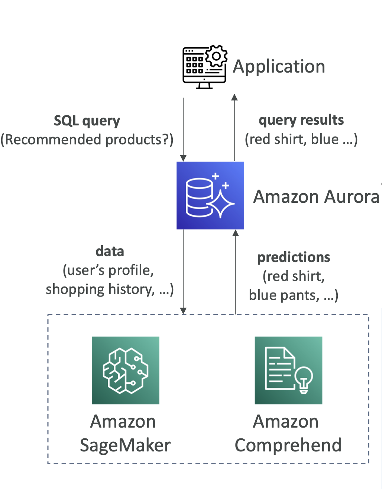

# Backups

- **RDS Backups**
    - Automated backups:
        - Daily full backup of the database (during the backup window)
        - Transaction logs are backed-up by RDS every 5 minutes
        - => ability to restore to any point in time (from oldest backup to 5 minutes ago)
        - 1 to 35 days of retention, set 0 to disable automated backups
    - Manual DB Snapshots
        - Manually triggered by the user
        - Retention of backup for as long as you want

    - **Trick**: in a stopped RDS database, you will still pay for storage. If you plan on stopping it for a long time, you should snapshot & restore instead.  
    (If you need a DB only for few hours then instead of stopping it, which still costs you a lot of money for storage, take a snapshot and then delete the original DB and snapshot storage will cost way less. After that restore the snapshot when needed)  

- **Aurora Backups**
    - Automated backups
        - 1 to 35 days (cannot be disabled) (Unlike in RDS)
        - point-in-time recovery in that timeframe
    - Manual DB Snapshots
        - Manually triggered by the user
        - Retention of backup for as long as you want

- **RDS & Aurora Restore options**
    - **Restoring a RDS / Aurora backup or a snapshot** creates a new database
    - **Restoring MySQL RDS database from S3**
        - Create a backup of your on-premises database
        - Store it on Amazon S3 (object storage)
        - Restore the backup file onto a new RDS instance running MySQL
    - **Restoring MySQL Aurora cluster from S3**
        - Create a backup of your on-premises database using Percona XtraBackup
        - Store the backup file on Amazon S3
        - Restore the backup file onto a new Aurora cluster running MySQL

- **Aurora Database Cloning**

    - Create a new Aurora DB Cluster from an existing one
    - Faster than snapshot & restore
    - Uses **copy-on-write** protocol
        - Initially, the new DB cluster uses the same data volume as the original DB cluster (fast and efficient – no copying is needed)
        - When updates are made to the new DB cluster data, then additional storage is allocated and data is copied to be separated
    - Very fast & cost-effective
    - **Useful to create a “staging” database from a “production” database without impacting the production database**

# Security

- **RDS & Aurora Security**
    - **At-rest encryption**:
        - Database master & replicas encryption using AWS KMS – must be defined at launch time
        - If the master is not encrypted, the read replicas cannot be encrypted
        - To encrypt an un-encrypted database, go through a DB snapshot & restore as encrypted
    - **In-flight encryption**: TLS-ready by default,use the AWS TLS root certificates client-side
    - **IAM Authentication**: IAM roles to connect to your database (instead of usual db username/pw)
    - **Security Groups**: Control Network access to your RDS / Aurora DB
    - **No SSH** available except on RDS Custom
    - **Audit Logs** can be enabled and sent to **CloudWatch** Logs for longer retention

# ElastiCache

- The same way RDS is to get managed Relational Databases...ElastiCache is to get managed Redis or Memcached
- Allows you to seamlessly set up, run, and scale popular open-Source compatible in-memory data stores in the cloud.
- Caches are in-memory databases with really high performance, low latency
- Build data-intensive apps or boost the performance of your existing databases by retrieving data from high throughput and low latency in-memory data stores
- Used as a caching layer in front of relational databases
- Helps reduce load off of databases for read intensive workloads
- Helps make your application stateless
- AWS takes care of OS maintenance / patching, optimizations, setup, configuration, monitoring, failure recovery and backups
- **<u>Using ElastiCache involves heavy application code changes</u>**
- Common queries are cached so the DB will not be queried every time  
- Change the application heavily to query the cache first
- Popular choice for real-time use cases like Caching, Session Stores, Gaming, Geospatial Services, Real-Time Analytics, and Queuing

- **Solution Architecture - DB Cache**
    - Applications queries ElastiCache, if not available, get from RDS and store in ElastiCache.
    - Helps relieve load in RDS
    - Cache must have an invalidation strategy to make sure only the most current data is used in there.
    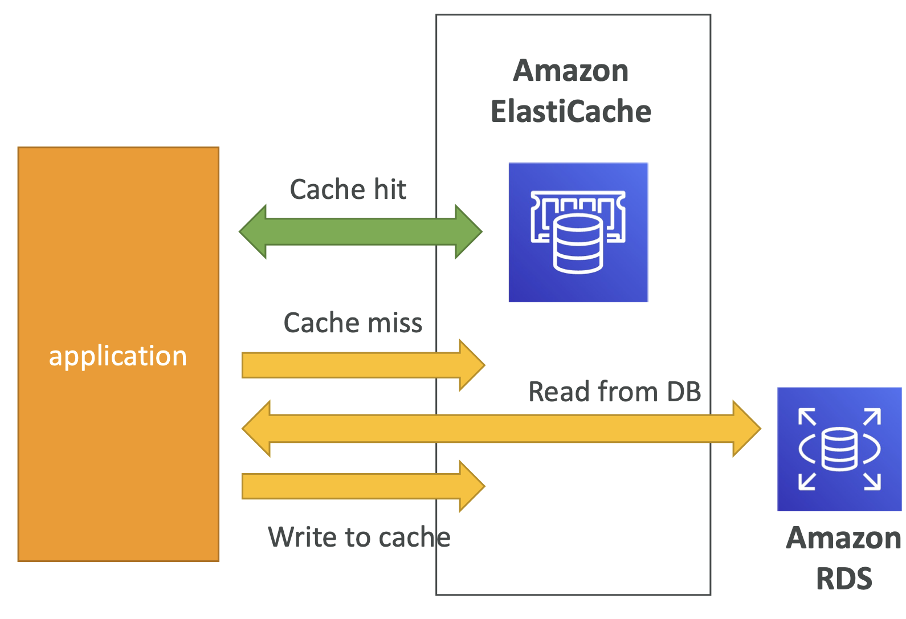
    (Lazy Loading)  

- **Solution Architecture – User Session Store**
    - User logs into any of the application
    - The application writes the session data into ElastiCache
    - The user hits another instance of our application
    - The instance retrieves the data and the user is already logged in
    - User session is stored so no need to login for different applications
    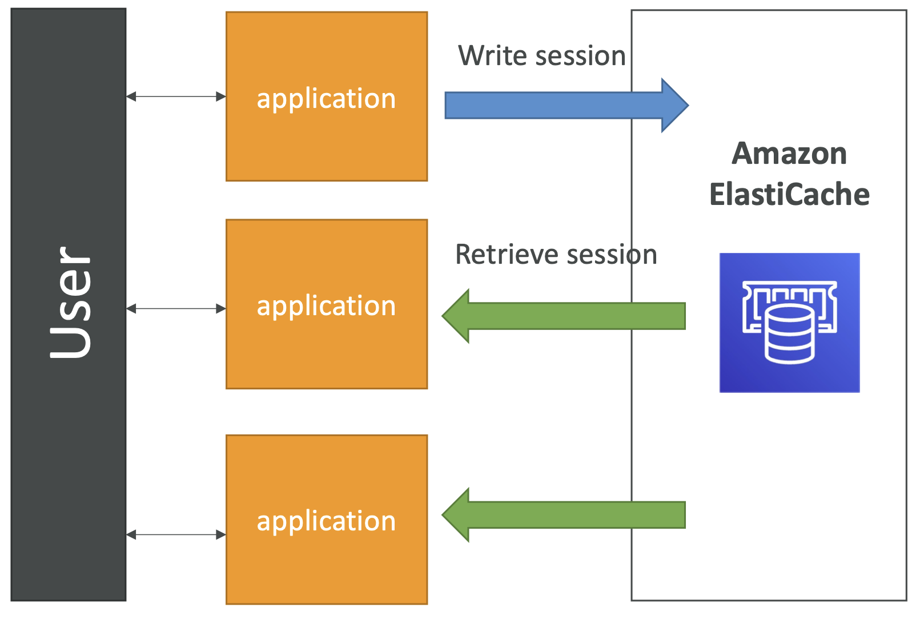  
    (Session Store)  

- **ElastiCache – Redis vs Memcached**
    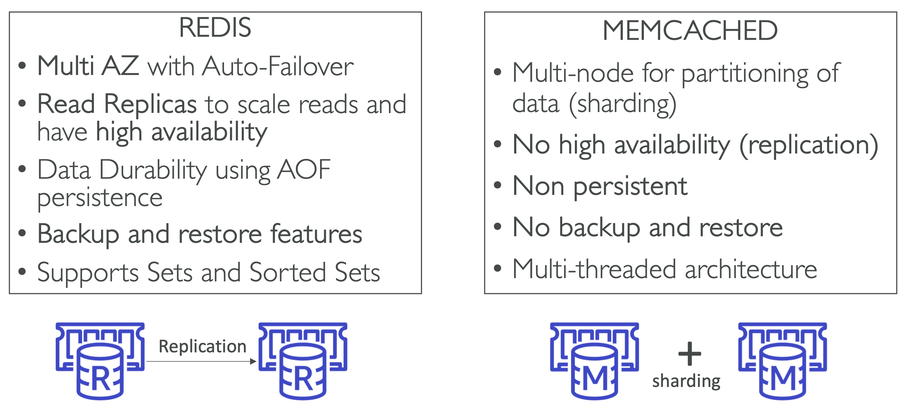

- **ElastiCache – Cache Security**
    - ElastiCache supports **IAM Authentication for Redis** (For redis only for other use username/passowrd)
    - IAM policies on ElastiCache are only used for AWS API-level security
    - **Redis AUTH**
        - You can set a “password/token” when you create a Redis cluster
        - This is an extra level of security for your cache (on top of security groups)
        - Support SSL in flight encryption
    - Memcached
        - Supports SASL-based authentication (advanced)
    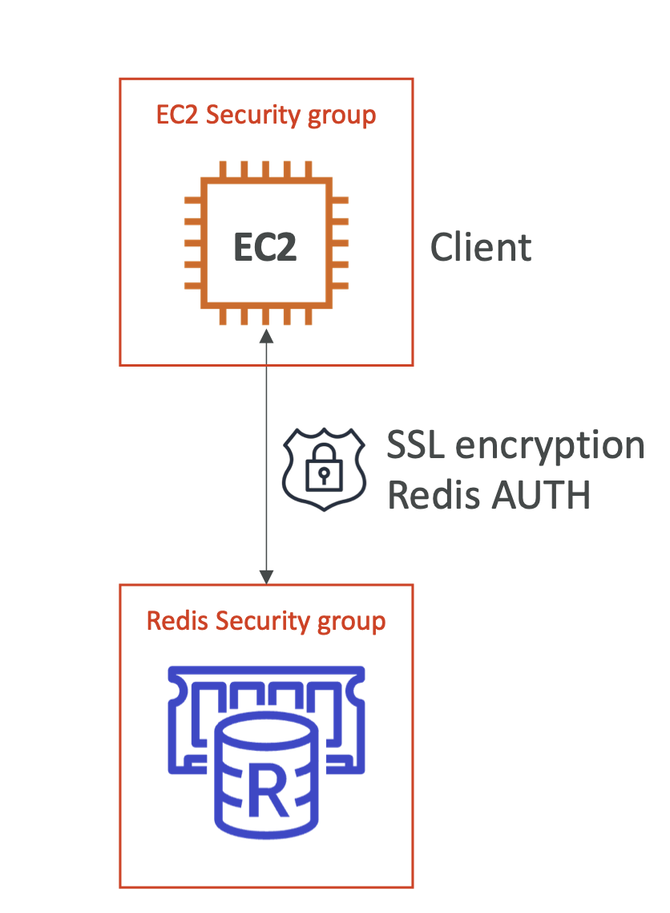

- **Patterns for ElastiCache**
    - **Lazy Loading**: all the read data is cached, data can become stale in cache
    - **Write Through**: Adds or update data in the cache when written to a DB (no stale data)
    - **Session Store**: store temporary session data in a cache (using TTL features)

- **ElastiCache – Redis Use Case**
    - Gaming Leaderboards are computationally complex
    - **Redis Sorted sets** guarantee both uniqueness and element ordering
    - Each time a new element added, it’s ranked in real time, then added in correct order
    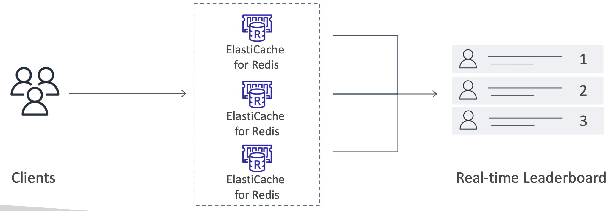