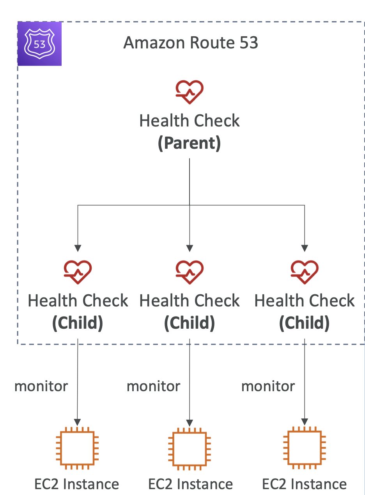
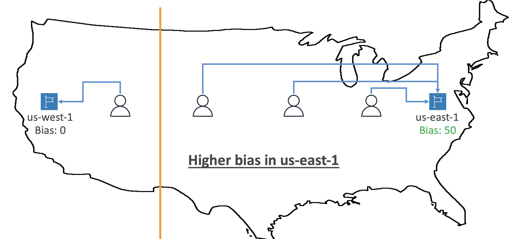

# Route 53

- **DNS Terminologies**

    - **Domain Registrar** : Amazon Route 53, GoDaddy, ...
    - **DNS Records**: A, AAAA, CNAME, NS, ...
    - **Zone File**: contains DNS records
    - **Name Server**: resolves DNS queries (Authoritative or Non-Authoritative)
    - **Top Level Domain (TLD)**: .com, .us, .in, .gov, .org, ...
    - **Second Level Domain (SLD)**: amazon.com, google.com, ...
    

- **How DNS Works**

    
    (There is a WebServer with public IP 9.10.11.12 and we want to access this with domain name example.com)  
    (We register this domain name in the DNS)  
    (The web browser which wants to access example.come, asks its local DNS server about this domain name)  
    (If the local DNS has never seen this domain name before it will first ask the root DNS server managed by ICANN)  
    (If the root DNS has also not seen it, it will say I dont know example.com but I know .com is 1.2.3.4)  
    (Now the Top Level DNS managed by IANA, is going to be asked, and it may say I no about the domain but I dont have the record for it)  
    (The TLD DNS will return the server address for the known example.com as 5.6.7.8)  
    (So the local DNS is going to our final DNS server, sub-level domain server, which will be maintained by the registrar, like Route 53)  
    (Now the SLD DNS will return for example an A record for the domain name exmaple.com and the IP is 9.10.11.12)  
    (Once the result is received the local DNS server will cache this entry and then return the result to the web browser)  

- **Route53**

    - A highly available, scalable, fully managed and Authoritative DNS
        - Authoritative = the customer (you) can update the DNS records
    - Route 53 is also a Domain Registrar
    - Ability to check the health of your resources
    - The only AWS service which provides 100% availability SLA
    - Why Route 53? 53 is a reference to the traditional DNS port
    

- **Route 53 – Records**
    - How you want to route traffic for a domain
    - Each record contains:
        - **Domain/subdomain Name** – e.g., example.com
        - **Record Type** – e.g., A or AAAA
        - **Value** – e.g., 12.34.56.78
        - **Routing Policy** – how Route 53 responds to queries
        - **TTL** – amount of time the record cached at DNS Resolvers
    - Route 53 supports the following DNS record types:
        - (must know)A /AAAA / CNAME / NS
        - (advanced)CAA/DS/MX/NAPTR/PTR/SOA/TXT/SPF/SRV

- **Route 53 – Record Types**
    - A – maps a hostname to IPv4
    - AAAA – maps a hostname to IPv6
    - CNAME – maps a hostname to another hostname
        - The target is a domain name which must have an A or AAAA record
        - Can’t create a CNAME record for the top node of a DNS namespace (Zone Apex)
        - Example: you can’t create CNAME for for example.com, but you can create for www.example.com
    - NS – Name Servers for the Hosted Zone (DNS names / IP address of the servers that responds to the DNS queries of your hosted zone)  
        - Control how traffic is routed for a domain

- **Route 53 – Hosted Zones**
    - A container for records that define how to route traffic to a domain and its subdomains
    - **Public Hosted Zones** – contains records that specify how to route traffic on the Internet (public domain names) application1.mypublicdomain.com
    - **Private Hosted Zones** – contain records that specify how you route traffic within one or more VPCs (private domain names) application1.company.internal
    - You pay $0.50 per month per hosted zone

- **Route 53 – Public vs. Private Hosted Zones**
    
    (Public hosted zone allows anyone from the internet to query your records which are public)  
    (Private hosted zone is queried from within your private resources for ex VPC)  
    (In the VPC the instances are sending request for resources within the same VPC)  

- **Route 53 – RecordsTTL (TimeTo Live)**
    - **High TTL – e.g., 24 hr**
        - Less traffic on Route 53
        - Possibly outdated records
    - **Low TTL – e.g., 60 sec.**
        - More traffic on Route 53 ($$)
        - Records are outdated for less time
        - Easy to change records
    - **Except for Alias records, TTL is mandatory for each DNS record**
    
    (TTL tells for how long the result should be cached, default is 300 sec or 5 min)  
    (If you plan to change a record, then its a good idea to reduce the TTL and once the TLL is updated then change the record value and once the change is effective then increase the TTL again)  

- **CNAME Vs Alias**
    - AWS Resources (Load Balancer, CloudFront...) expose an AWS hostname:
        - lb1-1234.us-east-2.elb.amazonaws.com and you want myapp.mydomain.com
    - CNAME:
        - Points a hostname to any other hostname.(app.mydomain.com => blabla.anything.com)
        - <u>ONLY FOR NON ROOT DOMAIN (aka. something.mydomain.com and not just mydomain.com)</u>
    - Alias:
        - Points a hostname to an AWS Resource (app.mydomain.com => blabla.amazonaws.com)
        - <u>Works for ROOT DOMAIN and NON ROOT DOMAIN (aka mydomain.com)</u>
        - Free of charge
        - Native health check

- **Route 53 – Alias Records**
    - Maps a hostname to an AWS resource
    - An extension to DNS functionality
    - Automatically recognizes changes in the resource’s IP addresses
    - Unlike CNAME, it can be used for the top node of a DNS namespace (Zone Apex), e.g.: example.com
    - Alias Record is always of type A/AAAA for AWS resources (IPv4 / IPv6)
    - Querying an Alias record is free
    - **You can’t set the TTL** (Automatically set by AWS)
    

- **Route 53 – Alias Records Targets**

    - Elastic Load Balancers
    - CloudFront Distributions
    - API Gateway
    - Elastic Beanstalk environments
    - S3 Websites (not S3 buckets)
    - VPC Interface Endpoints
    - Global Accelerator accelerator
    - Route 53 record in the same hosted zone
    - **You cannot set an ALIAS record for an EC2 DNS name**
    

- **Route 53 – Routing Policies**

    - Define how Route 53 responds to DNS queries
    - Don’t get confused by the word “Routing”
        - It’s not the same as Load balancer routing which routes the traffic
        - DNS does not route any traffic, it only responds to the DNS queries
    - Route 53 Supports the following Routing Policies
        - Simple
        - Weighted
        - Failover
        - Latency based
        - Geolocation
        - Multi-Value Answer
        - Geoproximity (using Route 53 Traffic Flow feature)

- **Routing Policies – Simple**

    - Typically, route traffic to a single resource
    - Can specify multiple values in the same record
    - **If multiple values are returned, a random one is chosen by the <u>client</u>**
    - When Alias enabled, specify only one AWS resource
    - Can’t be associated with Health Checks
    

- **Routing Policies – Weighted**

    - Control the % of the requests that go to each specific resource
    - Assign each record a relative weight:
        - 𝑡𝑟𝑎𝑓𝑓𝑖𝑐(%)= Weight for a specific record / Sum of all weights for all records 
        - Weights don’t need to sum up to 100
    - DNS records must have the same name and type
    - Can be associated with Health Checks
    - Use cases: load balancing between regions, testing new application versions...
    - **Assign a weight of 0 to a record to stop sending traffic to a resource**
    - **If all records have weight of 0, then all records will be returned equally**
    
    (Instances of different weights here 10, 20, 70)  

- **Routing Policies – Latency-based**

    - Redirect to the resource that has the least latency close to us
    - Super helpful when latency for users is a priority
    - **Latency is based on traffic between users and AWS Regions**
    - Germany users may be directed to the US (if that’s the lowest latency)
    - Can be associated with Health Checks (has a failover capability)
    

- **Route 53 – Health Checks**

    - HTTP Health Checks are only for **public resources**
    - Health Check => Automated DNS Failover:
        1. Health checks that monitor an endpoint (application, server, other AWS resource)
        2. Health checks that monitor other health checks (Calculated Health Checks)
        3. Health checks that monitor CloudWatch Alarms (full control !!) – e.g., throttles of DynamoDB, alarms on RDS, custom metrics, ... (helpful for private resources)
    - Health Checks are integrated with CW metric
    

- **Health Checks – Monitor an Endpoint**

    - **About 15 global health checkers will check the endpoint health**
        - Healthy / Unhealthy Threshold – 3 (default)
        - Interval – 30 sec (can set to 10 sec – higher cost)
        - Supported protocol:HTTP, HTTPS and TCP
        - If > 18% of health checkers report the endpoint is healthy, Route 53 considers it **Healthy**. Otherwise, it’s **Unhealthy**
        - Ability to choose which locations you want Route 53 to use for the health checks
    - Health Checks pass only when the endpoint responds with the 2xx and 3xx status codes
    - Health Checks can be setup to pass / fail based on the text in the first **5120** bytes of the response
    - Configure you router/firewall to allow incoming requests from Route 53 Health Checkers (add the IP address range for the health checkers which is available on the AWS site)  
      
    (If we have a health check for an ALB in eu-west-1, then about 15 health checkers from around the world are going to send request to our public endpoint to wherever routes we set)  
    (A 200 ok code will define the resource as healthy)  

- **Route 53 – Calculated Health Checks**

    - Combine the results of multiple Health Checks into a single Health Check
    - You can use **OR, AND, or NOT**
    - Can monitor up to 256 Child Health Checks
    - Specify how many of the health checks need to pass to make the parent pass
    - Usage: perform maintenance to your website without causing all health checks to fail
    
    (If there are 3 instances with health checks defined on Route 53 then there will be a parent health check which will be defined on the child health checks which monitor the EC2 instances)  

- **Health Checks – Private Hosted Zones**

    - All Route 53 health checkers are outside the VPC
    - They can’t access **private** endpoints (private VPC or on-premises resource)
    - The way to create health check for pricate resources is - You can create a **CloudWatch Metric** and associate a **CloudWatch Alarm**, then create a Health Check that checks the alarm itself.
    

- **Routing Policies – Failover (Active-Passive)**

      
    (Primary EC2 instance and a secondary instance for failover or disaster recovery)  
    (The health check will be associated with the primary record and this is **mandatory**)  
    (If the health check reports unhealthy then Route 53 will failover to the secondary record, and the secondary can be now associated with the health check but there can be only 1 primary and 1 secondary)  
    (A record of type failover can be created at Route 53 with the record type as primary or secondary, and both record types should have the same name)  

- **Routing Policies – Geolocation**

    - Different from Latency-based!
    - **This routing is based on user location**
    - Specify location by Continent, Country or by US State (if there’s overlapping, most precise location selected)
    - Should create a **“Default”** record (in case there’s no match on location)
    - Use cases: website localization, restrict content distribution, load balancing, ...
    - Can be associated with Health Checks
    
    (If I have a German version of the app then all Germal users should be redirected to a particular IP and same for French users who will be redirected to the French version of the App and all other users will be presented the default English version)  
    (We can again create records with the same name with traffic routed differently based on region)  

- **Routing Policies – Geoproximity**

    - Route traffic to your resources based on the geographic location of users and resources
    - Ability **to shift more traffic to resources based** on the defined **bias**
    - To change the size of the geographic region, specify bias values:
        - To expand (1 to 99) – more traffic to the resource
        - To shrink (-1 to -99) – less traffic to the resource
    - Resources can be:
        - AWS resources (specify AWS region)
        - Non-AWS resources (specify Latitude and Longitude)
    - You must use Route 53 **Traffic Flow** to use this feature
    
    (Here if there are 2 resources one in us-west-1 and another in us-east-1, both with bias 0, then if all users in the US are trying to access these resources, then there will be a line divinding both regions, and the users on the left will go to us-west-1 and the right will go to us-east-1) 
    (Looks more like going to closest resource region based on the user location)  
    
    (In the above example if the Bias is 0 for us-west-1 and 50 for us-east-1, then more users will be routed to us-east-1 because of the higher bias value)  
    (Now the dividing line between the two will not be in the middle but more towards us-west-1)  
    (Useful when you want t shift the traffic to a specific region)  

- **Routing Policies – IP-based Routing**

    - **Routing is based on clients’ IP addresses**
    - **You provide a list of CIDRs for your clients** and the corresponding endpoints/locations (user-IP-to-endpoint mappings)
    - Use cases: Optimize performance, reduce network costs...(because you know the IP ahead of time)
    - Example: If you know that you have a specific internet provider and they are using a specific CIDR of IP addresses then you can route end users from this particular ISP to a specific endpoint
    
    (In Route 53 define, 2 locations with 2 different CIDR blocks with IP ranges)  
    (We will link these locations to a specific record, and then all CIDR blocks from one location will be routed to a partcular IP when they access example.com)  
    (Based on the IP address range from where the request is coming it will be routed to a different EC2 instance)  

- **Routing Policies – Multi-Value**

    - Use when routing traffic to multiple resources
    - Route 53 return multiple values/resources
    - Can be associated with Health Checks (return only values for healthy resources)
    - Up to 8 healthy records are returned for each Multi-Value query sent by a client.
    - **Multi-Value is not a substitute for having an ELB** (The idea is that its a client-side load balancing)
      
    (The client will choose from the multiple values returned by DNS)  
    (Simple routing does not allow for health checks but the Multi-value does allow, so simiple routing can return unhealthy records too)    

- **Domain Registar vs. DNS Service**

    - You buy or register your domain name with a Domain Registrar typically by paying annual charges (e.g., GoDaddy, Amazon Registrar Inc., ...)
    - The Domain Registrar usually provides you with a DNS service to manage your DNS records
    - But you can use another DNS service to manage your DNS records
    - Example: purchase the domain from GoDaddy and use Route 53 to manage your DNS records
    

      
    (When you go to GoDaddy you are going to register your domain and then you get the name servers option and you can specify custom name servers)  
    (In Route 53, we create a public hosted zone for any domain we want, and then in the hosted zone details, we can see the 4 name servers)  
    (These 4 name servers we are going to have to change in the GoDaddy website)  
    (So the name servers at GoDaddy are going to point to the Route 53 name servers and therefore Route 53 manages the DNS records)

- **3rd Party Registrar with Amazon Route 53**

    - **If you buy your domain on a 3rd par ty registrar, you can still use Route 53 as the DNS Service provider**
    1. Create a Hosted Zone in Route 53
    2. Update NS Records on 3rd party website to use Route 53 Name Servers
    - **Domain Registrar != DNS Service**
    - But every Domain Registrar usually comes with some DNS features