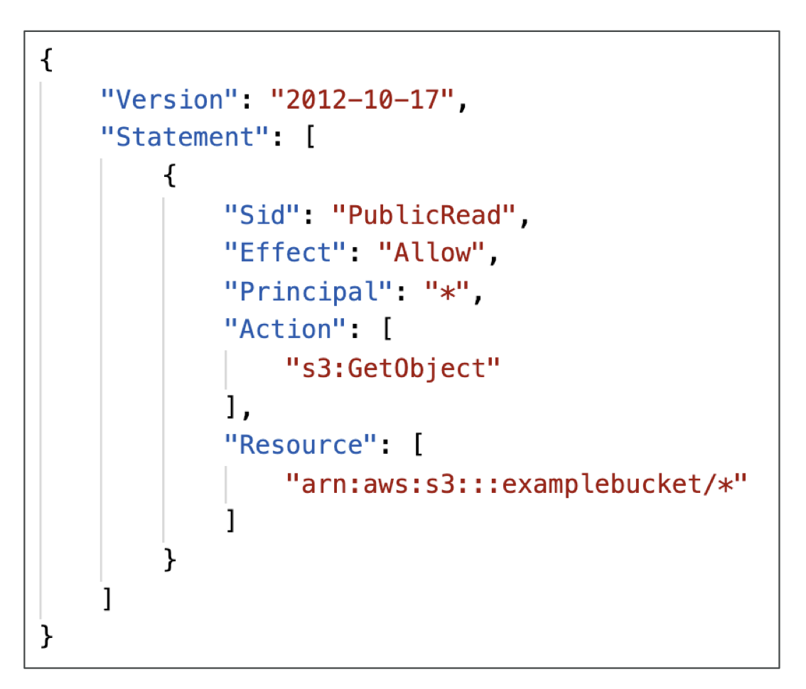
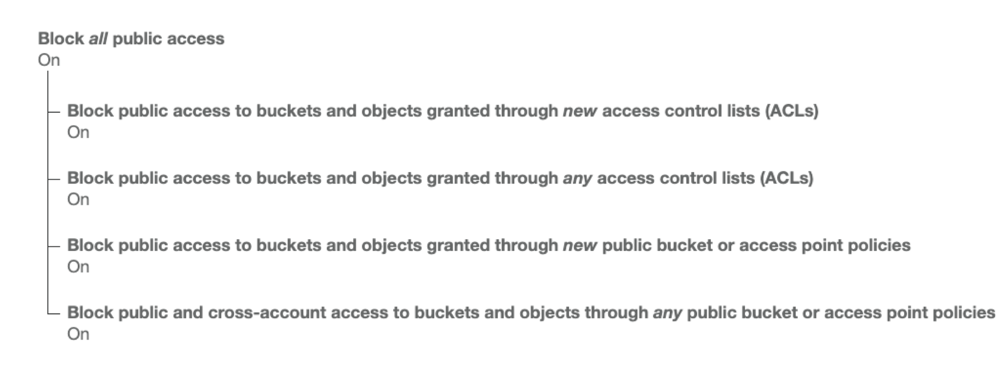
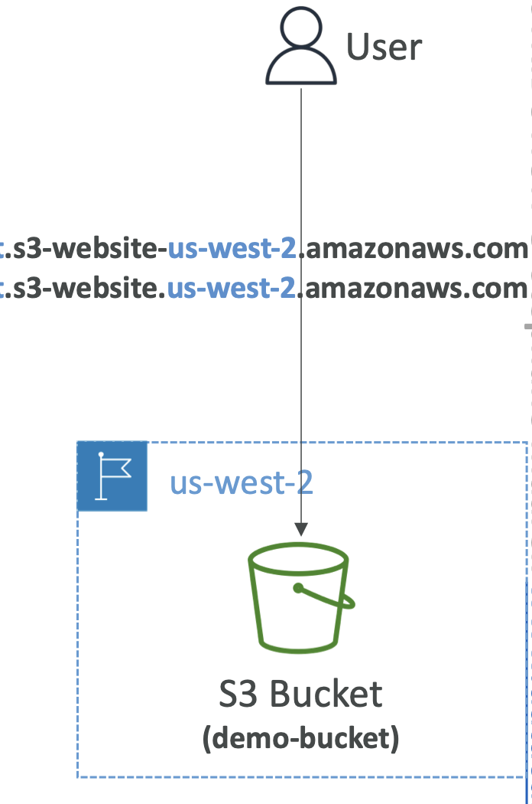
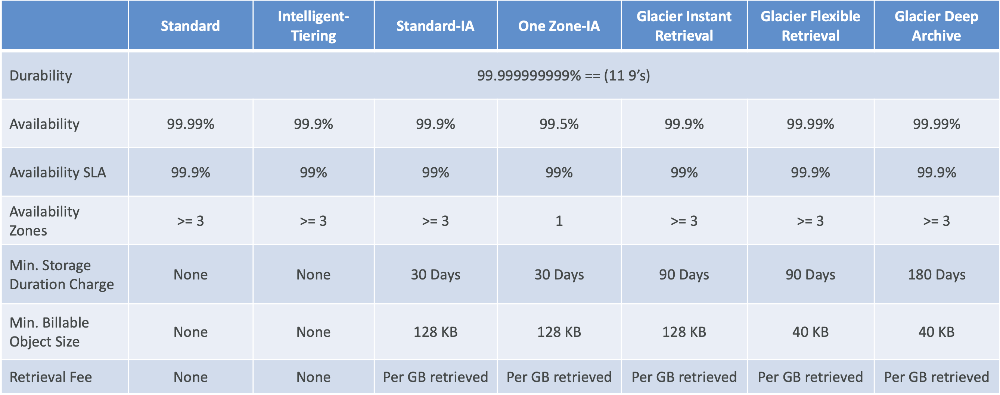
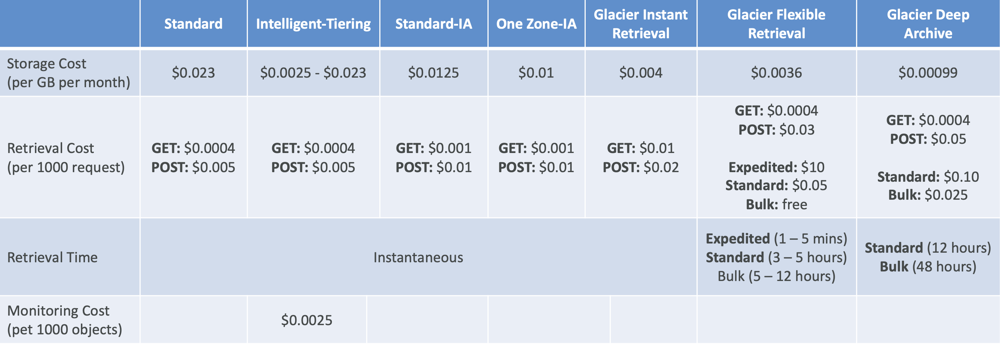

# S3

- **Use cases**
    
    - Backup and storage
    - Disaster Recovery
    - Archive
    - Hybrid Cloud storage
    - Application hosting
    - Media hosting
    - Data lakes & big data analytics
    - Software delivery
    - Static website
    - Nasdaq stored 7 years of data into S3 Glacier, Sysco runs analytics on its data and gain business insights.

- **S3 - Buckets**

    - Amazon S3 allows people to store objects (files) in “buckets” (directories)
    - Buckets must have a **globally unique name (across all regions all accounts)** 
    - Buckets are defined at the region level (names however need to be unique globally)
    - S3 looks like a global service but **buckets are created in a region**
    - Naming convention
        - No uppercase, No underscore
        - 3-63 characters long
        - Not an IP
        - Must start with lowercase letter or number
        - Must NOT start with the prefix xn--
        - Must NOT end with the suffix -s3alias

- **S3- Objects**

    - Objects (files) have a Key
    - The key is the FULL path:
        - s3://my-bucket/my_file.txt
        -  s3://my-bucket/my_folder1/another_folder/my_file.txt
    - The key is composed of prefix + object name
        - s3://my-bucket/my_folder1/another_folder/my_file.txt
    - There’s no concept of “directories” within buckets (although the UI will trick you to think otherwise)
    - Just keys with very long names that contain slashes (“/”)
    - Object values are the content of the body:
        - Max. Object Size is 5TB (5000GB)
        - If uploading more than 5GB, must use “multi-part upload”
            - Ex: for 5 TB must upload 1000 parts of 5GB.
    - Metadata (list of text key / value pairs – system or user metadata)
    - Tags (Unicode key / value pair – up to 10) – useful for security / lifecycle
    - Version ID (if versioning is enabled)

- **S3 pre-signed URL**: To access an object in S3 from the AWS console, contains in the URL a signature that verifies that I am the one making the request and therefore it has my credentials in it. So the credentials are encoded in the URL and hence the object will be accessible to the user.

- Amazon S3 delivers strong **read-after-write consistency** automatically, without changes to performance or availability, without sacrificing regional isolation for applications, and at no additional cost.
    - All Amazon S3 GET, PUT, and LIST operations, as well as operations that change object tags, ACLs, or metadata, are strongly consistent. What you write is what you will read, and the results of a LIST will be an accurate reflection of what’s in the bucket.

# Security

- **User-Based**
    - IAM Policies – which API calls should be allowed for a specific user from IAM
- **Resource-Based**
    - Bucket Policies – bucket wide rules from the S3 console - allows cross account
    - Object Access Control List (ACL) – finer grain (can be disabled)
    - Bucket Access Control List (ACL) – less common (can be disabled)
- **Note**: an IAM principal can access an S3 object if
    - The user IAM permissions ALLOW it OR the resource policy ALLOWS it
    - AND there’s no explicit DENY
- **Encryption**: encrypt objects in Amazon S3 using encryption keys

- With IAM policies, you can only grant users within your own account permission to access S3 resources.
- With ACLs, you can only grant other accounts (not specific users) access to  S3 resources
- With bucket policies, you can grant users within your Account or other Accounts access to S3 resources.

- **S3 Bucket Policies**
    - JSON based policies
        - Resources: buckets and objects (in the diagram below it applies to every object in exampleBucket)
        - Effect: Allow / Deny
        - Actions: Set of API to Allow or Deny (GetObject in the example below)
        - Principal:The account or user to apply the policy to (* means anyone)
        (Example sets public read on all objects inside the bucket)
    - Use S3 bucket for policy to:
        - Grant public access to the bucket
        - Force objects to be encrypted at upload
        - Grant access to another account (Cross Account)
    

    - For Public Access - Use Bucket Policy
    - For User Access to S3 – IAM permissions
    - For EC2 instance access - Use IAM Role
    - For Cross-Account Access – Use Bucket Policy that allows cross account access for that specific IAM user

    - **Bucket settings for Block Public Access**
        
        - These settings were created to prevent company data leaks
        - Invented by AWS for extra layer of security
        - Even if you set bucket policy that makes it public, if these setting are enabled the Bucket will never be public.
        - If you know your bucket should never be public, leave these on
        - Can be set at the account level

    - **To make a S3 bucket public**
        - First, disable the Block Public Access. (enabled by defaul)
        - Create a bucket policy to make it public. Can use policy generator for this.
            - Principal *, Effect is Allow, on GetObject for S3 service, ARN will be bucket name with `<arn-name>/*`
        - Now the public URL of any object in this bucket will be public.

# S3 – Static Website Hosting

- S3 can host static websites and have them accessible on the Internet
- The website URL will be (depending on the region)
    - http://bucket-name.s3-website-aws-region.amazonaws.com OR
    - http://bucket-name.s3-website.aws-region.amazonaws.com
    - Note the difference between - and .
- If you get a **403 Forbidden** error, make sure the bucket policy allows public reads!

- Amazon S3 does not support server-side scripting, but AWS has other resources for hosting dynamic websites. A dynamic website relies on server-side processing, including server-side scripts, such as PHP, JSP, or ASP.NET.

# S3 - Versioning

- You can version your files in Amazon S3
 - It is enabled at the **bucket level**
- Same key overwrite will change the “version”: 1, 2, 3....
- It is best practice to version your buckets
    - Protect against unintended deletes (ability to restore a version)(if you delete only a delete marker is added no actual delete)
    - Easy roll back to previous version
- Notes:
    - Any file that is not versioned prior to enabling versioning will have version “null”
    - Suspending versioning does not delete the previous versions

# S3 – Replication (CRR & SRR)

- **Must enable Versioning** in source and destination buckets
- Cross-Region Replication (CRR)
- Same-Region Replication (SRR)
- Buckets can be in different AWS accounts
- Single destination bucket or Multiple destination buckets
- Copying is **asynchronous**
- Must give proper IAM permissions to S3 (read and write from buckets)
- Use cases:
    - CRR – compliance, lower latency access to data in another region, replication across accounts
    - SRR – log aggregation across multiple buckets, live replication between production and test
- Notes
    - After you enable Replication, **only new objects are replicated**
    - Optionally, you can replicate existing objects using **S3 Batch Replication**
        - Replicates existing objects, objects already replicated and objects that failed replication
    - Batch replication differs from live replication which continuously and automatically replicates new objects across S3 buckets
    - If you want to enable live replication for existing objects for your bucket, you must contact AWS Support and raise a support ticket.
    - For DELETE operations
        - **Can replicate delete markers** from source to target (optional setting)
        - Deletions with a version ID are not replicated (permanent deletes)(to avoid malicious deletes)
        - Only delete markers are replicated and not the actual (permanent) delete.
    - **There is no “chaining” of replication**
        - If bucket 1 has replication into bucket 2, which has replication into bucket 3
        - Then objects created in bucket 1 are not replicated to bucket 3
    - For one-time data copy operation, delete the replication configuration, once done.

# S3 Storage Classes

- Amazon S3 Standard - General Purpose
- Amazon S3 Standard-Infrequent Access (IA)
- Amazon S3 One Zone-Infrequent Access
- Amazon S3 Glacier Instant Retrieval
- Amazon S3 Glacier Flexible Retrieval
- Amazon S3 Glacier Deep Archive
- Amazon S3 Intelligent Tiering
- Can move between classes manually or using S3 Lifecycle configurations

- **S3 Durability and Availability**
    - **Durability**:
        - High durability (99.999999999%, 11 9’s) of objects across multiple AZ
        - If you store 10,000,000 objects with Amazon S3, you can on average expect to incur a loss of a single object once every 10,000 years
        - Same for all storage classes
    - **Availability**:
        - Measures how readily available a service is
        - Varies depending on storage class
        - Example: S3 standard has 99.99% availability = not available 53 minutes a year

- **S3 Standard – General Purpose**
    - 99.99% Availability
    - Used for frequently accessed data (used by default)
    - Low latency and high throughput
    - Sustain 2 concurrent facility failures
    - no minimum storage duration charge and no retrieval fee
    - Use Cases: Big Data analytics, mobile & gaming applications, content distribution...

- **S3 – Infrequent Access**
    - For data that is less frequently accessed, but requires rapid access when needed
    - Lower cost than S3 Standard (cost on retrieval)
    - Minimum storage duration charge is 30 days
    - **Amazon S3 Standard-Infrequent Access (S3 Standard-IA)**
        - 99.9% Availability
        - Use cases: Disaster Recovery, backups
    - **Amazon S3 One Zone-Infrequent Access (S3 One Zone-IA)**
        - High durability (99.999999999%) in a single AZ; data lost when AZ is destroyed
        - 99.5% Availability
    - Use Cases: Storing secondary backup copies of on-premises data, or data you can recreate

- **S3 Glacier Storage Classes**
    - Low-cost object storage meant for archiving / backup
    - Pricing: price for storage + object retrieval cost
    - **Amazon S3 Glacier Instant Retrieval**
        - Millisecond retrieval, great for data accessed once a quarter 
        - Minimum storage duration of 90 days
    - **Amazon S3 Glacier Flexible Retrieval (formerly Amazon S3 Glacier)**:
        - Expedited (1 to 5 minutes), Standard (3 to 5 hours), Bulk (5 to 12 hours) – free
        - Minimum storage duration of 90 days
    - **Amazon S3 Glacier Deep Archive – for long term storage**:
        - Standard (12 hours), Bulk (48 hours)
        - Minimum storage duration of 180 days

- **S3 Intelligent-Tiering**
    - Small monthly monitoring and auto-tiering fee
    - Moves objects automatically between Access Tiers based on usage
    - There are no retrieval charges in S3 Intelligent-Tiering
    - *Frequent Access tier (automatic)*: default tier
    - *Infrequent Access tier (automatic)*: objects not accessed for 30 days
    - *Archive Instant Access tier (automatic)*: objects not accessed for 90 days
    - *Archive Access tier (optional)*: configurable from 90 days to 700+ days
    - *Deep Archive Access tier (optional)*: config. from 180 days to 700+ days

- **S3 Storage Classes Comparison**

- **S3 Storage Classes – Price Comparison Example: us-east-1**

# Notes

- The minimum storage duration is **30 days** before you can transition objects from Amazon S3 Standard to Amazon S3 One Zone-IA or Amazon S3 Standard-IA
- Amazon S3 Standard-IA is for data that is accessed less frequently, but requires **rapid access** when needed.
- This combination of **low cost and high performance** makes Amazon S3 Standard-IA ideal for **long-term storage, backups, and as a data store for disaster recovery files**.
- S3 Standard-IA costs more than S3 One Zone-IA because of the redundant storage across Availability Zones (AZs). If the data is re-creatable, you don't need to incur additional cost and hence use S3 One Zone-IA.
- S3 Standard-IA and S3 One Zone-IA have a minimum storage duration charge of 30 days (so instead of 24 hours, you end up paying for 30 days).
- S3 standard and S3 Intelligent-Tiering dont have retrieval charges.