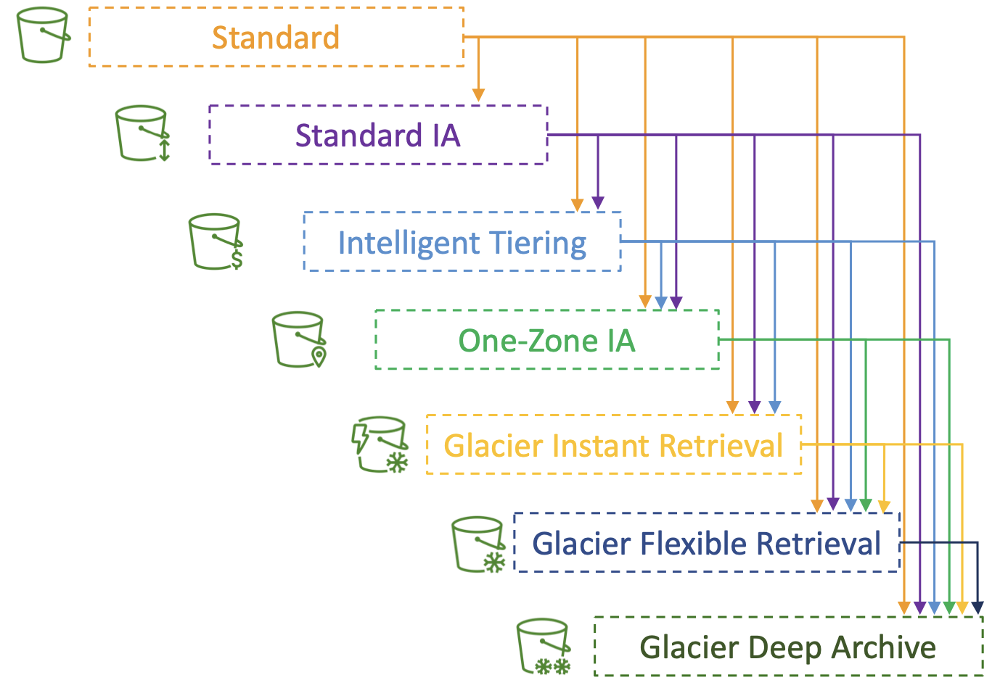
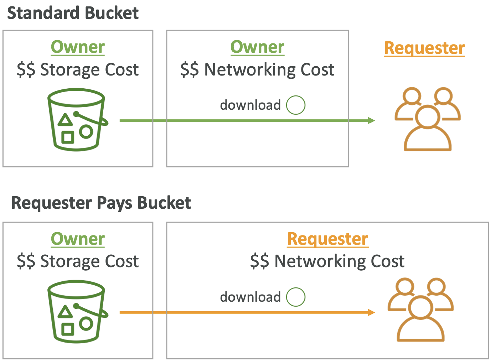
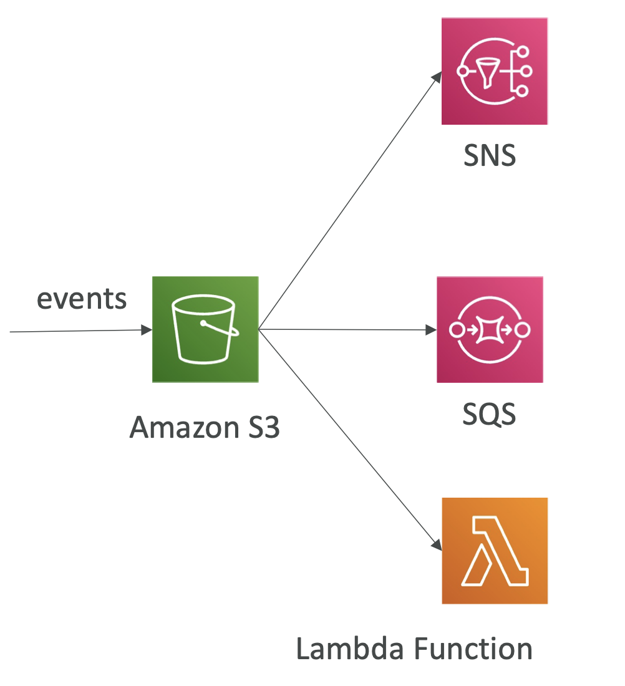
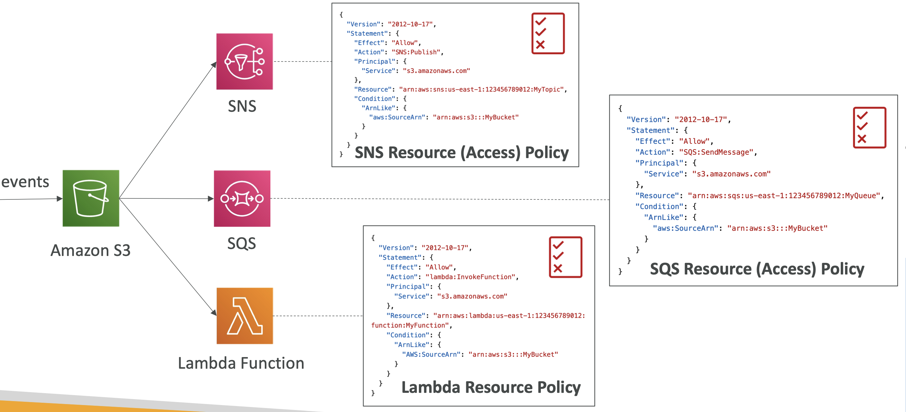
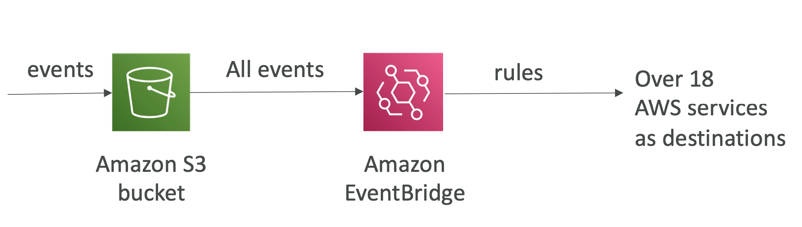
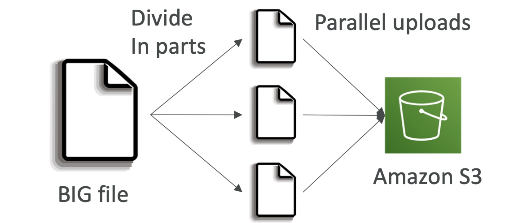
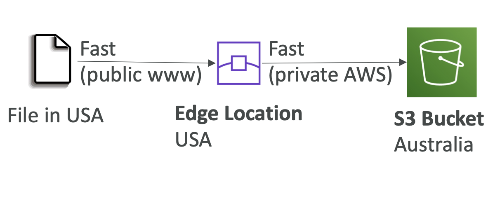
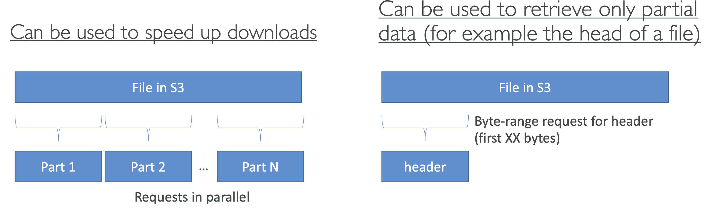
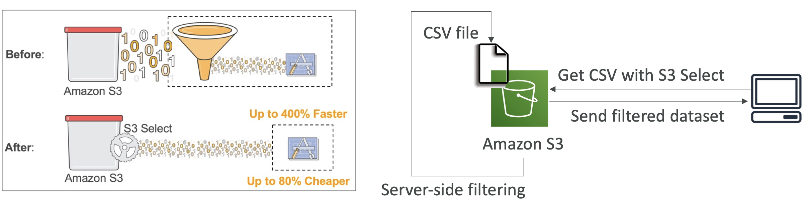
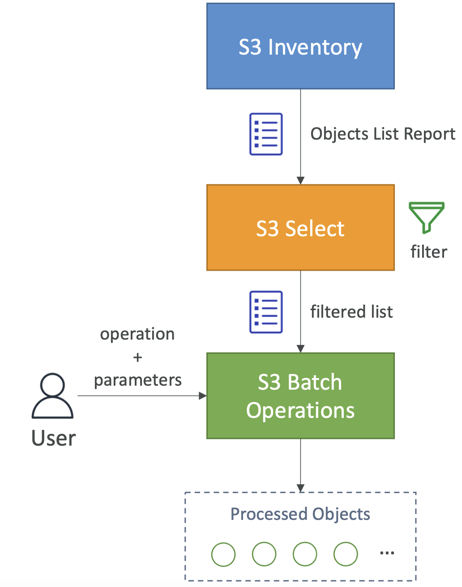

# S3 – Moving between Storage Classes

- You can transition objects between storage classes
- For infrequently accessed object, move them to **Standard IA**
- For archive objects that you don’t need fast access to, move them to **Glacier or Glacier Deep Archive**
- Moving objects can be automated using a **Lifecycle Rules**

- **S3 – Lifecycle Rules**

    - **Transition Actions** – configure objects to transition to another storage class
        - Move objects to Standard IA class 60 days after creation
        - Move to Glacier for archiving after 6 months
    - **Expiration actions** – configure objects to expire (delete) after some time
        - Access log files can be set to delete after a 365 days
        - **Can be used to delete old versions of files (if versioning is enabled)**
        - Can be used to delete incomplete Multi-Part uploads
    - Rules can be created for a certain prefix (example: s3://mybucket/mp3/*)
    - Rules can be created for certain objectsTags (example:Department:Finance)

- **S3- Lifecycle Rules (Scenario 1)**

    - Your application on EC2 creates images thumbnails after profile photos are uploaded to Amazon S3.These thumbnails can be easily recreated, and only need to be kept for 60 days.The source images should be able to be immediately retrieved for these 60 days, and afterwards, the user can wait up to 6 hours. How would you design this?
    - S3 source images can be on **Standard**, with a lifecycle configuration to transition them to **Glacier** after 60 days
    - S3 thumbnails can be on **One-Zone IA**, with a lifecycle configuration to expire them (delete them) after 60 days

- **S3- Lifecycle Rules (Scenario 2)**

    - A rule in your company states that you should be able to recover your deleted S3 objects immediately for 30 days, although this may happen rarely. After this time, and for up to 365 days, deleted objects should be recoverable within 48 hours.
    - Enable **S3 Versioning** in order to have object versions, so that “deleted objects” are in fact hidden by a “delete marker” and can be recovered
    - Transition the “noncurrent versions” (over-ridden by a current version) of the object to **Standard IA**
    - Transition afterwards the “noncurrent versions” to **Glacier Deep Archive**

- **S3 Analytics – Storage Class Analysis**

    - Help you decide when to transition objects to the right storage class
    - Recommendations for **Standard and Standard IA**
        - Does NOT work for One-Zone IA or Glacier
    - Report is updated daily (in csv)
    - 24 to 48 hours to start seeing data analysis
    - Good first step to put together Lifecycle Rules (or improve them)!

# S3 – Requester Pays

- In general, bucket owners pay for all Amazon S3 storage and data transfer costs associated with their bucket
- With **Requester Pays buckets**, the requester instead of the bucket owner pays the cost of the request and the data download from the bucket
- Helpful when you want to share large datasets with other accounts
- The requester must be authenticated in AWS (cannot be anonymous)

# S3 Event Notifications

- S3:ObjectCreated, S3:ObjectRemoved, S3:ObjectRestore, S3:Replication...
- Object name filtering possible (*.jpg)
- Use case: generate thumbnails of images uploaded to S3
- **Can create as many “S3 events” as desired**
- S3 event notifications typically deliver events in seconds but can sometimes take a minute or longer

- **S3 Event Notifications – IAM Permissions**

- Here we dont define IAM roles for S3 but create resource policy on SNS topic, SQS queue and Lambda functions. 

- **S3 Event Notifications with Amazon EventBridge**

    - **Advanced filtering** options with JSON rules (metadata, object size, name...)
    - **Multiple Destinations** – ex Step Functions, Kinesis Streams / Firehose...
    - **EventBridge Capabilities** – Archive, Replay Events, Reliable delivery
    

# S3 – Baseline Performance

- Amazon S3 automatically scales to high request rates, latency 100-200 ms
- Your application can achieve at least **3,500 PUT/COPY/POST/DELETE or 5,500 GET/HEAD requests per second per prefix in a bucket**.
- There are no limits to the number of prefixes in a bucket.
- Example (object path => prefix):
    - bucket/folder1/sub1/file => /folder1/sub1/
    - bucket/folder1/sub2/file => /folder1/sub2/
    - bucket/1/file => /1/
    - bucket/2/file => /2/
- If you spread reads across all four prefixes evenly, you can achieve 22,000 requests per second for GET and HEAD

- **S3 Performance**

    - **Multi-Part upload**:
        - recommended for files > 100MB, must use for files > 5GB
        - Can help parallelize uploads (speed up transfers)
    
    - **S3 Transfer Acceleration (S3TA)**
        - Increase transfer speed by 50-500% by transferring file to an AWS edge location which will forward the data to the S3 bucket in the target region
        - Takes advantage of Amazon CloudFront’s globally distributed edge locations
        - Compatible with multi-part upload
        - With S3TA, you pay only for transfers that are accelerated.
    
        - Bucket-level feature that enables fast, easy, and secure transfers of files over long distances between  client and S3 bucket.
        - You cannot use Transfer Acceleration to copy objects across S3 buckets in different Regions using S3 console.
    - **aws S3 sync command**
        - The aws S3 sync command uses the CopyObject APIs to copy objects between Amazon S3 buckets.
        - The sync command lists the source and target buckets to identify objects that are in the source bucket but that aren't in the target bucket
        - The command also identifies objects in the source bucket that have different LastModified dates than the objects that are in the target bucket.
        - The sync command on a versioned bucket copies only the current version of the object—previous versions aren't copied
        - By default, this preserves object metadata, but the access control lists (ACLs) are set to FULL_CONTROL for your AWS account, which removes any additional ACLs
        - If the operation fails, you can run the sync command again without duplicating previously copied objects.
        - `aws s3 sync s3://DOC-EXAMPLE-BUCKET-SOURCE s3://DOC-EXAMPLE-BUCKET-TARGET` 

- **S3 Performance – S3 Byte-Range Fetches**

    - Parallelize GETs by requesting specific byte ranges
    - In case if you have failure getting specific byte range you can retry with smaller byte range for better resilience in case of failures.
    - Better resilience in case of failures
    

- **S3 Select & Glacier Select**

    - Retrieve less data using SQL by performing server-side filtering
    - Can filter by rows & columns (simple SQL statements)
    - Less network transfer, less CPU cost client-side
    

# S3 Batch Operations

- Perform bulk operations on existing S3 objects with a single request, example:
    - Modify object metadata & properties
    - Copy objects between S3 buckets
    - **Encrypt un-encrypted objects**
    - ModifyACLs, tags
    - Restore objects from S3 Glacier
    - Invoke Lambda function to perform custom action on
- A job consists of a list of objects, the action to perform, and optional parameters
- S3 Batch Operations manages retries, tracks progress, sends completion notifications, generate reports ...
- **You can use S3 Inventory to get object list and use S3 Select to filter your objects**

- Get the object list with S3 inventory and then use S3 select to filter the list for ex find un-encrypted objects in the bucket.
- Do batch operation by passing this list to S3 Batch with parameters for ex to encrypt all the files at once.

# Data Transfer 

Following transfer over public internet is free:
- Data transferred out to the internet for the first 100GB per month, aggregated across all AWS Services and Regions (except China and GovCloud)
- **Data transferred in from the internet**
- Data transferred between S3 buckets in the **same AWS Region**. 
- Data transferred from an Amazon S3 bucket to any AWS service(s) within the same AWS Region as the S3 bucket (including to a different account in the same AWS Region).
- **Data transferred out to Amazon CloudFront (CloudFront)**