# S3 – Object Encryption

- You can encrypt objects in S3 buckets using one of 4 methods
- **Server-Side Encryption (SSE)**
    - **Server-Side Encryption with Amazon S3-Managed Keys (SSE-S3)** – <u>Enabled by Default</u>
        - Encrypts S3 objects using keys handled, managed, and owned by AWS
    - **Server-Side Encryption with KMS Keys stored in AWS KMS (SSE-KMS)**
        - Leverage AWS Key Management Service (AWS KMS) to manage encryption keys
    - **Server-Side Encryption with Customer-Provided Keys (SSE-C)**
        - When you want to manage your own encryption keys
    - **Client-Side Encryption**
    - **DSSE-KMS** is just "double encryption based on KMS".

- **S3 Encryption – SSE-S3**
    - Encryption using keys handled, managed, and owned by AWS
    - Object is encrypted server-side
    - Encryption type is **AES-256**
    - Must set header **"x-amz-server-side-encryption": "AES256"**
    - **Enabled by default for new buckets & new objects**
    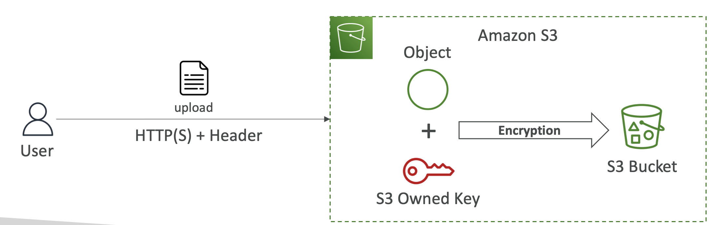
    (User uploads the data with the correct header and S3 will pair it with S3 owned key)

- **Amazon S3 Encryption – SSE-KMS**
    - Encryption using keys handled and managed by AWS KMS (Key Management Service)
    - KMS advantages: user control + audit key usage using CloudTrail (any time anyone uses the key it will be logged in CloudTrail)
    - Object is encrypted server side
    - AWS provides default KMS key for S3 which is free. If you create your own then its paid.
    - Must set header **"x-amz-server-side-encryption": "aws:kms"**
    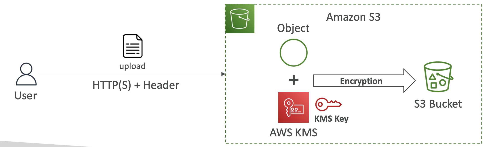
    (In the header we specify the KMS key we want to use)  
    (To read the object you need access to the object and the KMS key)

- **SSE-KMS Limitation**
    - If you use SSE-KMS, you may be impacted by the KMS limits
    - When you upload, it calls the **GenerateDataKey** KMS API
    - When you download, it calls the **Decrypt** KMS API
    - Need to do the API calls to the KMS service
    - Count towards the KMS quota per second (5500, 10000, 30000 req/s based on region)
    - You can request a quota increase using the Service Quotas Console
    - By default when using SSE-KMS a feature Bucket Key is enabled which reduces encryption cost by lowering calls to AWS KMS. Not supported for DSSE-KM.
    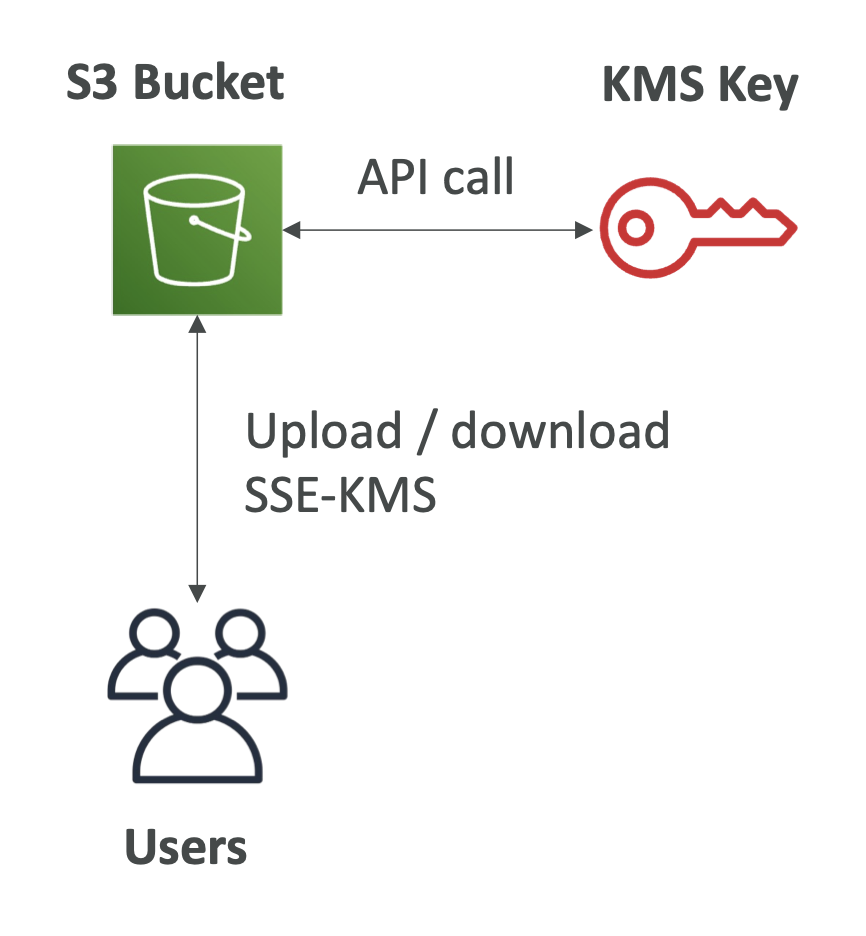

- **Amazon S3 Encryption – SSE-C**
    - Server-Side Encryption using keys fully managed by the customer outside of AWS
    - Amazon S3 does **NOT** store the encryption key you provide (discard after use)
    - **HTTPS must be used** (when passing the key to S3)
    - Encryption key must provided in HTTP headers, for every HTTP request made
    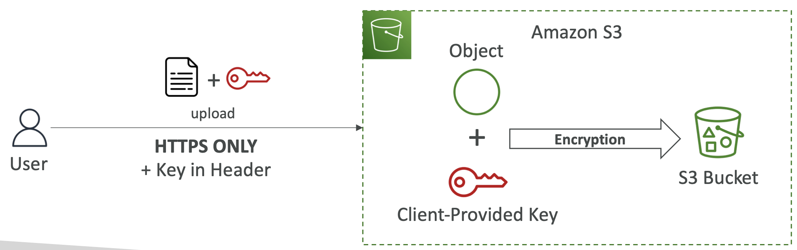

- **Amazon S3 Encryption – Client-Side Encryption**
    - Use client libraries such as **Amazon S3 Client-Side Encryption Library**
    - Clients must encrypt data themselves before sending to Amazon S3
    - Clients must decrypt data themselves when retrieving from Amazon S3
    - Customer fully manages the keys and encryption cycle
    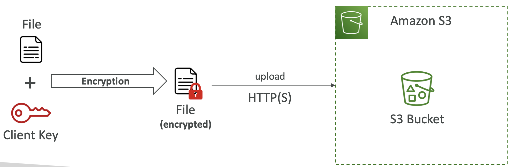

- **Amazon S3 – Encryption in transit (SSL/TLS)**
    - Encryption in flight is also called SSL/TLS
    - Amazon S3 exposes two endpoints:
        - **HTTP Endpoint** – non encrypted
        - **HTTPS Endpoint** – encryption in flight
    - **HTTPS is recommended**
    - **HTTPS is mandatory for SSE-C**
    - Most clients would use the HTTPS endpoint by default

- **Amazon S3 – Force Encryption in Transit aws:SecureTransport**
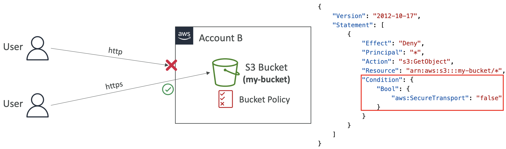  
(Use a bucket policy, which deny any GetObject for condition "aws:SecureTransport":"false")  
("aws:SecureTransport" will be true for HTTPS)  
(Any user using HTTP on your bucket will be denied)  

- **Amazon S3 – Default Encryption vs. Bucket Policies**
    - **SSE-S3 encryption is automatically applied to new objects stored in S3 bucket**
    - Optionally, you can “force encryption” using a bucket policy and refuse any API call to PUT an S3 object without encryption headers (SSE-KMS or SSE-C)
    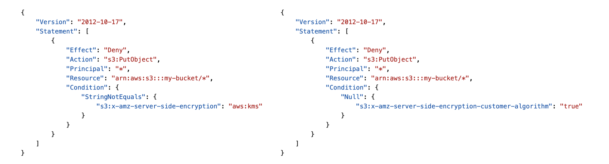
    (For PutObject on the bucket "x-amz-server-side-encryption": "aws:kms" checks if encryption header has KMS, if not then Deny)  
    ("x-amz-server-side-encryption-customer-algorithm" checks for SSE-C and deny PutObject)  
    - **<u> Note: </u> Bucket Policies are evaluated before “Default Encryption”**

# CORS

- **What is CORS?**
    - **Cross-Origin Resource Sharing (CORS)**
    - **Origin = scheme (protocol) + host (domain) + port**
        - example: https://www.example.com (implied port is 443 for HTTPS, 80 for HTTP)
    - **Web Browser** based mechanism to allow requests to other origins while visiting the main origin
    - Same origin: http://example.com/app1 & http://example.com/app2
    - Different origins: http://www.example.com & http://other.example.com
    - The requests won’t be fulfilled unless the other origin allows for the requests, using **CORS Headers** (example: **Access-Control-Allow-Origin**)

- **What is CORS?**
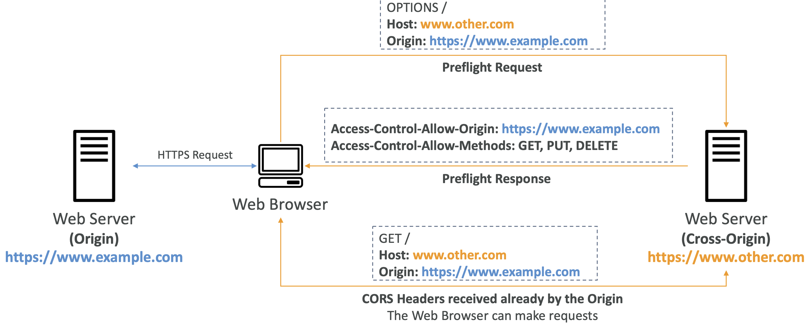
(Web browser does HTTPS request into the origin web-server and as part of this tries to retrieve some images from the other web-server)  
(The web browser will have an security built in, and it will do a pre-flight request to the cross-origin)  
(In the pre-flight request, the web browser will try to fetch the options for www.other.com and tell the origin where request is coming from)  
(If the web-browser has CORS enabled, then the cross-origin server will respond to the pre-flight request saying it allows, GET, PUT,DELETE for the origin)  
(This response is in a CORS header)  
(If the web browser is happy with the CORS header received, then its going to make the request to the other server and retrieve the needed files)  

- **Amazon S3 – CORS**
    - If a client makes a cross-origin request on our S3 bucket, we need to enable the correct CORS headers
    - It’s a popular exam question
    - You can allow for a specific origin or for * (all origins)
    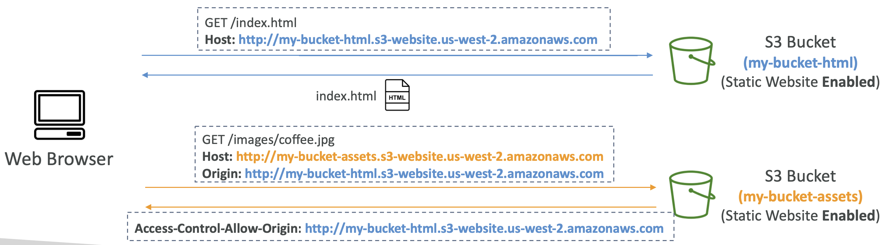
    (One S3 has the static website enabled and the other S3 has all the assets stored in it)  
    (Web-browser tries to access index.html for the said website URL, it gets the index.html)  
    (In the index.html there is an image which needs to be fetched from the other S3 bucket)  
    (The web-browser now sends a request to the other bucket stating the target host and the origin website)  
    (If the S3 bucket is not configured to have the correct CORS header then its going to refuse this request or else it will allow the request and return the Access-Control-Allow-Origin)
    (CORS is a web browser security that allows you to enable images/assets/file being retrieved from S3 bucket in case request is originating from another origin)  

- **Amazon S3 – MFA Delete**
    - **MFA (Multi-Factor Authentication)** – force users to generate a code on a device (usually a mobile phone or hardware) before doing important operations on S3
    - MFA will be required to:
        - Permanently delete an object version
        - Suspend Versioning on the bucket
    - MFA won’t be required to:
        - EnableVersioning
        - List deleted versions
    - To use MFA Delete, **Versioning must be enabled on the bucket**
    - Might have to use AWS CLI to enable this for the root.
    - **Only the bucket owner (root account) can enable/disable MFA Delete**

- **S3 Access Logs**
    - For audit purpose, you may want to log all access to S3 buckets
    - Any request made to S3, from any account, authorized or denied, will be logged into another S3 bucket
    - That data can be analyzed using data analysis tools...(for ex with Athena)
    - The target logging bucket must be in the same AWS region
    - The log format is at: https://docs.aws.amazon.com/AmazonS3/latest/dev/LogFormat.html
    - When you enable server access logging, the S3 updates the bucket policy automatically to include access to the S3 logging service to put.  
    - Access log information can be useful in security and access audits
    - It can also help you learn about your customer base and understand your Amazon S3 bill
    -  AWS recommends that you use AWS CloudTrail for logging bucket and object-level actions for your Amazon S3 resources, as it provides more options to store, analyze and act on the log information.  
    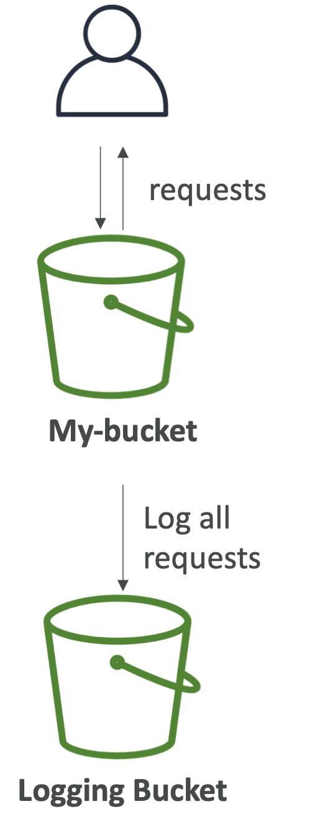  

- **S3 Access Logs:Warning**
    - Do not set your logging bucket to be the monitored bucket
    - It will create a logging loop, and your bucket will grow exponentially
    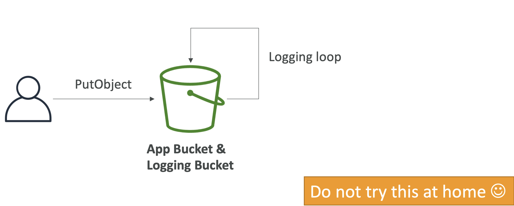  
    (You do PutObject and the logging bucket is same, and then it will create a logging loop of put when the access log is put in the same bucket and you will pay a lot of money)  

- **Amazon S3 – Pre-Signed URLs**
    - Generate pre-signed URLs using the **S3 Console, AWS CLI or SDK**
    - **URL Expiration**
        - **S3 Console** – 1 min up to 720 mins (12 hours)
        - **AWS CLI** – configure expiration with --*expires-in* parameter in seconds (default 3600 secs, max. 604800 secs ~ 168 hours)
    - Users given a pre-signed URL inherit the permissions of the user that generated the URL for GET / PUT
    - Examples:
        - Allow only logged-in users to download a premium video from your S3 bucket
        - Allow an ever-changing list of users to download files by generating URLs dynamically
        - Allow temporarily a user to upload a file to a precise location in your S3 bucket
    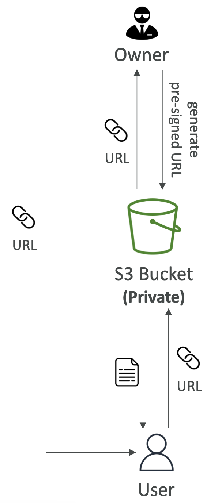  
    (S3 gives a URL for the bucket with the bucket owner credentials for authorization to acces the files)  
    (Temporary access to one specific file for download/upload)  

- **S3 Glacier Vault Lock**
    - Adopt a WORM (Write Once Read Many) model
    - Create a Vault Lock Policy
    - Lock the policy for future edits (can no longer be changed or deleted)(even by AWS or admins)
    - Helpful for compliance and data retention

- **S3 Object Lock (versioning must be enabled)**
    - Adopt a WORM (Write Once Read Many) model
    - Block an object version deletion for a specified amount of time
    - **Retention mode - Compliance:**
        - Object versions can't be overwritten or deleted by any user, including the root user
        - Objects retention modes can't be changed, and retention periods can't be shortened
    - **Retention mode - Governance:**
        - Most users can't overwrite or delete an object version or alter its lock settings
        - Some users have special permissions to change the retention or delete the object
    - **Retention Period:** protect the object for a fixed period, it can be extended
    - **Legal Hold:**
        - protect the object indefinitely, independent from retention period
        - can be freely placed and removed using the *s3:PutObjectLegalHold* IAM permission

- **S3 – Access Points**
     - Access Points simplify security management for S3 Buckets
    - Each Access Point has:
        - its own DNS name (Internet Origin or VPC Origin)
        - an access point policy (similar to bucket policy) – manage security at scale
    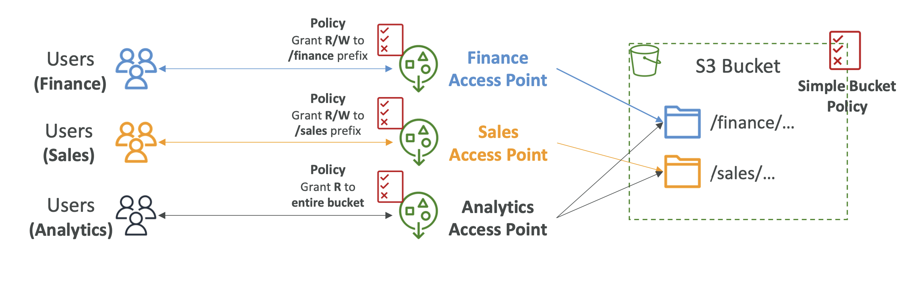  
    (S3 bucket has lots of data on finance, sales etc)  
    (Different groups of users want to acces the data. We can manage access with bucket policies but as the users grow this can become complicated)  
    (We create for ex a Finance access point with a access policy, which will be connected to the finance data)  
    (The access point policy looks like bucket policy and will grant read/write to the finance prefix)  
    (Can create another access point for Analytics with read only policy to entire bucket)  
    (So we pushed the Security Management from bucket policy to access points)  
    (With correct IAM permissions, users can now access the correct access points to connect to only specific parts in the bucket)  
    (The bucket policy of the S3 bucket itself can now be very simple as the security mgmt is handled via access points)  

- **S3 – Access Points – VPC Origin**
    - We can define the access point to be accessible only from within the VPC
    - You must create aVPC Endpoint to access the Access Point (Gateway or Interface Endpoint)
    - The VPC Endpoint Policy must allow access to the target bucket and Access Point
    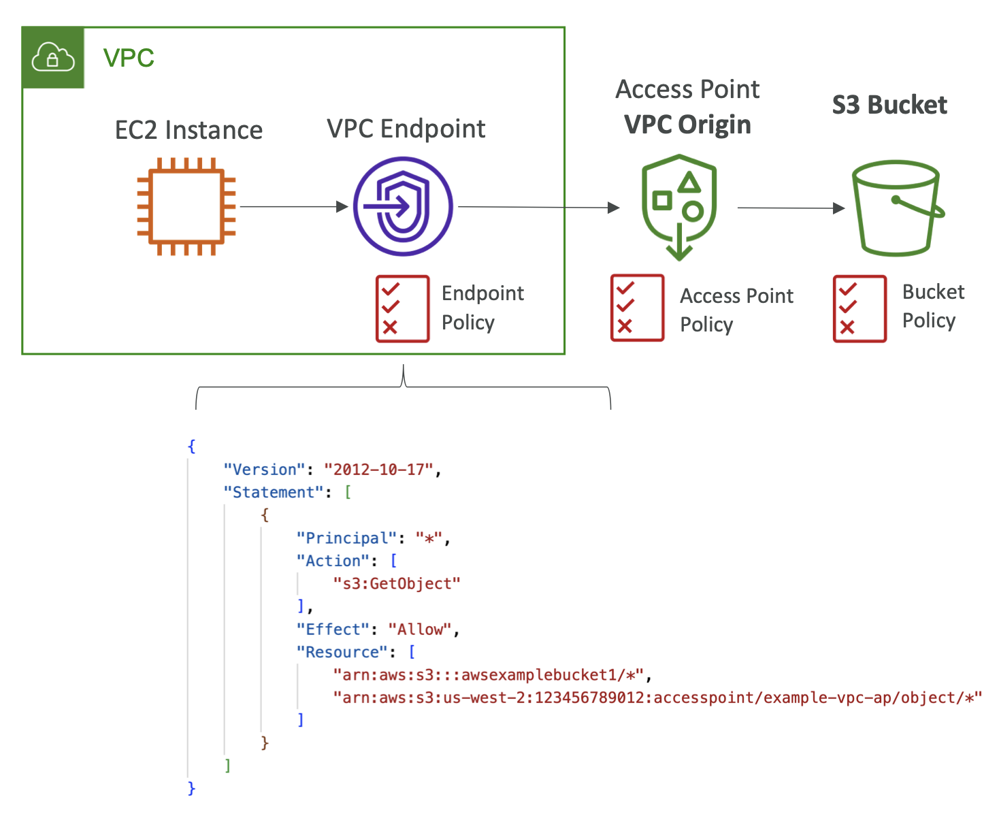  
    (The policy at the VPC endpoint, allows EC2 instance access to the target bucket and the access point)  
    (We also have security at the VPC endpoint, at access point and at the S3 bucket also)  

- **S3 Object Lambda**
    - Use AWS Lambda Functions to change the object before it is retrieved by the caller application
    - Only one S3 bucket is needed, on top of which we create **S3 Access Point** and **S3 Object Lambda Access Points.**
    - Use Cases:
        - Redacting personally identifiable information for analytics or non- production environments.
        - Converting across data formats,such as converting XML to JSON.
        - Resizing and watermarking images on the fly using caller-specific details, such as the user who requested the object.
    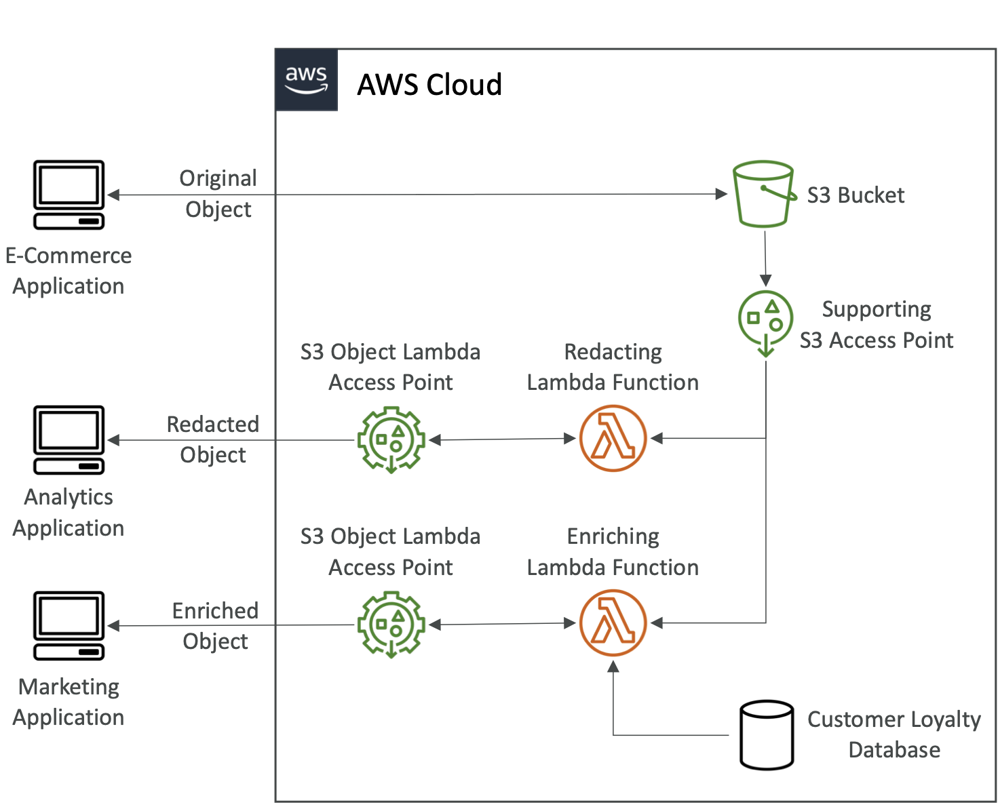  
    (An E-commerce application owns the S3 bucket and hence able to access the bucket directly)  
    (An analytics application only wants access to the redacted object (some data deleted from the object))  
    (Instead of creating a new bucket to store these objects for analytics we use S3 access points with Lambda function on it)  
    (On the S3 access point on the bucket, attach a Lambda function which will redact the object as it is retrieved)  
    (Further on the Lambda function, we create S3 object Lambda access point, and this is how the analytics application will access the bucket)  
    (A marketing application might need an enriched object, and then enhance the Customer Loyalty Database with it)  
    (We can create another Lambda function on the S3 bucket which will enrich the data by looking up in the Loyalty DB)  
    (Now create another S3 object Lambda access point for this new function so marketing applicatio can access the S3 bucket)  