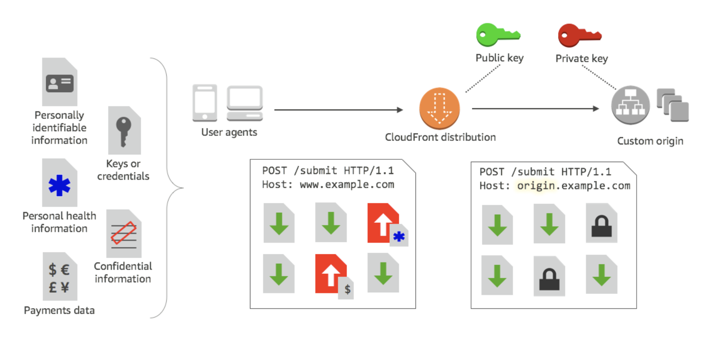

# CloudFront

- Content Delivery Network (CDN)
- **Improves read performance, content is cached at the edge**
- Improves users experience (lower latency as content is cached all around the world)
- 216 Point of Presence globally (edge locations)
- **DDoS protection (because worldwide), integration with Shield, AWS Web Application Firewall**
- CloudFront supports HTTP/RTMP protocol based requests
- You can an use different origins for different types of content on a single site – e.g. **S3 for static objects, EC2 for dynamic content, and custom origins for third-party content**.
- Keeps persistent connections with origin servers so objects are fetched from the origins as quickly as possible.

- **Origins**
    - **S3 bucket**
        - For distributing files and caching them at the edge
        - Enhanced security with CloudFront Origin Access Control (OAC) (To guarantee than only CloudFront can access the bucket)
        - OAC is replacing Origin Access Identity(OAI)
        - CloudFront can be used as an ingress (to upload files to S3)
    - **Custom Origin (HTTP)**
        - Application Load Balancer
        - EC2 instance
        - S3 website (must first enable the bucket as a static S3 website)
        - Any HTTP backend you want

- S3 with CloudFront is a very powerful way of distributing static content to geographically dispersed users with low latency speeds. If you have objects that are **smaller than 1GB** or if the data set is less than 1GB in size, you should consider using CloudFront's PUT/POST commands for optimal performance. 
- S3 doesn't support HTTPS access for website endpoints. If you want to use HTTPS, you can use CloudFront to serve a static website hosted on Amazon S3.

- **CloudFront at a high level**
  
(We have an Origin and then edge location all around th world)  
(When client sends a request to the edge location, the edge location will check its cache, if the cache doesnt have the content then it will fetch the result from the origin and then cache the result locally for serving future requests)  

- **S3 as an Origin**
  
(Users will get their content served through edge location but first edge location will get it from origin S3 bucket through private AWS n/w)  
(The S3 bucket will be secured through Origin Access Control and by modifying the bucket policy at S3)  
(Content from the S3 bucket in one region is distributed all around the world through edge locations or points of presence)

- **CloudFront vs S3 Cross Region Replication**
    - CloudFront:
        - Global Edge network
        - Files are cached for a TTL (maybe a day)
        - **Great for static content that must be available everywhere**
    - S3 Cross Region Replication:
        - Must be setup for each region you want replication to happen
        - Files are updated in near real-time (no caching)
        - Read only
        - **Great for dynamic content that needs to be available at low-latency in few regions**

- **ALB or EC2 as an origin**
  
(CloudFront can access any HTTP backend which includes EC2 instance or ALB)  
(We have an HTTP backend here on an EC2 instance)  
(For users to access this through CloudFront, the edge locations will make request to the EC2 instance hence they **must** be public)  
(The EC2 instances must be public, otherwise edge locations will not be able to access it, because there is not private VPC connectivity in CloudFront)  
(We must have a security group on the EC2 instance that allows all the public IP of CloudFront. The list of IP can be found in AWS docs)  
(The second approach is to access the EC2 private instances through a public ALB)  
(The EC2 instances may be private because there is private VPC connection between ALB and EC2 instances)  
(EC2 instance security group should allow security group of the ALB)  
(The public IPs of the CloudFront should be allowed in the security group of ALB)  

- **Geo Restriction**
    - You can restrict who can access your distribution
        - **Allowlist**: Allow your users to access your content only if they're in one of the countries on a list of approved countries.
        - **Blocklist**: Prevent your users from accessing your content if they're in one of the countries on a list of banned countries.
    - The “country” is determined using a 3rd party Geo-IP database
    - Use case: Copyright Laws to control access to content

- **Field-level encryption**
    -  Allows you to enable your users to securely upload sensitive information to your web servers.
    - The sensitive information is encrypted at the edge, close to the user, and remains encrypted throughout your entire application stack.
    - Specify the set of fields in **POST** requests that you want to be encrypted, and the public key to use to encrypt them.
    - You can encrypt up to 10 data fields in a request.
    

# High-availability and failover

- Create an origin group with two origins: a primary and a secondary
- If primary origin is unavailable or returns specific HTTP response status codes that indicate failure, CloudFront automatically switches to the secondary origin

# Pricing

- CloudFront Edge locations are all around the world
- The cost of data out per edge location varies
  

- **Price Classes**
    - You can reduce the number of edge locations for **cost reduction**
    - Three price classes:
        - 1 Price Class All: all regions – best performance
        - 2 Price Class 200: most regions, but excludes the most expensive regions
        - 3 Price Class 100: only the least expensive regions
      

#  Cache Invalidations

- In case you update the back-end origin, CloudFront doesn’t know about it and will only get the refreshed content after the TTL has expired
- However, you can force an entire or partial cache refresh (thus bypassing the TTL) by performing a **CloudFront Invalidation**
- You can invalidate all files ( * ) or a special path (/images/*)
  

(There are 2 edge locations each has its own cache which contains index.html and the images)  
(If TTL for the files is set to 1 day, and you updated the files in the S3 bucket(origin), then if you want the changes to the files reflected immidiately then you can invalidate the paths /index.html and /image/*)  
(Then CloudFront tells the edge locations to invalidate the said files and the files are going to be removed from the cache)  
(Next time user request these files edge locations will not find it in the cache and hence re-fetch from the origin)  

# Regional Caches

- Regional edge caches are CloudFront locations that are deployed globally, close to your viewers
- They’re located between your origin server and the POPs(global edge locations that serve content directly to viewers)
- As objects become less popular, individual POPs might remove those objects to make room for more popular content
- Regional edge caches have a larger cache than an individual POP, so objects remain in the cache longer at the nearest regional edge cache.
- Viewer makes a request -> DNS routes the request to nearest POP -> If object not in cache, POP goes to nearest regional edge cache -> for objects not cached at either POP or regional edge cache location, forward the request to origin.
- **Notes**
    - Regional edge caches have feature parity with POPs. Ex,**cache invalidation request** removes an object from both POP & regional edge caches before it expires. Next time a viewer requests the object, CloudFront returns to the origin to fetch the latest version of the object.- Proxy HTTP methods (PUT, POST, PATCH, OPTIONS, and DELETE) go directly to the origin from the POPs and do not proxy through the regional edge caches.
    - Dynamic requests, as determined at request time, do not flow through regional edge caches, but go directly to the origin.
    - When the origin is an Amazon S3 bucket and the request’s optimal regional edge cache is in the same AWS Region as the S3 bucket, the POP skips the regional edge cache and goes directly to the S3 bucket.