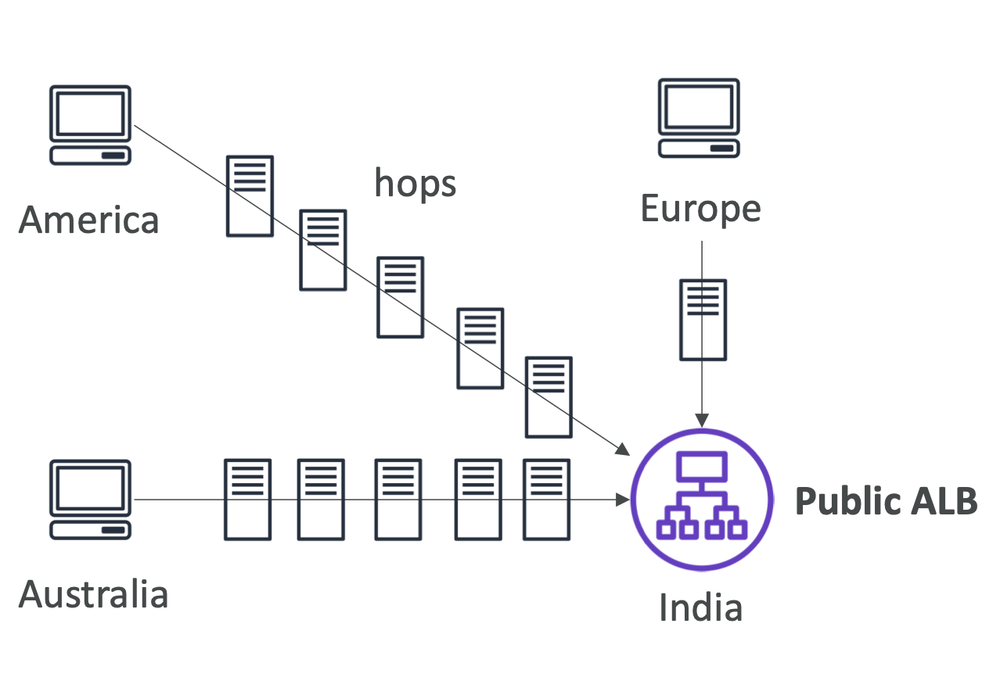
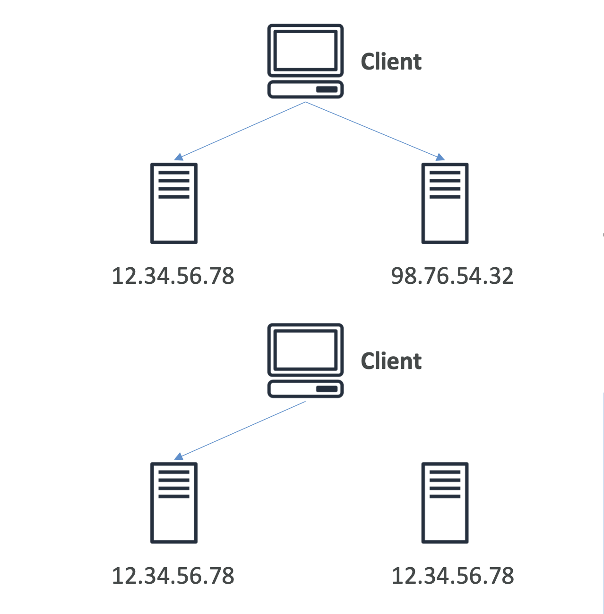
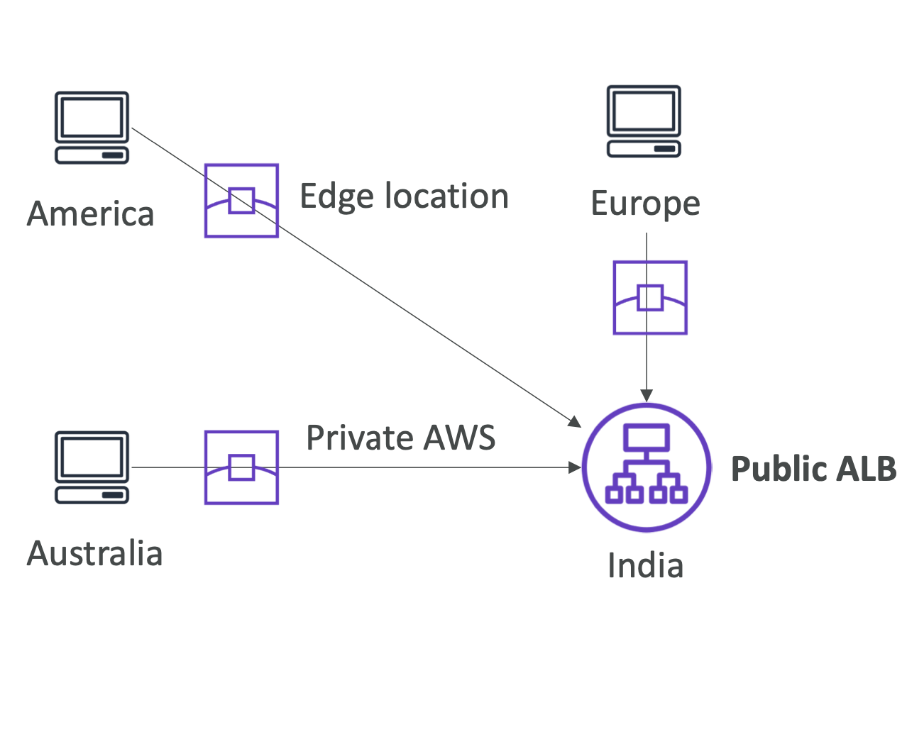

# AWS Global Accelerator

- AWS Global Accelerator is a networking service that helps you improve the availability and performance of the applications that you offer to your global users
- It provides **static IP addresses that provide a fixed entry point to your applications** and eliminate the complexity of managing specific IP addresses for different AWS Regions and Availability Zones (AZs)
- Always routes user traffic to the optimal endpoint based on performance, reacting instantly to changes in application health, your user’s location, and policies that you configure.
- If you have workloads that cater to a global client base, AWS recommends that you use AWS Global Accelerator.
- If you have workloads hosted in a single AWS Region and used by clients in and around the same Region, you can use an Application Load Balancer or Network Load Balancer to manage your resources.

- **Global users for our application**
    - You have deployed an application and have global users who want to access it directly.
    - They go over the public internet, which can add a lot of latency due to many hops
    - We wish to go as fast as possible through AWS network to minimize latency
      
    (If application is deployed in India and we have a public ALB, then users from around the world will access this over public internet)  
    (The hops in the network can add a lot of latency, and the connections can get lost in between and not directly within AWS infra)  

- **Unicast IP vs Anycast IP**
    - Unicast IP: one server holds one IP address
    - Anycast IP: all servers hold the same IP address and the client is routed to the nearest one
      

- **Global Accelerator**
    - Leverage the AWS internal network to route to your application
    - **2 Anycast IP** are created for your application
    - The Anycast IP send traffic directly to Edge Locations (closest to theuser)
    - The Edge locations send the traffic to your application
    - The global accelerator is created by default in us-west(Oregon)
     
    (Here instead of accessing the application deployed in India directly over public internet, its accessed via edge locations)  
    (From the edge location to the ALB its the AWS internal network, so more stable, less latency)  
    
    - Works with **Elastic IP, EC2 instances, ALB, NLB, public or private**
    - Consistent Performance
        - Intelligent routing to lowest latency(edge location) and fast regional failover
        - No issue with client cache (client doesnt cache anything) (because the IP doesn’t change)
        - Internal AWS network
    - Health Checks
        - Global Accelerator performs a health check of your applications
        - Helps make your application global (failover less than 1 minute for unhealthy)
        - Great for disaster recovery (thanks to the health checks)
    - Security
        - only 2 external IP need to be whitelisted
        - DDoS protection thanks to AWS Shield

# AWS Global Accelerator vs CloudFront
    
- They both use the AWS global network and its edge locations around the world
- Both services integrate with AWS Shield for DDoS protection.
- **CloudFront**
    - Improves performance for both cacheable content (such as images and videos)
    - Dynamic content(such as API acceleration and dynamic site delivery)
    - Content is served at the edge
- **Global Accelerator**
    - Improves performance for a wide range of applications over TCP or UDP
    - Proxying packets at the edge to applications running in one or more AWS Regions.
    - Good fit for non-HTTP use cases,such as gaming(UDP), IoT(MQTT),or VoiceoverIP
    - Good for HTTP use cases that require static IP addresses
    - Good for HTTP use cases that required deterministic,fast regional failover