# AWS Snow Family

- Highly-secure, portable devices to **collect and process data at the edge, and migrate data into and out of AWS**
- Data migration: Snowcone, Snowball Edge, Snowmobile
- Edge computing: Snowcone, Snowball Edge
- AWS Snow Family: offline devices to perform data migrations
    - If it takes more than a week to transfer over the network, use Snowball devices!

- **Data Migrations with AWS Snow Family**

    - Challenges:
        - Limited connectivity
        - Limited bandwidth
        - High network cost
        - Shared bandwidth (can’t maximize the line)
        - Connection stability
    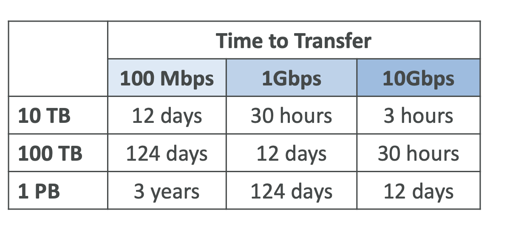

- **Snowball Edge (for data transfers)**

    - Physical data transport solution:moveTBs or PBs of data in or out of AWS
    - Alternative to moving data over the network (and paying network fees)
    - Pay per data transfer job
    - Provide block storage and Amazon S3-compatible object storage
    - **Snowball Edge Storage Optimized**
        - 80 TB of HDD capacity for block volume and S3 compatible object storage
    - **Snowball Edge Compute Optimized**
        - 42 TB of HDD or 28TB NVMe capacity for block volume and S3 compatible object storage
    - Use cases:large data cloud migrations, DC decommission, disaster recovery

- **AWS Snowcone & Snowcone SSD**
    
    - **Small, portable computing, anywhere, rugged & secure, withstands harsh environments**
    - Light (4.5 pounds, 2.1 kg)
    - Device used for edge computing, storage, and data transfer
    - **Snowcone** – 8 TB of HDD Storage
    - **Snowcone SSD** – 14 TB of SSD Storage
    - Use Snowcone where Snowball does not fit (space- constrained environment)
    - Must provide your own battery / cables
    - Can be sent back to AWS offline, or connect it to internet and use **AWS DataSync** to send data

- **AWS Snowmobile**

    - Transfer exabytes of data (1 EB = 1,000 PB = 1,000,000 TBs)
    - Each Snowmobile has 100 PB of capacity (use multiple in parallel)
    - High security: temperature controlled, GPS, 24/7 video surveillance
    - **Better than Snowball if you transfer more than 10 PB**

- **AWS Snow Family for Data Migrations**
    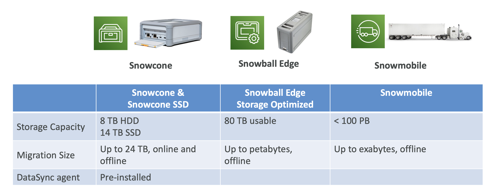

- **Snow Family – Usage Process**

    - 1 Request Snowball devices from the AWS console for delivery
    - 2 Install the snowball client / AWS OpsHub on your servers
    - 3 Connect the snowball to your servers and copy files using the client
    - 4 Ship back the device when you’re done (goes to the right AWS facility)
    - 5 Data will be loaded into an S3 bucket
    - 6 Snowball is completely wiped

# Edge Computing

- **What is Edge Computing?**

    - Process data while it’s being created on an edge location
        - A truck on the road, a ship on the sea, a mining station underground...
    - These locations may have
        - Limited / no internet access
        - Limited / no easy access to computing power
    - We setup a **Snowball Edge / Snowcone device** to do edge computing
    - Use cases of Edge Computing:
        - Preprocess data
        - Machine learning at the edge
        - Transcoding media streams
    - Eventually (if need be) we can ship back the device to AWS (for transferring data for example)

- **Snow Family – Edge Computing**

    - Snowcone & Snowcone SSD (smaller)
        - 2 CPUs, 4 GB of memory, wired or wireless access
        - USB-C power using a cord or the optional battery
    - Snowball Edge – Compute Optimized
        - 104 vCPUs, 416 GiB of RAM
        - Optional GPU (useful for video processing or machine learning)
        - 28 TB NVMe or 42TB HDD usable storage
        - Storage Clustering available (up to 16 nodes)
    - Snowball Edge – Storage Optimized
        - Upto 40vCPUs, 80 GiB of RAM, 80 TB storage
    - All: Can run EC2 Instances & AWS Lambda functions (using AWS IoT Greengrass)
    - Long-term deployment options: 1 and 3 years discounted pricing

# AWS OpsHub

- Historically, to use Snow Family devices, you needed a CLI (Command Line Interface tool)
- Today, you can use AWS OpsHub (a software you install on your computer / laptop) to manage your Snow Family Device
    - Unlocking and configuring single or clustered devices
    - Transferring files
    - Launching and managing instances running on Snow Family Devices
    - Monitor device metrics (storage capacity, active instances on your device)
    - Launch compatible AWS services on your devices (ex: Amazon EC2 instances, AWS DataSync, Network File System (NFS))

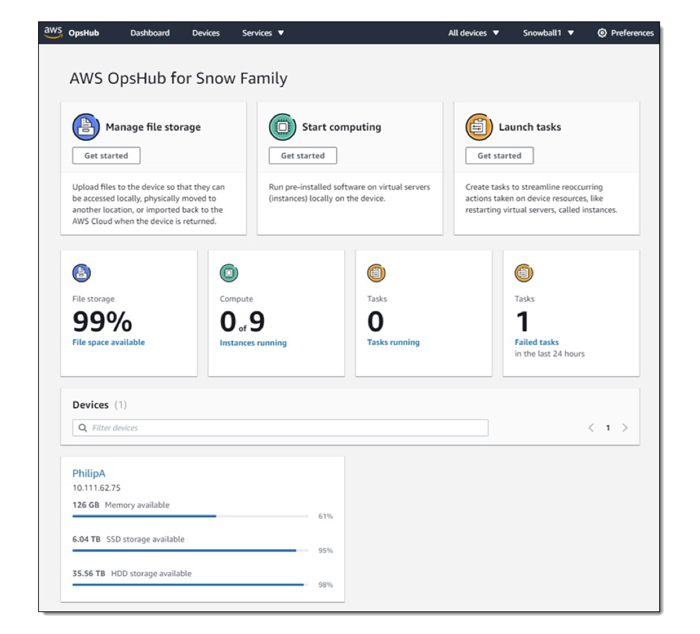

- **Solution Architecture: Snowball into Glacier**
    - **Snowball cannot import to Glacier directly**
    - You must use Amazon S3 first, in combination with an S3 lifecycle policy

# Amazon FSx – Overview

- Launch 3rd party high-performance file systems on AWS
- Fully managed service

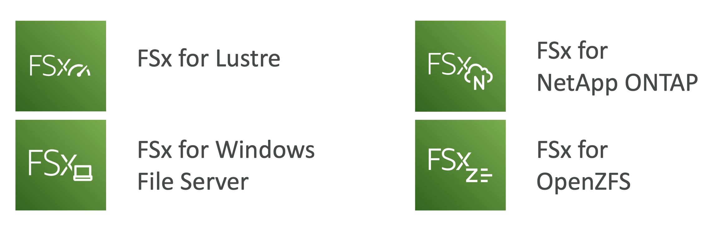

- **Amazon FSx for Windows (File Server)**
    - **FSx for Windows** is a fully managed Windows file system share drive
    - Supports SMB protocol & Windows NTFS
    - Microsoft Active Directory integration, ACLs, user quotas
    - **Can be mounted on Linux EC2 instances**
    - Supports **Microsoft's Distributed File System (DFS) Namespaces** (group files across multiple FS)
    - Scale up to 10s of GB/s, millions of IOPS, 100s PB of data
    - Storage Options:
        - SSD – latency sensitive workloads (databases, media processing, data analytics, ...)
        - HDD – broad spectrum of workloads (home directory, CMS, ...)
    - Can be accessed from your on-premises infrastructure (VPN or Direct Connect)
    - Can be configured to be Multi-AZ (high availability)
    - Data is backed-up daily to S3

- **Amazon FSx for Lustre**
    - Lustre is a type of parallel distributed file system, for large-scale computing
    - The name Lustre is derived from “Linux” and “cluster
    - Machine Learning, **High Performance Computing (HPC)**
    - Video Processing, Financial Modeling, Electronic Design Automation
    - Scales up to 100s GB/s, millions of IOPS, sub-ms latencies
    - Storage Options:
        - SSD – low-latency, IOPS intensive workloads, small & random file operations
        - HDD – throughput-intensive workloads, large & sequential file operations
    - **Seamless integration with S3**
        - Can “read S3” as a file system (through FSx)
        - Can write the output of the computations back to S3 (through FSx)
    - **Can be used from on-premises servers (VPN or Direct Connect)**

- **FSx Lustre - File System Deployment Options**
    - **Scratch File System**
        - Temporary storage
        - Data is not replicated (doesn’t persist if file server fails)
        - High burst (6x faster, 200MBps per TiB)
        - Usage: short-term processing, optimize costs
    - **Persistent File System**
        - Long-term storage
        - Data is replicated within same AZ
        - Replace failed files within minutes
        - Usage: long-term processing, sensitive data
    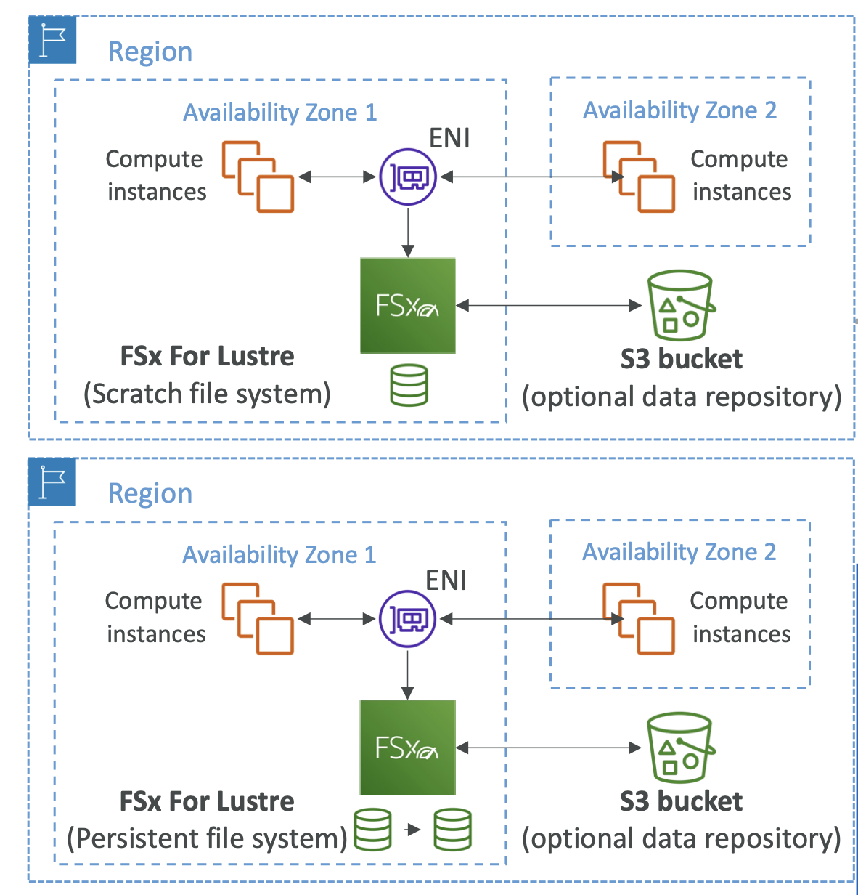

- **FSx for NetApp ONTAP**
    - Managed NetApp ONTAP on AWS
    - **File System compatible with NFS, SMB, iSCSI protocol**
    - Move workloads running on ONTAP or NAS to AWS
    - Works with: • Linux, Windows, MacOS, VMware Cloud on AWS, Amazon Workspaces & AppStream 2.0, Amazon EC2, ECS and EKS
    - Storage shrinks or grows automatically
    - Snapshots,replication,low-cost,compressionanddata
    - **Point-in-time instantaneous cloning (helpful for testing new workloads)**
    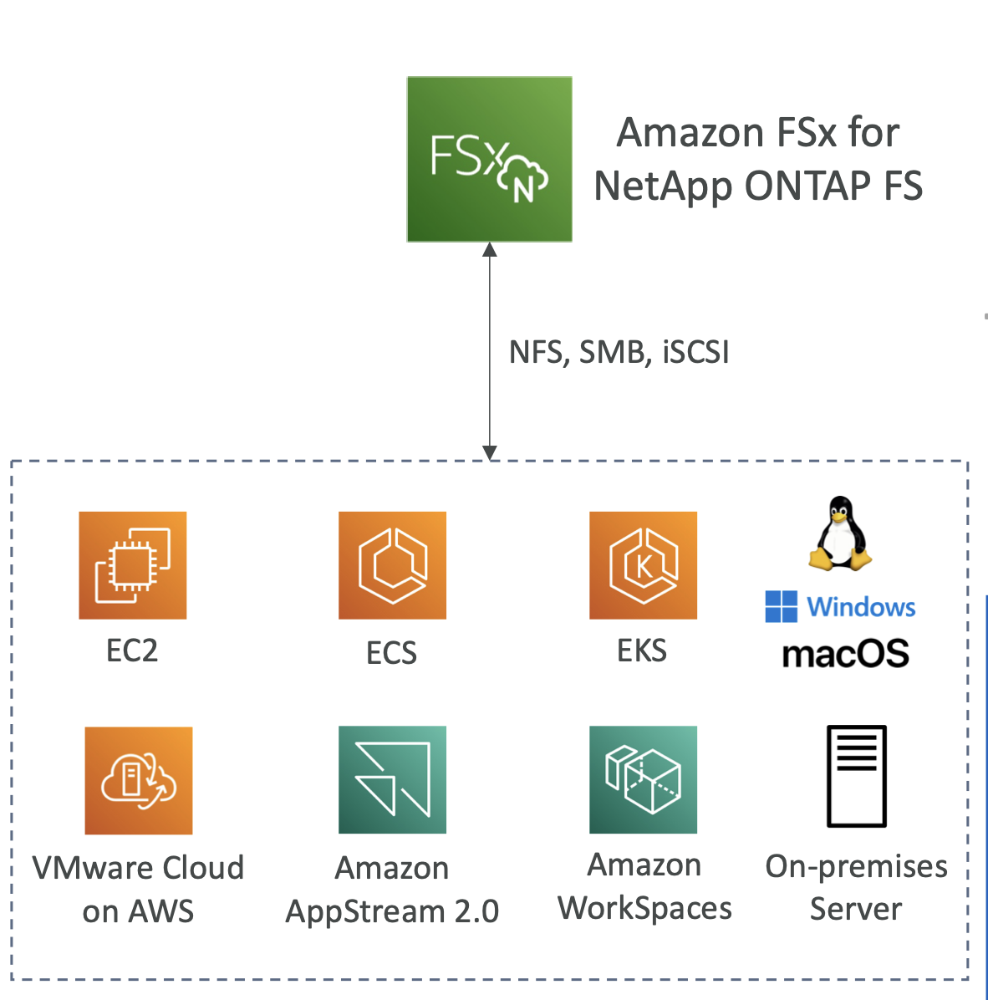

- **FSx for OpenZFS**
    - Managed OpenZFS file system on AWS
    - File System compatible with NFS (v3, v4, v4.1, v4.2)
    - Move workloads running on ZFS to AWS
    - Works with: • Linux, Windows, MacOS, VMware Cloud on AWS, Amazon Workspaces & AppStream2.0, Amazon EC2, ECS and EKS
    - Up to 1,000,000 IOPS with < 0.5ms latency
    - Snapshots, compression and low-cost
    - **Point-in-time instantaneous cloning (helpful for testing new workloads)**
    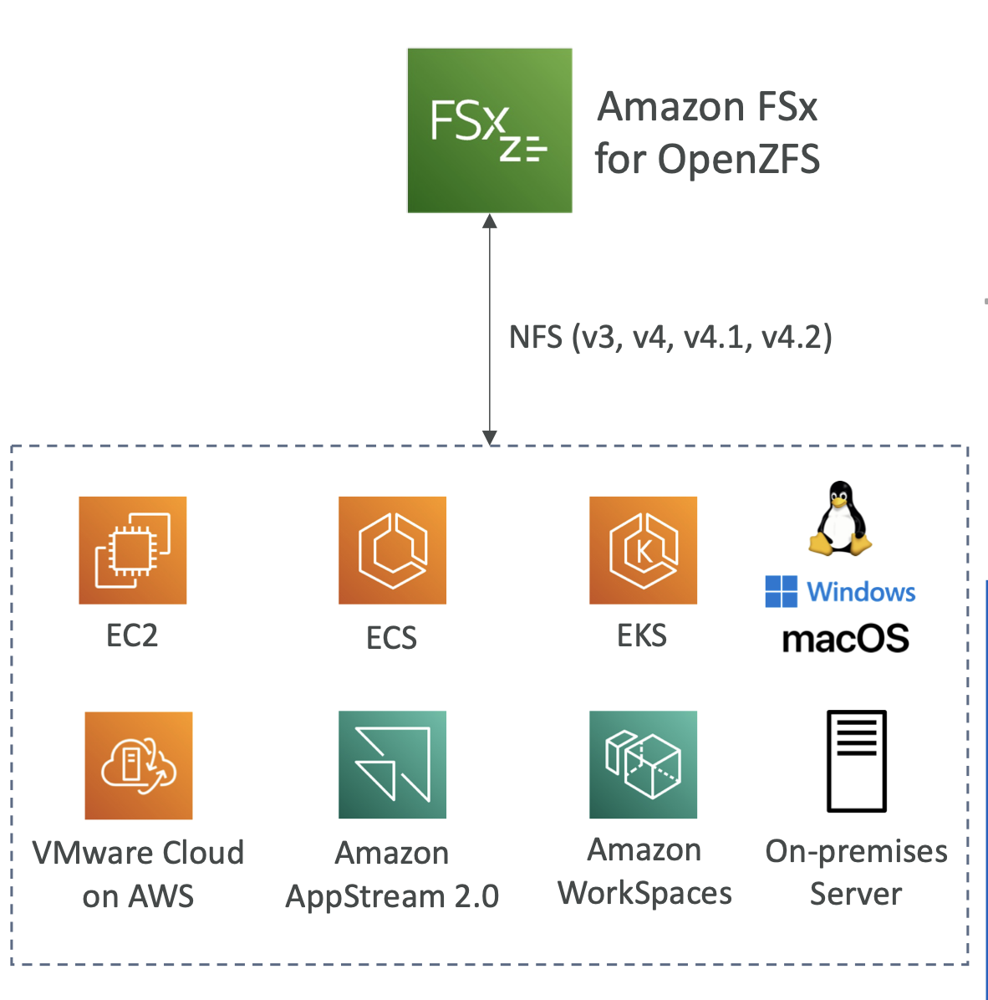

- **Hybrid Cloud for Storage**
    - AWS is pushing for ”hybrid cloud”
        - Part of your infrastructure is on the cloud
        - Part of your infrastructure is on-premises
    - This can be due to
        - Long cloud migrations
        - Security requirements
        - Compliance requirements
        - IT strategy
    - S3 is a proprietary storage technology (unlike EFS / NFS), so how do you expose the S3 data on-premises?
    - AWS Storage Gateway!

- **AWS Storage Cloud Native Options**
    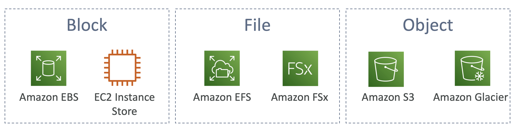

- **AWS Storage Gateway**
    - Bridge between on-premises data and cloud data
    - Use cases: disaster recovery, backup & restore, tiered storage, on-premises cache & low-latency files access
    - Types of Storage Gateway: S3 File Gateway, FSx File Gateway, Volume Gateway, Tape Gateway

    - **S3 File Gateway**
        - Configured S3 buckets are accessible using the NFS and SMB protocol
        - **Most recently used data is cached in the file gateway**
        - Supports S3 Standard, S3 Standard IA, S3 One Zone A, S3 Intelligent Tiering
        - **Transition to S3 Glacier using a Lifecycle Policy**
        - Bucket access using IAM roles for each File Gateway
        - SMB Protocol has integration with Active Directory (AD) for user authentication
    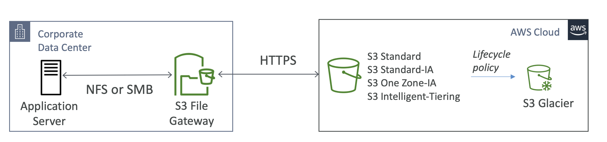

    - **FSx File Gateway**
        - Native access to Amazon FSx for Windows File Server
        - **Local cache for frequently accessed data**
        - Windows native compatibility (SMB, NTFS, Active Directory...)
        - Useful for group file shares and home directories
    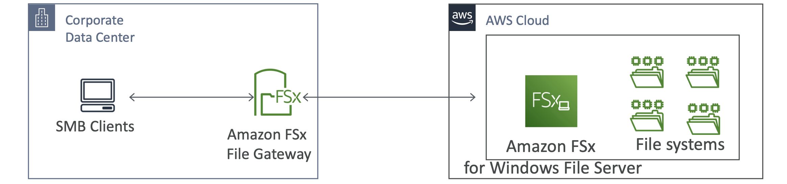

    - **Volume Gateway**
        -  Block storage using iSCSI protocol backed by S3
        - Backed by EBS snapshots which can help restore on-premises volumes!
        - Cached volumes: low latency access to most recent data
        - Stored volumes: entire dataset is on premise, scheduled backups to S3
    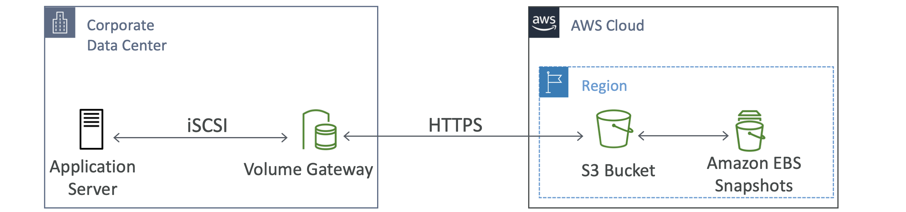

    - **Tape Gateway**
        - Some companies have backup processes using physical tapes (!)
        - With Tape Gateway, companies use the same processes but, in the cloud
        - VirtualTape Library (VTL) backed by Amazon S3 and Glacier
        - Back up data using existing tape-based processes (and iSCSI interface)
        - Works with leading backup software vendors
    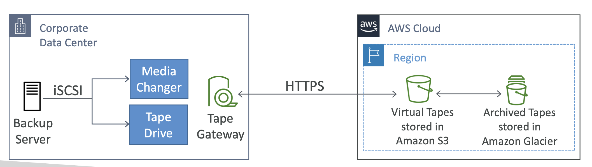
    
    - **Storage Gateway – Hardware appliance**
        - Using Storage Gateway means you need on-premises virtualization
        - Otherwise, you can use a Storage Gateway Hardware Appliance
        - You can buy it on amazon.com
        - Works with File Gateway,Volume Gateway,
        - Has the required CPU, memory, network, SSD cache resources
        - Helpful for daily NFS backups in small data centers
    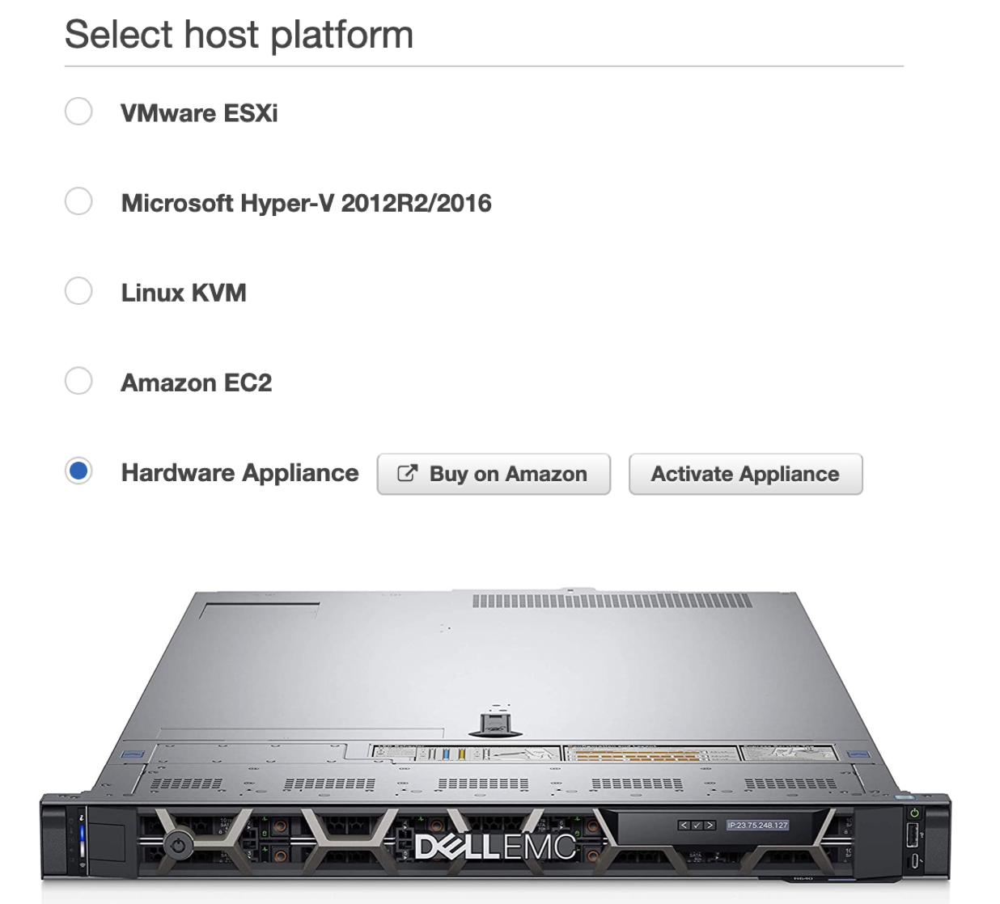

    - **AWS Storage Gateway**
    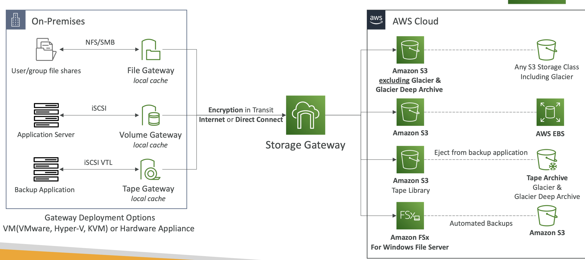

# AWS Transfer Family

- A fully-managed service for file transfers into and out of Amazon S3 or Amazon EFS using the FTP protocol
- Supported Protocols
    - AWS Transfer for FTP (File Transfer Protocol (FTP))
    - AWS Transfer for FTPS (File Transfer Protocol over SSL (FTPS)) • AWS Transfer for SFTP (Secure File Transfer Protocol (SFTP))
- Managed infrastructure, Scalable, Reliable, Highly Available (multi-AZ)
- Pay per provisioned endpoint per hour + data transfers in GB
- Store and manage users’ credentials within the service
- Integrate with existing authentication systems (Microsoft Active Directory, LDAP, Okta, Amazon Cognito, custom)
- Usage: sharing files, public datasets, CRM, ERP, ...

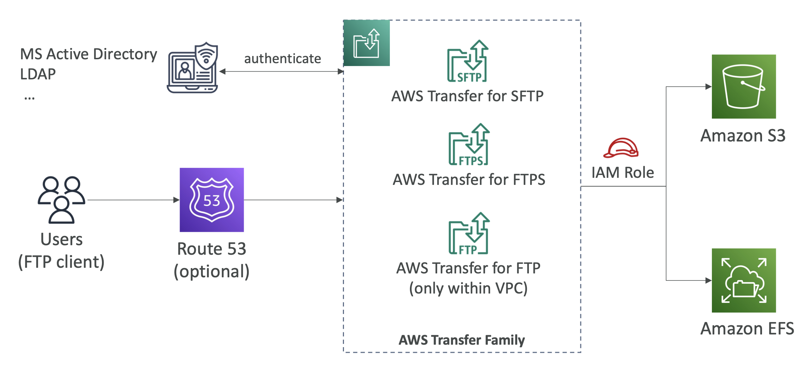

# AWS DataSync

- Move large amount of data to and from
    - On-premises / other cloud to AWS (NFS, SMB, HDFS, S3 API...) – **needs agent**
    - AWS to AWS (different storage services) – **no agent needed**
- Can synchronize to:
    - Amazon S3 (any storage classes – including Glacier)
    - Amazon EFS
    - Amazon FSx (Windows, Lustre, NetApp, OpenZFS...)
- Replication tasks can be scheduled hourly, daily, weekly
- **File permissions and metadata are preserved (NFS POSIX, SMB...)**
- One agent task can use 10 Gbps, can setup a bandwidth limit

- **NFS / SMB to AWS (S3, EFS, FSx...)**
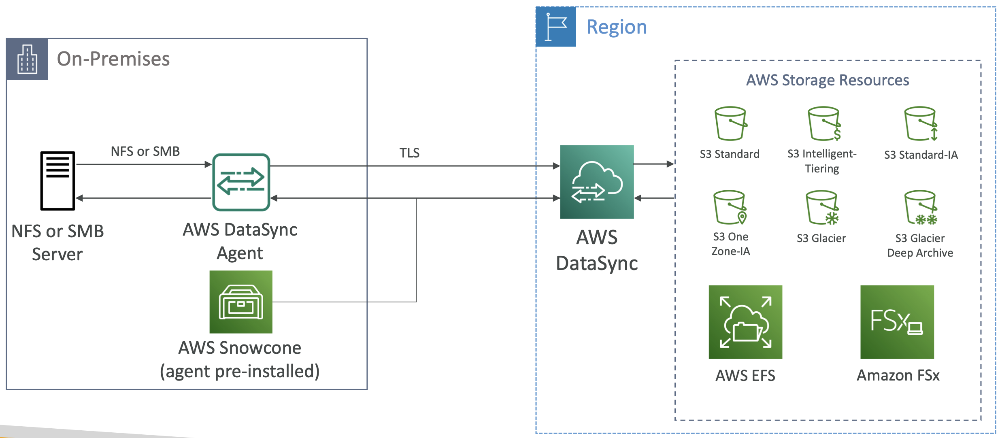
- **Transfer between AWS storage services**
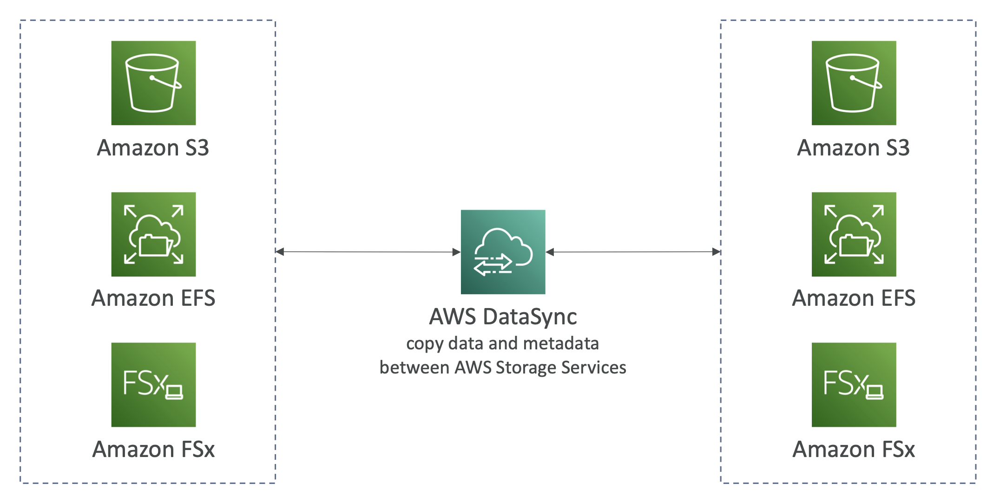

# Storage Summary

- S3: Object Storage
- S3Glacier:ObjectArchival
- EBS volumes: Network storage for one EC2 instance at a time
- Instance Storage: Physical storage for your EC2 instance (high IOPS)
- EFS: Network File System for Linux instances, POSIX filesystem
- FSx for Windows: Network File System for Windows servers
- FSx for Lustre: High Performance Computing Linux file system
- FSx for NetApp ONTAP: High OS Compatibility
- FSx for OpenZFS: Managed ZFS file system
- Storage Gateway: S3 & FSx File Gateway,Volume Gateway (cache & stored),Tape Gateway
- Transfer Family: FTP, FTPS, SFTP interface on top of Amazon S3 or Amazon EFS
- DataSync:Scheduledatasyncfromon-premisestoAWS,orAWStoAWS
- Snowcone / Snowball / Snowmobile: to move large amount of data to the cloud, physically
- Database: for specific workloads, usually with indexing and querying