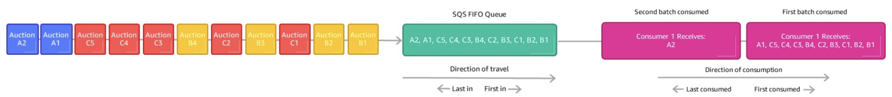

# Overview

- When we start deploying multiple applications, they will inevitably need to communicate with one another
- There are two patterns of application communication

- Synchronous between applications can be problematic if there are sudden spikes of traffic
- What if you need to suddenly encode 1000 videos but usually it’s 10?
- In that case, it’s better to decouple your applications
  - using SQS: queue model
  - using SNS: pub/sub model
  - using Kinesis: real-time streaming model
- These services can scale independently from our application!

# SQS

- Simple queue service 
- Oldest AWS offering 
- used to **decouple applications** 
- by sending all application from front end to the queue and the back end can process later ex video processing. 
- Attributes:
  - Unlimited throughput, unlimited number of messages in queue
  - Default retention of messages: 4 days, maximum of 14 days
  - Low latency (<10 ms on publish and receive)
  - Limitation of 256KB per message sent
- Can have duplicate messages (at least once delivery, occasionally)
- Can have out of order messages (best effort ordering)
- **Standard Queue** (max throughput, At least once delivery meaning duplicates, best effort ordering)
- **FIFO**(Exactly once processing, in the exact order)
- Max size **256KB**, **4-14 days message retention**

- **Producing Messages**
  - Produced to SQS using the SDK (SendMessage API)
  - The message is **persisted** in SQS until a consumer deletes it
  - Message retention: default 4 days, up to 14 days
  - Example: send an order to be processed
    - Order id
    - Customer id
    - Any attributes you want
  - SQS standard: unlimited throughput
  

- **Consuming Messages**
  - Consumers (running on EC2 instances, servers, or AWS Lambda)...
  - Poll SQS for messages (receive up to 10 messages at a time)
  - Process the messages (example: insert the message into an RDS database)
  - Delete the messages using the DeleteMessage API
  

- **SQS – Multiple EC2 Instances Consumers**
  - Consumers receive and process messages in parallel
  - At least once delivery
  - Best-effort message ordering
  - Consumers delete messages after processing them
  - We can scale consumers horizontally to improve throughput of processing
  

- **SQS with Auto Scaling Group (ASG)**
  
  - **CloudWatch metric** 
    - Queue Length 
    - **ApproximateNumberOfMessges** 
    - Can be used as a Cloudwatch metric and an alarm set for EC2 auto scaling group (ASG).

- **SQS to decouple between application tiers**
  

- **SQS - Security**
  - **Encryption**:
    - In-flight encryption using HTTPS API
    - At-rest encryption using KMS keys
    - Client-side encryption if the client wants to perform encryption/decryption itself
  - **Access Controls**: IAM policies to regulate access to the SQS API
  - **SQS Access Policies** (similar to S3 bucket policies)
    - Useful for cross-account access to SQS queues
    - Useful for allowing other services (SNS, S3...) to write to an SQS queue

- **SQS – Message Visibility Timeout**
  -  After a message is polled by a consumer, it becomes **invisible** to other consumers
  - By default, the “message visibility timeout” is **30 seconds** [0sec- 12 hr]
  - That means the message has 30 seconds to be processed
  - After the message visibility timeout is over, the message is “visible” in SQS
  
  - If a message is not processed within the visibility timeout, it will be processed **twice**
  - A consumer could call the **ChangeMessageVisibility** API to get more time
  - If visibility timeout is high (hours), and consumer crashes, re-processing will take time
  - If visibility timeout is too low (seconds), **we may get duplicates**

- **Long Polling** 
  - When a consumer requests messages from the queue, it can optionally “wait” for messages to arrive if there are none in the queue
  - This is called Long Polling
  - **LongPolling decreases the number of API calls made to SQS while increasing the efficiency and reducing latency of your application**
  - The wait time can be between 1 sec to 20 sec (20 sec preferable)
  - Long Polling is preferable to Short Polling
  - Long polling can be enabled at the queue level or at the API level using **WaitTimeSeconds**
  
  
- **SQS - FIFO queue** 
  - FIFO = First In First Out (ordering of messages in the queue)
  
  - Limited throughput: 300 msg/s without batching, 3000 msg/s with batching
  - When you batch 10 messages per operation (maximum), FIFO queues can support up to 3,000 messages per second.(4X300=1200 etc)
  - Exactly-once send capability (by removing duplicates)
  - Messages are processed in order by the consumer
  - Queue name must end with a .fifo .. for ex DemoQueue.fifo.
  - The suffix .fifo, counts towards the 80-character queue name limit.
	- If **Content-based deduplication** is explicitly enabled on the FIFO queue, **MessageDeduplicationId** will be automatically generated using a SHA-256 hash of the message body (content only, not attributes).  

- **Migrate from SQS Standard queues to FIFO**
  - Delete the existing standard queue and recreate it as a FIFO queue. You can't convert existing standard queue into a FIFO queue.
  - Make sure that the name of the FIFO queue ends with the .fifo suffix
  - Make sure that the throughput for the target FIFO queue does not exceed 3,000 messages per second(with batching)

- **If the load is too big, some transactions may be lost**
    

- **SQS as a buffer to database write**
    
  - as buffer to database writes where load is very high… So SQS sits in the middle of the front end application and the Database. 
  - SQS is infinitely scalable.
  - One Auto scaling group will **Enqueue** the msgs (sendMessage) to the SQS and then another auto scaling group with **Dequeue** (receiveMessages) and then insert in the DB.

- **SQS to decouple between application tiers**
  
  - to decouple between application tiers - request from front end applications auto scaling group and back end processing applications auto scaling group.

# SNS 
  

- Simple Notification service
- The “event producer” only sends message to one SNS topic
- As many “event receivers” (subscriptions) as we want to listen to the SNS topic notifications
- Each subscriber to the topic will get all the messages (note: new feature to filter messages)
- Up to 12,500,000 subscriptions per topic
- 100,000 topics limit

- Many AWS services can send data directly to SNS for notifications

- can publish messages to emails, sms, mobile notifications, HTTP endpoints OR SQS, Lambda, S3, Kinesis Data Firehose.
- can receive msgs from CloudWatch Alarms, ASGs, CloudFormation(state changes), AWS buckets, S3, DMS (new replica), Lambda, DynamoDB, RDS events.
- **Standard SNS** - Best effort msg ordering, At least once message delivery, Highest throughput in publishes/sec, subscription protocols: SQS, Lambda, HTTP, SMS, email, mobile application endpoints
- **FIFO** - strictly preserved message ordering, exactly once message delivery, Highest throughput upto 300 publishes/sec. Subscription protocol : SQS

- **SNS – How to publish**
  - Topic Publish (using the SDK)
    - Create a topic
    - Create a subscription (or many)
    - Publish to the topic
  - Direct Publish (for mobile apps SDK)
    - Create a platform application
    - Create a platform endpoint
    - Publish to the platform endpoint
    - Works with Google GCM, Apple APNS, Amazon ADM...

- **SNS - Security** 
  - **Encryption**:
    - In-flight encryption using HTTPS API
    - At-rest encryption using KMS keys
    - Client-side encryption if the client wants to perform encryption/decryption itself
  - **Access Controls**: IAM policies to regulate access to the SNS API
  - **SNS Access Policies** (similar to S3 bucket policies)
    - Useful for cross-account access to SNS topics
    - Useful for allowing other services ( S3...) to write to an SNS topic

**SNS + SQS : Fan-out pattern** 

    
  - Push once in SNS, receive in all SQS that are subscribers
  - Fully decoupled, no data loss
  - SQS allows for: data persistence, delayed processing and retries of work
  - Ability to add more SQS subscribers over time
  - Make sure SQS queue **access policy** allows for SNS to write.
  - Cross-Region Delivery: works with SQS queues in other regions

- **Use case 1: S3 Events to multiple queues**: 
  - For the same combination of **event type** (e.g object create) and prefix (eg images/), you can only have one S3 Event rule.
  - If you want to send the same S3 event to many SQS queues, use fan out
  - S3 object created -> Amazon S3 (event) -> SNS Topic -> Fan-out (multiple SQS + Lambda functions + ..)
  

- **Use case 2: SNS to Amazon S3 through Kinesis Data Firehose**: 
  - SNS can send to Kinesis Data Firehose and then to S3 or any supported KDF destination
  

- **SNS – FIFOTopic**
  - FIFO = First In First Out (ordering of messages in the topic)
  
  - Similar features as SQS FIFO:
    - **Ordering** by Message Group ID (all messages in the same group are ordered)
    - **Deduplication** using a Deduplication ID or Content Based Deduplication
  - **Can have SQS Standard and FIFO queues as subscribers**
  - Limited throughput (same throughput as SQS FIFO)

- **SNS FIFO + SQS FIFO: Fan Out**
	- In case you need fan out + ordering + deduplication
  

- **SNS – Message Filtering**
	- JSON policy used to filter messages sent to SNS topics subscription. For ex if a new transaction messages has a field called state then we can create a filter policy for state as placed (for placed orders), another policy for cancelled, declined etc which all go to different SQS queue and may have another SQS queue to have all the messages unfiltered.
  - If a subscription doesn’t have a filter policy, it receives every message
  

# Kinesis

- real time Big data streaming
- Makes it easy to collect, process, and analyze streaming data in real-time
- Ingest real-time data such as: Application logs, Metrics, Website clickstreams, IoT telemetry data...
- **Kinesis Data Streams**: capture, process, and store data streams
- **Kinesis Data Firehose**: load data streams into AWS data stores
- **Kinesis Data Analytics**: analyze data streams with SQL or Apache Flink
- **Kinesis Video Streams**: capture, process, and store video streams

- **Kinesis Data Streams** 
  
  - Way to stream big data in your systems.
	- Made up of multiple shards which are numbered. The number of shards should be provisioned ahead of time.
	- Data is split across all shards.
	- **Shards** define the stream capacity in terms of ingestion and consumption rates.
	- Producers send data to Kinesis Data Streams.
	- Producers can be Applications, Client desktops or mobiles, Lower level SDK or higher level KPL library, or Kinesis agent inside the server to stream application logs into Kinesis Data streams.
	- All the **producers** produce records, made of 2 things the partition key and the data blob, the partition key will decide the shard in which this record will go.
	- Data can be send by producers at the rate of **1 MB/sec or 1000 msgs/sec per shard**. Ex for 6 shards its 6MB/s or 6000 msgs/sec
	- **Consumers** are SDK or at high level KCL (Kinesis Client Libraries), Lambda functions (for server less processing), Kinesis Data Firehose, or Kinesis Data Analytics.
	- The record then **consumers** receive have the same partition key + sequence no(where the record was in the shard) + data blob.
	- Throughput is **2MB/sec shared across all consumers in a shard, OR 2MB/sec per shard per consumer** if enhanced consumer mode(or enhanced fan-out mode)
      - By default, the 2MB/second/shard output is shared between all of the applications consuming data from the stream
      - You should use **enhanced fan-out** if you have multiple consumers retrieving data from a stream in parallel
      - With enhanced fan-out developers can register stream consumers to use enhanced fan-out and receive their own 2MB/second pipe of read throughput per shard, and this throughput automatically scales with the number of shards in a stream.
  
  - **Basics**
    - Retention 1 day to 365 days
		- Ability to reprocess or replay data
		- Once data is inserted in the Kinesis, it can’t be deleted (immutability)  
		- Data that shares the same partition goes to the same shard (ordering) 
    - Producers: AWS SDK, Kinesis Producer Library (KPL), Kinesis Agent
    - Consumers:
      - Write your own: Kinesis Client Library (KCL), AWS SDK
      - Managed: AWS Lambda, Kinesis Data Firehose, Kinesis Data Analytics,

  - **Capacity Modes**  
    - **1 Provisioned Mode**:
      - You choose the number of shards provisioned, scale manually or using API
      - Each shard gets 1MB/s in (or 1000 records per sec)
      - Each shard gets 2MB/sec out (classic or enhanced fan-out consumer)
      - You pay per shard provisioned per hour
    - **2 On-demand mode**:
      - No need to provision or manage the capacity
      - Default capacity provisioned (4MB/s in or 4000 records per second)
      - Scales automatically based on observed throughput peak during last 30 days
      - Pay per stream per hour and data in/out per GB

   - If you don’t know your capacity event then go for **in-demand**

  - **Security**
    - Control Access /Authorization using IAM policie
    - Encryption inflight(HTTPS), at rest (KMS), client side(on your own)
    - VPC endpoints available which allows access to Kinesis directly from HTTPS, for instance in a private subject without going through internet.
    - Monitor API calls using CloudTrail.
    

- **Kinesis Data Firehose** 
  
  - All the producers of the data streams can be producers here + Kinesis data stream + CloudWatch(logs and events) + AWS IoT
	- The producers send **Upto 1MB records** to the firehose.
	- KDF can optionally **transform data using Lambda functions**.
	- Without u writing any code KDF will read data from sources and write in batches to destinations. 
	- 3 kinds of data destinations: 
        - 1 -ASW destinations - S3, Amazon Redshift (warehousing DB, to do so it first writes to S3 and from there issue COPY to write to Redshift), Amazon OpenSearch. 
        - 2 -3rd party partners - Datalog, splunk, New Relic, MongoDB etc 
        - 3 -Custom Destinations, using an API with HTTP endpoint.
	- You have an option to send all the data to an S3 bucket after sending to destinations as a backup OR send the failed data to an S3 bucket.
	- **Fully managed service, server less**. 
	- Pay for the data going through Firehose.
	- **Near Real Time** - meaning since we write data to destinations in batches, there may be 60sec latency minimum for non-full batches. OR wait until at least 1MB of data.
	- Supports many data formats, conversions, transformations, compressions, and can write ur own transformations using Lambda.

  - **Basics**
    - Fully Managed Service, no administration, automatic scaling, serverless
      - AWS: Redshift / Amazon S3 / OpenSearch
      - 3rd party partner: Splunk / MongoDB / DataDog / NewRelic / ...
      - Custom: send to any HTTP endpoint
    - Pay for data going through Firehose
    - **Near Real Time**
      - 60 seconds latency minimum for non full batches
      - Or minimum 1MB of data at a time
    - Supports many data formats, conversions, transformations, compression
    - Supports custom data transformations using AWS Lambda
    - Can send failed or all data to a backup S3 bucket

- **When to use Kinesis Data Streams Vs Kinesis Data Firehose**

| **Kinesis Data Streams**                                       | **Kinesis Data Firehose**                                                              |
|----------------------------------------------------------------|----------------------------------------------------------------------------------------|
| Streaming service to ingest at scale                           | Ingestion service to stream data into S3, RedShift, OpenSearch/Elasticsearch, Splunk, partner or custom HTTP |
| Write custom code (producer/consumer)                           | Fully Managed, no service to manage                                                    |
| Real time (about 200 to 70 milliseconds)                        | Near Real Time                                                                         |
| Manage scaling on your own (Shard splitting and Shard Merging) | Automated scaling                                                                      |
| Pay per capacity provisioned                                   | Pay for data that goes into it.                                                        |
| Data storage for 1 to 365 days                                 | No data storage                                                                        |
| Multiple consumers can read from the same stream               |                                                                                        |
| Replay capability                                              | No replay capability                                                                   |
|                                                                |                                                                                        |

- Kinesis Firehose cannot be used to process and analyze the streaming data in custom applications (custom HTTP endpoint allowed)
- Kinesis Data Streams **cannot directly write the output to Amazon S3**. Unlike Amazon Kinesis Data Firehose, KDS does not offer a ready-made integration via an intermediary AWS Lambda function to reliably dump data into Amazon S3. You will need to do a lot of custom coding to get the AWS Lambda function to process the incoming stream and then store the transformed output to Amazon S3 with the constraint that the buffer is maintained reliably and no transformed data is lost. 

**Kinesis Vs SQS data ordering**

Ex: 100 trucks on road, each has a unique truck_id, sending GPS data regularly and we want to consume this in AWS to track their movements. How should you send that data into Kinesis?
- Answer : send using a “Partition Key” value of the “truck_id”. The same key will always go to the same shard

  - **Ordering data into SQS**
    - For SQS standard, there is no ordering.
    - For SQS FIFO, if you don’t use a Group ID, messages are consumed in the order they are sent, with only one consumer
    
    - You want to scale the number of consumers, but you want messages to be “grouped” when they are related to each other
    - Then you use a Group ID (similar to Partition Key in Kinesis)
    

  - **Kinesis Data Stream**
    - For 100 trucks, 5 kinesis shards
    - On average you’ll have 20 trucks per shard
    - Trucks will have their data ordered within each shard
    - Maximum amount of consumers in parallel we can have is 5
    - Can receive upto 5MB/sec of data (high throughput)  

  - **SQS FIFO** 
    - One SQS FIFO queue
    - 100 group IDs each equal to one truck id
    - Upto 100 consumers (hooked to each group ID)
    - 300 msgs/sec (or 3000 if batching is used)  

    
If you want to have dynamic number of consumers based on the number of group ids, then SQS FIFO queue may be better and if you have 10000 trucks and need to send a lot of data, and have data ordering per shard then KDS are good choice.

- **Kinesis Vs SQS**
  - **Kinesis Data Stream - recommended for**  
    - Routing related records to the same record producer (streaming MapReduce)
    - Ordering of records
    - Ability for multiple applications to consume the same stream concurrently
    - Ability to consume records in the same order a few hours later (KDS stores data upto 7 days)
  - **SQS - recommended for**   
    - Messaging semantics (such as ack/fail) and visibility timeout. Apps dont have to maintain a persistent checkpoint/cursor if ack/fail is maintained. 
    - Individual message delay (upto 15 min)
    - Dynamically increasing concurrency/throughput at read time. For ex you have work queue and want to add more reader until backlog is cleared. With KDS you have to provision shards ahead of time and can scale upto sufficient number of shards.
    - Leveraging SQS's ability to scale transparently. If the load changes due to sudden spike or growth of business then the requests are bufferred and request can be processed independently. SQS can then scale transparently to handle the load without any provisioning from you.

**SQS vs SNS vs Kinesis**

|   SQS                                                                 |   SNS                                            |   Kinesis                                                                          |
|-----------------------------------------------------------------------|--------------------------------------------------|------------------------------------------------------------------------------------|
|   Consume pull data                                                   |   Pub-sub. Push model                            |   Standard: Pull data (2MB per shard)                                              |
|   Data is deleted after being consumed.                               |   Data is not persisted(lost if not delivered.)  |   Enhanced-fanout: push data (2MB per shard per consumer)                          |
|   Can have as many workers/consumers as we want.                      |   Upto 12,500,000 subscribers. 100,000 topics    |   Possibility to replay data.[data is persisted]                                   |
|   No need to provision throughput in advance as its managed service.  |   No need to provision throughput                |   Used for real time big data analytics and ETL.                                   |
|   Ordering guarantees only available on FIFO queues.                  |   Combine SNS FIFO + SQS FIFO.                   |   Ordering at shard level.[Shard no. specified in advance] [Scale shard yourself]  |
|   Individual msg delay capability.                                    |   Integrated with SQS for fan-out pattern        |   Data expires after X days [365 days].                                            |
|                                                                       |                                                  |   Provisioned mode or on-demand capacity mode                                                 |

The **capacity limits** of a Kinesis data stream are defined by the number of **shards** within the data stream. The limits can be exceeded by either data throughput or the number of reading data calls. Each shard allows for **1 MB/s incoming** data and **2 MB/s outgoing** data. You should increase the number of shards within your data stream to provide enough capacity.  

**Use case**: You are running an application that produces a large amount of real-time data that you want to load into S3 and Redshift. Also, these data need to be transformed before being delivered to their destination. 
**Kinesis Data Streams + Kinesis Data Firehose**  

Which is **NOT** a supported **subscriber** for **AWS SNS**?  
Kinesis Data Firehose is now supported, but not **Kinesis Data Streams**.  

**Amazon Kinesis Data Streams (KDS)** is a massively scalable and durable real-time data streaming service. It can continuously capture gigabytes of data per second from hundreds of sources such as website clickstreams, database event streams, financial transactions, social media feeds, IT logs, and location-tracking events.

- When an Amazon Kinesis Data Stream is configured as the source of a Kinesis Firehose delivery stream, Firehose’s `PutRecord` and `PutRecordBatch` operations are disabled and Kinesis Agent cannot write to Kinesis Firehose Delivery Stream directly. Data needs to be added to the Amazon Kinesis Data Stream through the Kinesis Data Streams `PutRecord` and `PutRecords` operations instead.

# Amazon MQ

- Traditional applications running from on-premises may use open protocols such as: MQTT, AMQP, STOMP, Openwire, WSS
- **When migrating to the cloud**, instead of re-engineering the application to use SQS and SNS, we can use Amazon MQ
- **Is not serverless and runs on a dedicated machine.**
- **Managed message broker service for Rabbit MQ and Active MQ**
- SQS, SNS are “cloud-native” services: proprietary protocols from AWS
- Doesn’t scale as much as SQS/SNS [which have sort of infinite scaling]
- Can run in Multi-AZ with failover [for HA]
- Has both queue and topic features [Like SQS and SNS]  

- **Amazon MQ – High Availability**

- High availability is achieved by having Active and Stand-by MQ, in different AZ’s and then you define Amazon EFS as your backend storage.
- EFS is a network file system which can be mounted onto multiple AZs.
- So when failover happens, standby will be mounted onto the EFS, and hence we have the same data.  