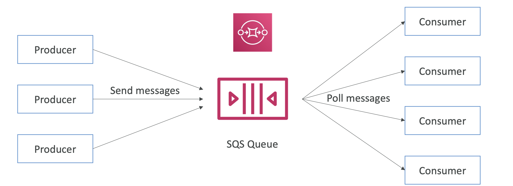
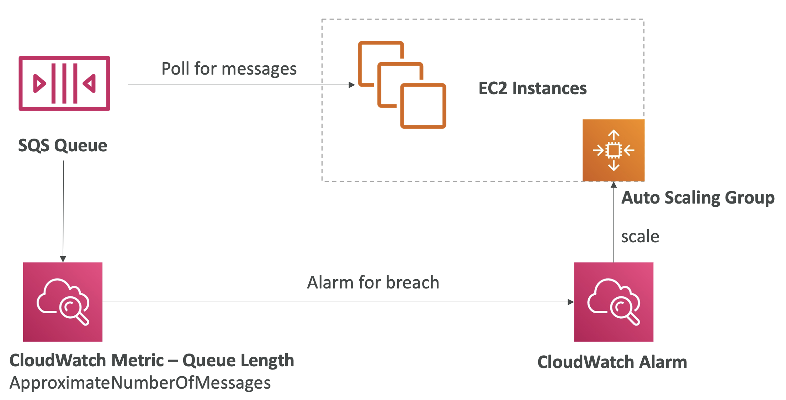
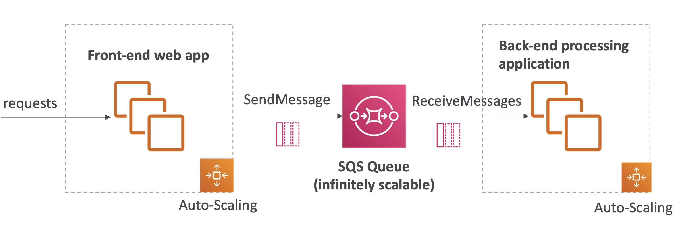
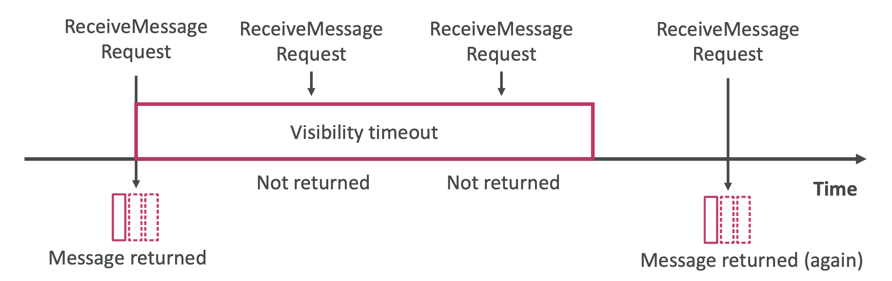
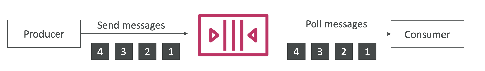
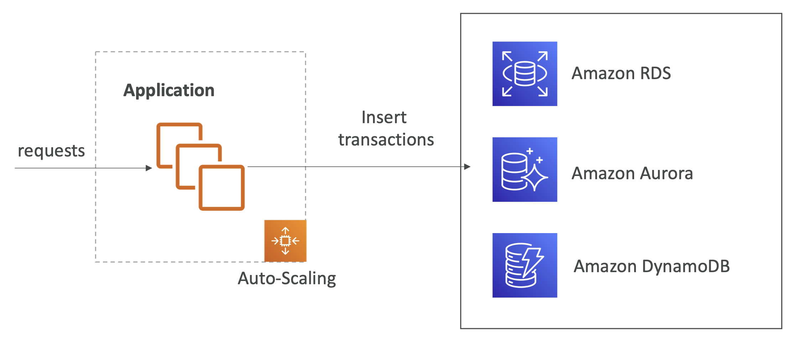
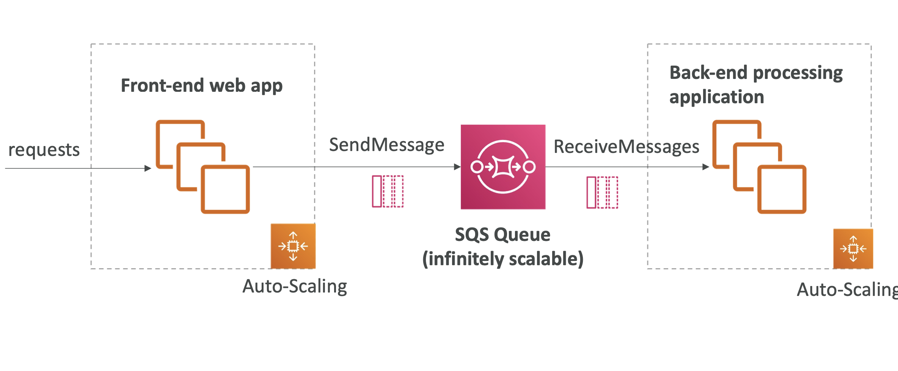

# SQS

- Simple queue service 
- Oldest AWS offering 
- used to **decouple applications** 
- by sending all application from front end to the queue and the back end can process later ex video processing. 
- Attributes:
  - Unlimited throughput, unlimited number of messages in queue
  - Default retention of messages: 4 days, maximum of 14 days
  - Low latency (<10 ms on publish and receive)
  - Limitation of 256KB per message sent
- Can have duplicate messages (at least once delivery, occasionally)
- Can have out of order messages (best effort ordering)
- **Standard Queue** (max throughput, At least once delivery meaning duplicates, best effort ordering)
- **FIFO**(Exactly once processing, in the exact order)
- Max size **256KB**, **4-14 days message retention**

- **Producing Messages**
  - Produced to SQS using the SDK (SendMessage API)
  - The message is **persisted** in SQS until a consumer deletes it
  - Message retention: default 4 days, up to 14 days
  - Example: send an order to be processed
    - Order id
    - Customer id
    - Any attributes you want
  - SQS standard: unlimited throughput
  

- **Consuming Messages**
  - Consumers (running on EC2 instances, servers, or AWS Lambda)...
  - Poll SQS for messages (receive up to 10 messages at a time)
  - Process the messages (example: insert the message into an RDS database)
  - Delete the messages using the DeleteMessage API
  

- **SQS – Multiple EC2 Instances Consumers**
  - Consumers receive and process messages in parallel
  - At least once delivery
  - Best-effort message ordering
  - Consumers delete messages after processing them
  - We can scale consumers horizontally to improve throughput of processing
  

- **SQS with Auto Scaling Group (ASG)**
  
  - **CloudWatch metric** 
    - Queue Length 
    - **ApproximateNumberOfMessges** 
    - Can be used as a Cloudwatch metric and an alarm set for EC2 auto scaling group (ASG).

- **SQS to decouple between application tiers**
  

- **SQS - Security**
  - **Encryption**:
    - In-flight encryption using HTTPS API
    - At-rest encryption using KMS keys
    - Client-side encryption if the client wants to perform encryption/decryption itself
  - **Access Controls**: IAM policies to regulate access to the SQS API
  - **SQS Access Policies** (similar to S3 bucket policies)
    - Useful for cross-account access to SQS queues
    - Useful for allowing other services (SNS, S3...) to write to an SQS queue

- **SQS – Message Visibility Timeout**
  -  After a message is polled by a consumer, it becomes **invisible** to other consumers
  - By default, the “message visibility timeout” is **30 seconds** [0sec- 12 hr]
  - That means the message has 30 seconds to be processed
  - After the message visibility timeout is over, the message is “visible” in SQS
  
  - If a message is not processed within the visibility timeout, it will be processed **twice**
  - A consumer could call the **ChangeMessageVisibility** API to get more time
  - If visibility timeout is high (hours), and consumer crashes, re-processing will take time
  - If visibility timeout is too low (seconds), **we may get duplicates**

- **SQS - Delay Queues**
  - Let you postpone the delivery of new messages to consumers for a number of seconds.
  - Helpful when your consumer application needs additional time to process messages
  - For *standard queues*, the per-queue delay setting is **not retroactive** —changing the setting doesn't affect the delay of messages already in the queue.
  - For *FIFO queues*, the per-queue delay setting **is retroactive** —changing the setting affects the delay of messages already in the queue.
  - Delay queues are similar to visibility timeouts because both features make messages unavailable to consumers for a specific period of time.
  - The difference between the two is that, for delay queues, a message is hidden *when it is first added to queue*, whereas for visibility timeouts a message is hidden only *after it is consumed from the queue*.
    

- **SQS - Temporary queues** 
    - Help you save development time and deployment costs when using common message patterns such as request-response
    - You can use the Temporary Queue Client to create high-throughput, cost-effective, application-managed temporary queues.
    - Benefits:
        - They serve as lightweight communication channels for specific threads or processes
        - They can be created and deleted without incurring additional costs.
        - They are API-compatible with static (normal) Amazon SQS queues. This means that existing code that sends and receives messages can send messages to and receive messages from virtual queues.

- **Long Polling** 
  - When a consumer requests messages from the queue, it can optionally “wait” for messages to arrive if there are none in the queue
  - This is called Long Polling
  - **LongPolling decreases the number of API calls made to SQS while increasing the efficiency and reducing latency of your application**
  - The wait time can be between 1 sec to 20 sec (20 sec preferable)
  - Long Polling is preferable to Short Polling
  - Long polling can be enabled at the queue level or at the API level using **WaitTimeSeconds**
  
- **SQS - FIFO queue** 
  - FIFO = First In First Out (ordering of messages in the queue)
  
  - Limited throughput: 300 msg/s without batching, 3000 msg/s with batching
  - When you batch 10 messages per operation (maximum), FIFO queues can support up to 3,000 messages per second.(4X300=1200 etc)
  - Exactly-once send capability (by removing duplicates)
  - Messages are processed in order by the consumer
  - Queue name must end with a .fifo .. for ex DemoQueue.fifo.
  - The suffix .fifo, counts towards the 80-character queue name limit.
	- If **Content-based deduplication** is explicitly enabled on the FIFO queue, **MessageDeduplicationId** will be automatically generated using a SHA-256 hash of the message body (content only, not attributes).  

- **Migrate from SQS Standard queues to FIFO**
  - Delete the existing standard queue and recreate it as a FIFO queue. You can't convert existing standard queue into a FIFO queue.
  - Make sure that the name of the FIFO queue ends with the .fifo suffix
  - Make sure that the throughput for the target FIFO queue does not exceed 3,000 messages per second(with batching)

- **If the load is too big, some transactions may be lost**
    

- **SQS as a buffer to database write**
    
  - as buffer to database writes where load is very high… So SQS sits in the middle of the front end application and the Database. 
  - SQS is infinitely scalable.
  - One Auto scaling group will **Enqueue** the msgs (sendMessage) to the SQS and then another auto scaling group with **Dequeue** (receiveMessages) and then insert in the DB.

- **SQS to decouple between application tiers**
  
  - to decouple between application tiers - request from front end applications auto scaling group and back end processing applications auto scaling group.

- **Reduce Cost with SQS**
  - To send, receive, and delete messages, and to change the message visibility timeout for multiple messages with a single action, use the Amazon SQS batch API actions.
  - To combine client-side buffering with request batching, use long polling together with the buffered asynchronous client included with the AWS SDK for Java.
