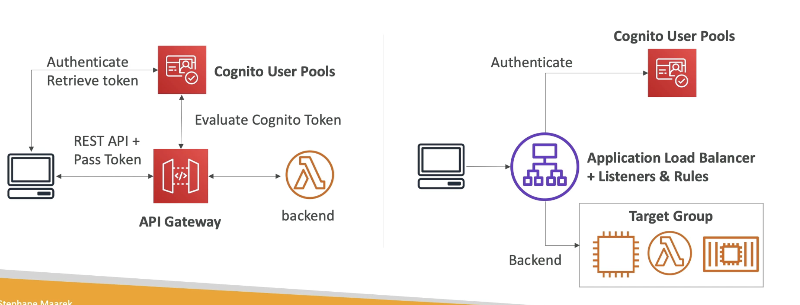
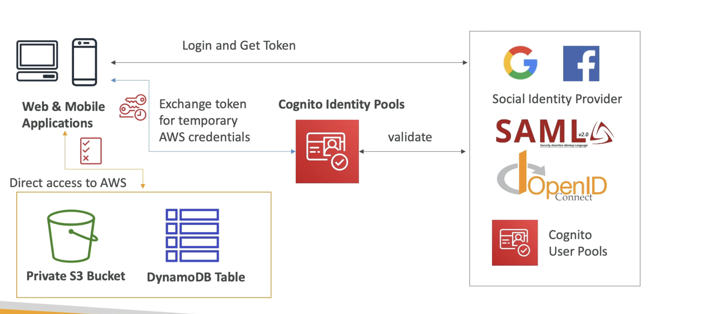

# Amazon Cognito

  - Give users an identity to interact with our web or mobile applications
  - Two kind of sub-services within Cognito - Cognito User Pool and Cognito Identity Pool
  - **Cognito User Pool**:
    - Sign in functionality for app users 
    - Integration with API Gateway and Application Load balancer
  - **Cognito Identity Pool** (formerly Federated Identity)
    - Provide temporary AWS credentials to users so they can access AWS resources directly
    - Integrate with Cognito User Pools as an identity provider
  - **Cognito vs IAM**: "hundreds of users", "mobile/web users", "users outside AWS", "Authenticate with SAML"

- **Cognito User Pools (CUP) - User Features**  
  
  - Create a serverless database of users for your web & mobile apps
  - Simple Login: Username (or email) / password combination
  - Password reset
  - Email & Phone Number Verification
  - Multi-factor Authentication (MFA)
  - Federated identities: users from Facebook, Google, SAML…

- **Cognito User Pools (CUP) - Integrations**  
  
  - CUP integrates with API Gateway and Application Load Balancer  
  

- **Cognito Identity Pool**   
  
  - Get identities for "users" so they obtain **temporary AWS credentials**
  - Users dont access the application through API Gateway or ALB but direct access to AWS accounts using temp credentials
  - Users source can be Cognito User Pools, 3rd party logins, etc..
  - Users can then access AWS services directly or through API Gateway.
  - The IAM policies applied to the credentials are defined within Cognito Identity Pool service.
  - The IAM Policies can be customized based on the user_id for fine grained control
  - **Default IAM roles** for authenticated and guest users (since these users dont have specific roles defined to them they will inherit the default IAM roles)

So in this diagram we see that web/mobile users can access the S3 bucket and DynamoDB table with the temporary credentials without going through API Gateway or ALB.

In the above diagram, the condition is saying that the leading key for DynamoDB must be equal to the Cognito Identity user ID.  
The user with this policy cannot read and write all the items in your DynamoDB table, thats too much power, so instead they can only deal with items that they have access to through this condition.  