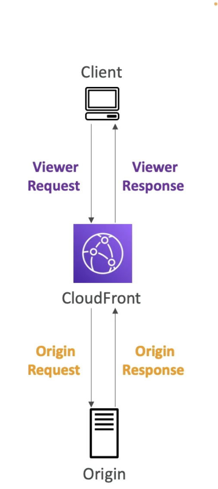

# Customization At the Edge

Many modern apps execute some form of the logic at the **edge**. [When we deploy our functions/applications in a specific region, sometime for ex when using **CloudFront**, we have edge locations ar distributing our content and sometime apps require to execute some logic at the edge before reaching the app itself.]  

- **Edge Functions**: A code that you write and attach to CloudFront distributions. Run closer to users to **minimize latency**.
  - CloudFront provides 2 types: CloudFront functions and Lambda Edge
  - Don’t have to **manage** any servers, **deployed globally**.
  - Pay only for what you use
  - Fully server less.
  - **Use case**: Customize CDN content.

- **CloudFront Functions and Lambda@Edge Use cases**  
	- Website Security and Privacy
	- Dynamic Web application at the edge
	- Search Engine Optimization (SEO)
	- Intelligently Route Across origins and Data Centres
	- Bot mitigation at the Edge
	- Real time Image Transformation 
	- A/B Testing
	- User Authentication and Authorization 
	- User Prioritization
	- User Tracking and Analysis

- **CloudFront Functions**
	- Lightweight functions written in Javascript
	- For high scale, latency sensitive CDN customization 
	- Sub-ms start up times, millions of requests/ second.
	- Used to change **Viewer Request** (after cloudFront receives a request from a viewer) and **Viewer Response** (before Cloudfront forwards the response to the viewer)
	- Native feature of CloudFront (manage code entirely within CloudFront)

- **Lambda@Edge**

	- Written in NodeJS or Python
	- Scales to 1000s of requests/second
	- Used to change all 4 requests/responses - **Viewer Requests, Origin Requests, Origin Response, Viewer Response**.
	- Author your functions in one AWS region (us-east-1), which is the region where you manage your cloudFront distributions and then cloudFront replicates to all its locations.

|                                   |   CloudFront                                 |   Lambda@Edge                                          |
|-----------------------------------|----------------------------------------------|--------------------------------------------------------|
|   Runtime Support                 |   Javascript                                 |   Node.js, Python                                      |
|   # of requests                   |   Millions of req per sec                    |   Thousands of req per sec                             |
|   Triggers                        |   Viewer Request/response                    |   Viewer Request/Response and Origin Request/Response  |
|   Max execution time              |   < 1 ms [quick]                             |   5-10sec [more logic can be added to the function]    |
|   Max memory                      |   2 MB                                       |   128 Mb - 10GB                                        |
|   Total Package size              |   10 KB                                      |   1MB - 50 MB                                          |
|   N/w access, File system access  |   No                                         |   Yes                                                  |
|   Access to req body              |   No                                         |   Req                                                  |
|   Pricing                         |   Free tire available, 1/6th price of @Edge  |   No free tier, charged per req and duration.          |

## Use cases
  
**Cloud Front Functions**
  - Cache Key Normalization [Transform request attributes (headers, cookies, query strings, URL) to create an Optimal Cache Key]
  - Header Manipulations [Insert/modify/delete HTTP headers in the request or response]
  - URL rewrites or redirects
  - Request authentication and authorization [Create and validate user generated tokens, eg JWT, to allow or deny request]
  - All these can be executes in less than 1 ms

**Lambda@Edge** 
  - Longer execution time (several ms)
  - Adjustable CPU or memory
  - Your code depends on 3rd party libraries, (eg AWS SDK to access other AWS services)
  - N/w access to use external services for processing 
  - File system access or access to the body of HTTO request.

Lambda@Edge is a feature of CloudFront that lets you run code closer to your users, which improves performance and reduces latency.