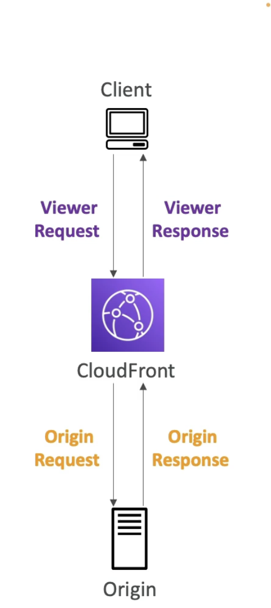
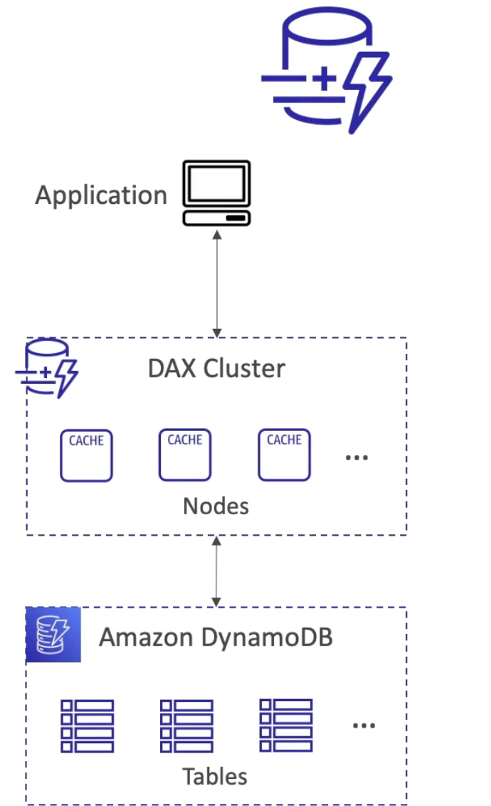

# Serverless

**What is Serverless**  
- Serverless is a new paradigm in which the developers don’t have to manage servers anymore...
- They just deploy code
- They just deploy... functions !
- Initially... Serverless == FaaS (Function as a Service)
- Serverless was pioneered by AWS Lambda but now also includes anything that’s managed: “databases, messaging, storage, etc.”
- **Serverless does not mean there are no servers...**
    - it means you just don’t manage / provision / see them

**Serverless in AWS**  
- AWS Lambda
- DynamoDB
- AWS Cognito 
- AWS API Gateway 
- Step Functions  
- Amazon S3
- AWS SNS & SQS
- AWS Kinesis Data Firehose
- Aurora Serverless
- Fargate

# 1 AWS Lambda

- With AWS Lambda, you can run code without provisioning or managing servers
- You pay only for the compute time that you consume—there’s no charge when your code isn’t running
- You can run code for virtually any type of application or backend service—all with zero administration
- Since AWS Lambda functions can scale extremely quickly, this means you should have controls in place to notify you when you have a spike in concurrency.
	- A good idea is to deploy an Amazon CloudWatch Alarm that notifies your team when function metrics such as `ConcurrentExecutions` or `Invocations exceeds your threshold`
	- You should create an AWS Budget so you can monitor costs on a daily basis.

 **AWS Lambda - Why?**
  - Amazon EC2 - Virtual servers in Cloud  
    - Limited by RAM and CPU  
	- Continuously running [we can optimize by starting and stopping efficiently]  
	- Scaling means intervention to add/remove servers [for ex with ASG]  
  - AWS Lambda - Virtual functions, no servers to manage  
    - Limited by time - **short executions** (upto 15 mins)  
	- Run on-demand [when not using its not running and billed for duration when its running]  
	- Scaling is automated.   

  **Benefits**   
  - Easy pricing - Pay per request and compute time  
  - Free tier of 1,000,000 AWS Lambda requests and 400,000 GBs of compute time  
  - Integrated with the whole AWS suite of services  
  - Integrated with many programming languages [Node.js, Python, Java, C#, GoLang, Ruby, Custom runtime API(ex Rust with community support)]  
  - Support for Lambda container Image - Container image that run on Lambda, must implement the Lambda runtime API. ECS/Fargate is preferred for running arbitrary Docker images.  
  - Can now package and deploy AWS Lambda functions as container images
  - Easy monitoring through AWS CloudWatch  
  - Easy to get more resources per functions (upto 10 GB of RAM)  
  - Increasing RAM will also improve CPU and n/w.  
  	
  **Integrations**  
  - API Gateway (create REST APIs that invokes Lambda functions)  
  - Kinesis (for data transformation on the fly)  
  - DynamoDB (create triggers when something happens in the DB)  
  - S3 (ex lambda function will be triggered when a file is created)  
  - CloudFront (Lambda Edge)  
  - CloudWatch Events EventBridge (ex if something happens to our infra and we want to react, ex we have a cut pipeline, state changes, and we want to do automation based on it)  
  - SNS (react to notifications )  
  - SQS (process messages)  
  - Cognito (react when a user logs into a DB  

## Examples

Case 1: **Serverless Thumbnail Creation**  

A reactive architecture to the events of a new image being created in S3.  

Case 2: **Serverless CRON Job**  

So this is a server less architecture and you don’t have to waste EC2 instances which will need to run continuously.  

## AWS Lambda Limits

- **Execution:**  
    - Memory Allocation - 128 MB - 10 GB (1 MB increments)  
	- Maximum execution time - 15 mins  
	- Environment variables - 4 KB   
	- Disk capacity in the “function container” (temp space in /tmp) 512 MB to 10GB. For ex if you want to pull in some big files while we create another function.  
	- Concurrent execution - 1000 (can be increased)  

- **Deployment:**  
	- deployment size (compressed zip): 50 MB. For anything above try using temp space.  
	- Uncompressed deployment (code+dependency) - 250 MB  
	- Use /tmp directory to load other files at startup  
  
- AWS recommends that you should **not over provision your function time out settings**. Always understand your code performance and set a function time out accordingly. Overprovisioning function timeout often results in Lambda functions running longer than expected and unexpected costs.

## AWS Lambda Layer

- Can configure your AWS Lambda function to pull in additional code and content in the form of layers
- A layer is a ZIP archive that contains libraries, a custom runtime, or other dependencies
- With layers, you can use libraries in your function without needing to include them in your deployment package.
- Layers let you keep your deployment package small, which makes development easier
- A function can use up to **5 layers at a time**
- Can create layers, or use layers published by AWS and other AWS customers
- Layers **support resource-based policies** for granting layer usage permissions to specific AWS accounts, AWS Organizations, or all accounts.
- Total unzipped size of the function and all layers **can't exceed the unzipped deployment package size limit of 250 MB**

  
### Lambda and VPC
	
- **By Default**  
    - Launched outside your own VPC(in an AWS owned VPC)   
	- Lambda functions always operate from an AWS-owned VPC
   	- So it can’t access resources in your VPC (RDS, ElastiCache, internal ELB)  
   	- Has access to public API on the internet.  
   	- Will have access to DynamoDB as it’s a public resource on the AWS cloud. 
	- You should only enable your functions for VPC access when you need to interact with a private resource located in a private subnet. An Amazon RDS instance is a good example. 
  
- **Lambda in VPC**  
	- Must define VPC id, subnet you want to launch in, and attach a security group to the Lambda.  
	- Lambda will create an ENI ( **Elastic Network interface** ) in your subnets  
  
- **Lambda with RDS Proxy**  
	- if Lambda functions directly access your RD DB, then it may open too many connections under high load.  
	- With too many functions appearing and disappearing, they there may be too many open connections   
	- Instead launch RDS Proxy - pull connections and connect with less connections to the RDS  
	- Lambda function must be deployed in your VPC because RDS Proxy is never publicly accessible   
	- 3 benefits of RDS Proxy  
		- 1 Improve **scalability** by pooling and sharing DB connections  
  		- 2 Improve **availability** by reducing by 66% the failover time and preserving connections.  
  		- 3 Improve **security** by enforcing IAM authentication and storing credentials in Secrets Manager  
	

  **Invoking Lambda from RDS & Aurora**  
	- Allows you to process **data events** from within a database.  
	- Supported for RDS for **PostgreSQL** and Aurora **MySQL**.  
	- Idea is that the user is going to insert a data event into your table, registration table, and RDS will be setup to invoke your Lambda functions.  
	- This Lambda function can then send a welcome mail to the user and then the user will receive it.  
	- This is not set from the AWS console but setup from within the DB by connecting to it.  
	- Since RDS is the one invoking the Lambda function, **Must allow outbound traffic to your Lambda function** from within your DB instance. [through Public internet, or invoke NAT gateway, or VPC endpoints]  
	- Also RDS instance should have  required permissions to invoke the Lambda functions. [IAM policy ]  

	**RDS Event Notifications**  
	- Notifications that tells information about the **DB instance** itself (created, stopped, start,…)  
	- You don’t have information about the **data itself** [For this use the above method]  
	- Subscribe to the following event categories: DB instance, DB snapshot, DB Parameter Group, DB Security group, RDS Proxy, Custom Engine version.  
	- Near real-time events (upto 5 minutes)  
	- Send notifications to SNS or subscribe to events using EventBridge.  
	- From SNS send to SQS or Lambda functions and from EventBridge to so many different destinations including Lambda functions.  

# Customization At the Edge

Many modern apps execute some form of the logic at the **edge**. [When we deploy our functions/applications in a specific region, sometime for ex when using **CloudFront**, we have edge locations distributing our content and sometime apps require to execute some logic at the edge before reaching the app itself.]  

- **Edge Functions**: A code that you write and attach to CloudFront distributions. Run closer to users to **minimize latency**.
  - CloudFront provides 2 types: CloudFront functions and Lambda Edge
  - Don’t have to **manage** any servers, **deployed globally**.
  - Pay only for what you use
  - Fully server less.
  - **Use case**: Customize CDN content.

- **CloudFront Functions and Lambda@Edge Use cases**  
	- Website Security and Privacy
	- Dynamic Web application at the edge
	- Search Engine Optimization (SEO)
	- Intelligently Route Across origins and Data Centres
	- Bot mitigation at the Edge
	- Real time Image Transformation 
	- A/B Testing
	- User Authentication and Authorization 
	- User Prioritization
	- User Tracking and Analysis

- **CloudFront Functions**
	- Lightweight functions written in Javascript
	- For high scale, latency sensitive CDN customization 
	- Sub-ms start up times, millions of requests/ second.
	- Used to change **Viewer Request** (after cloudFront receives a request from a viewer) and **Viewer Response** (before Cloudfront forwards the response to the viewer)
	- Native feature of CloudFront (manage code entirely within CloudFront)

- **Lambda@Edge**

	- Written in NodeJS or Python
	- Scales to 1000s of requests/second
	- Used to change all 4 requests/responses - **Viewer Requests, Origin Requests, Origin Response, Viewer Response**.
	- Author your functions in one AWS region (us-east-1), which is the region where you manage your cloudFront distributions and then cloudFront replicates to all its locations.

|                                   |   CloudFront                                 |   Lambda@Edge                                          |
|-----------------------------------|----------------------------------------------|--------------------------------------------------------|
|   Runtime Support                 |   Javascript                                 |   Node.js, Python                                      |
|   # of requests                   |   Millions of req per sec                    |   Thousands of req per sec                             |
|   Triggers                        |   Viewer Request/response                    |   Viewer Request/Response and Origin Request/Response  |
|   Max execution time              |   < 1 ms [quick]                             |   5-10sec [more logic can be added to the function]    |
|   Max memory                      |   2 MB                                       |   128 Mb - 10GB                                        |
|   Total Package size              |   10 KB                                      |   1MB - 50 MB                                          |
|   N/w access, File system access  |   No                                         |   Yes                                                  |
|   Access to req body              |   No                                         |   Req                                                  |
|   Pricing                         |   Free tire available, 1/6th price of @Edge  |   No free tier, charged per req and duration.          |

## Use cases
  
**Cloud Front Functions**
  - Cache Key Normalization [Transform request attributes (headers, cookies, query strings, URL) to create an Optimal Cache Key]
  - Header Manipulations [Insert/modify/delete HTTP headers in the request or response]
  - URL rewrites or redirects
  - Request authentication and authorization [Create and validate user generated tokens, eg JWT, to allow or deny request]
  - All these can be executes in less than 1 ms

**Lambda@Edge** 
  - Longer execution time (several ms)
  - Adjustable CPU or memory
  - Your code depends on 3rd party libraries, (eg AWS SDK to access other AWS services)
  - N/w access to use external services for processing 
  - File system access or access to the body of HTTP request.

Lambda@Edge is a feature of CloudFront that lets you run code closer to your users, which improves performance and reduces latency.

# 2 Amazon Dynamo DB

- Amazon DynamoDB is a key-value and document database that delivers single-digit millisecond performance at any scale.
- It's a fully managed, multi-region, multi-master, durable database with built-in security, backup and restore, and in-memory caching for internet-scale applications
- Amazon DynamoDB is a NoSQL database and it's best suited to store data in key-value pairs.

- **Basics**
	- Fully managed, highly available with replication across multiple AZs  
	- NoSQL - not a relational DB - with transaction support  
	- Scales to massive workloads, distributed DB  
	- Millions of requests per second, trillions of row, 100s of TB of storage  
	- Fast and consistent in performance (single digit milliseconds)  
	- Integrated with IAM for security, authorization and administration  
	- Low cost and auto scaling capability  
	- No maintenance or patching, always available  
	- Standard and Infrequent Access (IA) Table class  

- **DynamoDB Basics**
    - Dynamo DB is made of **Tables**. [No need to create a DB, the DB is available as a service]  
    - Each table has a **primary key** (must be decided at creation time)(optionally sort key which is a part of the primary key)  
	- Each table can have an infinite number of **items (=rows)**
	- Each item has **attributes** (can be added over time - can be null)
	- In RDS/Aurora you can add columns later but it’s complicated, can be difficult to evolve schemas. In Dynamo DB it’s easy to add column or attributes later.
	- Max size of an item is **400KB**
	- **Data types** supported are: Scalar Types (String, Number, Binary, Boolean, Null), Document Types (List, Map), Set Types (String set, Number set, Binary set)
	- **Therefore in DynamoDB you can rapidly evolve schemas.**

- **DynamoDB Capacity**
	- Dynamo - Read/Write Capacity Modes
	- Control how you manage your tables capacity (read/write throughput)
	- **Provisioned Mode**(default) 
        - you specify the number of reads/writes per second.
		- You need to Plan capacity **beforehand**
		- Pay for **provisioned** Read Capacity Units (**RCU**) & Write Capacity Units (**WCU**)
		- Possibility to add **auto-scaling** mode for RCU & WCU
	- **On-Demand Mode** 
        - Read/writes automatically scale up/down with your workloads
		- **No capacity** planning needed.
		- Pay for what you use, **more expensive**
		- Great for **unpredictable** workloads, steep sudden spikes.

- **DynamoDB Advance Features**
	- DynamoDB Accelerator (DAX)
        - Fully managed, highly available, seamless in-memory cache for Dynamo DB.
		- Help solve read congestion by caching data. 
		- Microseconds latency for cached data.
		- Doesn’t require application logic modification (compatible with existing DynamoDB APIs)
		- The cache has a TTL of 5 minute.

- **DAX vs EastiCache**  
	- DAX sits in front of Dynamo DB and is going to be helpful for individual object cache or queries, and scanned queries cache   
	- Amazon ElastiCache is great to store aggregation result, say very big computation done on top of DynamoDB.  
	- Both are not replacements but complimentary   
	- For caching solution on top of DynamoDB it’s going to be DAX.  
	- You can do stream processing on top of DynamoDB  
  	
- **DynamoDB - Stream Processing**  
	- Ordered stream of item-level **modification** (create/update/delete) in a table.   
	- 2 Kind of stream processing on DynamoDB   
		- **DynamoDB Streams**   
			- 24 hours retention   
			- a limited number of consumers   
			- Process using Lambda triggers or DynamoDB stream Kinesis (KCL) adapter (if you want to read it yourself).  
		- **Kinesis Data stream**(newer)  
			- send all your changes here   
			- upto 1 year retention   
			- higher number of consumers   
			- Higher number of ways to process data using AWS Lambda, Kinesis data Analytics, Kinesis Data Firehose, AWS Glue Streaming ETL ….  
	- **Use case** : 	
        - React to changes in real-time (welcome email to users, whenever new user in user’s table)  
		- Real-time usage analytics  
		- Insert into derivatives table  
		- Implement cross region replication  
		- Invoke AWS Lambda on changes to your DynamoDB table. 

**DynamoDB Streams** allows you to capture a time-ordered sequence of item-level modifications in a DynamoDB table. It's integrated with AWS Lambda so that you create triggers that automatically respond to events in real-time. 

- **DynamoDB Global Tables**
	- Table replicated across multiple regions, so a table in us-east-1 and a table in ap-southeast-2 and there will be **2 way replication** between the tables.
	- Make a DynamoDB table accessible with **low-latency** in multiple regions 
	- Active-Active replication
	- Applications can READ and WRITE to the table in any region.
	- Must enable DynamoDB Streams as a pre-requisite. [Because this is the underlying infra to replicate the table across regions]
	- DynamoDB Streams enable DynamoDB to get a **changelog** and use that changelog to replicate data across replica tables in other AWS Regions.

- **DynamoDB TTL**
	- **Use case**: reduce stored data by keeping only current items, adhere to regulatory obligations , **web session handling** (user logs to a website and has a session and keep the session in a central place, for 2 hours, this session data can be accessed by any kind of application, if within 2 hours the session is not renewed then the data is deleted) 

- **DynamoDB - Backups for disaster recovery**
	- **Continuous backups** using Point-in-time-recovery (**PITR**) - optionally enabled for **35** days, point-in-time recovery for any time within the backup window, the recovery process creates a new table.
	- **On-demand backups** - Full backups for long term retention, until explicitly deleted, doesn’t affect performance or latency of the DynamoDB table, can be configured and managed in AWS backup service (enables cross-region copy, enables you to have lifecycle policies for your backup), recovery process creates a new table.

- **DynamoDB - Integration with S3**
	- **Export to S3** (must enable PITR)
		- Works for any point of time in the last 35 days (because continuous backup is enabled)
		- doesn’t affect the read capacity of your table or the performance
		- Perform data analysis on top of DynamoDB
		- Retain snapshots for auditing
		- Do any big transformation like ETL on top of S3 data before importing back into DynamoDB
		- Format of export in DynamoDB JSON or ION format.
	- **Import from S3** (to DynamoDB)
		- Import CSV, DynamoDB JSON, ION
		- Doesn’t consume any write capacity.
		- Create a new table
		- If any errors then it will be logged in CloudWatch logs.

# 3 Amazon Cognito

  - Give users an identity to interact with our web or mobile applications
  - Two kind of sub-services within Cognito - Cognito User Pool and Cognito Identity Pool
  - **Cognito User Pool**:
    - Sign in functionality for app users 
    - Integration with API Gateway and Application Load balancer
	- A built-in, customizable web UI to sign in users.
	- Social sign-in with Facebook, Google, Login with Amazon, and Sign in with Apple, as well as sign-in with SAML identity providers from your user pool
	- User directory management and user profiles
	- Security features such as multi-factor authentication (MFA), checks for compromised credentials, account takeover protection, and phone and email verification
	- Customized workflows and user migration through AWS Lambda triggers.

  - **Cognito Identity Pool** (formerly Federated Identity)
    - Provide temporary AWS credentials to users so they can access AWS resources directly
    - Integrate with Cognito User Pools as an identity provider
	- Identity pools aren't an authentication mechanism in themselves
	- To enable users in your user pool to access AWS resources, you can configure an identity pool to exchange user pool tokens for AWS credentials
  - **Cognito vs IAM**: "hundreds of users", "mobile/web users", "users outside AWS", "Authenticate with SAML"

- **Cognito User Pools (CUP) - User Features**  
  
  - Create a serverless database of users for your web & mobile apps
  - Simple Login: Username (or email) / password combination
  - Password reset
  - Email & Phone Number Verification
  - Multi-factor Authentication (MFA)
  - Federated identities: users from Facebook, Google, SAML…

- **Cognito User Pools (CUP) - Integrations**  
  
  - CUP integrates with API Gateway and Application Load Balancer  
  

- **Cognito Identity Pool**   
  
  - Get identities for "users" so they obtain **temporary AWS credentials**
  - Users dont access the application through API Gateway or ALB but direct access to AWS accounts using temp credentials
  - Users source can be Cognito User Pools, 3rd party logins, etc..
  - Users can then access AWS services directly or through API Gateway.
  - The IAM policies applied to the credentials are defined within Cognito Identity Pool service.
  - The IAM Policies can be customized based on the user_id for fine grained control
  - **Default IAM roles** for authenticated and guest users (since these users dont have specific roles defined to them they will inherit the default IAM roles)

So in this diagram we see that web/mobile users can access the S3 bucket and DynamoDB table with the temporary credentials without going through API Gateway or ALB.

In the above diagram, the condition is saying that the leading key for DynamoDB must be equal to the Cognito Identity user ID.  
The user with this policy cannot read and write all the items in your DynamoDB table, thats too much power, so instead they can only deal with items that they have access to through this condition.  

# 4 API Gateway Overview

- **Building a server less API**  
    - Lambda functions can do CRUD on the tables in DynamoDB  
    - How to enable clients to use these Lambda functions- multiple ways to do this  
        1. Client can directly invoke the Lambda functions which means they need **IAM permissions** to do this.  
        2. Use **Application Load balancer** between client and Lambda functions and expose the functions as HTTP endpoint.  
        3. Or Use **API Gateway** between client and Lambda functions. Serverless offering which allows us to create REST APIs that are going to be public and accessible for our clients. Clients talk to the API gateway which will then proxy the request to Lambda functions.  
  
- **API Gateway**   
	- Lambda + API Gateway : No infrastructure to manage  
	- Support for the WebSocket API [real time streaming]  
	- Handle API versioning   
	- Handle different environments (dev, test, prod)  
	- Handle security ( Authentication and Authorization)  
	- Create API keys, handle request throttling (in case some clients send too many requests)  
	- Use common standards like Swagger / Open API 3.0 to import quickly defined APIs  
	- Transform and validate requests and response  
	- Generate SDK and API specifications   
	- Cache API responses  
  
## API Gateway Integrations  
- **Lambda**   
	- Invoke Lambda function 	[Full server less application]  
	- Easy way to expose REST API backed by Lambda  
- **HTTP**  
	- Expose HTTP endpoints in the backend  
	- Ex: Internal HTTP API on premise, Application Load Balancer ..  
	- Why? Add rate limiting, caching, user authentication, API keys etc..  
- **AWS Service**  
	- Expose any AWS API through API Gateway?  
	- Ex, start an AWS Step Function workflow, post a message to SQS  
	- Why? Add authentication, deploy publicly, rate control  
- **Others**
	- Mock (Generate a response based on API mappings and transformations)
	- VPC Link (Integrate with a resource not available over public internet)

    
  
- **API Gateway - Endpoint types**  
	- There are 3 ways to deploy API Gateways also called endpoint types.  
	- **Edge-optimized** (default): For global clients (API gateway accessible from anywhere in the world)  
		- Requests are routed through the CloudFront Edge locations (improves latency and efficiency)  
		- API Gateway still lives in the region where created (but accessible from every Edge location)  
	- **Regional**:
		- Expect all users to be within the same region  
		- Could manually combine with CloudFront (will give the same result as edge-opimized but more control over location and caching strategies and the distribution setting itself)  
	- **Private**:
		- Can only be accessed from your VPC using an interface VPC endpoint (ENI)  
		- Use a resource policy to define access  

- **API Gateway - Security**  
	- **User Authentication** through
		- IAM Roles (useful for internal applications, ex apps running on EC2 instances, which wants to access the API in the API Gateway)  
		- Cognito (identity for external users - ex mobile users/web apps)  
		- Custom Authorizer (your own login, using Lambda function) 
			- If you have an existing Identity Provider (IdP), you can use an AWS **Lambda authorizer** for Amazon API Gateway to invoke a Lambda function to authenticate/validate a given user against your Identity Provider  
			- You can use a Lambda authorizer for custom validation logic based on identity metadata.
			- A Lambda authorizer can send additional information derived from a bearer token or request context values to your backend service.
			- For example, the authorizer can return a map containing user IDs, user names, and scope
			- When using Lambda authorizers, AWS strictly advises against passing credentials or any sort of sensitive data via query string parameters or headers	
	- **Custom Domain Name HTTPS** security through integration with AWS Certificate Manager (ACM)  
		- If using Edge-Optimized endpoint, then the certificate must be in **us-east-1**  
		- If using Regional endpoint, the cetificate must be in the same region as the API Gateway  
		- Must setup **CNAME** or A-alias record in Route 53.   

# AWS Step Functions

  - Build Serverless visual workflow to orchestrate your Lambda functions
  - Coordinate multiple AWS services into serverless workflows so you can build and update apps quickly
  - **Features**: sequence, parallel, conditions, timeouts, error handling ..
  - Can integrate with EC2, ECS, On-premises servers, API Gateway, SQS queues etc ..
  - Can design and run workflows that stitch together services, such as AWS Lambda, AWS Fargate, and Amazon SageMaker, into feature-rich applications.
  - Possibility of implementing human approval feature
  - **Use Cases** - Order FullFillment, data processing, web applications, any workflow

