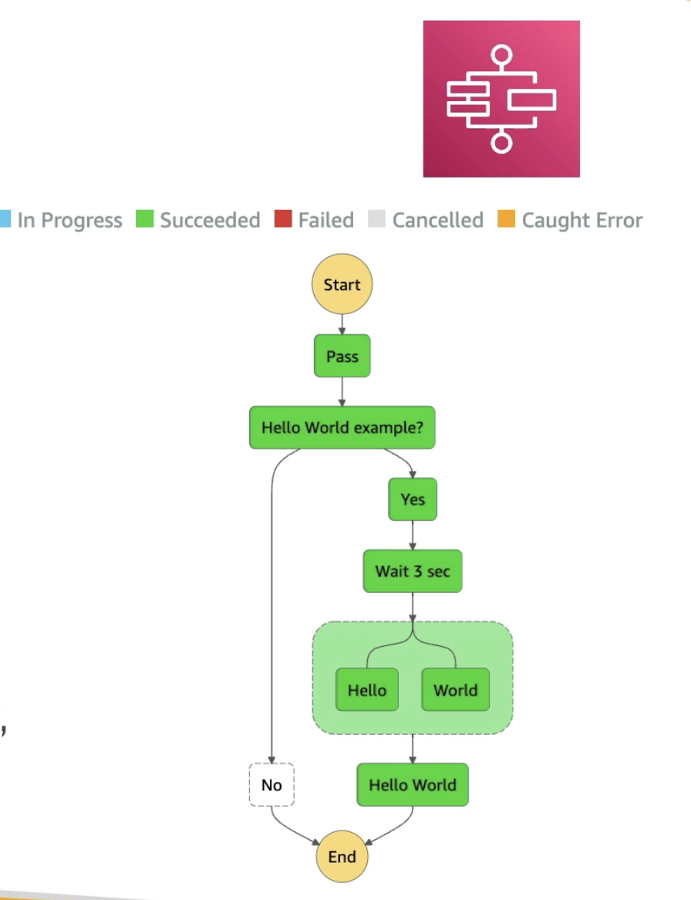

# AWS Step Functions

  - Build Serverless visual workflow to orchestrate your Lambda fucntions
  - **Features**: sequence, parallel, conditions, timeouts, error handling ..
  - Can integrate with EC2, ECS, On-premises servers, API Gateway, SQS queues etc ..
  - Possibility of implementing human approval feature
  - **Use Cases** - Order FullFillment, data processing, web applications, any workflow

