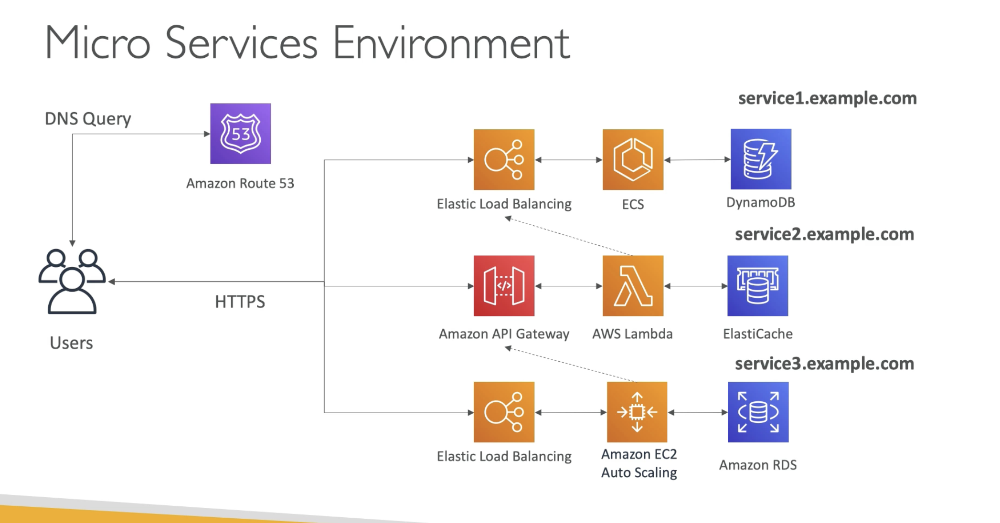

# Microservices Architecture

  - We want to switch to micro service architecture
  - Many services interact with each other directly using a REST API
  - Each architecture for each micro service may vary in form and shape
  - We want micro serice architecture so we can have a **leaner development lifecycle** for each service. Each service to scale independently and have its own code repository.

(Each micro service usually have a DNS name ot URL so ex service1.example.com, so we may need to do a DNS query to **Route 53**, get an alias record back and then interact with the service. Here ECS is for writing Docker containers to ECS.)  
  
(If service2 wants to interact with service1 then, the lambda function will make a call to the **Elastic Load Balancer** in service1 to get some information from service1.)  

(A third service3 uses EC2 instance so its not serverless. And if this want to interact with service2 to make a decision then it will talk to the API Gateway.)  

  - Two patterns to make explicit calls to other micro services either with HTTPS calls with synchronous pattern or if you dont care about when the response comes or whether a response comes at all then use asynchronous pattern.
  - **Synchronous pattern**: API Gateway, Load Balancer
  - **Asynchronous pattern**: SQS, Kinesis, SNS, Lambda triggers (S3)
  - Challenges for microservices
    - repeated overhead of creating each new microservice
    - issues with optimizing server density/utilization
    - complexity of running multiple versions of multiple microservices simultaneously
    - proliferation of client-side code requirements to integrate with many separate services
  - Some of the challenges are solved with Serverless patterns:
    - API Gateway, Lambda scale automatically and you pay per usage
    - You can easily clone API, reproduce environments
    - Generated client SDK through Swagger integration for the API Gateway.