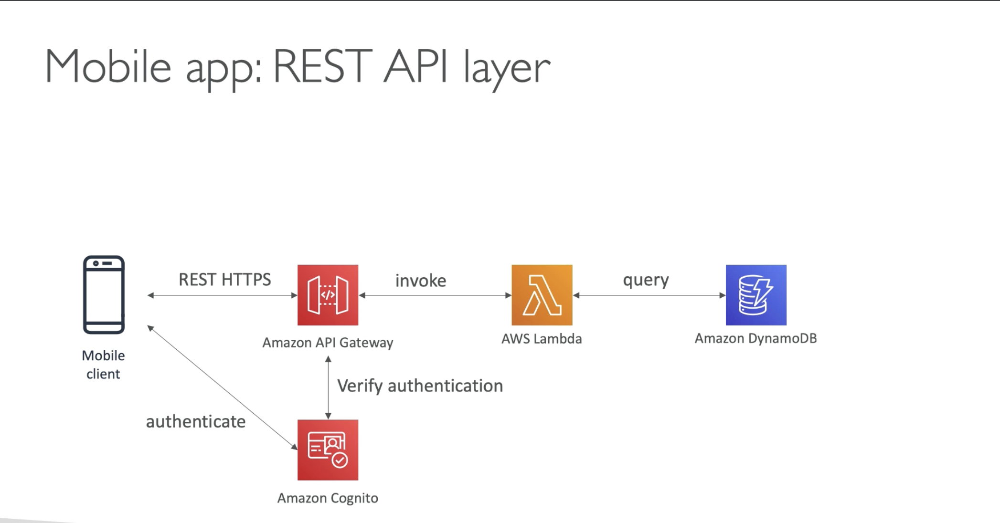
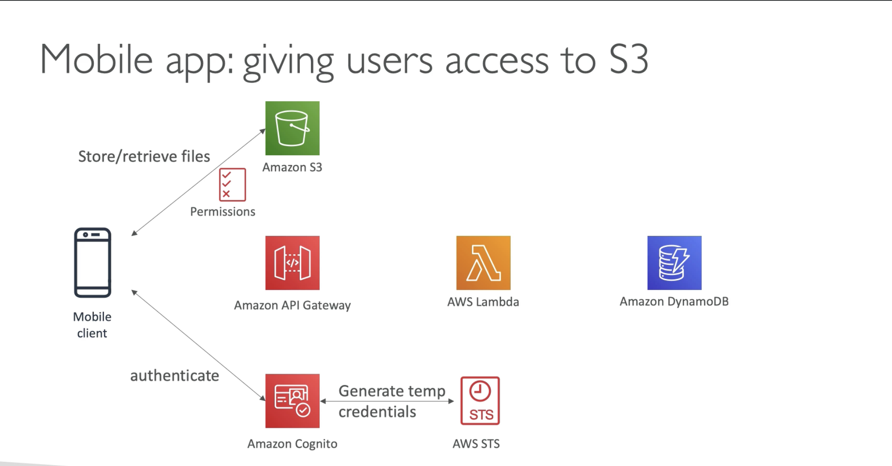
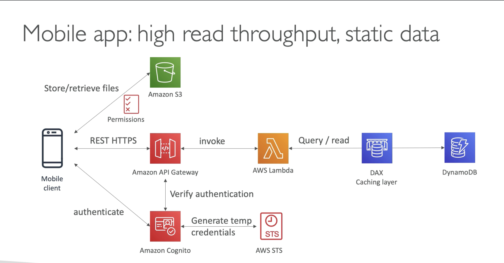
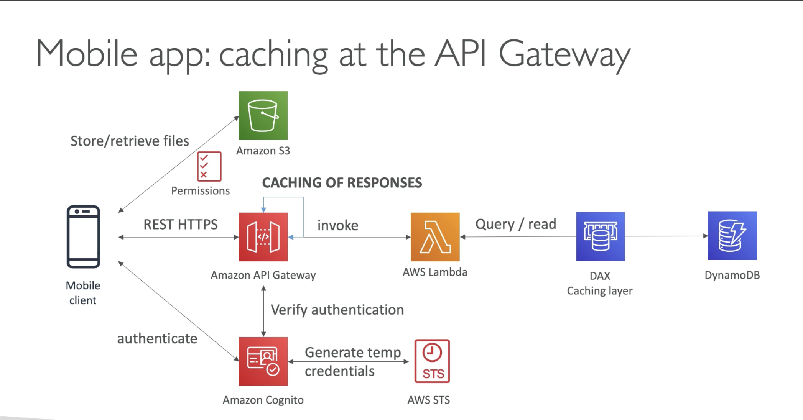

# Mobile application - MyTodoList

  - Want to expose REST API that has HTTPS endpoints  
  - Serverless Architecture  
  - Users should be able to directly interact with their own folder in S3  
  - Users should authenticate through a managed serverless service  
  - Users write to-dos but mostly read them  
  - Database should scale and have high read throughput  

Basic Architecture:

If you need to give access to S3

(Here wrong answer would be to store AWS credentials in mobile, you need to use Cognito and STS)

(We have very high RCU or high read throughput, using DAX will be effective and will save some cost maybe because we may not need to scale.)

(Further caching can be enabled at the API gateway, by caching the response for some API routes if the answers dont change)

