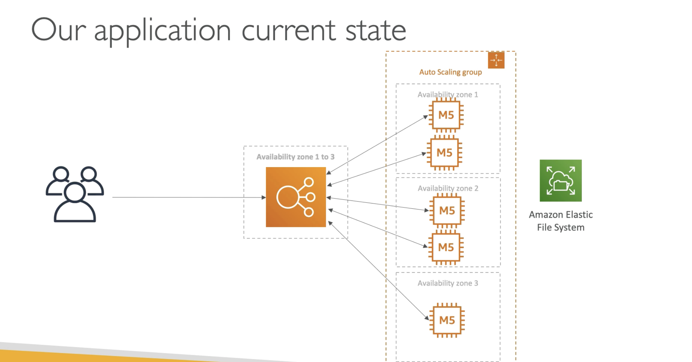
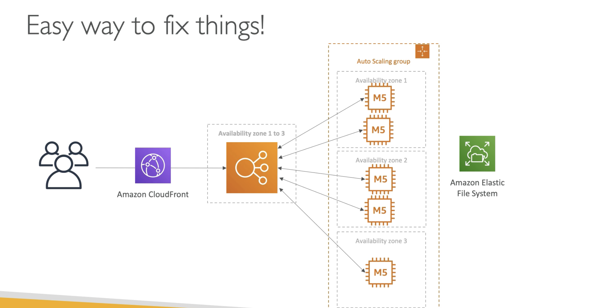

# Software Updates Offloading

  - We have an application running on EC2, that distributes software updates once in a while
  - When a new software update is out, we get a lot of request and the content is distributed in mass over the n/w. Its very costly.
  - We dont want to change our application, but want to optimize the cost and CPU.

  (The current architecture has an **Elastic Load Balancer** and **Auto Scaling Group** runnign in Multi-AZ, and the M5 instances are distributing the software updates and the updates are in an **EFS** (Elastic File System))  

  (Super Easy fix is to put a CloudFront in the front.)
  (If the contents are **static** then CloudFront is the most easy way to make an existing application **scalable** and **cheaper**)  

- **Why CloudFront?**
    - No changes to the architecture
    - Will cache software update files at the **edge**
    - Software update files are not dynamic, they are static (never changing)
    - Our EC2 instances arent servrless
    - But CloudFront is, and will scale for us
    - Our ASG will not scale as much, and we'll save tremendously in EC2
    - We'll also save in availability, network bandwidth cost etc..
    - Easy way to make existing application more scalable and cheaper!