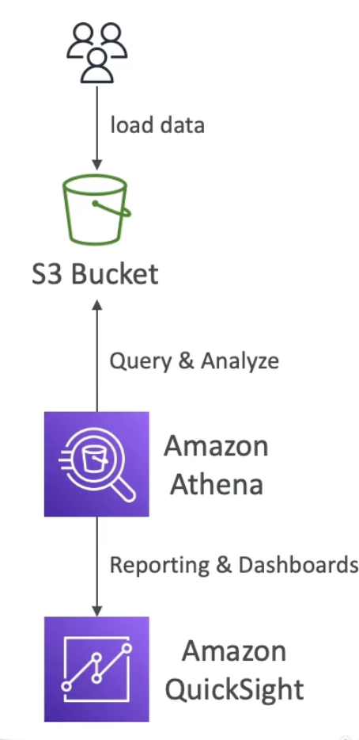
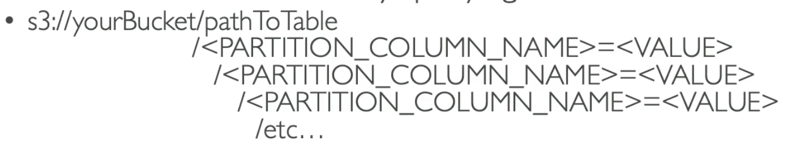
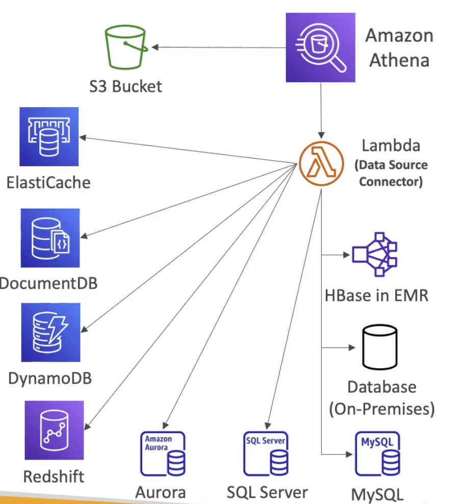

# Amazon Athena

- **Basics**
    - Serverless query service to analyze data stored in S3.
    - Use SQL to query files (built on Presto engine)
    - Supports CSV, JSON, ORC, Avro, and Parquet
    - Pricing: $5 per TB of data scanned
    - Commonly used with Amazon Quicksight for resporting/dashboards
    - **Use case**: BI/ analytics/ reporting, analyze and query logs from AWS like VPC flow logs, ELB logs, CloudTrail trails, etc..
    - **Exam Tip**: analyze data in S3 using serverless SQL, use Athena

- **Performance Improvement**
    - Use **columnar data** for cost-savings (less scan)(since charges are based on amount of data scanned)
        - Recommended formats: Apache Parquet or ORC, will have huge performance improvement, use **GLUE** to covert data to Parquet or ORC (with glue data can be converted as an ETL job fo e.x to convert from CSV to Parquet)
    - **Compress data** for smaller retrievals (bzip2, gzip, lz4, snappy, zlip, zstd) (compress data to scan less data)
    - **Partition** datasets in S3 for easy querying on virtual columns.
      
    Ex: S3://athena-examples/flight/parquet/year=1991 /month=1 /day=1/  (folder for each year, month and day)  
    This kind of paritioning helps recover data faster as we know exactly which folder to read.
    - **Use larger files** (> 128 MB) to minimize overhead. For many small files Athena performance is not going to be good and larger files are easier to scan and retrieve.

- **Federated Query**
    - Allows you to run SQL queries across data stored in relational, non-relational, object and custom data sources (AWS or on-prem)
    - Use Data Source Connectors that run on AWS Lambda to run Federated Queries (e.g CloudWatch Logs, Dynamo DB, RDS)
    

    One Lambda function per connector, results can be stored in S3 for later analysis.