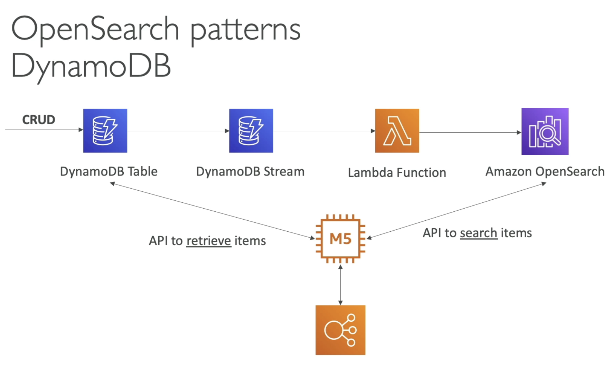
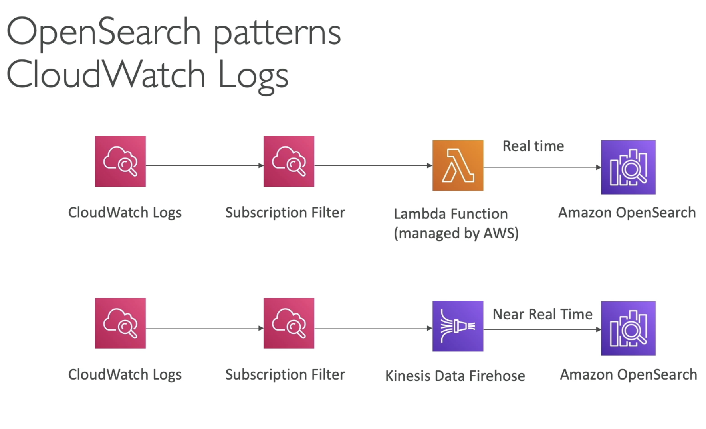
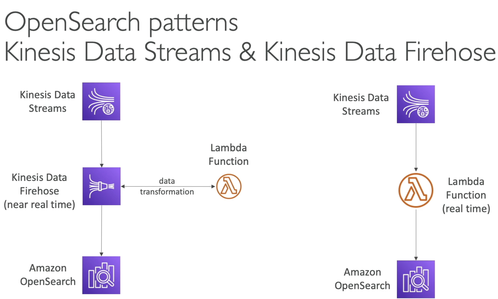
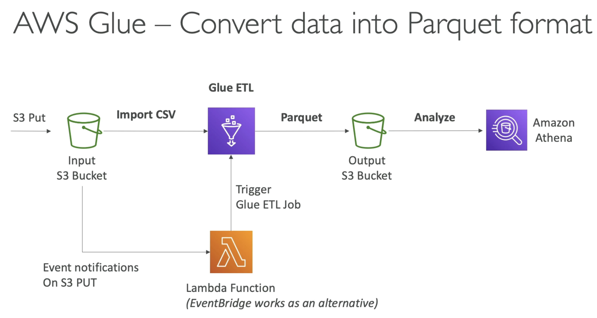
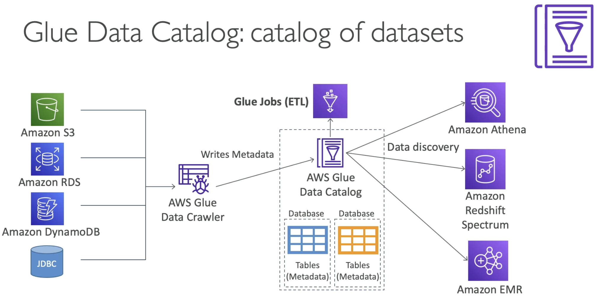
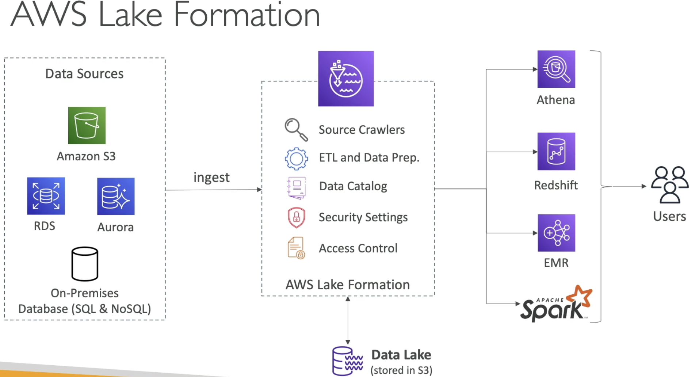
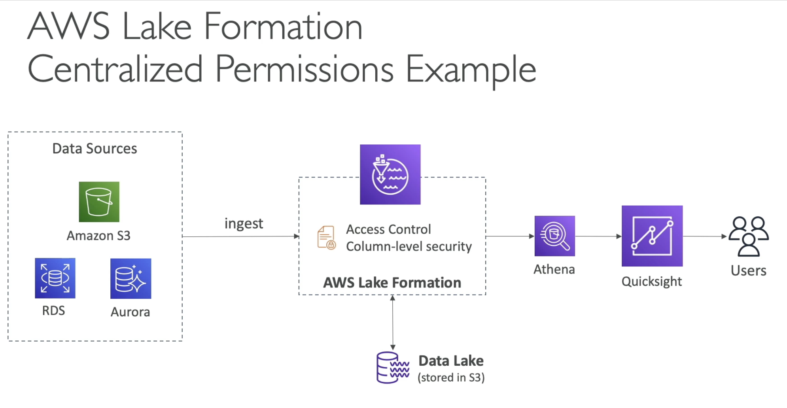
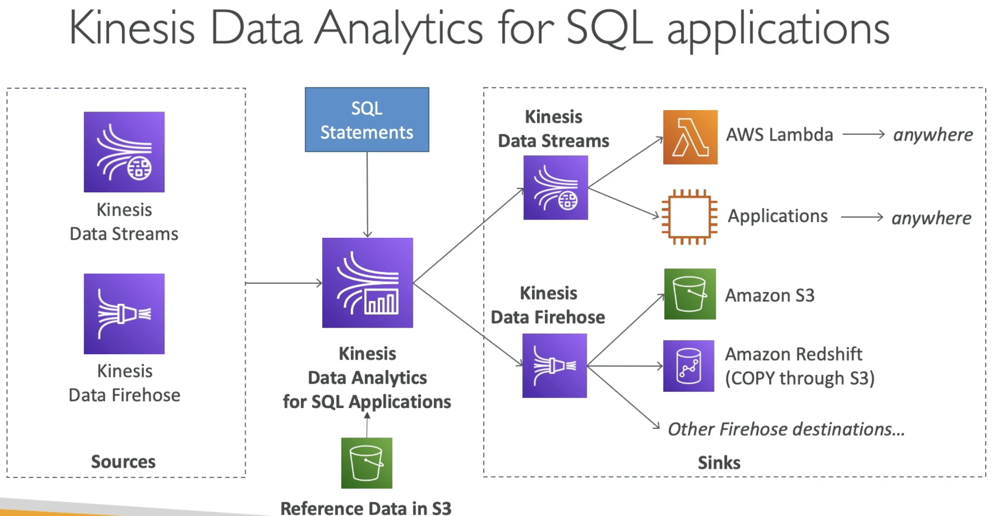
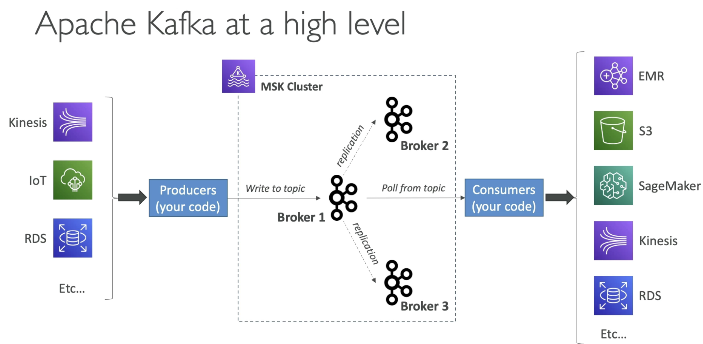
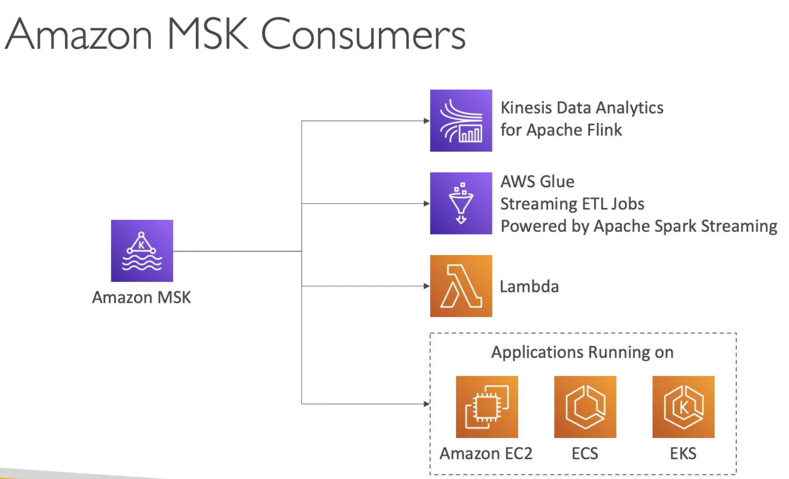

# OpenSearch
- Successor to ElasticSearch (name changed)
- In DynamoDB, queries only exist by primary key or indexes
- With OpenSearch, you can **search any field, even partially matches**
- Its common to use OpenSearch as a **complement to another DB**
- Can be used for analytical queries
- Two Modes: **Managed Cluster OR Serverless cluster**
- Has its own query language, **does not natively support SQL** (can be enabled via a plugin)
- Ingestion from Kinesis Data Firehose, AWS IoT and CloudWatch Logs
- Security through Cognito and IAM, KMS encryption, TLS
- Comes with OpenSearch Dashboards for visualization
    
    (In the example above the OpenSearch provides the search ability whereas main source of data is still DynamoDB. Here DynamoDB stream will capture the streams of data which is then picked by a Lambda function, which inserts the data in OpenSearch in real time. Now the application has the ability to do a partial search with an item name and find the item ID and then once item ID is obtained, it will retrieve the full item from DynamoDB table)

    

    

# EMR
- **"Elastic MapReduce"**
- Helps creating **Hadoop Clusters (Big Data)** to analyze and process vast amount of data.
- The clusters have to be provisioned and can be made of **hundreds of EC2 instances**.
- Comes bundled with Apache Spark, HBase, Hive, Hudi, Presto, Flink (all are big data specialist tools)
- Takes care of all the provisioning and configuration of the services
- Auto scaling and integrated with spot instances (for cost reductions)
- **Use cases**: data processing, machine learning, web indexing, big data ...

- Node types and purchasing
    - **Master Node**: Manage the cluster, coordinate, manage health - **long running**
    - **Core Node**: Run tasks and store data - **long running**
    - **Task Node**(optional):Just to run tasks - usually Spot
    - **Purchasing options**: 
        - On-demand: reliable, predictable, wont be terminated
        - Reserved (min 1 year): cost savings(EMR will automatically use if available), good for master and core nodes
        - Spot instances: cheaper, can be terminated, less reliable, may be good for task nodes.

- EMR deployments can be either long running clusters, or transient (temporary) cluster (tear down once the analysis is done.)
- With EMR you can run Petabyte-scale analysis at less than half of the cost of traditional on-premises solutions and over 3x faster than standard Apache Spark.
- For short-running jobs, you can spin up and spin down clusters and pay per second for the instances used
- For long-running workloads, you can create highly available clusters that automatically scale to meet demand.

# QuickSight
- Serverless machine learning-powered BI service to create interactive dashboards
- Fast, automatically scalable, embeddable, with per-session pricing
- **Use cases**: Business Analytics, Building Visualizations, Perform ad-hoc analysis, Get business insights using data
- Integrated with RDS, Aurora, Athena, RedShit, S3...
- **In-memory computation using SPICE** engine if data is imported directly into QuickSight. (Doesnt work if QuickSight is connected to another database)
- Enterprise Edition: possibility to setup **Cloumn level security (CLS)**, to prevent some columns from being displayed for some users if they dont have enough access rights.

- Dashboard and Analysis
    - Define Users(standard version) and Groups(enterprise version)
        - These users and groups exist only within QuickSight, not IAM, IAM users are used only for administration.
    - A **dashboard** ..
        - is a read-only snapshot of an analysis that you can share
        - preserves the configuration of the analysis (filtering, parameters, controls, sort)
    - **You can share the analysis or the dashboard with Users or Groups**
    - To share a dashboard, you must first publish it.
    - Users who see the dashboard can also see the underlying data.

    

# Glue
- Manged **extract, transform and load (ETL)** service
- Useful to prepare and transform data for analytics
- Fully serverless service
- Extract data, transform it, and load the resulting data back to S3, data stores in a VPC, or on-premises JDBC data stores as a target
- The **AWS Glue Data Catalog** contains references to data that is used as sources and targets of your ETL jobs in AWS Glue. To create your data warehouse or data lake, you must **catalog this data**. The Glue Data Catalog is an index to the location, schema, and runtime metrics of your data. Information in the Data Catalog is stored as **metadata tables**, where each table specifies a single data store. Typically, you run a **crawler** to take inventory of the data in your data stores, but there are other ways to add metadata tables into your Data Catalog.
- **Glue Job Bookmarks**: prevent reprocessing old data in case you run a new ETL job.
- **Glue Elastic Views**: combine and replicate data across multiple data stores using SQL. So to create a view RDS and Aurora and S3.
    - No Custom code
    - Glue monitors for changes in the source data
    - Serverless
    - Leverages a "Virtual Table" (materialized view) (spreads across multiple data store) 
- **Glue DataBrew**: clean and normalize data using pre-built transformation
- **Glue Studio**: new GUI to create, run and monitor ETL jobs in Glue
- **Glue Streaming ETL** (built on Apache Spark Structured Streaming): compatible with Kinesis Data Streaming, Kafka, MSK(managed Kafka)

    

    
    (example above is to convert data in Parquet format which is columnar data format and therefore much better to use with services like Athena. Either the Glue service can import the CSV coming from the S3, or the process can be automated by sending event notifications to Lambda function or EventBridge, when a new file is inserted in S3 and then this can trigger the Glue ETL job)

    - **Glue Data Catalog**

    
    (Behind the scenes when you use Athena data discovery or SQL discovery, its going to leverage the Glue Data Catalog, so will RedShift Spectrum and EMR. So the Glue Data Catalog service is central to many other services)

# AWS Lake Formation
- **Data Lake = central place to have all your data for analytics purposes**
- Fully managed service that makes it easy to setup a **data lake** in days
- Discover, cleanse, transform and ingest data into your Data lake
- It automates many complex manual steps (collecting, cleansing, moving, cataloging data, ...) and de-duplicate (using ML Transforms)
- Combine structured and unstructured data in the data Lake
- **Out-of-the-box source blueprints**: Helps you migrate data from one place to this central data lake. It has blueprints for S3, RDS, Relational and NoSQL databases.
- With Lake formation everything is in one place.
- **Fine grained Access Control for you applications** (row and column level)
- **Built on top of AWS Glue**

      
    (Lake Formation comes with Source crawlers, ETL and Data prep tools, data catalogin tool, and all this comes from the underlying Glue service)

    
    (In the above example, the permissions and security can be setup in Athena, or at user level with QuickSight, S3 bucket policies, or with users in RDS, Aurora etc. So with security at multiple places, maneging it becomes a mess. Lake Formation solves this problem by providing column or row level security.)
    (With Lake Formation, you ingest all the data which then sits in S3. Within the Lake formation service you manage access control so that any service that connects to it will only see the data to which it has permissions)

# Kinesis Data Analytics
- There are 2 flavours: **SQL Applications** and **Apache Flink**
- 1 SQL Application
    - Real time analytics on Kinesis Data Streams & Firehose using SQL
    - Add reference data from Aamzon S3 to enrich streaming data
    - Fully managed, no servers to provision
    - Automatic scaling
    - Pay for actual consumption rate
    - Output: Kinesis Data Streams (create streams out of the real-time analytics queries), Kinesis Data Firehose(send analytics query results to destinations)
        - **Use cases**: Time-series analytics, Real-time dashboards, Real-time metrics

    
    (SQL statements can be applied to perform real-time analytics and its possible to join some reference data from S3 bucket. Allows to enrich the data in real time. )

- 2 Apache Flink
    - renamed to Amazon Managed Service for Apache Flink
    - Use Flink (Java, Scala, or SQL) to process and analyze streaming data
    - Flink are special applications you need to write as code, which can be run on clusters that dedicated to it on Kinesis Data Analytics.
    - Run any Flink application on a managed cluster on AWS.
    - Flink is more powerful than just standard SQL, for advanced querying capability or to read streaming data from other services.
    - Provisioning compute resources, parallel computation, automatic scaling
    - Applicaiton backups (implemented as checkpoints and snapshots)
    - Use any Apache Flink Programming features
    - **Flink does not read from Firehose** (use Kinesis Analytics for SQL instead)
    

# Managed Streaming for Apache Kafka (MSK)
- Kafka is an alternative to Amazon Kinesis. Kafka and Kinesis both allow you to stream data.
- Fully managed Apache Kafka on AWS
    - Allow you to create, update and delete clusters
    - MSK creates and manages Kafka broker nodes and Zookeeper nodes for you
    - Deploy the MSK cluster in your VPC, multi-AZ (upto 3 for HA)
    - Automatic recovery from common Apache Kafka failures
    - **Data is stored on EBS columes for as long as you want**
    - One click Apache Kafka deployment on AWS is great.
- **MSK Serverless**
    - Run Apache Kafka on MSK without managing the capacity
    - MSK automatically provisions resources and scales compute and storage.

      
    
|   Kinesis Data Streams                      |   Amazon MSK                                                        |
|---------------------------------------------|---------------------------------------------------------------------|
| 1 MB message size limit                     | 1 MB default, configure for higher(ex 10MB)                         |
| Data streams with Shards                    | Kafka topics with Partition                                         |
|   Shard Splitting and Merging (for scaling) | Can only add partitions to a topic.(no delete)                      |
| TLS in-flight encryption                    |   PLAINTEXT or TLS In-flight encryption.                            |
|   KMS at-rest encryption                    | KMS at-rest encryption                                              |
|                                             | Retain data as long as you want, as long as EBS volume is available |

 

