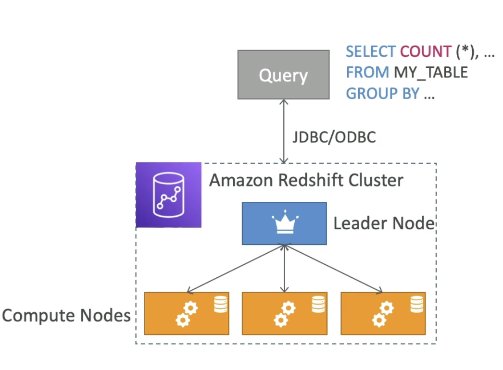
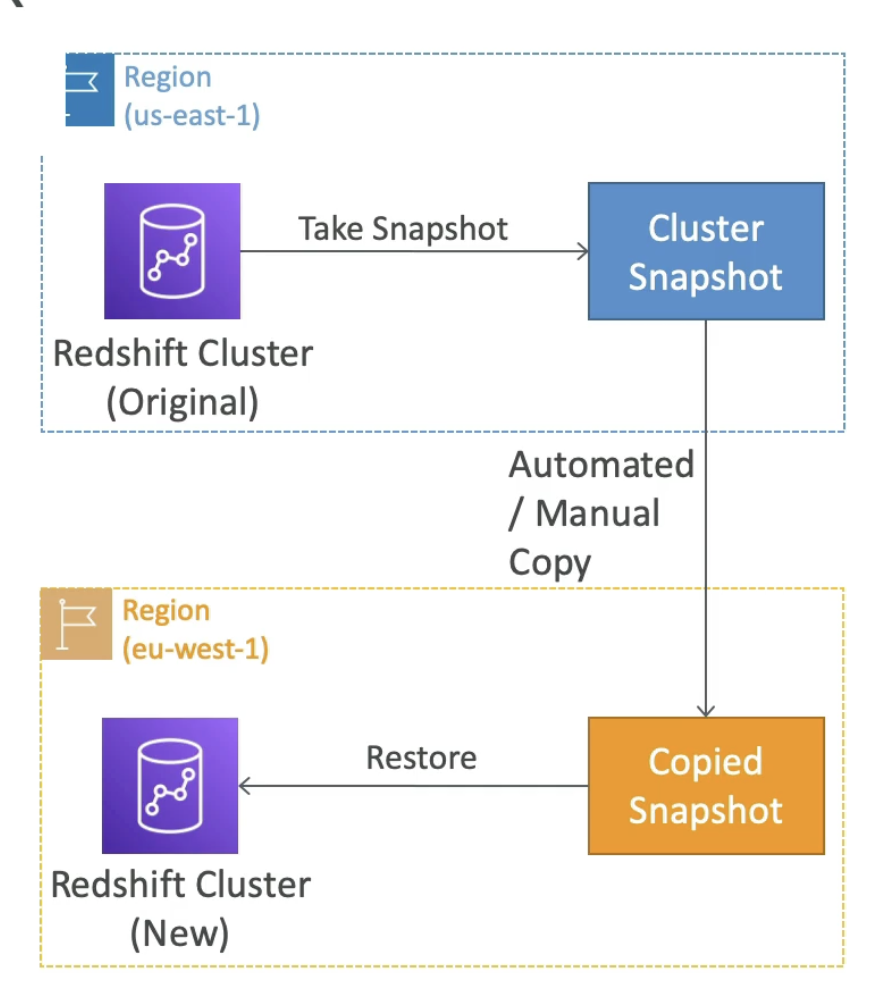
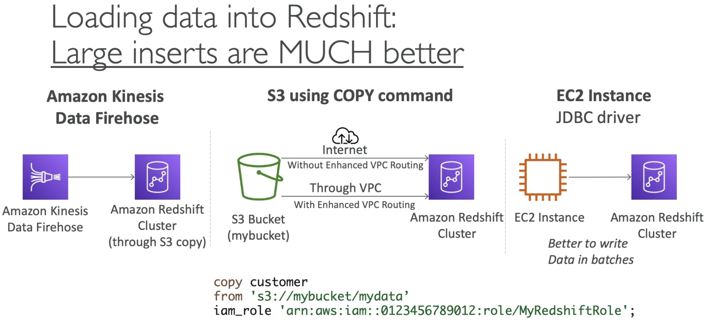
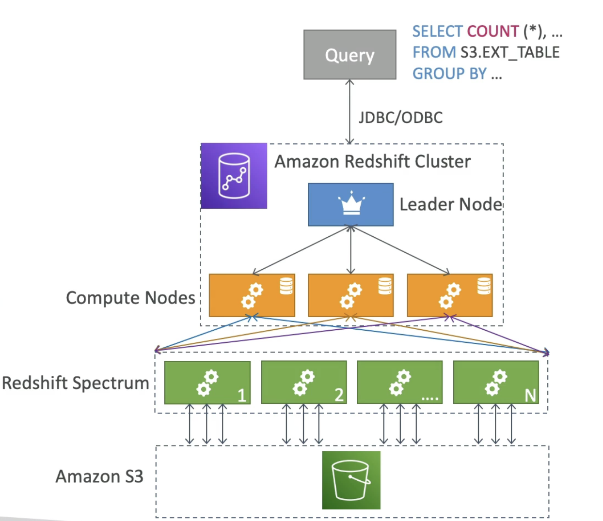

# RedShift

- **Basics**
    - Based on PostgreSQL, but not used for **OLTP**
    - Its **OLAP** (analytics and data warehousing)
    - 10x better performance than other data warehouses, scale to PBs of data
    - **Columnar** storage of data (instead of row based) & parallel query engine
    - Pay as you go based on instances provisioned
    - Load all your data into RedShift and then quickly randomize it
    - Has a **SQL interface** for performing queries
    - BI tools such as Amazon Quicksight or Tableau integrate with it
    - **vs Athena**: faster queries, joins, aggregation thanks to **indexes**. (Once data is loaded to Reshift from say another Amazon server, then indexes are built on this data which makes the data warehouse very fast) (For ad-hoc query on S3, Athena is good, for intense data warehousing with many queries and they are complicated then RedhShift is good)

- **Cluster**
    - **Leader Node**: for query planning and results aggregation
    - **Compute Node**: for performing the queries, send results to leader.
    - You provision the node size in advance.
    - You can use **Reserved Instance** for cost savings.

- **Snapshots & DR**
    - Single AZ for most clusters, "Multi-AZ" mode for some clusters
    - For single AZ we need snapshots for disaster recovery
    - **Snapshots** are point-in-time backups of a cluster, stored in S3
    - Snapshots are incremental (only what has changed is saved) (saves space)
    - You can restore a snapshot into a **new cluster**
    - Have 2 modes for Snapshots: Manual(retention until manual deletion) and Automated (every 8 hours or every 5 GB, or on schedule. Set retention.)
    - You can configure Amazon RedShift to automatically copy snapshots (automated or manual) of a cluster to another AWS region (for disaster recovery)

- **Loading data into RedShift**
    - Large inserts are MUCH better
    - Firehose will receive data from different sources and send to RedShift and to do so it first will write to S3 bucket.
    - So first load data into S3, then issue copy command directly from RedShift to copy data from S3, using IAM role into your RedShift cluster.
    - There are 2 ways of doing the copy, go through internet because S3 buckets are connected to internet Or through enahnced VPC routing. 
    - You can insert data into RedShift cluster using JDBC driver for ex. if the application is on EC2 instance then you can do using JDBC driver.
    - Better to write large batches of data into RedShift instead of one row at a time.

- **RedShift Spectrum**
    - Query data that is already in S3 without loading it to RedShift.
    - Want to use lot more processing power.
    - To use RedShift Spectrum, you **must have a RedShift cluster available** to start the query.
    - The query is then submitted to thousands of RedShift Spectrum nodes which will perform the query onto your data in S3.
    
