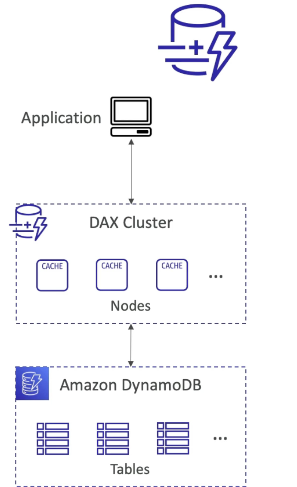

# Amazon Dynamo DB

- Fully managed, highly available with replication across multiple AZs  
  NoSQL - not a relational DB - with transaction support  
  Scales to massive workloads, distributed DB  
  Millions of requests per second, trillions of row, 100s of TB of storage  
  Fast and consistent in performance (single digit milliseconds)  
  Integrated with IAM for security, authorization and administration  
  Low cost and auto scaling capability  
  No maintenance or patching, always available  
  Standard and Infrequent Access (IA) Table class  

- **DynamoDB Basics**
    - Dynamo DB is made of **Tables**. [No need to create a DB, the DB is available as a service]  
    - Each table has a **primary key** (must be decided at creation time)(optionally sort key which is a part of the primary key)  
	- Each table can have an infinite number of **items (=rows)**
	- Each item has **attributes** (can be added over time - can be null)
	- In RDS/Aurora you can add columns later but it’s complicated, can be difficult to evolve schemas. In Dynamo DB it’s easy to add column or attributes later.
	- Max size of an item is **400KB**
	- **Data types** supported are: Scalar Types (String, Number, Binary, Boolean, Null), Document Types (List, Map), Set Types (String set, Number set, Binary set)
	- **Therefore in DynamoDB you can rapidly evolve schemas.**

- **DynamoDB Capacity**
	- Dynamo - Read/Write Capacity Modes
	- Control how you manage your tables capacity (read/write throughput)
	- **Provisioned Mode**(default) 
        - you specify the number of reads/writes per second.
		- You need to Plan capacity **beforehand**
		- Pay for **provisioned** Read Capacity Units (**RCU**) & Write Capacity Units (**WCU**)
		- Possibility to add **auto-scaling** mode for RCU & WCU
	- **On-Demand Mode** 
        - Read/writes automatically scale up/down with your workloads
		- **No capacity** planning needed.
		- Pay for what you use, **more expensive**
		- Great for **unpredictable** workloads, steep sudden spikes.

- **DynamoDB Advance Features**
	- DynamoDB Accelerator (DAX)
        - Fully managed, highly available, seamless in-memory cache for Dynamo DB.
		- Help solve read congestion by caching data. 
		- Microseconds latency for cached data.
		- Doesn’t require application logic modification (compatible with existing DynamoDB APIs)
		- The cache has a TTL of 5 minute.

- **DAX vs EastiCache**  
	- DAX sits in front of Dynamo DB and is going to be helpful for individual object cache or queries, and scanned queries cache   
	- Amazon ElastiCache is great to store aggregation result, say very big computation done on top of DynamoDB.  
	- Both are not replacements but complimentary   
	- For caching solution on top of DynamoDB it’s going to be DAX.  
	- You can do stream processing on top of DynamoDB  
  	
- **DynamoDB - Stream Processing**  
	- Ordered stream of item-level **modification** (create/update/delete) in a table.   
	- 2 Kind of stream processing on DynamoDB   
		- **DynamoDB Streams**   
			- 24 hours retention   
			- a limited number of consumers   
			- Process using Lambda triggers or DynamoDB stream Kinesis (KCL) adapter (if you want to read it yourself).  
		- **Kinesis Data stream**(newer)  
			- send all your changes here   
			- upto 1 year retention   
			- higher number of consumers   
			- Higher number of ways to process data using AWS Lambda, Kinesis data Analytics, Kinesis Data Firehose, AWS Glue Streaming ETL ….  
	- **Use case** : 	
        - React to changes in real-time (welcome email to users, whenever new user in user’s table)  
		- Real-time usage analytics  
		- Insert into derivatives table  
		- Implement cross region replication  
		- Invoke AWS Lambda on changes to your DynamoDB table. 

**DynamoDB Streams** allows you to capture a time-ordered sequence of item-level modifications in a DynamoDB table. It's integrated with AWS Lambda so that you create triggers that automatically respond to events in real-time. 

- **DynamoDB Global Tables**
	- Table replicated across multiple regions, so a table in us-east-1 and a table in ap-southeast-2 and there will be **2 way replication** between the tables.
	- Make a DynamoDB table accessible with **low-latency** in multiple regions 
	- Active-Active replication
	- Applications can READ and WRITE to the table in any region.
	- Must enable DynamoDB Streams as a pre-requisite. [Because this is the underlying infra to replicate the table across regions]

- **DynamoDB TTL**
	- **Use case**: reduce stored data by keeping only current items, adhere to regulatory obligations , **web session handling** (user logs to a website and has a session and keep the session in a central place, for 2 hours, this session data can be accessed by any kind of application, if within 2 hours the session is not renewed then the data is deleted) 

- **DynamoDB - Backups for disaster recovery**
	- **Continuous backups** using Point-in-time-recovery (**PITR**) - optionally enabled for **35** days, point-in-time recovery for any time within the backup window, the recovery process creates a new table.
	- **On-demand backups** - Full backups for long term retention, until explicitly deleted, doesn’t affect performance or latency of the DynamoDB table, can be configured and managed in AWS backup service (enables cross-region copy, enables you to have lifecycle policies for your backup), recovery process creates a new table.

- **DynamoDB - Integration with S3**
	- **Export to S3** (must enable PITR)
		- Works for any point of time in the last 35 days (because continuous backup is enabled)
		- doesn’t affect the read capacity of your table or the performance
		- Perform data analysis on top of DynamoDB
		- Retain snapshots for auditing
		- Do any big transformation like ETL on top of S3 data before importing back into DynamoDB
		- Format of export in DynamoDB JSON or ION format.
	- **Import from S3** (to DynamoDB)
		- Import CSV, DynamoDB JSON, ION
		- Doesn’t consume any write capacity.
		- Create a new table
		- If any errors then it will be logged in CloudWatch logs.

