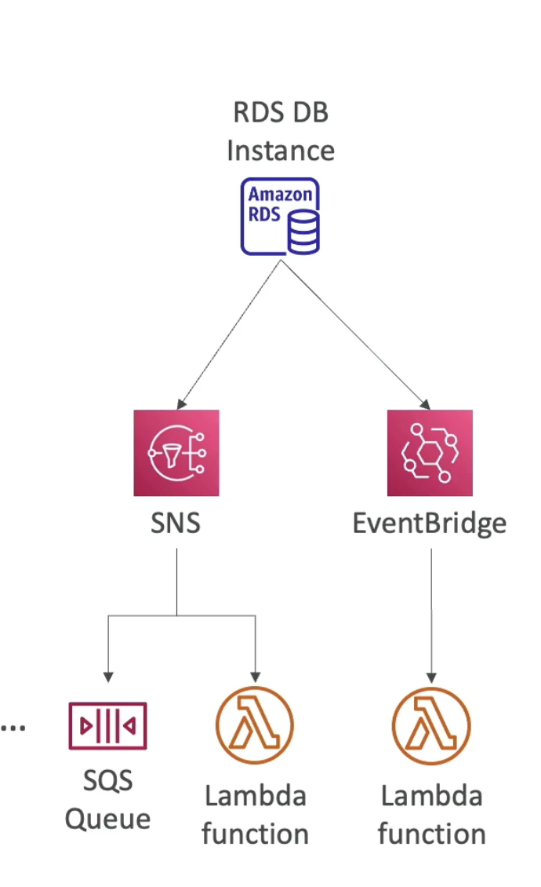

# AWS Lambda

 **AWS Lambda - Why?**
  - Amazon EC2 - Virtual servers in Cloud  
    - Limited by RAM and CPU  
	- Continuously running [we can optimize by starting and stopping efficiently]  
	- Scaling means intervention to add/remove servers [for ex with ASG]  
  - AWS Lambda - Virtual functions, no servers to manage  
    - Limited by time - **short executions** (upto 15 mins)  
	- Run on-demand [when not using its not running and billed for duration when its running]  
	- Scaling is automated.   

  **Benefits**   
  - Easy pricing - Pay per request and compute time  
  - Free tier of 1,000,000 AWS Lambda requests and 400,000 GBs of compute time  
  - Integrated with the whole AWS suite of services  
  - Integrated with many programming languages [Node.js, Python, Java, C#, GoLang, Ruby, Custom runtime API(ex Rust with community support)]  
  - Support for Lambda container Image - Container image that run on Lambda, must implement the Lambda runtime API. ECS/Fargate is preferred for running arbitrary Docker images.  
  - Easy monitoring through AWS CloudWatch  
  - Easy to get more resources per functions (upto 10 GB of RAM)  
  - Increasing RAM will also improve CPU and n/w.  
  	
  **Integrations**  
  - API Gateway (create REST APIs that invokes Lambda functions)  
  - Kinesis (for data transformation on the fly)  
  - DynamoDB (create triggers when something happens in the DB)  
  - S3 (ex lambda function will be triggered when a file is created)  
  - CloudFront (Lambda Edge)  
  - CloudWatch Events EventBridge (ex if something happens to our infra and we want to react, ex we have a cut pipeline, state changes, and we want to do automation based on it)  
  - SNS (react to notifications )  
  - SQS (process messages)  
  - Cognito (react when a user logs into a DB  

## Examples

Case 1: **Serverless Thumbnail Creation**  

A reactive architecture to the events of a new image being created in S3.  

Case 2: **Serverless CRON Job**  

So this is a server less architecture and you don’t have to waste EC2 instances which will need to run continuously.  

## AWS Lambda Limits

  **Execution:**  
    - Memory Allocation - 128 MB - 10 GB (1 MB increments)  
	- Maximum execution time - 15 mins  
	- Environment variables - 4 KB   
	- Disk capacity in the “function container” (temp space in /tmp) 512 MB to 10GB. For ex if you want o pull in some big files while we create another function.  
	- Concurrent execution - 1000 (can be increased)  

  **Deployment:**  
	- deployment size (compressed zip): 50 MB. For anything above try using temp space.  
	- Uncompressed deployment (code+dependency) - 250 MB  
	- Use /tmp directory to load other files at startup  
  
  
  ### Lambda and VPC
	
  **By Default**  
    - Launched outside your own VPC(in an AWS owned VPC)   
   	- So it can’t access resources in your VPC (RDS, ElastiCache, internal ELB)  
   	- Has access to public API on the internet.  
   	- Will have access to DynamoDB as it’s a public resource on the AWS cloud.  
  
  **Lambda in VPC**  
	- Must define VPC id, subnet you want to launch in, and attach a security group to the Lambda.  
	- Lambda will create an ENI ( **Elastic Network interface** ) in your subnets  
  
  **Lambda with RDS Proxy**  
 	- if Lambda functions directly access your RD DB, then it may open too many connections under high load.  
	- With too many functions appearing and disappearing, they there may be too many open connections   
	- Instead launch RDS Proxy - pull connections and connect with less connections to the RDS  
	- Lambda function must be deployed in your VPC because RDS Proxy is never publicly accessible   
	- 3 benefits of RDS Proxy  
  1. Improve **scalability** by pooling and sharing DB connections  
  2. Improve **availability** by reducing by 66% the failover time and preserving connections.  
  3. Improve **security** by enforcing IAM authentication and storing credentials in Secrets Manager  
	

  **Invoking Lambda from RDS & Aurora**  
	- Allows you to process **data events** from within a database.  
	- Supported for RDS for **PostgreSQL** and Aurora **MySQL**.  
	- Idea is that the user is going to insert a data event into your table, registration table, and RDS will be setup to invoke your Lambda functions.  
	- This Lambda function can then send a welcome mail to the user and then the user will receive it.  
	- This is not set from the AWS console but setup from within the DB by connecting to it.  
	- Since RDS is the one invoking the Lambda function, **Must allow outbound traffic to your Lambda function** from within your DB instance. [through Public internet, or invoke NAT gateway, or VPC endpoints]  
	- Also RDS instance should have  required permissions to invoke the Lambda functions. [IAM policy ]  

**RDS Event Notifications**  
	- Notifications that tells information about the **DB instance** itself (created, stopped, start,…)  
	- You don’t have information about the **data itself** [For this use the above method]  
	- Subscribe to the following event categories: DB instance, DB snapshot, DB Parameter Group, DB Security group, RDS Proxy, Custom Engine version.  
	- Near real-time events (upto 5 minutes)  
	- Send notifications to SNS or subscribe to events using EventBridge.  
	- From SNS send to SQS or Lambda functions and from EventBridge to so many different destinations including Lambda functions.  

