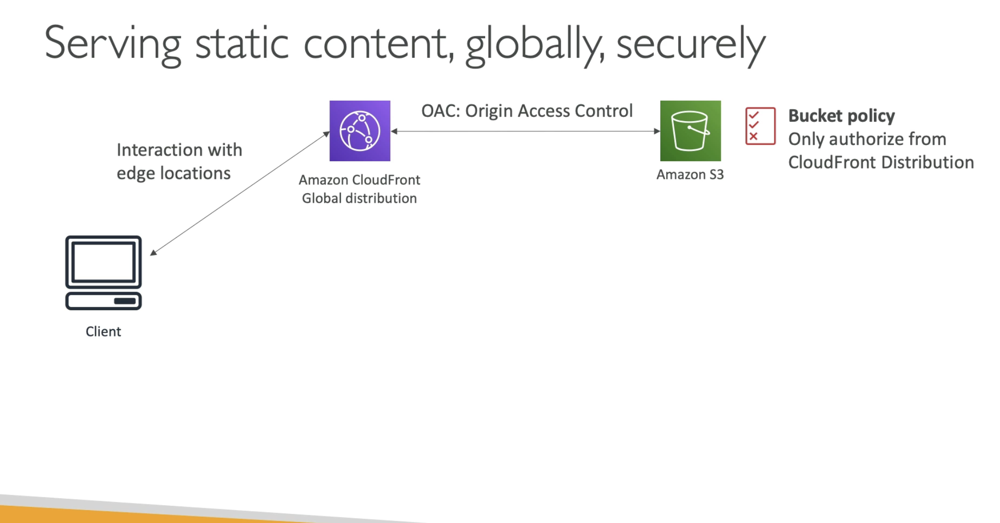
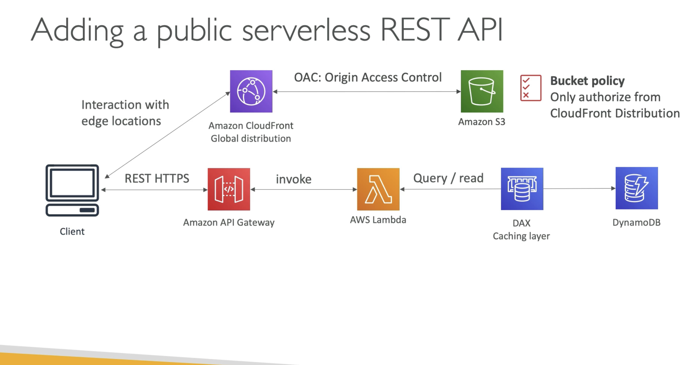
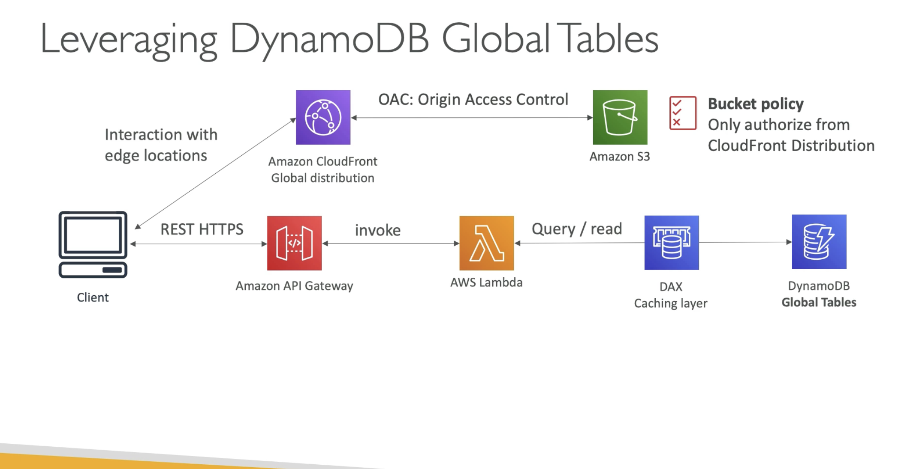
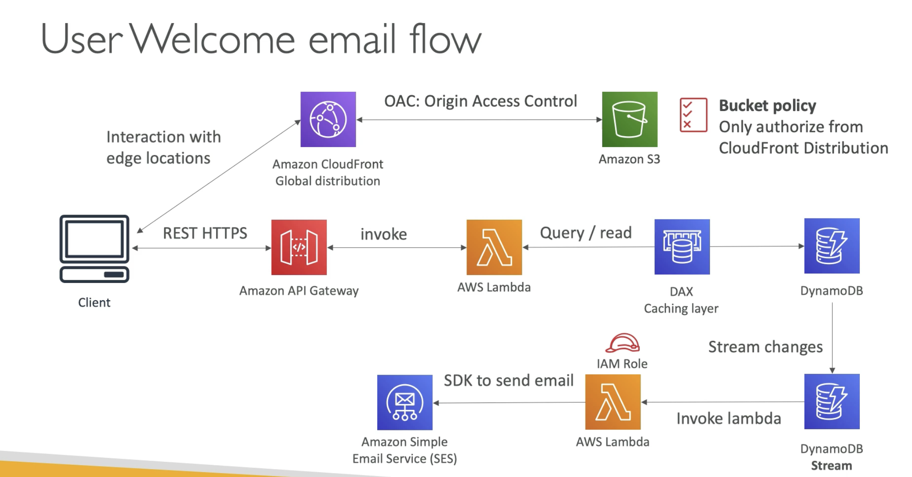
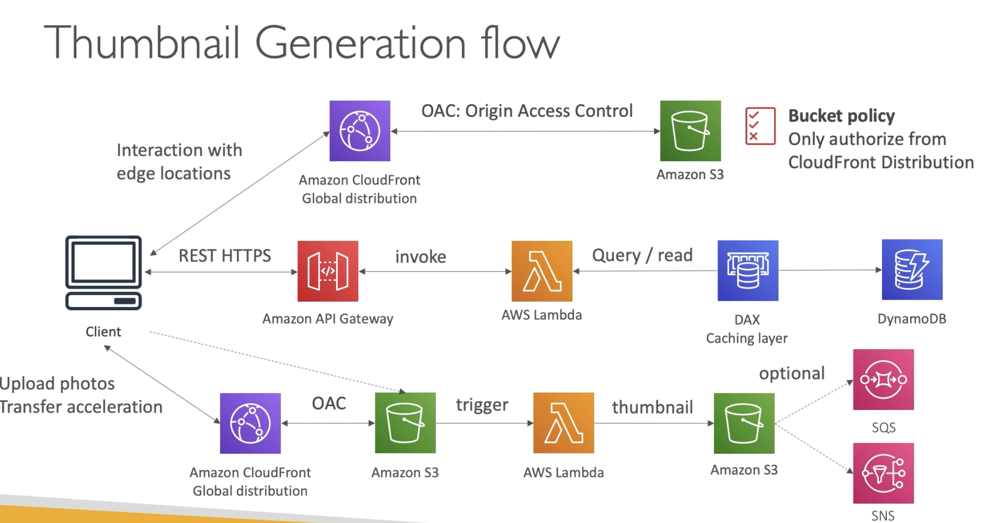

# Website - MyBlog.com

  - Website should scale globally
  - Blogs are rarely written, often read
  - Some of the website is purely static files, rest are dynamic REST API
  - Caching must be implemented where possible
  - New users that subscribe should receive a welcome mail
  - Photo uploaded to blog should have a thumbnail generated

(To expose S3 buckets globally, we can use Amazon CloudFront, which is a global distribution CDN, so our client is going to interact with edge location of the CloudFront and its going to cache data coming from S3)  

(To make this secure, we need to add Origin Access Control to S3, so that it can be accesed only by CloudFront. For this we add a Bcuket Policy to authorize only the CloudFront Distribution)  

(Next is to add a public serverless REST API, using API Gateway, Lambda, DynamoDB and possibly a DAX for efficiency. We dont need Cognito here as its a public REST API.)  

(If we are going global, then its good to leverage DynamoDB global databases, to reduce latency and will speed up the architecture)  
(We could have used **Aurora** but in that case its a provisioned Aurora and not **serverless**)  

(For the welcome email lets introduce DynamoDB stream to react on changes in the tables, this will invoke a Lambda function, which will have an IAM role which allows us to use **Amazon SES**. Lambda function will use AWS SDK to send mails using SES.)  
 

(Next we need to add the thumbnail creation, so clients can either directly upload to an S3, or we can have an OAC(Origin Access Control) and a CloudFront distribution, in which case users will upload to the CloudFront and then CloudFront will uoload to S3. This is called **S3 Transfer Acceleration**. When a file is uploaded to S3, a lambda function will be triggered, which will create the thumbnail and put into an S3 bucket. As an addition we can also triggers set from S3 to **SQS** or **SNS** and then we can do whatever we want from there.)  