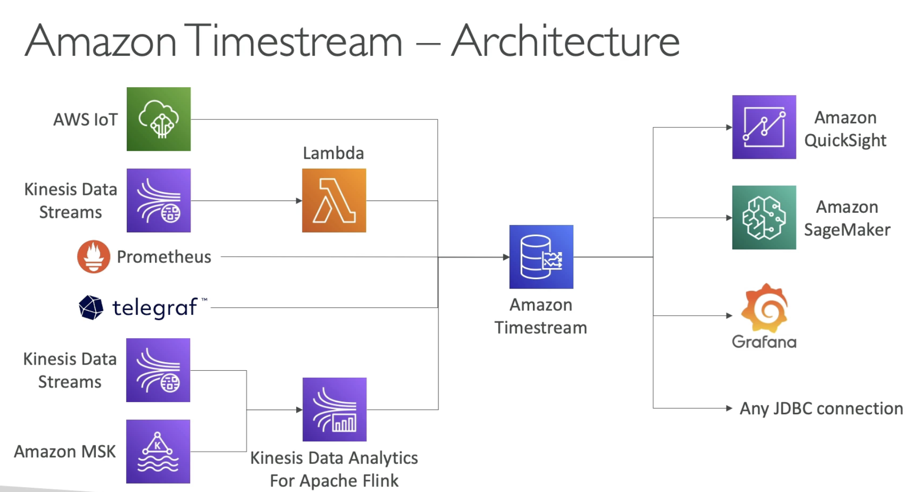

# Choosing the Right Database

Questions to choose the right databsse based on your architecture

  - Read-heavy, write-heavy, or balanced workloads ?
  - Throughput needs? Will it change, does it need to scale or fluctuate during the day?
  - How much data to store and for how long? Will it grow? Average object size? How are they accessed?
  - Data durability? Source of truth for the data?
  - Latency requirements? Consurrent users?
  - Data model? How will you query the data? Joins? Structured? Semi-structures?
  - Strong schema? More flexibility? Reporting? Search? RDBMS / NoSQL?
  - License costs? Switch to Cloud Native DB such as Aurora?

- **Database Types**

    - **RDBMS** (= SQL / OLTP): RDS, Aurora — great for joins
    - **NoSQL database** — no joins, no SQL: DynamoDB (~JSON), ElastiCache (Key / value pairs), Neptune (graphs), Document DB (for MongoDB), Keyspaces (for Apache Cassandra)
    - **Object Store**: S3 (for big objects) / Glacier (for backup / archives)
    - **Data Warehouse** (= SQL Analytics / BI): Redshift (OLAP), Athena, EMR
    - **Search**: OpenSearch (JSON) — free text, unstructured searches
    - **Graphs**: Amazon Neptune — displays relationships between data
    - **Ledger**: Amazon Quantum Ledger Database
    - **Time Series**: Amazon Timestream 

- **RDS**
    - Managed PostgreSQL / MySQL / Oracle / SQL Server / MariaDB / Custom
    - Provisioned RDS Instance size and EBS Volume Type & Size
    - Auto-scaling capability for storage
    - Support for read replicas and Multi-AZ
    - Security through IAM, Security Groups, KMS, SSL intransit
    - Automated Backup with Point in time restore feature (upto 35 days) (Restore will create a new database)
    - Manual DB Snapshot for longer-term recovery
    - Managed and Scheduled maintenance (with downtime)
    - Support for IAM Authentication, integration with Secrets Manager
    - RDS Custom for access to and customize the underlying instance (Oracle and SQL Server)

    - **Use Case**: Store relational datasets (RDBMS/OLTP), perform SQL queries, transactions

- **Aurora**
    - Compatible API for PostgreSQL / MySQL, separation of storage and compute.
    - Storage: data is stored in 6 replicas, across 3 AZ(you cannot change this) - highly available, self-healing, auto-scaling
    - Compute:(this is the acutal DB instances) Cluster DB of instance across multi-AZ, auto scaling of read replicas
    - Cluster: Custom endpoints for writer and reader DB instances
    - Same security/ monitoring/ maintenance features of RDS
    - Know the backup and restore options for Aurora
    - **Aurora Serverless** - for unpredictable/intermittent workloads, no capacity planning
    - **Aurora Multi-master** - for continuous writes failover (high write availability)
    - **Aurora Global** - upto 16 DB read instances in each region, < 1sec storage replication, in case primary region has a problem secondary region can be promoted to primary.
    - **Aurora Machine Learning** - perform ML using SageMaker & Comprehend on Aurora
    - **Aurora Database Cloning** - new cluster from existing one, faster than restoring a snapshot, can be used as testing/staging database out of the production database.
    - **Use case** - Same as RDS but with less maintenance/ more flexibility/ more performance/ more features.

- **ElastiCache**
    - Managed Redis/ Memcached (similar offering as RDS, but for caches)
    - In-memory data store, sub-millisecond latency
    - Select an ElastiCache instance type (e.g. cache.m6g.large)
    - Support for Clustering (Redis) and Multi-AZ, Read Replicas (sharding)
    - Security through IAM, Security groups, KMS, Redis Auth
    - Backup/ Snapshot/ Point in time restore features- same as RDS
    - Managed and Scheduled maintenance
    - **Requires some application code changes to be leveraged**
    - **Use Case**: Key-Value store, Frequent reads, less writes, cache results for DB queries, store session data for websites, **cannot use SQL**

- **DynamoDB**
    - AWS propriertary technology, managed serverless, **NoSQL database**, millisecond lateency
    - Capacity modes: provisioned capacity with optional auto-scaling or on-demand(unpredictable workloads or sudden steep spikes of demand)
    - Can replace ElastiCache as a key-value store (storing sessions data for example, using TTL feature)
    - High availability, Multi-AZ by default, Read and Writes are decoupled, transaction capability
    - DAX cluster for read cache, microsecond read latency
    - Security, authentication and authorization is done through IAM
    - Event processing: DynamoDB streams to integrate with AWS Lambda, or Kineses Data Streams (can integrate with Firehose and have longer term retention)
    - Global Table feature: active-active setup
    - Automated backups upto 35 days with PITR(restore to new table), or on-demand backups(longer term retention, also restores to new table.)
    - Export the DynamoDB tables to S3 without using RCU within the PITR window, import from S3 without using WCU.
    - **Greate to rapidly evolve schemas**
    - **Use case**: Serverless application development (small documents 100s KB), distributed serverless cache

- **S3**
    - key/value store for objects
    - Great for bigger objects, not so great for manu small objects
    - Serverless, scales infinitely, max object size is 5TB, versioning capability.
    - **Tiers**: S3 standard, S3 Infrequent Access, S3 Intelligent, S3 Glacier + lifecycle policy.
    - **Security**: IAM, Bucket policy, ACL, Access Points, Object Lambda, CORS, Object/Vault lock(for Glacier)
    - **Encryption**: SSE-S3, SSE-KMS, SSE-C, client-side, TLS in transit, default encryption
    - **Batch Operations**: on objects using S3 Batch, listing files using **S3 inventory**, for ex if you want ot encrypt all the files in and S3 bucket at the same time, or want to copy all files from one S3 to another bucket before enabling replication.
    - **Performance**: Multi-part upload, S3 Transfer Accelaration, S3 select (to only retrieve the data you need out of S3)
    - **Automation** : S3 Event Notifications (SNS, SQS, Lambda, EventBridge)
    - **Use Case**: static files, key value store for big files, website hosting

- **DocumentDB**
    - Aurora is an "AWS-implementation" of PostgreSQL/MySQL ..DocumentDB is the same for MongoDB (**NoSQL**)
    - MongoDB is used to store, query and index JSON data
    - Similar deployment concepts as Aurora
    - Fully Managed, highly available with replication across **3 AZ** 
    - DocumentDB storage automatically grows in increments of 10GB upto 64 TB
    - Automatically scales to workloads with millions of requests per seconds. 

- **Neptune**
     - Fully managed **graph database**
     - A popular graph dataset would be a **social network** - Users have friends, posts have comments, comments have likes from users, users share and like posts.
     - Highly available across 3 AZ, with upto 15 read replicas
     - Build and run applications working with highly connected datasets - optimized for these complex and hard queries
     - Can store upto billions of relations and query the graph with milliseonds latency
     - Highly available with replications across multiple AZs
     - Great for knowledge graphs (Wikipedia), fraud detection, recommendation engines, social networking.

- **Keyspaces (for Apache Cassandra)**
    - **Apache Cassandra is an open-source NoSQL distributed database**
    - A managed Apache Cassandra-compatible database service
    - Serverless, Scalable, highly available, fully managed AWS
    - Automatically scale tables up/down based on the application's traffic
    - Tables are replicated 3 times across multiple AZ
    - Using the Cassandra Query Language (CQL)
    - Single-digit millisecond latency at any scale, 1000s of requests per second
    - Capacity: On-demand mode or provisioned mode with auto scaling
    - Encryption, backup, PITR upto 35 days
    - **Use Case**: store IoT devices info, time-series data

- **QLDB**
    - Quantum Ledger Database
    - A ledger is a book **recording financial transactions**
    - Fully managed, Serverless, High available, Replication across 3 AZ
    - Used to review history of all changes made to you application data over time.
    - **Immutable** system: no entry can be removed or modified, cryptographically verifiable
    - 2-3 X better performance than common ledger blockchain frameworks, manipulate data using SQL
    - Difference with Amazon Managed Blockchain: **No decentalized component**, in accordance with financial regulations. (has a central authority component owned by Amazon that allows you to write to this journal)

- **Timestream**
    - Fully managed, fast, scalable, serverless **time series database** (bunch of points that have time included in them, ex graph by year)
    - Automatically scales up/down to adjust capacity
    - Store and analyze trillions of events per day
    - 1000s times faster and 1/10th the cost of relational databases
    - Scheduled queries, multi-measure records, SQL compatibility.
    - Data storage tiering: recent data kept in memory and historical data kept in cost-optimized storage.
    - **Built-in time series analytics fuctions** (helps you **identify patterns in your data in near real-time**)
    - Encryption in transit and at rest.
    - **Use case**: IoT apps, operational applications, real time analytics.

Notes: **Amazon Aurora** is a MySQL and PostgreSQL-compatible relational database. It features a distributed, fault-tolerant, self-healing storage system that auto-scales up to 128TB per database instance. It delivers high performance and availability with up to 15 low-latency read replicas, point-in-time recovery, continuous backup to Amazon S3, and replication across 3 AZs.  
  
Amazon S3 is indeed a key-value store! (where the key is the full path of the object in the bucket)