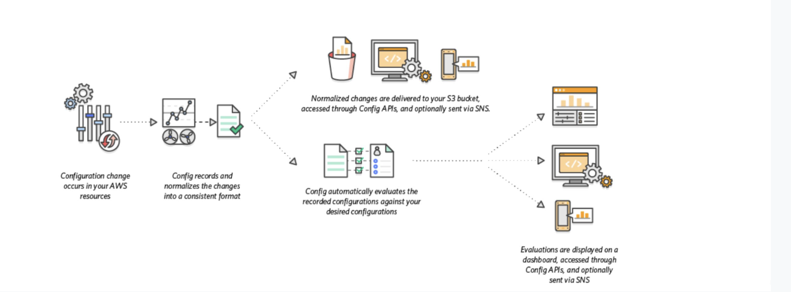
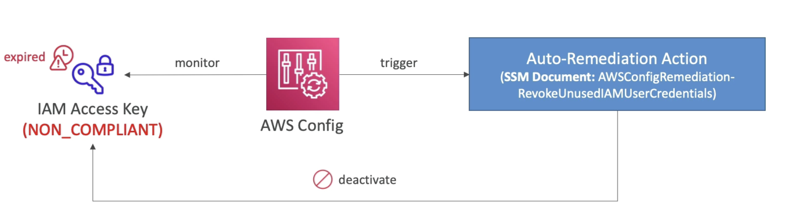
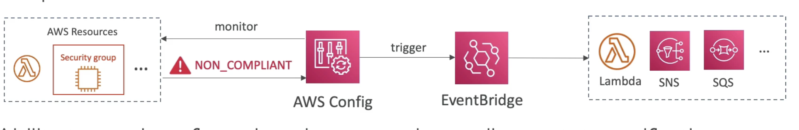
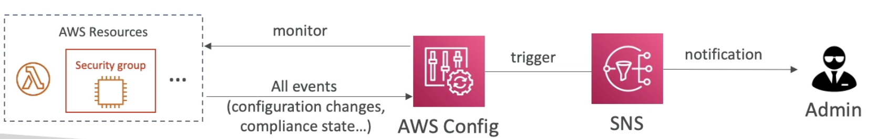

# AWS Config

- AWS Config provides AWS-managed rules, which are predefined, customizable rules that AWS Config uses to evaluate whether your AWS resources comply with common best practices.
- When you turn on AWS Config, it first discovers the supported AWS resources that exist in your account and generates a configuration item for each resource.
- AWS Config also generates configuration items when the configuration of a resource changes, and it maintains historical records of the configuration items of your resources from the time you start the configuration recorder.
- Keeps track of all changes to your resources by invoking the **Describe or the List API call** for each resource in your account. The service uses those same API calls to capture configuration details for all related resources.

  - Helps with auditing and recording **compliance** of your AWS resources based on some rules.
  - Helps record configurations and changes over time (to quickly be able to roll back and figure out what happened in your infra if need be)
  - Questions that can be solved by AWS Config:
    - Is there unrestricted SSH access to my security groups?
    - Do my buckets have any public access?
    - How has my ALB configurations changed over time?
  - You can receive alerts (**SNS Notifications**) for any changes (for example if any of the above rules are not compliant)
  - AWS Config is a **per-region** service
  - Can be **aggregated across regions and accounts**.
  - Possibility of **storing the configuration data into S3** (analyzed by Athena)

- **Config Rules**
    - Can use AWS managed config rules (over 75)
    - Can make custom config rules (must be defined in AWS Lambda)
        - Ex: evaluate if each EBS disk is of type gp2
        - Ex: evaluate if each EC2 instance is t2.micro
    - Rules can be evaluated / triggered:
        - For each config change (ex. whenever new configuration of EBS disc evaluate if its of right type)
        - And / or at regular time intervals (ex. every 2 hours make sure EBS disks are of gp2 type)
    - **AWS Config rules does not prevent actions from happening (no deny)**
    - Not a replacement for security mechanism like IAM but gives an overview of configuration and compliance of your resources.

    - **Pricing**: (can get expensive very quickly) no free tier, $0.003 per configuration item recorded per region, $0.001 per config rule evaluation per region.
    - **Usage Examples**: View Compliance of a resource over time, View configuration of a resource over time (when the change happened, who changed etc), Link to **CloudTrail** to view API calls made to a resource over time. 

- **Config Rules - Remediations**
    - Automate remediation of non-compliant resources using SSM Automation Documents. (cannot deny but remediation is possible)
    - Use AWS managed automation documents or create custom Automation documents for creating remediation action for the non-compliant resources
        - Tip: you can create custom Automation documents that invokes Lambda function.
    - You can set **Remediation Retries** if the resource is still non-compliant after auto-remediation

    
    (Here we are monitoring whether or not your IAM keys have expired, ex if they are older than 90 days then you mark them as non-compliant and then trigger a remediation action.)  
    (In the SSM Document, choose the one that needs to be applied to your resouce, for ex here it should deactivate the IAM keys.)

- **Config Rules - Notifications**
    - Use EventBridge to trigger notifications when AWS resources are non-compliant 
    
    - Ability to send configuration changes and compliance state notifications to SNS (all events) 
    - and then if needed use SNS filtering or filter at client side, and for ex send the notifications to an admin email or slack channel etc
    