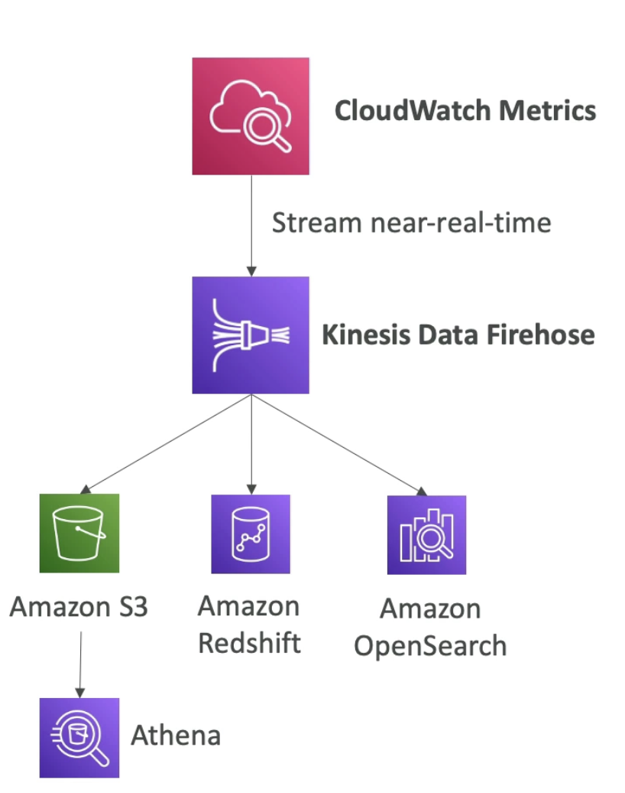
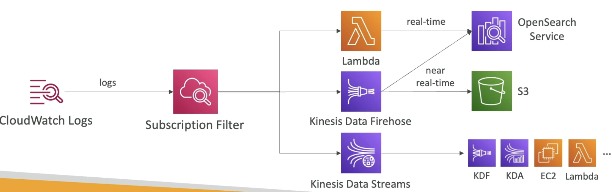
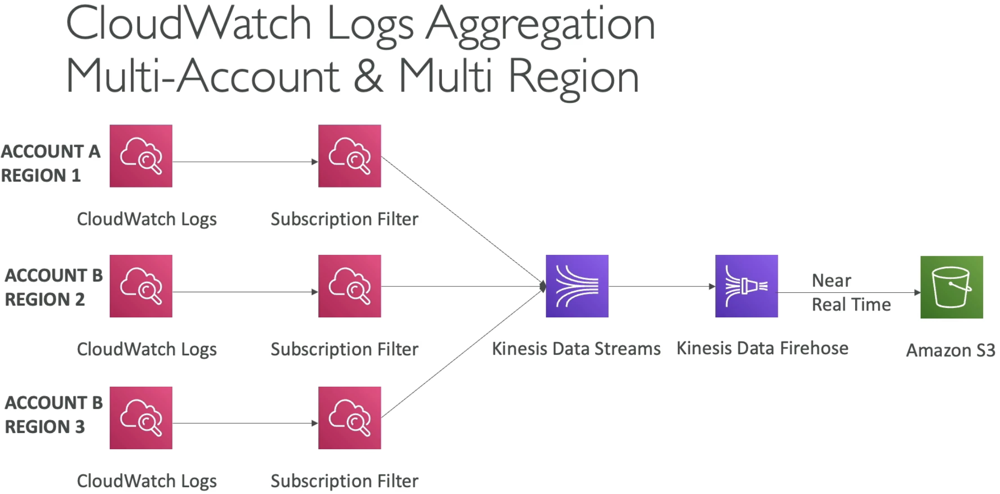
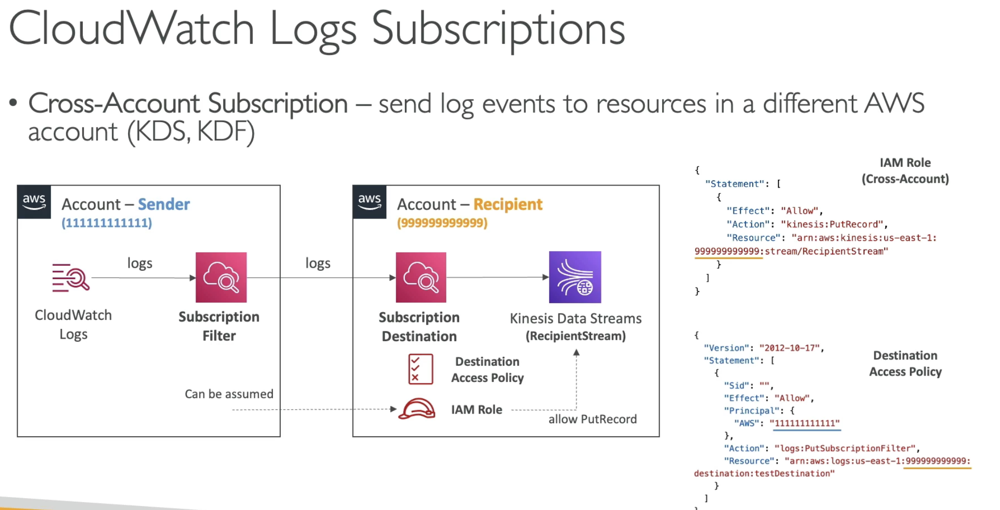
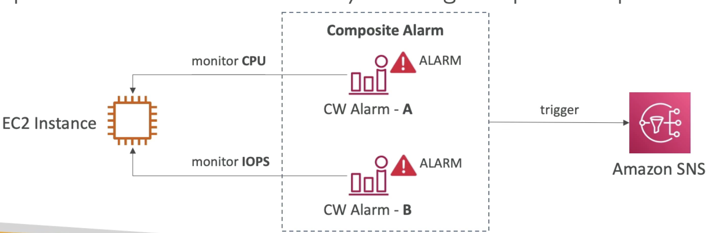
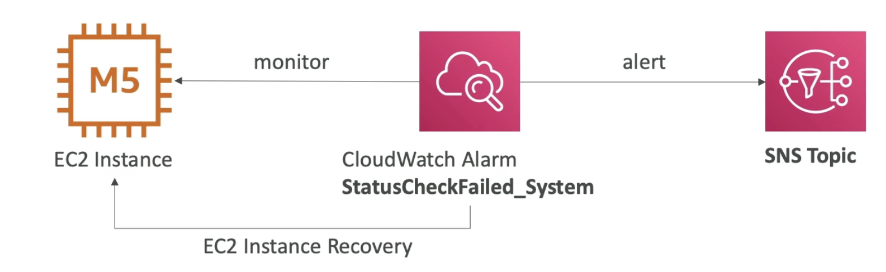

# CloudWatch

- **CloudWatch Metrics**
    - CloudWatch provides metrics for **every** services in AWS.
    - **Metric** is a variable to monitor (for EC2 instance: CPUUtilization, NetworkIn..)
    - Metrics belong to **namespaces** (one namespace per service)
    - **Dimension** is an attribute of a metric (for ex a metric about CPUUtilization can ne related to instance id, environment id)
    - Upto 30 dimensions per metric.
    - Metrics have timestamps. (Metrics are time based)
    - Can create CloudWatch dashboard of metrics (once you have a lot of metrics)
    - Can create **CloudWatch Custom Metrics** (for the RAM for example for EC2 instances) (instead of relying on metrics provided by each service)

- **CloudWatch Metric Streams**
    - Continually stream CloudWatch metrics to a destination of your choice, with **near-real-time** and low latency.
        - Amazon Kinesis Data Firehose (and then its destinations)
        - 3rd party service provider: Datadog, Dynatrace, New Relic, Splunk, Sumo Logic...
    
    (The metric streams can be put into Kinesis Data Firehose and then to S3 and then Athena can do analysis on the data in S3)
    (or the data analysis can be done in s data warehouse like RedShift or in OpenSearch)
    - Option to **filter metrics** to only stream a subset of the metrics. (or stream all metrics in all namespaces)

- **CloudWatch Logs**
    - Place to store your application logs
    - **Log groups**: arbitrary name, usually representing an application
    - **Log stream**: log instances within application/ specific log files/ containers which are part of the cluster. Within log groups, multiple log streams. 
    - Can define log expiration policies (never expire, 1 day to 10 years ..)
    - **CloudWatch Logs can send logs to**:
        - Amazon S3 (exports)
        - Kinesis Data Streams
        - Kinesis Data Firehose
        - AWS Lambda
        - OpenSearch
    - Logs are encrypted be default
    - Can setup KMS based encryption with your own keys

- **CloudWatch Logs - Sources**
    - Can send logs using SDK, CloudWatch Log Agents (deprecated), CloudWatch Unified Agent 
    - Eastic Beanstalk: used to collect logs from application directly into CloudWatch.
    - ECS: send logs directly from containers.
    - Lambda: send logs from functions themselves.
    - VPC Flow Logs: send logs specific to VPC metadata network traffic
    - API Gateway: send all the requests made to the 
    - CloudTrail: send the logs directly based on a filter
    - Route53: log DNS queries made to its service

- **CloudWatch Insights**
    - **Query the CloudWatch logs**
    - Search and Analyze log data stored in CloudWatch logs.
    - Lots of sample queries provided as part of the console for Insights.
    - **Example**: find a specific IP inside a log, count occurences of "Error" in logs, 25 most recent events, 
    - Provides a **purpose built query language**
        - Automatically discovers fields from AWS services and JSON log events.
        - Fetch desired event fields, filter based on conditions, calculate aggregate statistics, sort events, limit number of events..
        - Can save queries and add them to CloudWatch dashboards.
    - Can query multiple Log groups in **Different AWS accounts**.
    - **Its a query engine, not a real time engine.** (only query historical data when you run the query)

    - You write your query and specify a timeframe you want to apply your query to and the result will be shown as a visualization. You can also see the specific line that made the visualization,.
    - This visualization can be exported as a result or added to a dashboard for being able to re-run whenever needed.

- **CloudWatch Logs - S3 Export**
    - Log data can take **upto 12 hours** to become available for export
    - The API call is **CreateExportTask**. This is a **batch export.**
    - Not near-real-time or real-time. If you need real-time use Logs subscription instead.

- **CloudWatch Logs Subscriptions**
    - Get a real-time log events from CloudWatch Logs for processing and analysis
    - Send to Kinesis Data Stream, Kinesis Data Firehose, or Lambda
    - **Subscription filter** - filter which logs or events delivered to your destination.
      
  
      

    - **Cross-Account Subscription**: Use **destinations**. send log events to resources in a different AWS account (KDS,KDF)  
  
      
    (There is sender and receiver account, CloudWatch subscription filter is created, which then gets sent to a **Subscription Destination**. Here the destination is a virtual representation of the Kinesis Data Stream in the recipient account.)
    (Attach a **destination access policy** to allow the first account to send data into the destination.)
    (Create **IAM role** in the recipient account, which has permission to send records into Kinesis Data Stream.)
    (Make sure this IAM role can be assumed by the sender account)

- **CloudWatch Logs for EC2**
    - By default, no logs are going from EC2 instance to CloudWatch.
    - Need to run **CloudWatch agent** on EC2 to push the logs
    - Make sure IAM permissions are correct (IAM role that allows to send the logs)
    - Can be setup on-premises too.

- **CloudWatch Logs Agent & Unified Agent**
    - For virtual servers (EC2 instances, on-prem servers)
    - CloudWatch Logs Agent
        - Old version of the agent
        - Can only send to CloudWatch Logs
    - CloudWatch Unified Agent
        - Collect additional system-level metrics such as RAM, processes etc
        - Collect logs to send to CloudWatch logs
        - Centralized configurations using SSM Parameter Store. (centralized for all unified agents)

- **CloudWatch Unified Agent - Metrics**
    - Collected directly on your Linux sever / EC2 instance
    - **CPU** - active, guest, idle, system, user, steal
    - **Disk Metrics** - free, used, total, **Disk IO** - writes, reads, bytes, iops
    - **RAM** - free inactive, used, total, cached
    - **Netstat** - number of TCP and UDP connections, net packets, bytes
    - **Processes** - total, dead, bloqued, idle, running, sleep
    - **Swap space** - free, used, used %

    - **Reminder**: out-of-the-box metrics for EC2 - get some information on disk, CPU, network (high level),not memory and swap.
    If you need more granularity of your EC2 metrics then think CloudWatch Unified Agent.

# CloudWatch Alarms

  - Alarms are used to trigger notifications for any metric
  - Various options (sampling, %, max, min etc..)
  - Alarm states: OK, INSUFFICIENT_DATA, ALARM
  - Period: 
        - Length of time in seconds to evaluate the metric
        - High resolution custom metrics: 10sec, 30sec, or multiples of 60 sec.

- **CloudWatch Alarm Targets**
    - Actions on EC2 instances - to stop, terminate, reboot or recover an instance
    - Trigger an auto-scaling action
    - Send notifications to SNS (from which you can do a lot of things by hooking this to a Lambda function)

- **CloudWatch Alarm - Composite Alarms**
    - CloudWatch alarms are on a single metric
    - **Composite Alarms are monitoring states of multiple other alarms**, each of this alarm can be relying on different metrics.
    - AND and OR conditions
    - Helpful to reduce "alarm noise" by creating complex composite alarms.
    - ex alert me when CPU is high anf Network is high also.
    

    - Ex. **EC2 Instance Recovery** - There is a status check for Instance Status (check the EC2 VM), System status (check the underlying   hardware)
        - So you monitor a single EC2 instance and when the alarm is breached you can start EC2 instance recovery by for ex making sure the instance is moved from one host to another. 
        - When you do **recovery**, you get the same private, public, elastic IP, metadata and placement group. 
    

- **CloudWatch Alarm - Summary**
    - Alarms can be created based on **CloudWatch Logs Metrics filter**. (Remember the logs have a metric filter which is hooked to the alarm)
    - For ex if we receive too many instance if a word like error then do an alert and send a message to SNS
    - To test alarms and notifications, set the alarm state using CLI call called **set-alarm-state**. Useful for testing the trigger for the alarm:
    - `aws cloudwatch set-alarm-state --alarm-name "myalarm" --state-value ALARM --state-reason "testing purpose"`

# CloudWatch Insights

- **CloudWatch Comtainer Insights**
    - Collect, aggregate, summarize metrics and logs from containers.
    - Available for containers on..
        - ECS
        - EKS
        - Kubernetes platform on EC2
        - Fargate (for both ECS and EKS)
    - In Amazon EKS and Kuberbnetes, CloudWatch Insights is using a containerized version of the CloudWatch Agent to discover containers.
    - Extracts the metrics and logs out of our containers into a very detailed ans granular dashboard from within CloudWatch.

- **CloudWatch Lambda Insights**
    - Monitoring and troubleshooting solution for serverless applications running on AWS Lambda
    - Collects, aggregates, and summarizes system-level metrics including CPU, time, memory, disk, and network.
    - Collects, aggregates, and summarizes diagnostics information such as cold starts and Lambda worker shutdowns
    - Lambda Insights are provided as a Lambda layer. (runs next to your Lambda)

- **CloudWatch Contributor Insights**
    - Analyze log data and create time series that display contributor data.
        - See metrics about top N contributors
        - Total number of unique contributors and their usage
    - Helps you find top talkers and understand who or what is impacting systeem performance.
    - Works for any AWS generated logs (VPC, DNS etc..)
    - For ex you can find bad hosts, identify the heaviest network users, or find URLs that generate most errors
    - From the VPC Flow log, we can pass this to CloudWatch logs and then to CloudWatch Contributor Insights which can find top 10 IP addresses that are generating traffic on our VPC and understand if they are good or bad actors.
    - You can build rules from scratch or you can also use **sample rules** that AWS has created - **leverages your CloudWatch logs**
    - CloudWatch also provides **built-in rules** that you can use to analyze metrics from other AWS services. 

- **CloudWatch Application Insights**
    - Provides automated dashboards that show potential problems with monitored applications, to help isolate ongoing issues.
    - Your applications run on Amazon EC2 Instances with select technologies only (java, .net, Microsoft IIS web server, databases)
    - And you can use other AWS resources such as Amazon EBS, RDS, ELB, ASG, Lambda, SQS, DynamoDB, S3, ECS, EKS, SNS, API Gateway.
    - When there is an issue with your application, automatically CloudWatch Application Insights is going to put together a dashboard to show the issues with the services.
    - **Powered by SageMaker**
    - Enhanced visibility into your application health to reduce the time it will take you to troubleshoot and repair your applications.
    - Finding and alerts are sent to **Amazon EventBridge and SSM OpsCenter**