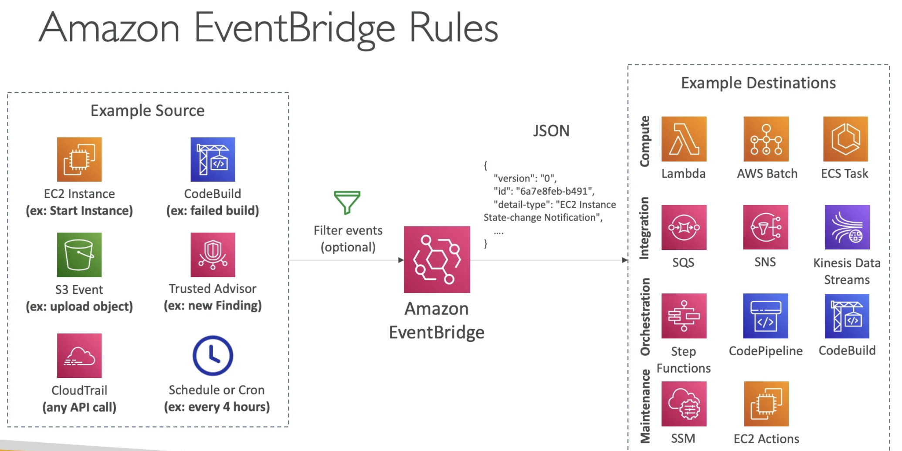
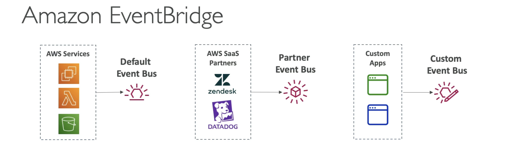
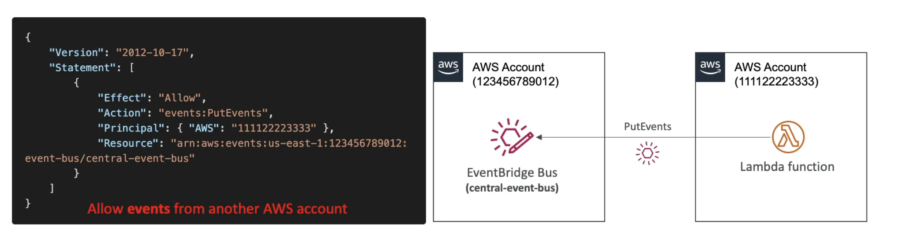

# EventBridge (Formerly CloudWatch Events)

  - Schedule: Cron jobs (scheduled scripts) ex every hour trigger a Lambda function.
  - Event Pattern: Event rules to react to a service doing something. ex react to an event of IAM root user sign in in the console and send a message to SNS topic and receive an email notification. So like if someone is using root accout you will get an email.
  - Trigger Lambda functions, send SQS/SNS messages
  - Is the only event-based service that integrates directly with **third-party SaaS partners**

    
    (Filter can be applied on the source data for ex event only for a specific bucket)

    
    (EventBridge is what we call default event bus, represents services from AWS that send their events into default event bus.)
    (Partner event bus has integration with partners most likely SaaS which will send events directly to the partner event bus.)
    (Partner Bus allows to react to events happening outside your own AWS account)
    (Custom event bus gets event from applications)

  - Event buses can be accessed by other AWS accounts using Resource-based Policies
  - You can **archive events** (all/filter) sent to an event bus (indefinitely or set period)
  - Ability to **replay archived events**. Ex if there is a bug in your Lambda function and you fixed it, then to test the fix you can replay the archived events, which is handy for debugging, troubleshooting and for fixing production.

- **EventBridge - Schema Registry** 
    - EventBridge receives a lots of events from different places in JSON format.
    - EventBridge can analyze the events in your bus and infer the **schema**.
    - Can enable automated schema discovery on the event bus.
    - The **Schema Registry** allows you to generate code for your application, that will know in advance how data is structured in the event bus.
    - Schema can be versioned. So you can iterate over time between schemas of your application.

- **EventBridge - Resource-based Policy**
    - Manage permissions for a specific event bus.
    - Example: allow/deny events from another AWS account or AWS region
    - **Use case**: aggregate all events from your AWS Organization in a single AWS account or AWS region. (central event bus)
    
    (resource based policy allowing other accounts to send events to the central event bus)

