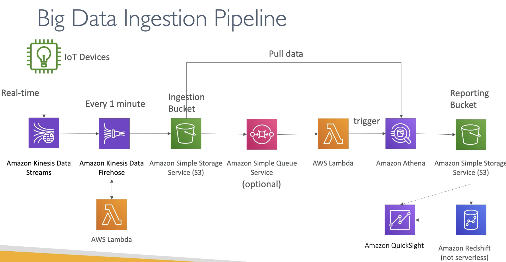

# Big Data Ingestion Pipeline

  - We want the ingestion pipeline to be fully serverless, fully managed by AWS
  - We want to collect data in real time
  - We want to transform the data
  - We want the query the transformed data using SQL
  - The reports created using the queries should be in S3
  - We want to load the data into a warehouse and create dashboards
  - Usual big data analogies - ingestion, collection, transformation, querying and analysis

    

    - For IoT devices there is a service in AWS called **IoT Core** which helps manage the IoT devices and allows to harvest data from these devices
    - Kinesis is great for real-time data collection.
    - Firehose helps with data delivery to S3 in real time (1 minute is the lowest frequency you can chose)
    - Cleanse or tranform the data in Firehose with Lambda function.
    - Once we have **Ingestion Bucket** then we can connect it optionally to a SQS queue and then to Lambda. S3 can trigger notifications to SQS.
    - Lambda can subscribe to SQS (or SNS), so we could have connector S3 to lambda
    - Athena (Serverless) will pull data from the bucket and do SQL query and the output can go into another S3 bucket
    - So this data which is not cleansed and analyzed can be viewed using QuickSight
    - Or can be loaded into data warehouse like RedShift for analysis. Note that **RedShift is not serverless**. Redshift can here also be an endpoint to QuickSight 