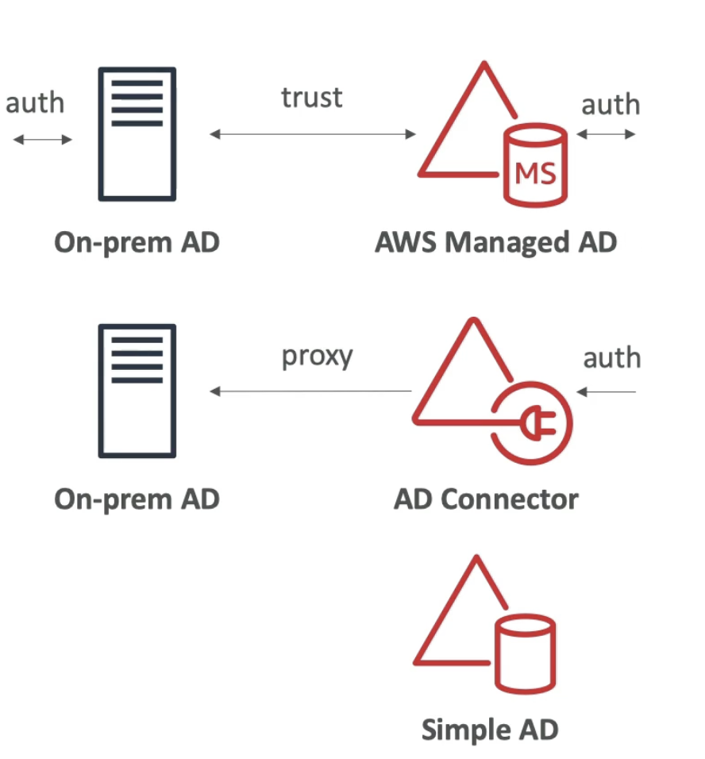
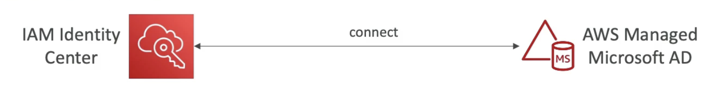
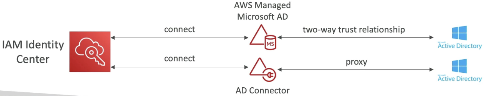

# AWS Directory Services

- **Microsoft Active Directory (AD)**
    - Found on any Windows server with AD Domain Services
    - Database of **objects**: User, Accounts, Computer, Printers, File Shares, Security Groups
    - All users within entire Microsoft ecosystem on premise, is managed by AD.
    - Centralized security mgmt, create account, assign permissions.
    - Objects are organized in **trees**.
    - A group of trees is a **forest**.

- **AWS Directory Services - Three Flavours**
    1. **AWS Managed MicroSoft AD**
        - Create your own AD in AWS
        - Manage users locally
        - Users are going to be shared between on-prem AD and AWS AD
        - Support MFA
        - Establish 2 way "**trust**" connections with your on-prem AD
    2. **AD Connector**
        - Directory Gateway (proxy) to redirect to on-premise AD, supports MFA (requests are going to be proxied to on-prem AD)
        - Users are managed on the on-prem AD
        - Some kind of latency is involved here
    3. **Simple AD**
        - AD-compatible managed directory on AWS
        - Doesnt use Microsoft AD 
        - Cannot be joined with on-prem AD (dont have on-prem AD)
        - Can be used with domain controllers on Windows EC2 instances and share logins and credentials.
    4. One more option is provided for Cognito User Pools (but this is not AD service)

          

- **Identity Center - AD Setup**
    - Connect to an AWS Managed Microsoft AD - Integration is out of the box
    
    - Connect to a self managed AD - create 2 way trust using AWS managed Microsoft AD ( Out of box Integration between Identity Centre and AWS Managed AD) OR Create an AD connector (connect to the AD connector which will proxy the request to the self managed AD)
    