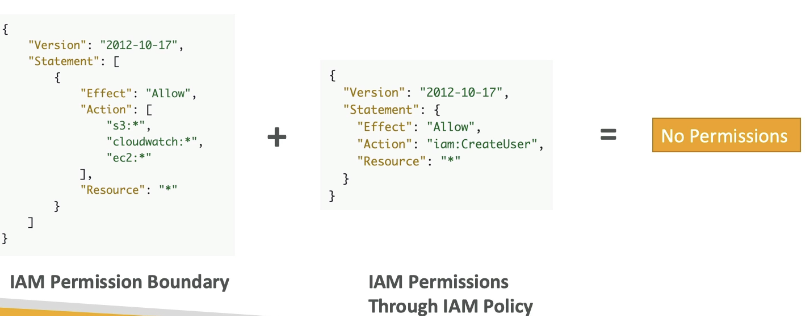
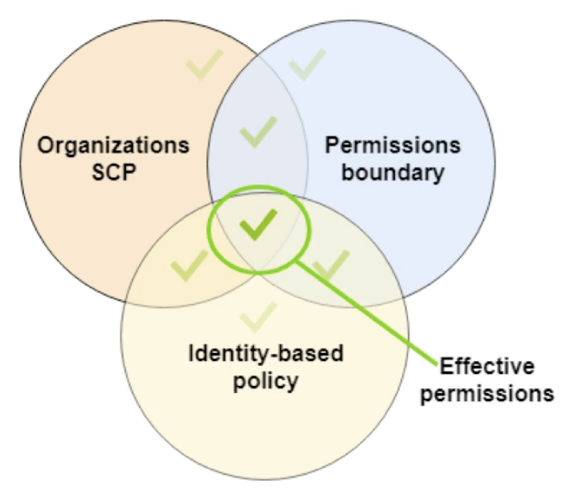
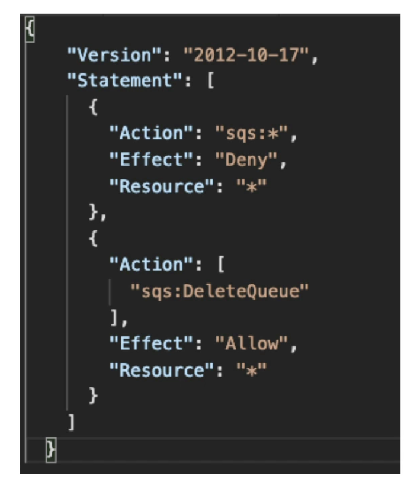

# IAM Permission Boundaries

  - IAM permission boundaries are supported for users and roles **(not groups)**
  - Advanced feature to use a managed policy to set the maximum permissions an IAM entity can get.

  

  (In this example, for the permission boundary for an IAM user, we set allow everything on S3, CloudWatch and EC2)  
  (On top of this, to the same user we attach allow:iamCreateUser, Resource *)  
  (In this case no permissions will be given to the user as the IAM policy is outside the boundary)  

  - If an example developer is given `AdministratorAccess`, then this user becomes super user and can do everything. But if we set a permission boundary of AmazonS3FullAccess, then the developer can only access S3 because thats the boundary. The boundary is going to be more restrictive.

    
  (Effective permissions is in the middle of all 3. Org SCP applies to all IAM entity in the account, bondaries are only for users and roles, identity based policy is attached to user or group)  
  - **Use cases**
    - Delegate responsibilities to non-administrators within their permission boundaries, for example create IAM users.
    - Allow developers to self-assign policies and manage their own permissions, while making sure they cant "escalate" their privileges (make themselves admin)
    - Useful to restrict one specific user (instead of a whole account using Organizations and SCP) 

  - IAM Policy Evaluation Logic
    

  - Lets try some questions with an example policy
    
  (We have sqs:* Deny on resource *, and sqs:DeleteQueue Allow on resource *)  
    - Q1: Can you perform sqs:CreateQueue?  
    Ans: No. There is a Deny * on SQS.
    - Q2: Can you perform sqs:DeleteQueue?  
    Ans: No. There is a Deny on top and Allow in the bottom. Even though they conflict, an explicity deny takes precedence.
    - Q3: Can you perform ec2:DescribeInstances?  
    Ans: No. There is no explicit allow.  

- Some of the AWS tasks that only a root account user can do are as follows: (Cannot be done with `AdministratorAccess`)
  - Change account name or root password or root email address
  - Change AWS support plan
  - Close AWS account
  - Enable AWS Multi-Factor Authentication (AWS MFA) on S3
  - Create Cloudfront key pair
  - Register for GovCloud