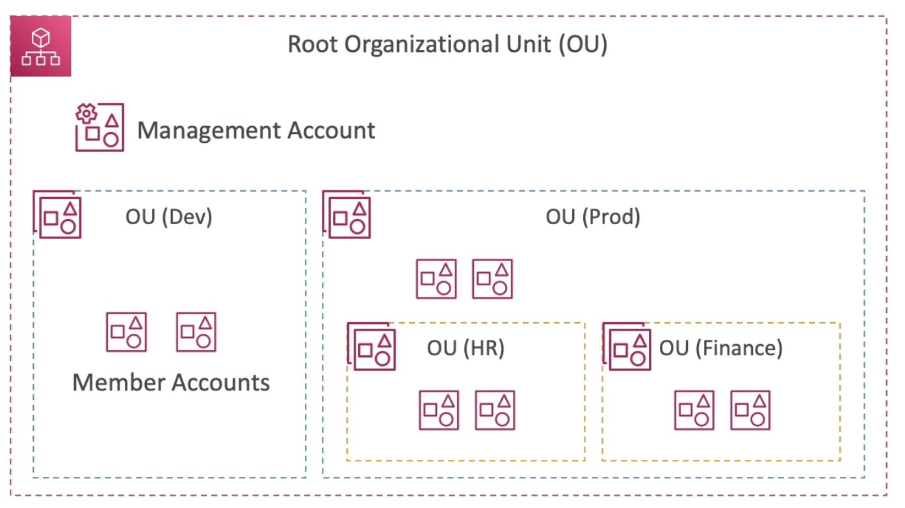
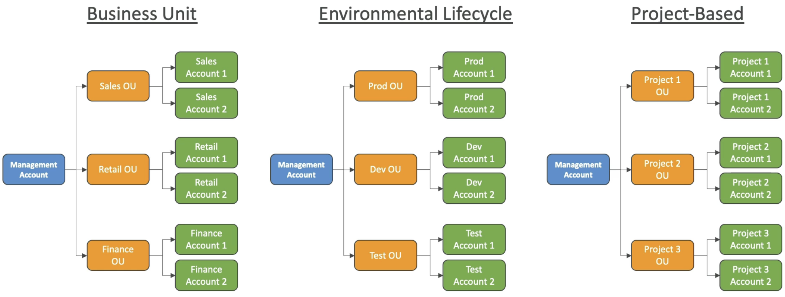
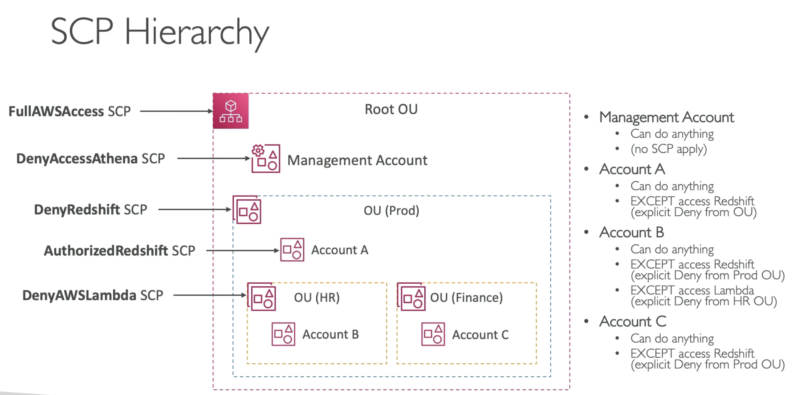
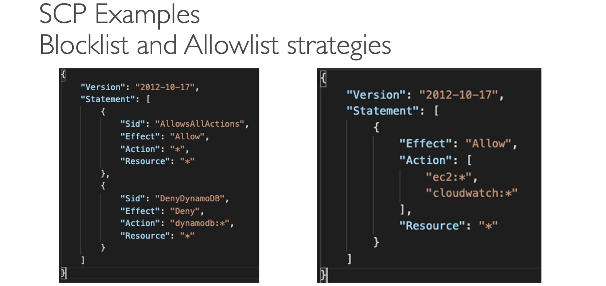

# AWS Organization

- Global Service
- Allows to manage multiple AWS accounts
- The main account is the **management account**
- Other accounts created from main accounts are **member accounts**
- Member accounts can only be part of one organization
- Consolidated Billing accross all accounts - single payment method
- Pricing benefits from aggregated usage (volume discount for EC2, S3...)
- **Shared reserved instances and saving plans accross accounts**
- API is available to automate AWS account creation.

  
  

- **Advantages**
  - Multi account vs One Account Multi VPC(better security because accounts are more seprated and better than one account having multiple VPC)
  - Use tagging standards for billing purposes
  - Enable CloudTrail to all accounts, send logs to central S3 account
  - Send CloudWatch Logs to central logging account
  - Establish Cross Account Roles for Admin purposes
- **Security: Service Control Policies (SPR)**
  - IAM policies applied to OU or Accounts to restrict Users and Roles
  - They **do not apply to the management account (full admin power)**
  - Must have an explicit allow (does not allow anything by default - like IAM)

- **Service control policy (SCP)**
  - Available only in an organization that has all features enabled. (not for consolidated billing feature)
  - SCPs affect only *member* accounts in the organization. They have no effect on users or roles in the *management* account.
  - SCPs *affect only IAM users and roles* that are managed by accounts that are part of the organization. SCPs don't affect resource-based policies directly.
  - SCPs affect all users and roles in attached accounts, *including the root user*.
  - SCPs *do not affect any service-linked role*. Service-linked roles enable other AWS services to integrate with AWS Organizations and can't be restricted by SCPs.

  
  (Very common to FullAWSAcess to root OU, so all account within it will have full permissions)  
  (Even if SCP applied to Mgmt account, they can do anything as no SCPs apply to them)  
  (Account A is in Root OU so it can do everything, but its also in Prod OU which has DenyRedShift. Even though there is an AuthorizedRedShift on account A, it still doesnt have access to RedShift because *if there is one deny then by default its denied*)  
  (Account B is within HR OU, which is in Prod OU, so it inherits everything)  
  (Account C is within Fianance OU, which is in Prod OU, so it can do anything except access RedShift)  

  
  (For a **Block List** we first attach an Allow star, and then we attach a deny like above deny access to DynamoDB)  
  (For **Allow List** we only allow, like in above example only allow EC2 and CloudWatch. Needs explicit allow to use resources)
  
- **Migrate Accounts**

  - To migrate accounts from one organization to another, you must have root or IAM access to both the member and master accounts. Here are the steps to follow: 
    - 1 Remove the member account from the old organization 
    - 2 Send an invite to the member account from the new Organization 
    - 3 Accept the invite to the new organization from the member account