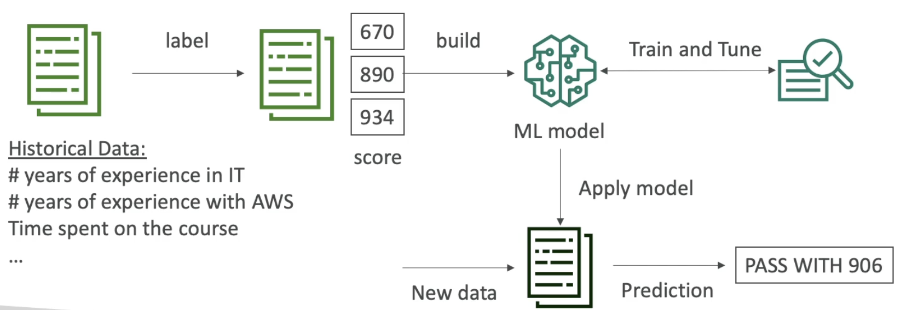
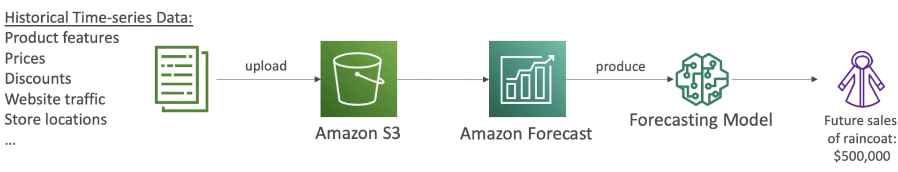
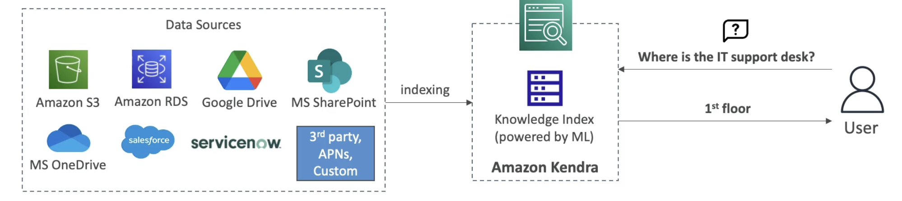
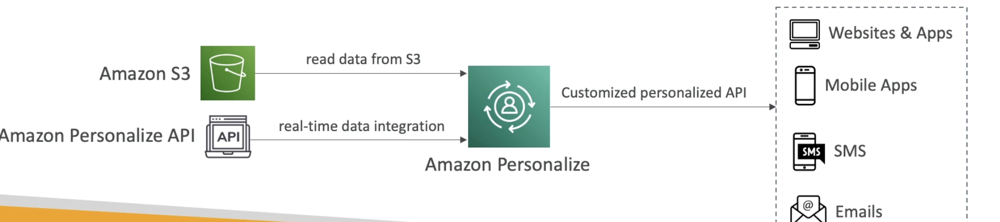

# Machine Learning

- **Rekognition**
    - Find **objects, people, text, scenes** in **images and videos** using ML
    - **Facial analysis** and **Facial search** to do user verification, people counting in an image
    - Create a database of "familiar faces" or compare against celebrities
    - **Use Cases**: 
        -   Lableling images/videos
        -   Content Moderation (for ex safe/appropriate content)
        -   Text detection
        -   Face Detecion and Analysis (gender, age range, emotions..)
        -   Face Search and Verification
        -   Celebrity Recognition
        -   Pathing (ex, for sports game analysis)

    - **Content Moderation**
        - Detect content that is inappropriate, unwanted, or offensive (images and video)
        - Used in social media, broadcast media, advertising, ecommerse to create a safer user experience
        - **Set a Minium Confidence Threshold for items that will be flagged**
            - lower percentage means more matches will be found.
            - This value determines how confident Rekognition is that the flagged image is inappropriate or offensive.
        - Flag sensitive content for **manual review in Amazon Augmented AI (A2I)** (Optional)
        - Helps comply with regulations

- **Transcribe**
    - Automatically **convert speech to text**
    - Uses a **deep learning process** called **automatic speech recognition (ASR)** to convert speech to text quickly and accurately.
    - Automatically **remove Personally Identifiable Information (PII) using Redaction.**
    - Supports automatic language identification for **multi-lingual audio.**
    - **Use cases**:
        - Transcribe customer service calls
        - Automate closed captioning and subtitling
        - generate metadata for media assets to create a fully searchable archive.

- **Polly**
    - Turn text into lifelike speech using deep learning. Opposite of Transcribe.
    - Allowing you to create applications that talk.
    - Customize the pronunciation of words with **Pronunciation lexicons**
        - Stylized words: S@j1n@ => "Sajina"
        - Axronyms: AWS => "Amazon Web Services"
        - Upload the lexicons and use them in the **SynthesizeSpeech** Operation.
    - Generate speech from plain text or from documents marked with **Speech Synthesis Markup Language (SSML)** - enables more customization.
        - emphasizing specific words or phrases
        - using phonetic pronunciation
        - including breathing sounds, whispering
        - using the Newscaster speaking style
        - ex. <break time="1s>

- **Translate**
    - Natural and accurate **language translation.**
    - Amazon Translate allows you to **localize ontent** - such as websites and applications - for **international users**, and to easily translate large volumes of text efficiently.

- **Lex + Connect**
    - **Amazon Lex**: Same technology that powers Alexa
        - Automatic Speech Recognition (ASR) to convert speech to text.
        - Natural Language Understanding (NLU) to recognize the intent of text, callers
        - Helps build chatbots, call centre bots
    - **Amazon Connect**:
        - Receive calls, create contact flows, cloud based **virtual contact centre**
        - Can integrate with other CRM systems or AWS
        - No upfront payments, 80% cheaper than traditional contact centre solutions.

- **Comprehend**
    - For **Natural Language Processing - NLP**
    - Fully managed and serverless service
    - Uses machine learning to find insights and relationships in text
    - Uses machine learning to find insigts and relationship in text.
        - Understand language of the text.
        - Extracts key phrases, places, people, brands, or events
        - Understands how positive or negative the text is (sentiment analysis)
        - Analyzes text using tokenization and parts of speech
        - Automatically organizes a collection of text files by topic
    - **Use cases**: 
        - analyze customer interactions (emails) to find what leads to a positive or negative experience (business insights)
        - Create and group articles by topics that Comprehend will uncover.
    - Amazon **Comprehend Medical** detects and returns useful information in **unstructured climical text**: Physicians notes, discharge summaries, test results, case notes.
        - Entities, RxNorm concepts, etc are extracted and analyzed and formed into structured text.
        - Uses **NLP to detect Protected Health Information (PHI)** - DetectPHI API.
        - Store documents in S3, analyze real-time data with Kinesis Data Forehose, or use Amazon Transcribe to transcribe patient narratives into text that can be analyzed by Comprehend Medical.

- **Sagemaker**
    - Fully managed service for developers/data scientist to build ML models.
    - Typically difficult to do all the processes in one place + provision servers.
    - Machine Learning Process: Below is a simplified example, for predicting your exam score.

    
    (Gather data then Label the data, means you need to say which columns corresponds to what, give some kind of score, here the score that the person gets in the exam.) (for ex score 670 for someone who didnt do the course completely, or high grades of 990 or 934, and the guess is based on the data collected.) (the labelling is a hard process) (Then build a machine learning model to predict the scores from the data.) (After this train and tune the model to refine the model overtime to fit the data and outputs. This process is also quite difficult.)

- **Forecast**
    - Fully managed service that uses ML to deliver highly accurate forecasts.
    - Example: predict the future sales of raincoat
    - 50% more accurate than looking at the data itself
    - Reduce forecasting time from months to hours
    - **Use cases**: Product demand planning, Financial Planning, Resource Planning ...

    
    (Take historical time series data and enrich it with more data from other places like product features, prices etc to enhance the model)

- **Kendra**
    - Fully managed **document search service** powered by Machine Learning
    - Extract answers from within a document (text, pdf, HTML, PowerPoint, MS Word, FAQs ...)
    - Natural language search capabilities.
    - Learn from user interactions/feedback to promote preferred results (**Incremental Learning**)
    - Ability to manually fine-tune search results (importance of data, freshness, custom, ...)
    

- **Personalize**
    - Fully managed ML-service to build apps with real time personalized recommendation.
    - Ex: personalized product recommendations/re-ranking, customized direct marketing (user bought gardening tools, provide recommendations on next one to buy)
    - Same technology used by Amazon.com
    - Integrates into existing websites, applications, SMS, email marketing systems ...
    - Implement in days, not months (you dont need to build, train and deploy ML solutions.)
    - **Use cases**: retail stores, media and entertainment...
    
    (data read from S3 could be user interactions for ex. like how you've been searching, buying user interests etc..)

- **Textract**
    - Automatically extrracts text, handwriting, and data from any scanned documents using AI and ML and give a data file.
    - You can then extract the required information from this data file.
    - Extract data from forms and tables
    - Read and process any type of document (PDFs, images, ..)
    - **Use cases**: Financial services (invoices, financial reports), Healthcare (medical records, insurance claims), Public sector (tax forms, ID documents, passports)

- **Summary**
    - Rekognition: face detection, labeling, celebrity recognition
    - Transcribe: audio to text (ex subtitles)
    - Polly: text to audio
    - Translate: translations
    - Lex: build conversational bots - chatbots
    - Connect: cloud contact center
    - Comprehend: natural language processing
    - Sagemaker: machine learning for developers and data scientist
    - Forecast: build highly accurate forecasts
    - Kendra: ML powered search engine
    - Personalize: real-time personalized recommendations.

**Amazon Lex** is a service for building conversational interfaces into any application using voice and text. Lex provides the advanced deep learning functionalities of automatic speech recognition (ASR) for converting speech to text, and natural language understanding (NLU) to recognize the intent of the text, to enable you to build applications with highly engaging user experiences and lifelike conversational interactions.

**Amazon Comprehend** is a natural language processing (NLP) service that uses machine learning to find meaning and insights in text.ex A research team would like to group articles by topics using Natural Language Processing (NLP). 

**Amazon Transcribe** can automatically **remove Personally Identifiable Information (PII) using Redaction.** also **Amazon Comprehend Medical** uses **NLP to detect Protected Health Information (PHI)** - DetectPHI API.