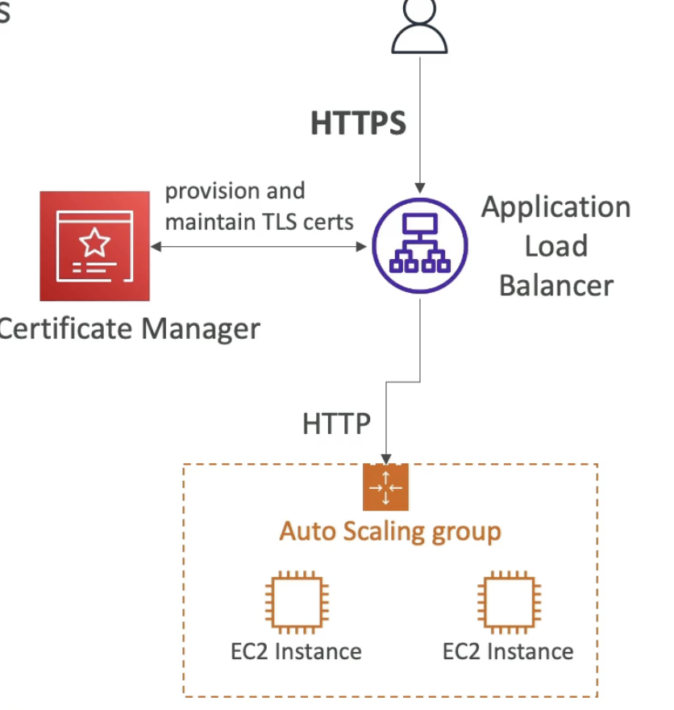
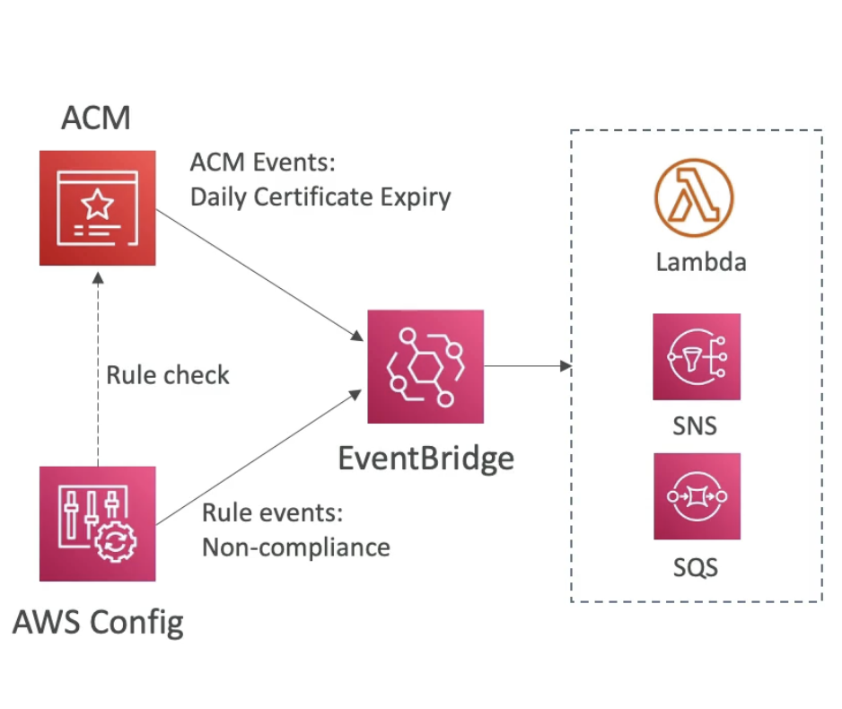
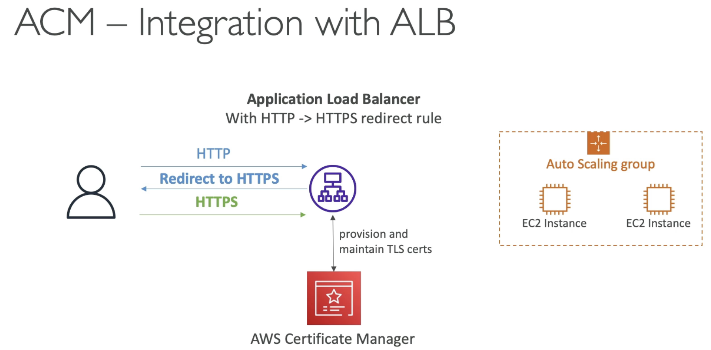
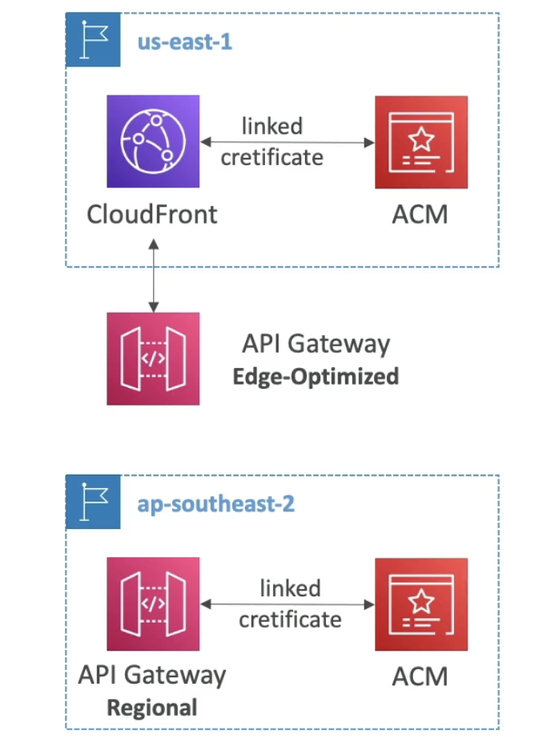

# AWS Certification Manager (ACM)

  - Easily provision, manage, and deploy **TLS Certificates**
  - Provide in-flight encryption for websites (HTTPS)
  - Supports both public and private TLS certificates
  - Free of charge for public TLS certificates
  - Automatic TLS certificate renewal
  - Integrations with (load TLS certificates on)
    - Elastic Load Balancer (Classic LB, Application LB, Network LB)
    - CloudFront Distributions
    - APIs on API Gateway
  - **Cannot use ACM with EC2 (public certificates cant be extracted)**
  

- **ACM - Requesting Public Certificates**
    - 1 - List domain names to be included in the certificates
        - FQDN: ex corp.example.com
        - Wildcard Domain: *example.com
    - 2 - Select Validation Method: DNS Validation or Email validation
        - DNS validation is preferred for automation purposes
        - Email validation will send emails to contact addresses in the WHOIS database
        - DNS validation will leverage a CNAME record to DNS config to verify you own the domain (Route53 is integrated with ACM and this will be done for you)
    - 3 - It will take a few hours to get verified and the certificate will be issued.
    - 4 - The public certificate will be enrolled for automatic renewal
        - ACM automatically renews ACM generated certicates 60 days before expiry.

- **ACM - Importing Public Certicates**
    - Option to generate the certificate outside of ACM and then import it.
    - **No automatic renewal**, must import a new certificate before expiry.
    - **ACM sends daily expiration events** starting 45 days prior to expiration
        - The number of days can be configured
        - Events are appearing in EventBridge
    - **AWS Config** has a managed rule named *acm-certificate-expiration-check* to check for expiring certificates (configurable number of days)
    

- **ACM - Integration with ALB**
      
    (on your ALB you can set a redirect rule from HTTP to HTTPS)  
    (If user access ALB with HTTP, then ALB will return a redirect and ask user to come back with HTTPS)  
    
- **ACM - API Gateway Integration - Endpoint Types**
    - **Edge-Optimized (default)**: For global clients
        - Requests are routed through the CloudFront Edge locations (improves latency)
        - API Gateway still lives in the same region.
    - **Regional**:
        - For clients within the same region
        - Could manually combine with CloudFront (more control over caching strategies and distribution)
    - **Private**:
        - Can only be accessed from your VPC using an interface VPC endpoint (ENI)
        - Use a resource policy to define access.

    
    - First, create a resource in API gateway called a **Custom Domain Name** and then configure it.
    - **Edge-Optimized (default)**: 
        - TLS certificates are going to be attached to your CloudFront distribution. And therefore the TLS Certificate must be created in the same region as CloudFront. (ACM certificates **must live in us-east-1** in above example)
        - Then setup CNAME or better A-Alias record in Route 53.
    - **Regional**:
        - TLS certificate must be imported on API gateway in the same region as the API stage.
        - Then setup CNAME or better A-Alias record in Route 53 to point to your DNS.

- **Renewal for 3rd party certificates**
    - AWS Certificate Manager (ACM) does not attempt to renew third-party certificates that are imported.
    - An administrator needs to reconfigure missing DNS records for certificates that use DNS validation if the record was removed for any reason after the certificate was issued.
    - Amazon CloudWatch metrics and Amazon EventBridge events are enabled for all certificates that are managed by ACM.
    - Users can monitor `days to expiry` as a metric for ACM certificates through **Amazon CloudWatch**.
    - Amazon EventBridge expiry event is published for any certificate that is at least 45 days away from expiry by default
    - Users can build alarms to monitor certificates based on days to expiry and also trigger custom actions such as calling a Lambda function or paging an administrator.