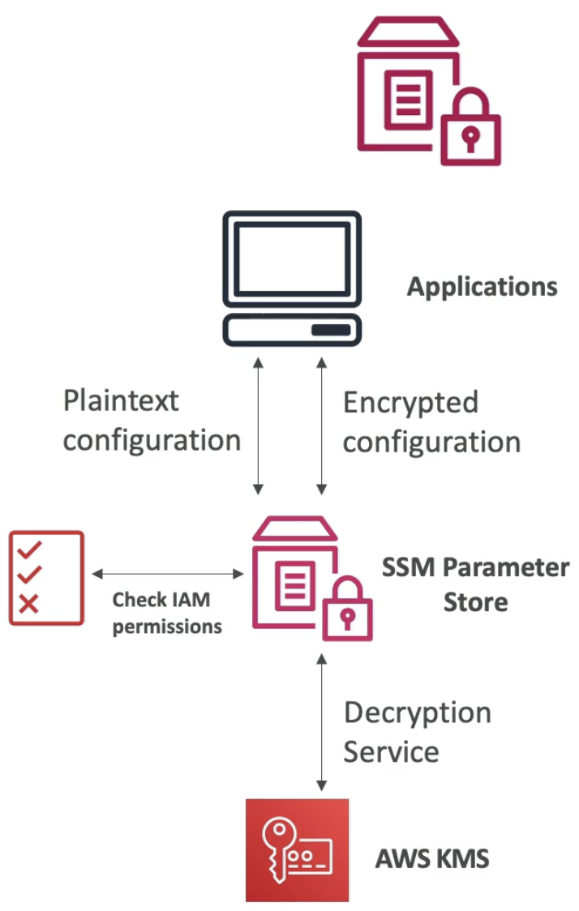
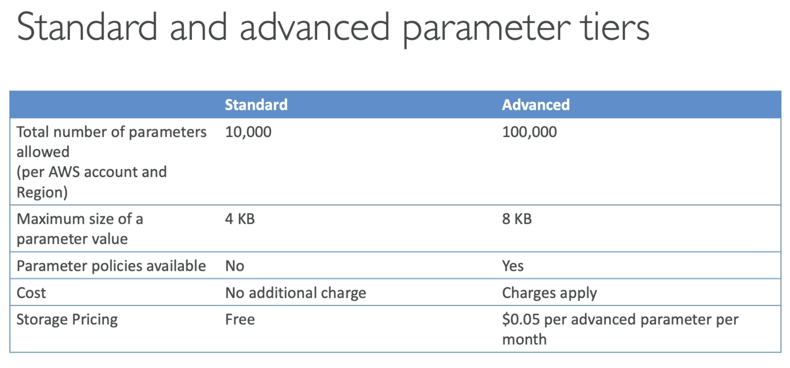
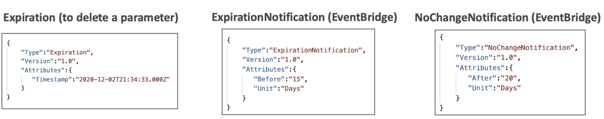

# SSM Paramaeter Store

  - Simple Systems Manager
  - Secure storage and management for configuration and secrets 
  - Centralize all the parameters within your AWS account
  - Optional Seamless Encryption using KMS
  - Serverless, scalable, durable, easy SDK
  - Version tracking of configuration /secrets
  - Security through IAM
  - Notifications with Amazon EventBridge
  - Integration with CloudFormation (can leverage the parameters from paramter store as input parameters for your stack)  
       
  (Above example, we can store plain text configuration, then the IAM permissions of you apps are going to be checked. For ex your EC2 role)    
  (You can have encrypted configuration, in that case SSM store will use KMS for encryption/decryption)    
  (Application should also have access to the KMS key)   

How it Works: Create a new parameter, Specify the parameter type and values, Reference this paramter from within your code and commands.  
Paramter type can be String, StringList, SecureString.   

- **SSM Parameter store Hierarchy**
    - /my-department/  
    &emsp;&emsp;my-app/  
    &emsp;&emsp;&emsp;&emsp;dev/  
    &emsp;&emsp;&emsp;&emsp;&emsp;&emsp;db-url  
    &emsp;&emsp;&emsp;&emsp;&emsp;&emsp;db-password  
    &emsp;&emsp;&emsp;&emsp;prod/  
    &emsp;&emsp;&emsp;&emsp;&emsp;&emsp;db-url  
    &emsp;&emsp;&emsp;&emsp;&emsp;&emsp;db-password  
    &emsp;&emsp;other-app/  
    /other-department  
    - Helps you to organize your paramters the way you want in a structured fashion
    - Will simplify your IAM policies to allow aplications to have access to an entire dept, or to an entire app, or just to an app environment specific path.
    - Have the opportunity to access Secrets of Secrets manager through the paramater store by using the reference:
        /aws/reference/secretsmanager/secret_ID_in_Secrets_Manager
    - There are some public parameters that are issed by AWS that you can use. For ex latest AMI for the amazon index 2 for your region:  
        /aws/service/ami-amazon-linux-latest/amzn2-ami-hvm-x86_64-gp2 (public)

      
    (Big difference is around the size 4KB in std and 8KB in advanced)  
    (Parameter policy is available only in advanced)  
    (Storage pricing is free in std)  

- **Parameter Policies (for advanced parameters)**
    - Allow to assign a TTL to a parameter (expiration date) to force updating or deleting sensitive data such as passwords
    - Can assign multiple policies at a time
    
    (First is an expiration policy which says on this timestamp delete this parameter)  
    (Through EventBridge integration, EventBridge is going to get a notification 15 days before the parameter expires, so we can update it on time and make sure the parameter is not deleted because of the TTL )  
    (Last is an example of another EventBridge notification, which makes sure the paramaters change once in a while, it checks if the parameter has not been updated for 20 days)  

# AWS Secrets Manager

  - Newer service, meant for storing secrets
  - Capability to force **rotation of secrets** every **X** days (different from SSM)
  - Automate generation of secrets on rotation (define a Lambda function that will generate the new secrets)
  - Integration with **Amazon RDS** (MySQL, PostgreSQL, Aurora) (username and password for the database is stored directly in Secrets Manager and can be rotated etc)  
  - Secrets are encrypted using KMS
  - **Mostly meant for RDS integration**

- **AWS Secrets Manager - Multi-region Secrets**
    - Replicate Secrets across multiple AWS Regions
    - Secrets Manager keeps read replicas in sync with the primary Secret
    - Ability to promote a read replica Secret to a standalone Secret
    - Use cases: multi-region apps, disaster recovery strategies, multi-region DB.. (If you have RDS database that is also being replicated from one region to the next, then you can use the same Secret to access, the same RDS database , the correspomding one in corresponding region)
    - Has tight integrations with databases.
 
