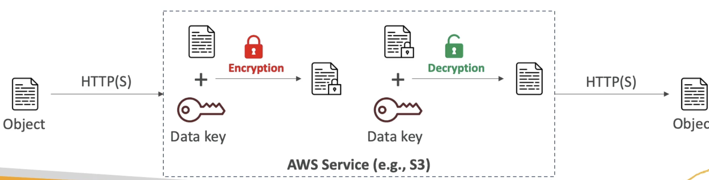
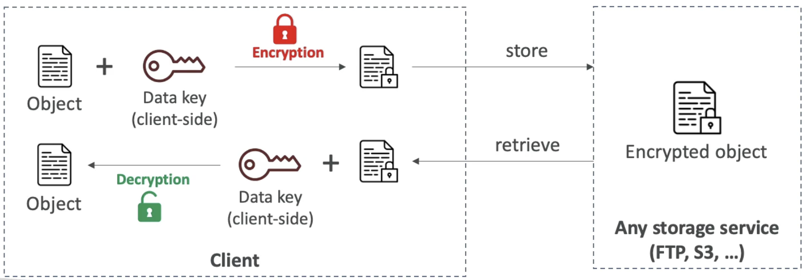
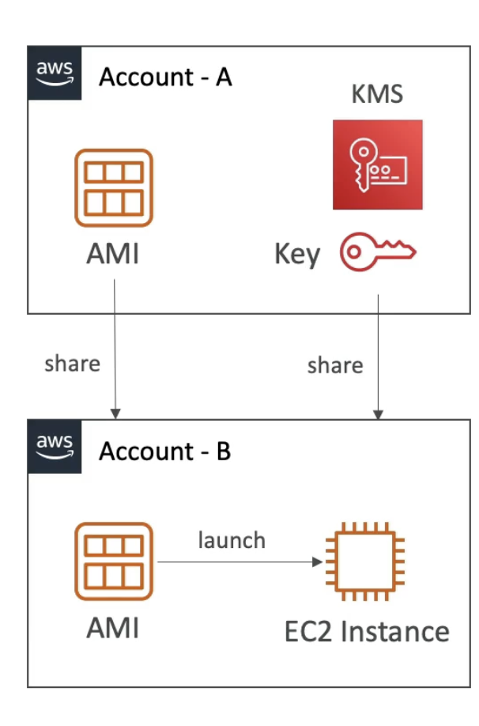
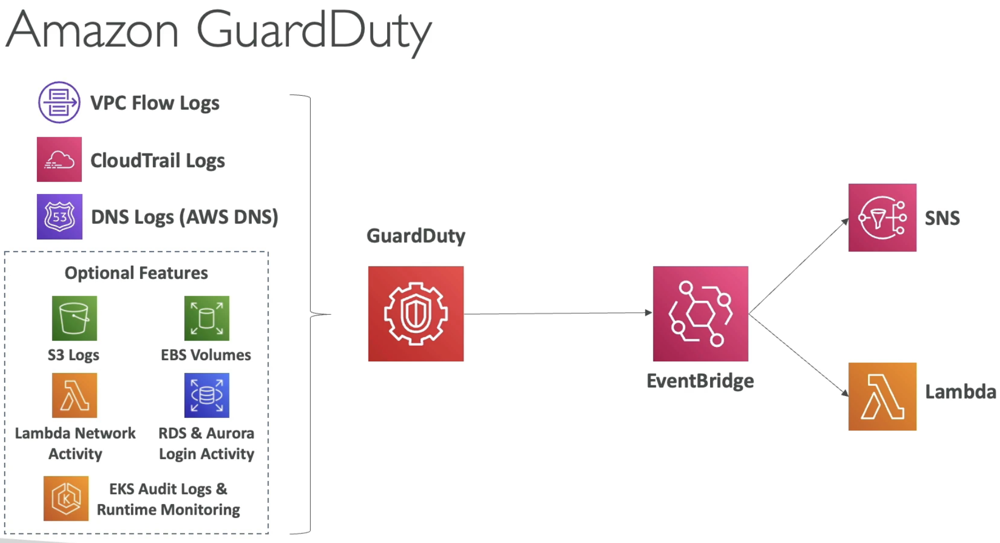
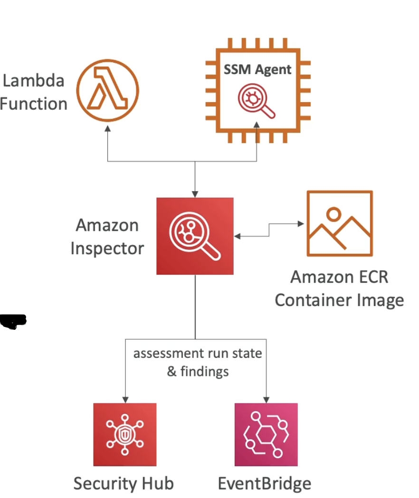
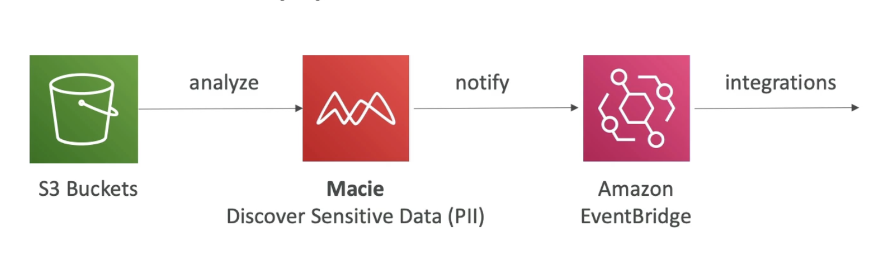

# Encryption

- **Encryption in flight (TLS/SSL)**
    - Data is encrypted before sending and decrypted after receiving
    - TLS Certificates help with encryption (HTTPS)
    - Encryption in-flight ensure no Man in the Middle Attack can happen

- **Server side encryption at rest**
    - Data is encrypted after being received by the server
    - Data is decrypted before being sent
    - It is stored in an encrypted form thanks to a key (usually a data key)
    - The encryption / decryption keys must be managed somewhere, and the server must have access to it.
    

- **Client side encryption**
    - Data is encrypted by the client and never decrypted by the server
    - Data will be decrypted by a receiving client
    - The server should not be able to decrypt the data
    - Could leverage envelope encryption.
    

# S3 Replication Encryption Consideration

  - If you enabled S3 replication from one bucket to another then, **Unencrypted objects and objects encrypted with SSE-S3 are replicated by default**.
  - Objects encrypted with **SSE-C** (customer provided key) can be replicated
  - For objects **encrypted with SSE-KMS**, by default are not replicated, you need to enable the option.
    - Specify which KMS key to encrypt the objects within the target bucket.
    - Adapt the KMS key policy for the target key.
    - Create an IAM role that allows the S3 replication service to first decrypt the data in the source bucket (kms:Decrypt) and then re-encrypt the data in the target bucket (kms:Encrypt) with target KMS Key.
    - The above 3 steps will enable the replication.
    - You might get KMS throttling errors, due to a lot of encryption/decryption, in which case ask for a service quota increase.
  - You **can use multi-region AWS KMS Keys**, but they are currently treated as **independent keys** by S3 (the object will still be decrypted and encrypted using the same key)

# AMI Sharing Process Encrypted using KMS

     
   (How to launch an EC2 instance in account B from the AMI in Account A)  

  - AMI in source Account is encrypted with KMS Key from source Account.
  - Must modify the image attribute(AMI property) to add **Launch Permission** which corresponds to the specified target AWS account. This permission allows account B to launch this AMI. This is how you share AMI, by modifying launch permissions and adding specified target to its account ID.
  - Must share the KMS keys used to encrypt the snapshot the AMI references, with the target account / IAM role. This is usually done with the **key policy**. 
  - Create an IAM role /user in the target account with enough permissions to use both KMS keys and AMI, like DescribeKey, ReEncrypted, CreateGrant, Decrypt API calls.
  - When launching an EC2 instance from the AMI, optionally, the target account can specify a new KMS key in its own account to re-encrypt the volumes. 

# GuardDuty

  - Intelligent Threat Discovery to protect your AWS account.
  - Uses Machine learning algorithm, anomaly detection, 3rd party data
  - One click to enable (30 day free trial), no need to install software
  - Input data includes:
    - **CloudTrail Event Logs** - unusual API calls, unauthorized deployments
      - **CloudTrail Management events** - create VPC subnet, create trail ..
      - **CloudTrail S3 Data events** - get object, list object, delete object ..
    - **VPC Flow Logs** - unusual internal traffic, unusual IP address ..
    - **DNS Logs** - compromised EC2 instances sending encoded data within DNS queries..
    - **Optional Feaures** - EKS Audit Logs & runtime monitoring, RDS & Aurora Login activity, EBS, Lambda network activity, S3 logs..
  - Can set up **EventBridge Rules** to be notified in case of findings
  - EventBridge rules can target AWS Lambda or SNS
  - **Can protect against CryptoCurrency attacks (has a dedicated "finding" for it)**
  

# Inspector

  - service that allows you to run Automated Security Accessments on following:
    - For EC2 instances
      - leveraging the **SSM (Systems Manager) agent**.
      - Inspector will analyze against **unintended network accessibility**
      - Analyze the **running OS** against known **vulnerabilities**
      - Assessment happens continuously.
    - For Container Images push to Amazon ECR
      - Assessment on Container images as they are pushed, against known vulnerabilities.
    - For Lambda functions
      - Identifies software vulnerabilities in fucntion code and package dependencies.
      - Assessment of functions as they are deployed.

  - Reporting & Integration with AWS Security Hub
  - Send findings to Amazon Event Bridge. (centralized view of vulnerabilities, also can run some automations)
    

  - **What does Inspector Evaluate?**
    - **Remember its only for EC2 instances, Container images and Lambda functions**
    - Continuous scanning of the Infrastructure, onl;y when needed
    - Going to look into a database of CVEs or for package vulnerabilities (EC2, ECR & Lambda)
    - Going to look at network reachability on EC2
    - If for ex the database of CVE is updated then Inspector will automatically run again and test the infra again.
    - A **risk score** is associated with all vulnerabilities for prioritization. 

# Macie

  - Macie is a fully managed data security and data privacy service that uses **machine learning and pattern matching to discover and protect you sensitive data in AWS.**
  - Macie helps identify and alert you to **sensitive data, such as personally identifiable information (PII)** in S3.
  

# Notes

You have a Lambda function used to process some data in the database. You would like to give your Lambda function access to the database password. Which of the following options is the most secure?
- Have it as an encrypted environment variable and decrypt it at runtime.  
  
SSM Parameters Store can be used to store secrets and has built-in version tracking capability. Each time you edit the value of a parameter, SSM Parameter Store creates a new version of the parameter and retains the previous versions. You can view the details, including the values, of all versions in a parameter's history.  
  
What is the most suitable AWS service for storing RDS DB passwords which also provides you automatic rotation?  
- AWS Secrets Manager (Meant mostly for RDS Integration)  
  
AWS Firewall Manager is a security management service that allows you to centrally configure and manage firewall rules across your accounts and applications in AWS Organizations. It is integrated with AWS Organizations so you can enable AWS WAF rules, AWS Shield Advanced protection, security groups, AWS Network Firewall rules, and Amazon Route 53 Resolver DNS Firewall rules.  
  
As the Edge-Optimized API Gateway is using a **custom AWS managed CloudFront distribution** behind the scene to route requests across the globe through CloudFront Edge locations, the ACM certificate must be created in **us-east-1**.