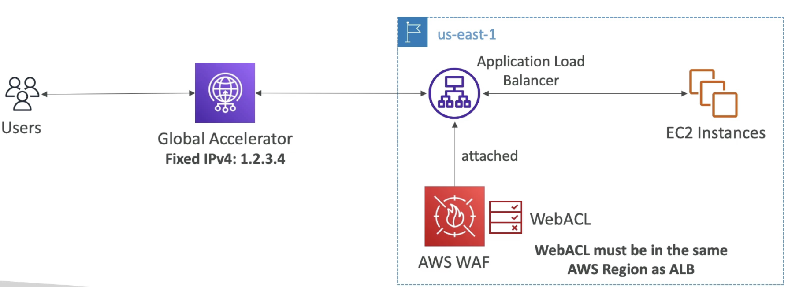
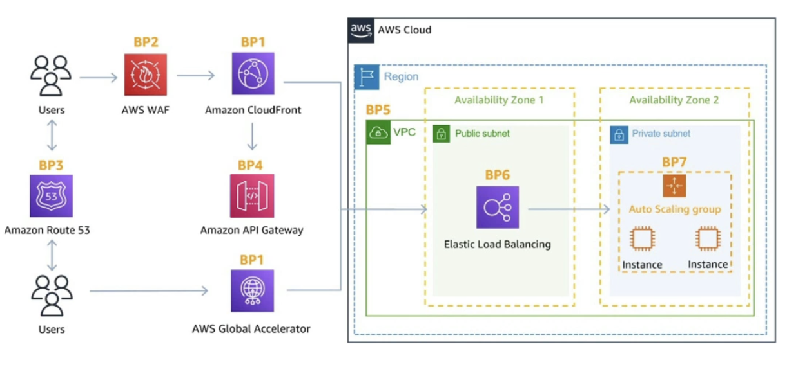

# WAF

  - Web Application Firewall
  - Protects your web applications from common web exploits (Layer 7)
  - **Layer 7 is HTTP** (vs Layer 4 is TCP/UDP)
  - Deploy on
    - Application Load Balancer
    - API Gateway
    - CloudFront
    - AppSync GraphQL API
    - Cognito User Pool
  - Note: you cannot deploy WAF on any other layer for example its not applicable for Network Load Balancer  
  
  - Once you deploy the firewall you can define **Web ACL** Rules:
    - **IP Set: upto 10,000 IP addresses** - use multiple Rules for more IPs
    - HTTP headers, HTTP body, or URI strings Protects from common attack - **SQL injection** and **Cross-Site Scripting (XSS)**
    - Size constraints (ex make sure req are only upto 2 MB), **geo-match (block countries)**
    - **Rate-based rules** (to count occurences of req per IP) - for **DDoS protection** (ex, prevent specific IP from sending more than 10 req per sec)  
      
  - Web ACL are **regional** except for Cloudfront (here they are defined globally)
  - A rule group is a **reusable set of rules that you can add to a web ACL**

- **WAF - Fixed IP while using WAF with Load Balancer**
    - WAF does not support the Network Load Balancer (because it operated on Layer 4 and WAF is for Layer 7)
    - We use **Global Accelerator** for fixed IP and WAF on the ALB. (ALB does not have IPs)
    

# AWS Shield: protect from DDoS attack

  - **DDoS**: Distributed Denial of Service - many requests at the same time
  - **AWS Shield Standard**:
    - Free service that is activated for every AWS customer
    - Provides protection from attacks such as SYN/UDP Floods, Reflection attacks and other layer 3/layer 4 attacks.
  - **AWS Shield Advanced**:
    - Optional DDoS mitigation service ($3000 per month per organization)
    - Protect against more sophisticated attack on Amazon EC2, Elastic Load Balancing (ELB), Amazon CloudFront, AWS Global Accelerator, and Route 53
    - 24X7 access to AWS DDoS response team (DRP)
    - Protect against higher fee during usage spikes due to DDoS
    - Shield Advanced automatic application layer DDoS mitigation automatically creates, evaluates and deploys AWS WAF rules to mitigate layer 7 attacks.
    - Offer protection to resources outside of AWS
    
- If your organization has multiple AWS accounts, then you can subscribe multiple AWS Accounts to AWS Shield Advanced by individually enabling it on each account using the AWS Management Console or API.
- You will pay the monthly fee once as long as the AWS accounts are all under a single consolidated billing, and you own all the AWS accounts and resources in those accounts.

# AWS Firewall Manager

  - Service to manage all firewall rules in all accounts of an AWS organization.
  - Can set a Security Policy: common set of security rules like
    - WAF rules (Application Load Balancer, API Gateway, CloudFront)
    - AWS Shield Advanced (ALB, CLB, NLB, Elastic IP, CloudFront)
    - Security Groups for EC2, Application Load Balancer and ENI resources in VPC
    - AWS Network Firewall (VPC Level)
    - Amazon Route 53 Resolver DNS Firewall
  - Policies are created at **region level.** and then applied to all account in your Org. 
  - **Rules are applied to new resources as they are created** (good for complaince) across all and future account in your Org. Ex, you create a WAF rule for your ALB and then a new ALB is created then automatically Firewall Manager is going to apply the same rule to the new ALB too.

# WAF Vs Firewall Manager Vs Shield

  - **WAF, Shield and Firewall Manager are used together for comprehensive protection**
  - Define your Web ACL rules in WAF
  - For granular protection of your resources, WAF alone is correct choice
  - If you want to use AWS WAF across accounts, accelerate WAF configuration, automate the protection of new resources, use Frirewall Manager with AWS WAF. (Firewall Manager will apply the rules to all your accounts and all your resources automatically)
  - Shield Advanced (for DDoS protection) adds additional features on top of AWS WAF, such as dedicated support from the Shield Response Team (SRT) and advanced reporting. It can also automatically create WAF rules for you.
  - If you are prone to frequent DDoS attacks, consider purchasing Shield Advanced.
  - FireWall Manger can help deploy Shield Advanced across all your accounts. 

# DDoS Best Practices

- **Edge Location Mitigation (BP1, BP3)**

  
(BP here represents Best Practice)  
(We have ASG with EC2 instance, which is fronted by an ELB, then this LB can be exposed by global accelerator (as fixed IP), or can be fronted by CloudFront, which can be linked to WAF. Can have Route 53 for DNS routing)  

  - BP1 - CloudFront (by using this we are at the edge)
    - Web Application delivery at the edge
    - Protect from DDoS Common attacks (SYN floods, UDP reflection..) using Shield.
  - BP1 - Gloabl Accelerator - able to access the application around the world, again, at the edge.
    - Access you application from the edge
    - Integration with Shield for DDoS protection.
    - If your backend is not compatible with CloudFront then use Global Accelerator in front of it.
  - BP3 - Route 53 
    - DNS is global and at the edge
    - DDoS protection mechanism 

  - If we are at the edge then we can have better DDoS protection.

- **Infrastructure Layer Defence (BP1, BP3, BP6)**
  - Using CloudFront, Global Accelerator, Route 53, Elastic Load Balancing we can protect **EC2 instances against high traffic**
  - Amazon EC2 with Auto Scaling (BP7)- Helps scale in case of sudden traffic surges including a flash crowd or DDoS attack
  - Elastic Load Balancing (BP6) - ELB scales with traffic increases and will distribute the traffic to many EC2 instances.

- **Application Layer Defence (BP1, BP2)**
  - Detect and filter malicious web requests at BP1 and BP2.
    - CloudFront cache static content and serve it from edge locations, protecting your backend
    - You can use WAF on top of CloudFront or your ALB to filter and block requests based on request signatures.(for ex block specific IP or specific request types, ...)
    - You can use WAF rate based rules which can automatically block the IPs of bad actors.
    - Use managed rules on WAF to block attacks based on IP reputation or block anonymous IPs
    - CloudFront can block specific geographies.
    - CloudFront and WAF are managed services so they will take care of filtering some requests for you to protect you from DDoS attacks.
  - Shield Advanced (BP1, BP2, BP6)
    - Shield Advanced automatic application layer DDoS mititgation: automatically creates, evaluates and deploys AWS WAF rules to mitigate layer 7 attacks.

- **Attack Surface Reduction**
  - Obfuscating AWS resources (BP1, Bp4, BP6) (Backend AWS resources that serve our application are hidden)
    - Using CloudFront, API gateway, ELB we can hide our backend resourced like EC2 instances, Lambda functions, ECS tasks etc.
  - Security groups and Network ACLs (BP5)
    - Use security groups and NACL to filter traffic based on specific IP at the subnet or ENI level
    - Elastic IP are protected by AWS Shield Advanced.
  - Protecting API endpoints (BP4)
    - If you use API Gateway, then you already hide EC2, Lambda etc
    - If you use Edge-optimized mode then they are global, otherwise use CloudFront + regional mode which gives more protection for DDoS.
    - WAF + API Gateway: get filtering of HTTP requests, burst limits, header filtering, use and force API keys for users.

