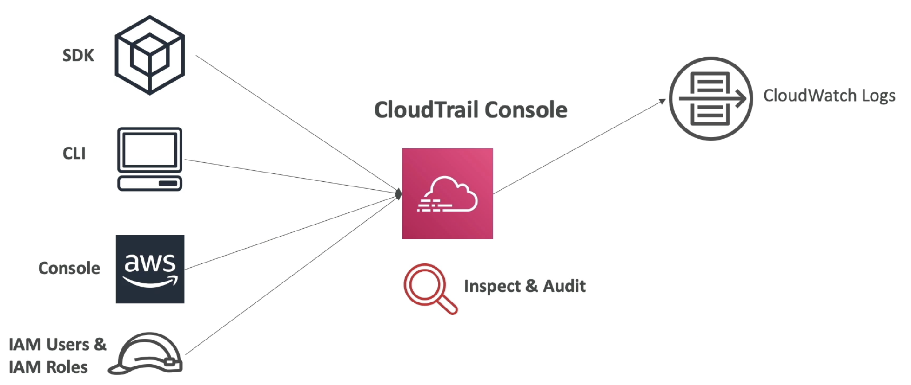
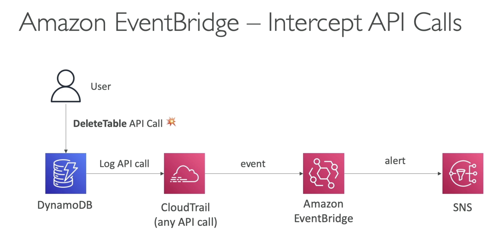
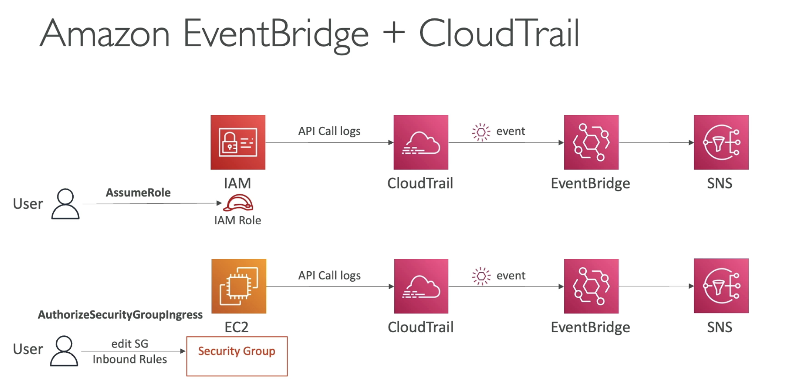

# CloudTrail

  - Provides **governance,compliance and audit** for your AWS accounts
  - CloudTrail is enabled by default
  - Get an history of events / API calls made within your AWS Account by:
    - Console
    - SDK
    - CLI
    - AWS Services
  - Can put logs from CloudTrail into CloudWatch Logs or S3
  - **A trail can be applied to All Regions (default) or a single Region.**
  - If a resource is deleted in AWS, investigate CoudTrail first.  (it will have the API call details)
  
  
  (All the actions of SDK, ClI etc will be in CloudTrail. We can inspect and Audit it)
  (If you want the events to be there for more than 90 days then send them to CloudWatch logs or to S3.)

- **CloudTrail Events**
    - **Management Events**:
        - Operations that are performed on resources in your AWS account.
        - Ex:
            - Configuring security (IAM **AttachRolePolicy**)
            - Configuring rules for routing data (Amazon EC2 **CreateSubnet**)
            - Setup logging (AWS CloudTrail **CreateTrail**)
        - **By default, trails are configured to log management event**
        - Can separate **Read Events** (that dont modify resources) from **Write events** (that modify resources)
            - Read events: listing all the users in IAM, listing all EC2 instances etc
            - Write events: delete a DynamoDB table.
    
    - **Data Events**:
        - **By default, data events are not logged (because high volume operations)**
        - Amazon S3 object-level activity (ex **GetObject, DeleteObject, PutObject**):can separate Read and Write events
        - AWS Lambda Function execution activity. (**Invoke** API)

    - **CloudTrail Insight Events**
        - Enable (and pay) CloudTrail Insights to **detect unusual activity** in your account:
            - inaccurate resource provisioning
            - hitting service limits
            - Bursts of AWS IAM actions
            - Gaps in periodic maintenance activity
        - CloudTrail Insights analyzes normal management events to create a baseline.
        - And then **continuously analyzes write events to detect unusual patterns**
            - Anomalies appear in the CloudTrail console
            - Event is sent to Amazon S3
            - An EventBridge event is generated (for automation needs)

        

- **CloudTrail Events Retention**
    - Events are stored for 90 days in CloudTrail
    - To keep events beyond this period, log them to S3 and use Athena
    

- **Intgrations**

    - Integration with EventBridge

    
    (At the EventBridge create a rule for any API call you want, in this case for DeleteTable API call, and this rule will have a destination to SNS as an alert.)

    