# CIDR-IPv4

  - **Classless Inter-Domain Routing** - a method for allocating IP addresses
  - Used in **Security Groups** rules and AWS networking in general
  - Consists of 2 components - **Base IP, Subnet Mask** 
  - Subnet mask allows part of the underlying IP to get additional next values from the base IP.

  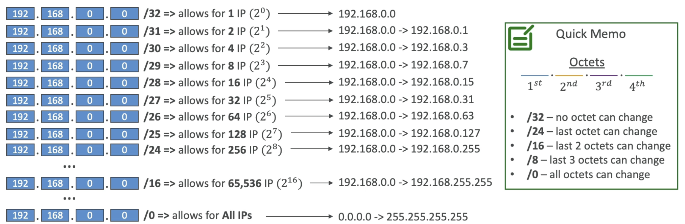

  - Example 192.168.0.0/24 = 192.168.0.0 - 192.168.0.255 (256 IPs)
            192.168.0.0/16 = 192.168.0.0 - 192.168.255.255 (65,536 IPs)
            134.56.78.123/32 = Just 134.56.78.123
            0.0.0.0/0 = All IPs
  - /28 means 16 IPs (=2^(32-28) = 2^4), means only the last digit can change.
  - max CIDR size in AWS is /16.
  - Can use CIDR to IP conversion websites.
  - The Internet Assigned Numbers Authority (IANA) established certain blocks of IPv4 addresses for the use of private LAN and public internet addresses
  - Private IP can only have certain values:
    - 10.0.0.0 - 10.255.255.255 (10.0.0.0/8) <- in big networks
    - 172.16.0.0 - 172.31.255.255 (172.16.0.0/12) <- **AWS default VPC** in that range
    - 192.168.0.0 - 192.168.255.255 (192.168.0.0/16) <- home networks
  - All the rest of the IP addresses on the Internet are public

# IPv6

  - IPv4 designed to provide 4.3 Billion addresses (will be exhausted soon)
  - IPv6 is designed to provide **3.4 X 10 power 38** unique IP addresses
  - Every IPv6 address is public and Internet-routable (no private range)
  - Format -> x.x.x.x.x.x.x.x (x is hex from 0000 to ffff)
  - Ex, 2001:db8:3333:4444:5555:6666:7777:8888, :: (all 8 segments are 0), 2001:db8:: (last 6 segments are 0), ::1234:5678 (first 6 segments are 0), 2001:db8::1234:5678 (middle 4 segments are 0)

- **IPv6 in VPC**
  - **IPv4 cannot be disabled for your VPC and subnets**
  - You can enable IPv6 (they are public IP address) to operate in dual stack mode
  - Your EC2 instances will get at least a private internal IPv4 and a public IPv6
  - They can communicate using either IPv4 or IPv6 to the internet through the Internet Gateway

- **IPv6 Troubleshooting**
  - If you cannot launch an EC2 instance in your subnet
    - Its not because it cannot acquire an IPv6 (the space is very large and there will be enough IPv6 for your EC2 instances)
    - Its because there are no available IPv4 in your subnets.
    - **<u>Solution</u>**: Create a new IPv4 CIDR in your subnet.

# Security Groups and NACL

  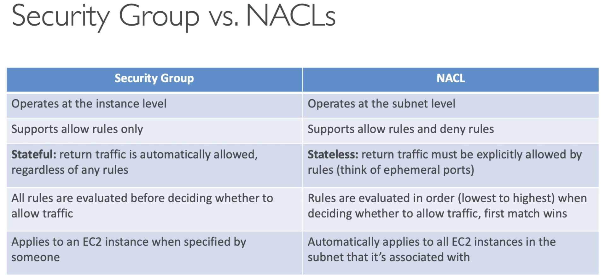  

- **Network Access Control List (NACL)**
  - NACL are like a firewall which control traffic from and to **subnets**
  - **One NACL per subnect**, new subnects are assigned the **default NACL**
  - You define **NACL rules**:
    - Rules have a number (1-32766), higher precedence with lower number
    - First rule match will drive the decision
    - Example: If you define #100 ALLOW 10.0.0. 10/32 and #200 DENY 10.0.0. 10/32, the IP address will be allowed because 100 has a higher precedence over 200
    - The last rule is an asterix (*) and denies a request in case of no rule match
    - AWS reccomends adding rules by increment of 100
  - Newsly created NACLs will deny everything
  - NACL are a great way of blocking a specific IP address at a subnet level

  - **Default NACL** - Accepts everything inbound/outbound with the subnet its associated with
    - Do **NOT** modify the Default NACL, instead create custom NACLs
    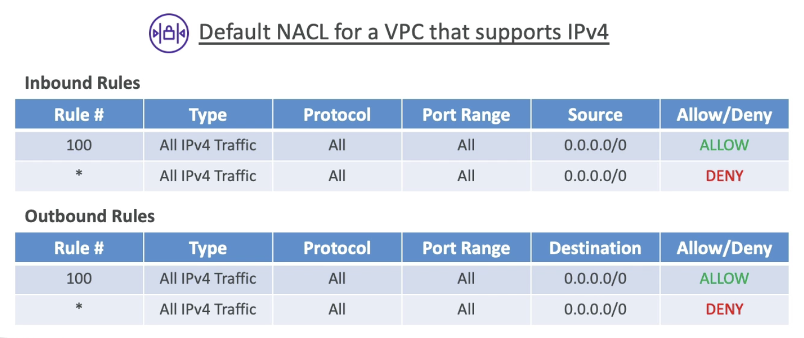

  - **Ephemeral Ports** - random port assigned just for the life of the connection.
    - For any two endpoints to establised a connection, they must use ports
    - Clients connect to a **defined port**, and expect a response on an **ephemeral port**
    - Different Operating Systems use different port ranges ex:
      - IANA & MS Windows 10 -> 49152 - 65535
      - Many Linux Kernels -> 32768 - 60999
    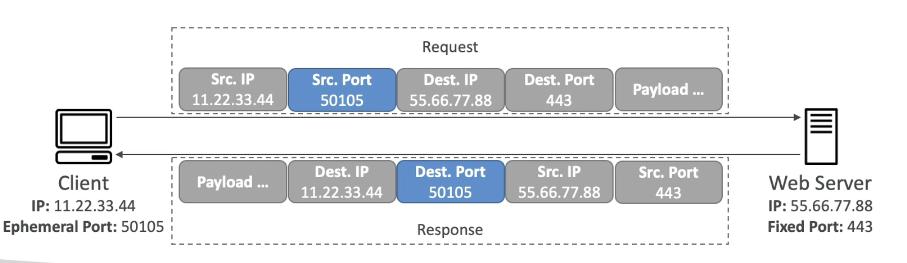  

    - NACL with Ephemeral Ports
    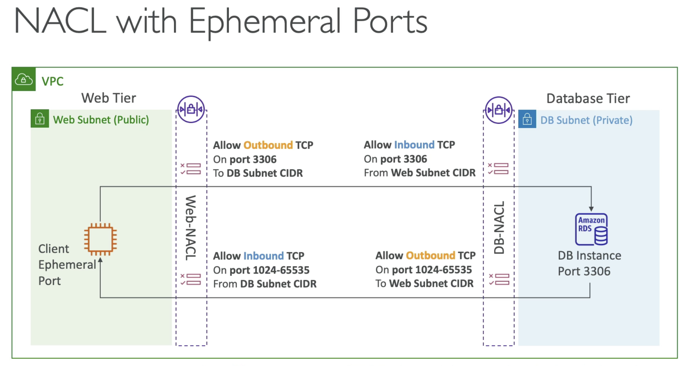  
    (Web client connecting to a DB with private and public subnets, and NACL associated with each subnet)  
    (When client initiates connection to DB instance, one NACL rule should Allow Oubound on port 3306)  
    (DB-NACL should allow Inbound TCP on 3306 from Web Subnet CIDR)  
    (When DB sends back the request, the NACL should allow Outbound on ephemeral port ex 1024-65535) and inbound by Web NACL  

    - NACL rules for subnets  
    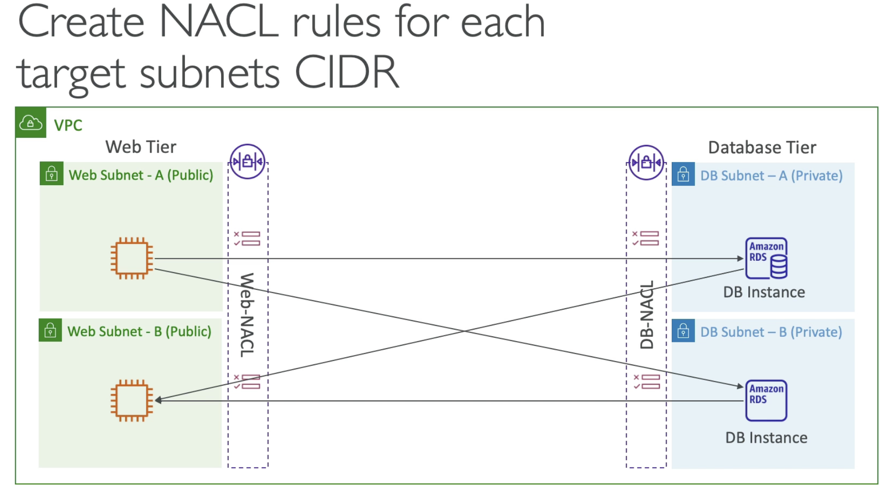  
    (If you have multiple NACL and multiple subnets then each NACL combination should be allowed within the NACL, because you are using CIDRs and each subnet will have its own CIDR)

- **Security Group vs NACL**

# AWS Site-to-Site VPN

  - If we want to connect AWS to corporate data centre using a private connection, there will be a customer gateway at the data centre and VPN gateway on the VPC side. We then establish through public internet a private site-to-site VPN connection.
  - Its a VPN connection so its encrypted but goes over public internet.
  - You can access the interface VPC endpoint from on-premises environments or other VPCs using AWS VPN, AWS Direct Connect, or VPC peering.
  - Needs 2 things:
    - **Virtual Private Gateway(VGW)**
        - VPN concentrator on the AWS side of the VPN connection
        - VGW is created and attached to the VPC from which you want to create the Site-to-Site VPN connection.
        - Possibility to customize the ASN (Autonomous System Number)
    - **Customer Gateway (CGW)**
        - Software application or physical device on customer side of the VPN connection.
  - **Site-to-Site VPN Connections**
    - Customer Gateway Device (on-prem)
        - What IP address to use?
            - If CGW is public, then there is Public Internet-routable IP address for your CGW device to connect to the VGW.
            - If CGW is private and has a private IP, then its very common for it to be behind NAT device that enabled for NAT traversal (NAT-T), use the public address of the NAT device. For the CGW use that public IP of the NAT device.
    - **<u>Important step:</u>** enable **Route Propegation** for the Virtual Private Gateway in the route table that is associated with your subnets. 
    - If you need to ping your EC2 instances from on-premises, make sure you add the ICMP protocol on the inbound of your security groups.  
    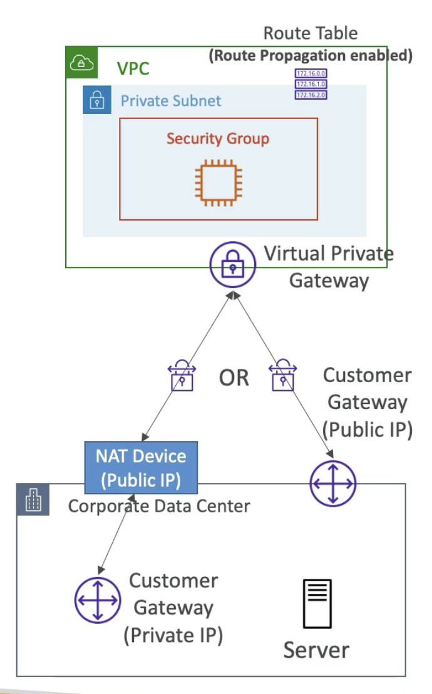

  - **AWS VPN CloudHub**
    - If you have multiple customer networks, multiple data centre, each their own customer gateway, CloudHub provides the secure communication between all the sites, using multiple VPN connections.
    - Low-cost hub-and-spoke model for primary or secondary network connectivity between different locations (VPN only). Establish a site-to-site VPN between CGW and one single VGW within your VPC.
    - Its a VPN connection so it goes over the public Internet and is encrypted.
    - To set it up, connect multiple VPN connection on the same VGW, setup dynamic routing and configure route tables.
    - This enables your remote sites to communicate with each other, and not just with the VPC
    - Sites that use AWS Direct Connect connections to the virtual private gateway can also be part of the AWS VPN CloudHub.
    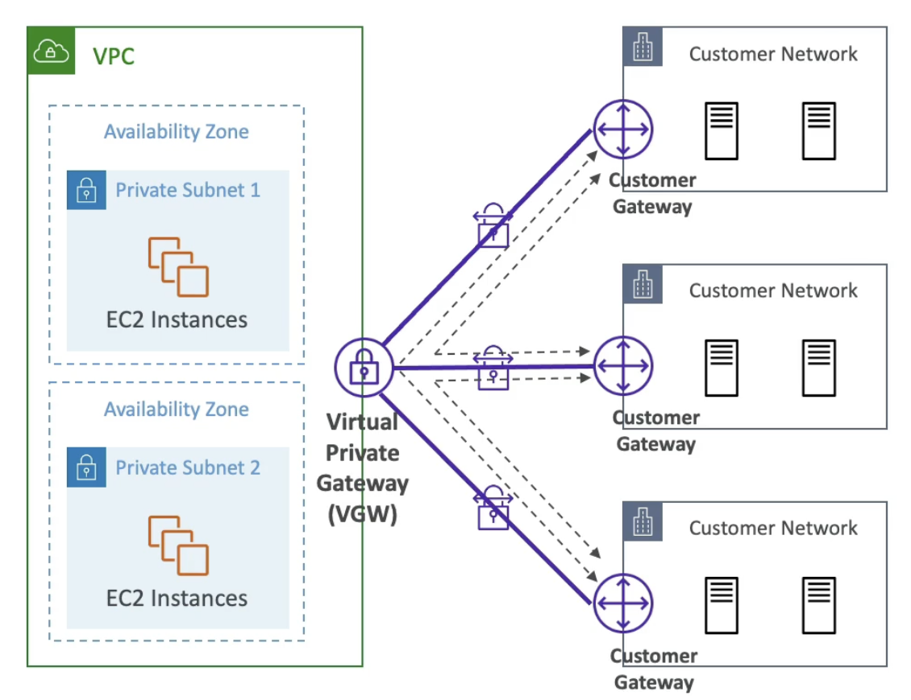

# Direct Connect (DX)
  - Provides a dedeciated **<u>private</u>** connection from a remote network to your VPC.
  - Dedicated connection must be setup between your DC and AWS Direct Connect locations.
  - You need to setup a Virtual Private Gateway on your VPC to make connectivity between your on-prem data centre and AWS.
  - Access public resources S3 and private EC2 on same connection.
  - Use cases:
    - Increase bandwidth throughput - working with large data sets - lower cost - faster because its not on public internet.
    - More consistent network experience - applications using real-time data feeds
    - Hybrid Environment (on-prem + cloud)
  - Supports both IPv4 and IPv6
  - You need to set up a dedicated connection between your on-premises corporate datacenter and AWS Cloud. This connection must be private, consistent, and traffic must not travel through the Internet. Which AWS service should you use? AWS Direct Connect.
  - AWS Direct Connect does not involve the Internet; instead, it uses dedicated, private network connections between your intranet and Amazon VPC

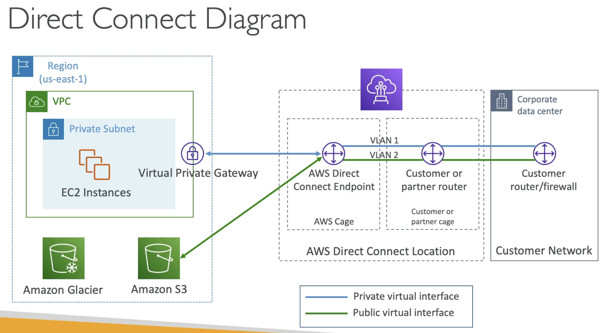
(We have a region and we want to connect to our data centre)  
(Find the physical location of the AWS Direct Connect location from the AWS site)  
(There will be a Direct connect endpoint, customer/partner router rented from a customer/partner cage)  
(In the Customer network or on-prem, set customer router with firewall)  
(Next, set a Private Virtual Interface or VIF(VLAN), to access private resources into your VPC, and then connect it to the Virtual Private Gateway, which is attached to your VPC)  
(Through the private VIF, you will be able to access you private subnets with your EC2 instances)  
(Since all this happen privately there is lot of manual work involved in setting up the connections)  
(In order to connect public AWS services like Glacier and S3, through Public Virtual Interface or Piblic VIF)  
(This public route goes through the same path but does not connect to the Virtual Private Gateway)  

- **Direct Connect Gateway**
  - If you want to setup a Direct Connect to one or more VPC in many different regions(same account), you must use a Direct Connect Gateway.
  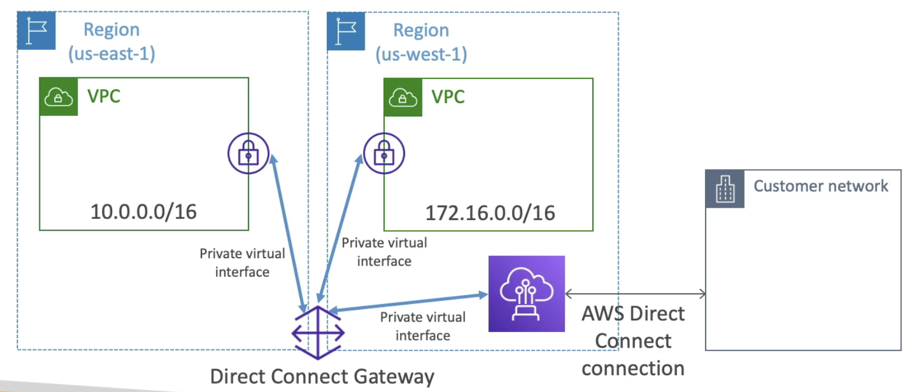
  (Here there are 2 regions, with 2 VPCs and different CIDRs)  
  (We want to connect both VPC to the on-prem data centre)  
  (For this we will establish a Direct Connect connection, then using private VIF, connect to the Direct Connect Gateway)  
  (This Direct Connect Gateway will have a private virtual interface into the Virtual Private Gateway in both regions)  

- **Direct Connect Virtual Interface**
  - Direct Connect provides three types of virtual interfaces: **public, private, and transit**.
  - **Public Virtual Interface** 
    - To connect resources reachable with public IP like S3
    - To connect to all public IP address globally
    - To access publicly routable services in any region.
    - To receive Amazon's global IP routes from the public interfaces in Direct Connect locations.
  - **Private Virtual Interface** 
    - To connect to resources hosted on Amazon VPC using private IP
    - To connect to multiple Amazon VPC's in any region because virtual private GW is associated with a single VPC.
    - Connect private virtual interface to direct connect GW, and then associate this GW with one or more virtual private GW in any region.
  - **Transit Virtual Interface** 
    - To connect to resources hosted on Amazon VPC using private IP, through a transit GW. 
    - To Connect multiple VPC in the same or different account using Direct Connect. 
    - Associate upto 3 transit GW in any region when using this interface to connect to Direct Connect GW.
    - Attach Amazon VPC in the same region to transit GW. Then access multiple VPC in different account in same region using transit virtual interface.

- **Direct Connect - Connection Types**
  - **Dedicated Connecions**: 1Gbps, 10Gbps and 100Gbps capacity
    - Physical ethernet port dedicated to a customer
    - Request made to AWS first, then completed by AWS Direct Connect Partners
  - **Hosted Connections**: 50Mbps, 500Mbps, 10Gbps
    - Connection requests are made via AWS Direct Connect Partners
    - Capacity can be **added or removed on demand**
    - 1,2,5,10 Gbps available at select AWS Connect Partners
  - Lead times are often longer than 1 month to establish a new connection. [If you want to data transfer within short times like weeks then Direct Connect cannot be used for those cases]

- **Direct Connect - Encryption**
  - Data in transit is <u>not encrypted</u> but is private.
  - AWS Direct Connect + VPN provides an IPsec-encrypted private connection which can be a solution for Encryption.
  - Good for an extra level of security, but slightly more complex to put in place.
  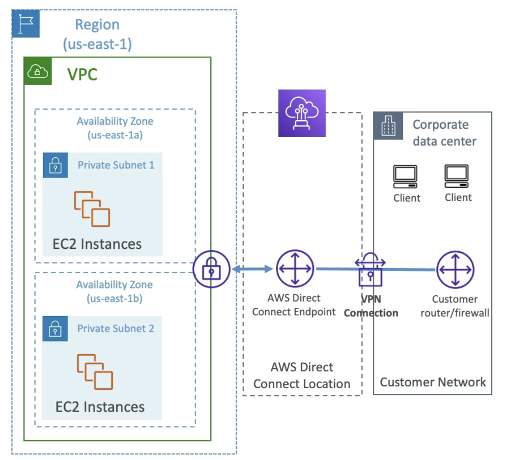

- **Direct Connect - Resiliency**  
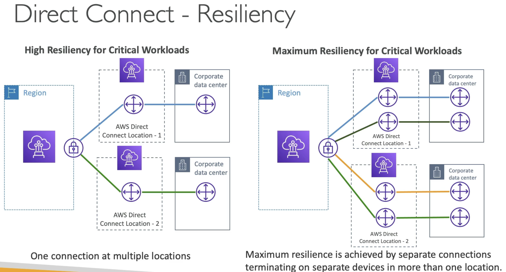  
(For maximum resilinecy, there will still be 2 Direct Connect locations, but this time each will have 2 independent connections. Total 4 connections across 2 locations, terminating on separate devices in more than one location.)

- **Site-to-Site VPN connection as a Backup**
  - In case Direct Connect fails, you can set up a backup Direct Connect connection (expensive), or a Site-to-Site VPN connection.
  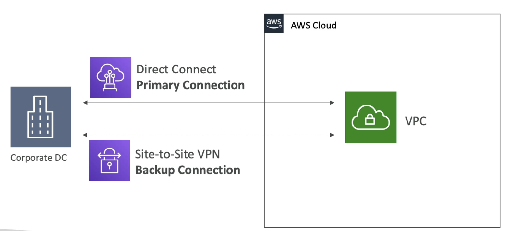
  (If Primary connection fails then you will be connected through the public internet using Site-to-Site VPN which is more reliable because public internet may be always accessible.)  

# Transit Gateway
  - **For transitive peering between thousands of VPC and on-prem, hub-and-spoke (star) connection.**
  - Regional resource, can work cross region
  - Share cross-account using Resource Access Manager (RAM)
  - You can peer Transit Gateways across regions
  - Route tables: limit which VPC can talk with other VPC, includes dynamic and static route to decide next hop based on destination IP of packet.
  - Works with Direct Connect Gateway, VPN connections, VPC, peering connection with another transit GW
  - Support **IP Multicast** (not supported by any other AWS service)
  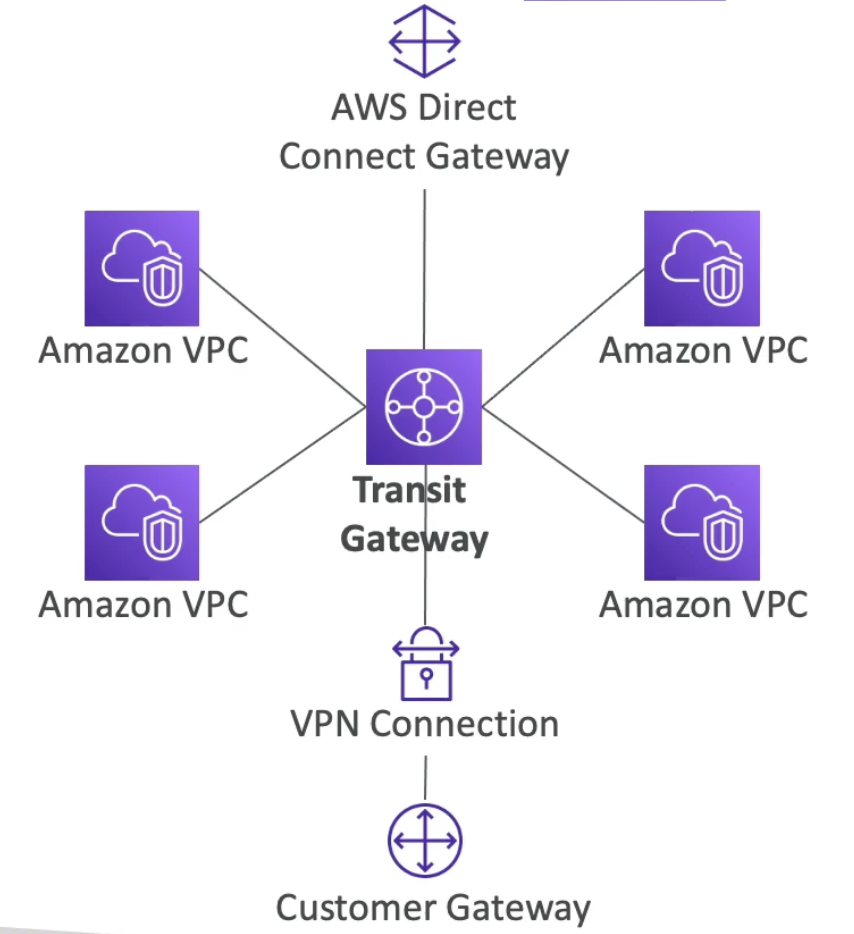

- **Transit Gateway: Site-to-Site VPN ECMP**
  - ECMP = **Equal-Cost-Multi-Path** routing
  - Routing strategy to allow to forward a packet over multiple best path
  - Use case: Create multiple Site-to-Site VPN connections **to increase the bandwidth of your connections to AWS**
  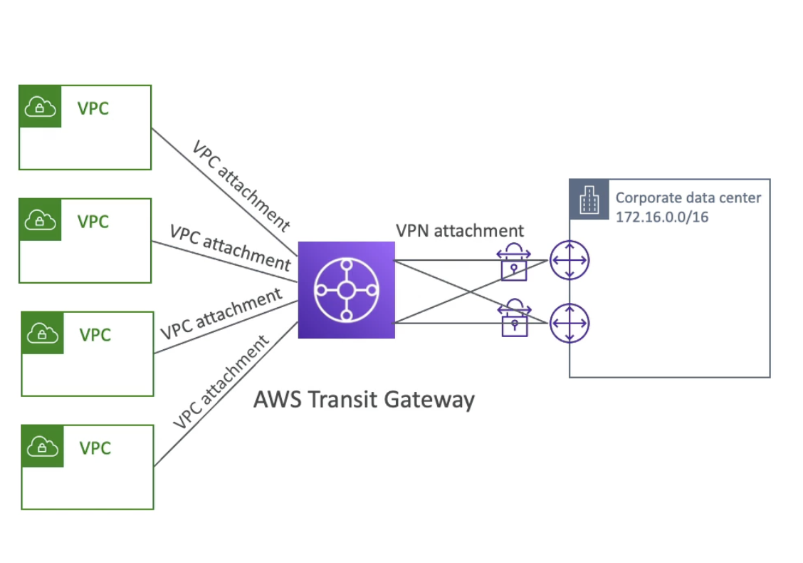
  (In the above diagram, the corporate data centre is connected to the Transit GW using site-to-site VPN)  
  (When you establish a site-to-site VPN connection, there are actually 2 tunnels, one going forward and one going back)  
  (When such a VPN is connected into a VPC directly, both the tunnels are used as part of one connection, but when using the transit gateway 2 tunnels can be used at the same time, thats why there are 2 lines in the above diagram)  
  (With transit gateway, you can have multiple site-to-site VPN, so a second site-to-site VPN is present in the example)

- **Transit Gateway: throughput with ECMP**
  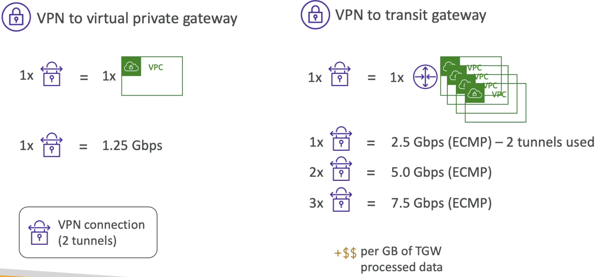

- **Transit Gateway: Share Direct Connect between multiple accounts**
  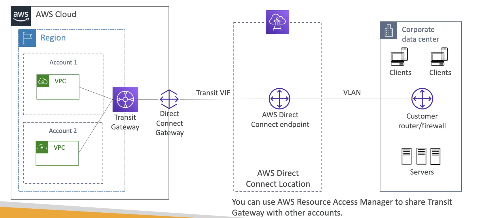
  (First establish a Direct Connect connection between corporate data centre and a Direct Connect location)  
  (Setup a Transit Gateway between the 2 VPCs in 2 diffrent accounts)  
  (Next connect the direct connect location to direct connect gateway which is then connected to the transit gateway)  
  (This architecture allowed us to shared direct connect connection between multiple accounts and multiple VPCs)  

# Egress-only Internet Gateway

  - **<u>Used for IPv6 only</u>**
  - (Similar to NAT Gateway but for IPv6)
  - Allows instances in your VPC outbound connections over IPv6 while preventing the internet to initiate an IPv6 connection to your instances
  - **You must update the Route Tables**
  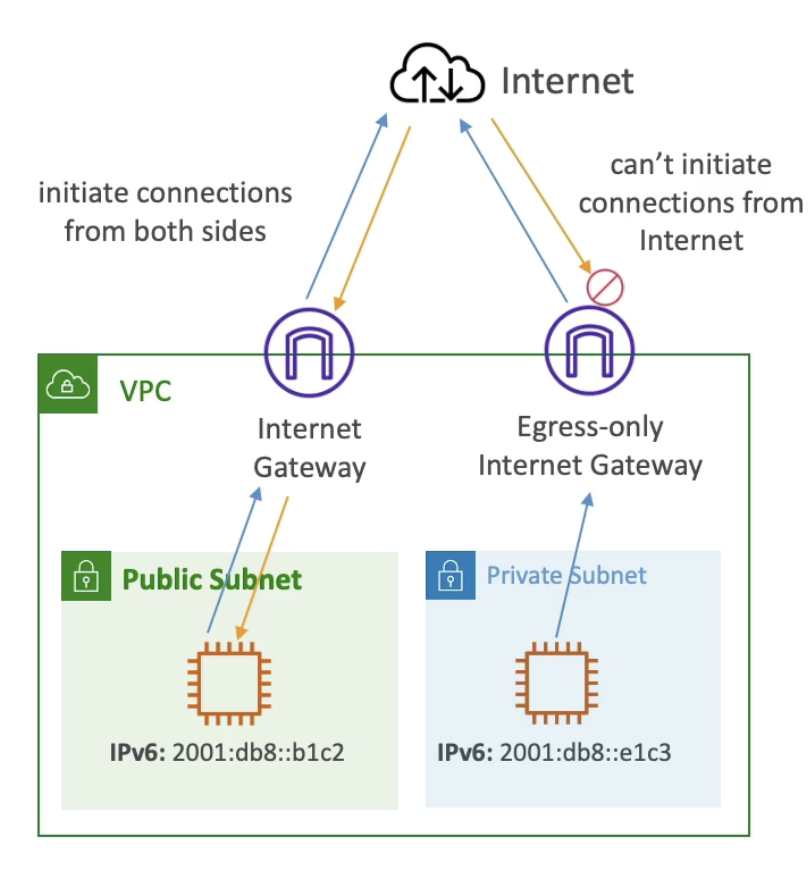

  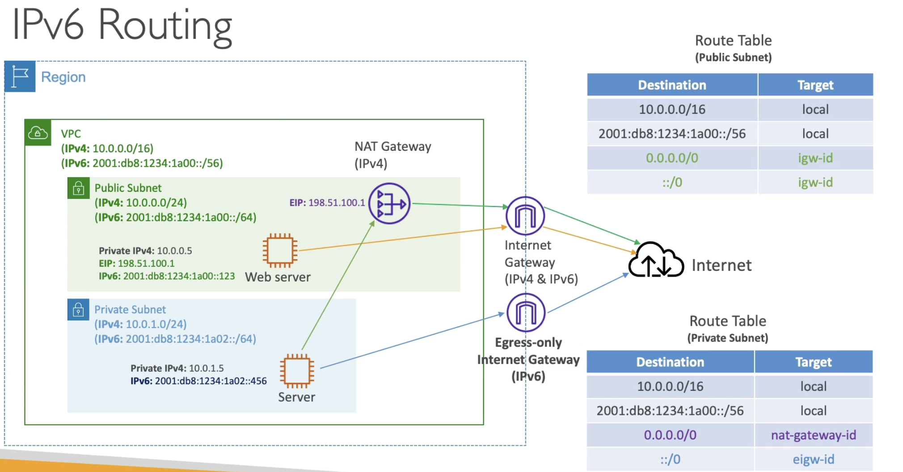
  (If we consider a web server accessing the internet it can do it over IPv4 and IPv6 through an Internet Gateway (IGW))  
  (The route table for the Public subnet will have the IPVv4 and IPv6 local traffic within the CIDRs of the subnet within this VPC)  
  (Anything else which is 0.0.0.0/0 for IPv4 and ::/0 for IPv6, go through the IGW)  
  (IPv4 and IPv6 is enabled both ways by this in the public subnet)  
  (For the private subnet, for IPv4 we will have to use NAT Gateway, which then connects to IGW and for IPv6 we use Egress GW)  
  (In the route table we can see for IPv4 all traffic 0.0.0.0/0 is routed through NAT and ::/0 through Egress GW)  
  (Usually Egress GW will be used for Private subnets)

# Networking Costs in AWS per GB

  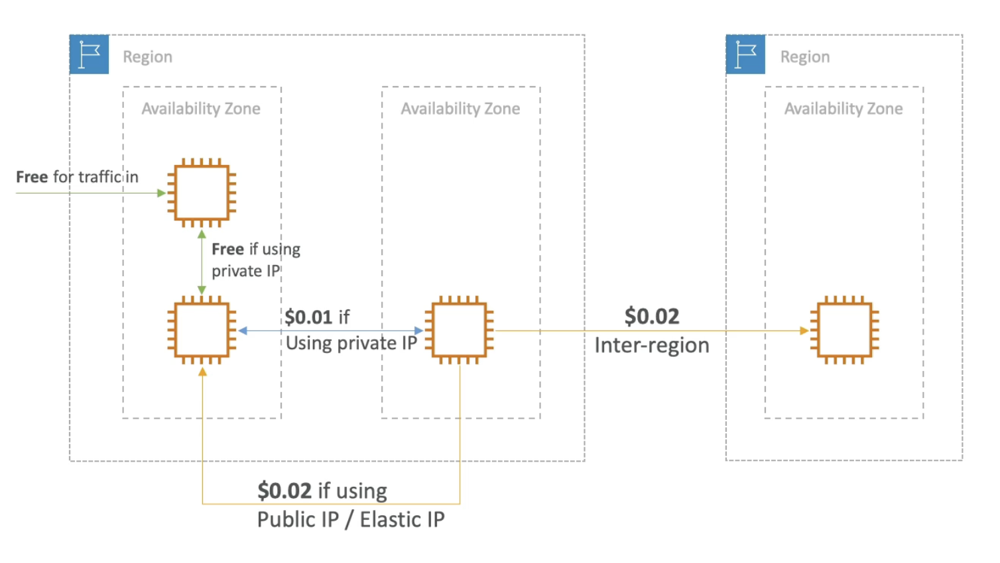
  - Use Private IP instead of Public IP for good savings and better network performance
  - Use same AZ for  maximum savings (at the cost of high availability, if the AZ goes down)
  - If you have a cluster that does some computation and requires lots of communication between EC2 instances, then use same AZ for max savings ans efficiency.
  - If we have an RDS database and we create a replica in the same AZ then no charge and we can do some analytics on the read replica free of cost. But if the read replica is in another AZ then it will cost 1 cent per GB of data transfer between the replica and RDS DB.

- **Minimizing egress traffic network cost**
  - <u>Egress traffic</u>: outbound traffic (from AWS to outside)
  - <u>Ingress traffic</u>: inbound traffic - from outside to AWS (typically free)
  - Try to keep as much internet traffic within AWS to minimize costs
  - Direct Connect location that are co-located in the same AWS Region result in lower cost for egress network.

  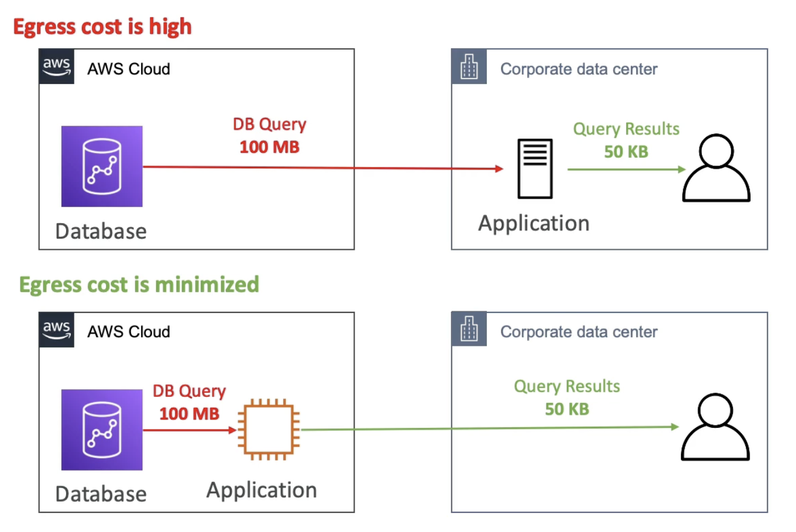
  (User in the corporate data centre runs an application which queries DB and retrieves 100 MB of data from the DB, does some aggregation and computation and returns the query result only 50KB to the user)  
  (In that case Egress traffic is going to be very high)  
  (A good solution will be to move the application inside the AWS on an EC2 instance, and we can keep the instance and applicaiton in the same AZ to reduce cost further. Only query resukt of 50KB will be sent over internet to the data centre.)

- **S3 Data Transfer Pricing**
  - S3 ingress: free
  - S3 to Internet: $0.09 per GB
  - S3 Transfer Acceleration:
    - faster transfer times (50 to 500% better)
    - Additional cost on top od Data transfer Pricing: +$0.04 to $0.08 per GB
  - S3 to CloudFront: $0.00 per GB (Free)
  - CloudFront to Internet: $0.085 per GB (slightly cheaper than S3)
    - Caching capability (lower latency)
    - Reduce costs associated with S3 Requests.  
      Pricing (7X cheaper with CloudFront)
  - S3 Cross Region Replication: $0.02 per GB
  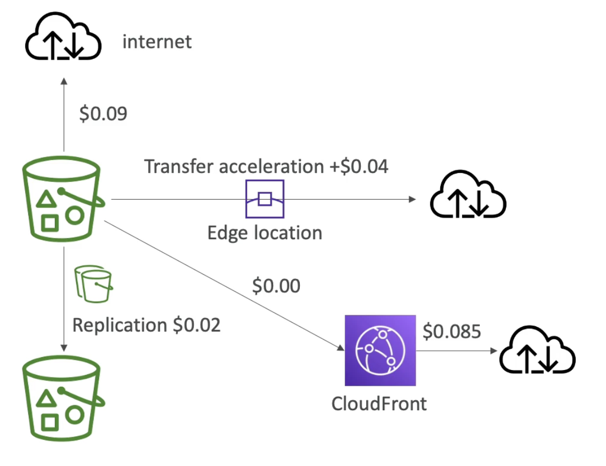

- **NAT Gateway Vs Gateway VPC Endpoint**
  
  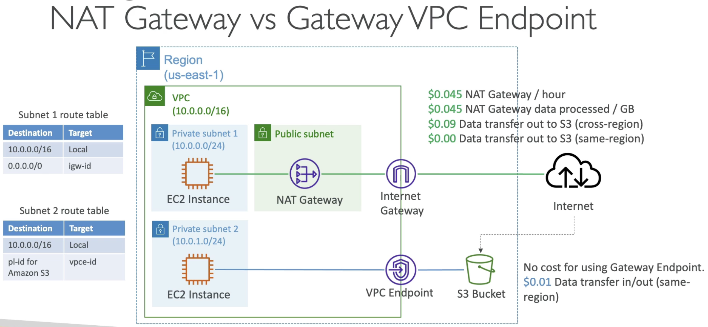
  (VPC in a region with 2 private subnets and different types of EC2 instances and they want to access the S3 bucket)  
  (One way to do so is using a public subnet with NAT Gateway and a route to a IGW, also create the route tables for it)  
  (The cost associated with this approach is $0.045 per hour for the NAT Gateway, $0.045 per GB of data process through your NAT GW, $0.09 per hour of data transfer out to S3, $0.0 or free if its the same region)  
  (Another approach is to setup VPC endpoint to access S3 privately and for that we set a different route table)  
  (In this case data flows directly from theprivate subnet into the VPC endpoint and the S3 bucket)  
  (No cost for using Gateway endpoint and pay $0.01 per GB of Data transfer in/out of S3 for the same region)  

# AWS Network Firewall

  - Protect your entire Amazon VPC
  - From Layer 3 to Layer 7 protection
  - Any direction, you can inspect
    - VPC to VPC traffic
    - Outbound to internet
    - Inbound from internet
    - To / From Direct Connect & Site-to-Site 
  - Internally, the AWS Network Firewall uses the AWS Gateway Load Balancer (instead of us setting up a third party appliance to inspect the traffic, we let AWS manage its own appliances)
  - Rules can be centrally managed cross-account by AWS Firewall Manager to apply to many VPCs
  - With the network firewall, we have fine grained controls over all kind of network traffic.

- **Fine Grained Controls**
  - Supports 1000s of rules
    - IP & port - ex:10,000 of IPs filtering
    - Protocol - ex:block the SMB protocol for outbound communications
    - Filtering at Domain level: Stateful domain list rule groups: only allow outbound traffic from VPC to *.mycorp.com or third-party software repo
    - General pattern matching using regex
  - **Traffic Filtering**: Allow, drop, or alert for the traffic that matches the rules
  - **Active flow inspection** to protect against network threats with intrusion-prevention capabilities (like Gateway Load Balancer, but all managed by AWS)
  - Send logs of rule matches to Amazon S3, CloudWatch Logs, Kinesis Data Firehose
  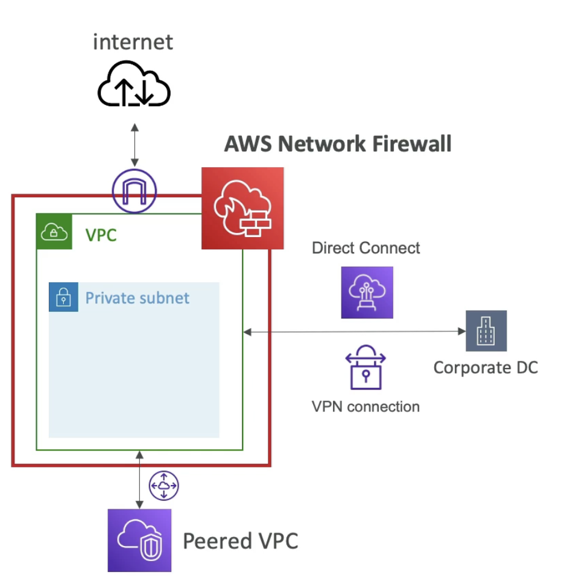

Note: A web application hosted on a fleet of EC2 instances managed by an Auto Scaling Group. You are exposing this application through an Application Load Balancer. Both the EC2 instances and the ALB are deployed on a VPC with the following CIDR 192.168.0.0/18. How do you configure the EC2 instances' security group to ensure only the ALB can access them on port 80?
- Add an Inbound Rule with port 80 and ALBs Security Group as the source.