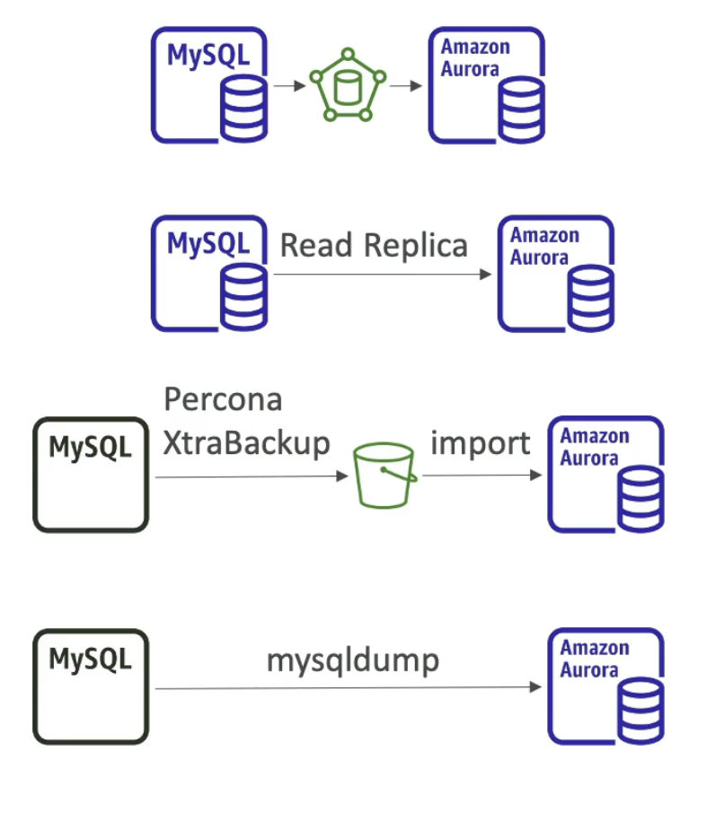

# Database Migration Service

  - Quickly and securely migrate databases to AWS,  resilient, self healing
  - The source database remains available during migration
  - Supports:
    - Homogeneous migrations: ex Oracle to Oracle, Postgres to Postgres
    - Heterogeneous migrations: ex Microsoft SQL server to Aurora
  - Continuous Data replication using CDC (**Change Data Capture** - identify and capture changes made to data in DB and delivering them real time)
  - You must create an EC2 instance to perform the replication tasks
  - So you have a Source DB (may be on prem) -> EC2 instance running DMS software will pull data from the DB -> continuously put in a target DB.
  - Source DB can be On-prem or EC2 based databases (Oracle, MS SQL server, MySQL, MariaDB, PostgreSQL, MongoDB, SAP, DB2), Azure SQL database, Amazon RDS (all including Aurora), S3, DocumentDB
  - Target can be On-prem or EC2 based databases (Oracle, MS SQL server, MySQL, MariaDB, PostgreSQL, SAP), Amazon RDS, RedShift, DynamoDB, S3, OpenSearch service, Kinesis Data Streams, Apache Kafka, DocumentDB, Amazon Neptune, Redis and Babelfish (With Babelfish, Aurora PostgreSQL now understands T-SQL, Microsoft SQL Server's proprietary SQL dialect, and supports the same communications protocol, so your apps that were originally written for SQL Server can now work with Aurora with fewer code changes)

- **AWS Schema Conversion Tool (SCT)**
    - If source and target database have different engines then we use SCT
    - Convert your database schema from one engine to another
    - Example OLTP: (SQL Server to Oracle) to MySQL, PostgreSQL, Aurora
    - Example OLAP (data transform for analytics): (Terradata or Oracle) to Amazon RedShift
    - This will run on the EC2 instance which runs the DMS software.
    - **You do not need to used SCT if you are migrating the same DB engine**. ex On-prem PostgreSQL -> RDS PostgresSQL (The DB engine is PostgreSQL and RDS is just the platform used to run the DB engine.) 

- **DMS - Continuous Replication**
  
  
  (We have Oracle DB in the data centre and then we setup a server with SCT (Schema Conversion Tool) on-prem, this is the best practice)  
  (The SCT server will do the schema conversion into RDS running MySQL)  
  (Next we setup a DMS replication instance that will do the full load and the CDC - Change data capture, to have continuous replication)  
  (This will perform the data migration by reading the Oracle DB on-prem and inserting the data into the private subnet)  
  
- **DMS- Multi-AZ deployment**

  
  - When Multi-AZ enabled, DMS provisions and maintains a synchronously stand replica in a different AZ
  - Advantages:
    - Resiliency to failure in a AZ
    - Provides Data redundancy
    - Eliminates I/O freezes
    - Minimizes latency spikes

# RDS & Aurora MySQL Migrations

  
  - RDS MySQL to Aurora MySQL
    - Option 1: Take a DB snapshot from RDS MySQL and restore as MySQL Aurora DB (will have downtime to stop operations in the MySQL DB)
    - Option 2: Create an Aurora read-replica from your RDS MySQL, and when replication lag is 0 (means Aurora replica has fully caught up with MySQL), promote it as its own DB cluster (can take time and cost $) (more continous) (extra cost associated with the network for replication)
  - External MySQL to Aurora MySQL
    - Option 1: Use Percona XtraBackup to create a file backup and put it in S3. From Aurora to directly import this backup file from S3 into a new Aurora MySQL DB cluster.
    - Option 2: Create an Aurora MySQL DB then use the mysqldump utility to run against the MySQL database and pipe this output to the Aurora DB. (slower than S3 method)
  - Use DMS if both database are up and running to do continuous replication between the 2 DB.

# RDS & Aurora PostgreSQL Migrations

  

  - RDS PostgreSQL to Aurora PostgreSQL
    - Option 1: Take a DB snapshot from RDS PostgreSQL and restore as PostgreSQL Aurora DB (will have downtime to stop operations)
    - Option 2: Create an Aurora read-replica from your RDS PostgreSQL, and when replication lag is 0 (means Aurora replica has fully caught up with MySQL), promote it as its own DB cluster (can take time and cost $) (more continous) (extra cost associated with the network for replication)
  - External PostgreSQL to Aurora PostgreSQL
    - Create a backup and put it in S3.
    - Then, import it using the aws_s3 Aurora extension which will create a new DB out of it.
  - Use DMS if both database are up and running for continuous migration.

# Notes

  - **continuously replicate and consolidate Oracle and PostgreSQL RDS into Redshift**
    - The Amazon Redshift cluster must be in the same AWS account and the same AWS Region as the replication instance.
    - During a database migration to Amazon Redshift, AWS DMS first moves data to an Amazon S3 bucket
    - When the files reside in an Amazon S3 bucket, AWS DMS then transfers them to the proper tables in the Amazon Redshift data warehouse.
    - AWS DMS creates the S3 bucket in the same AWS Region as the Amazon Redshift database.
    - The AWS DMS replication instance must be located in that same region.
  - AWS DMS lets you expand the existing application to stream data from Amazon S3 into Amazon Kinesis Data Streams for real-time analytics without writing and maintaining new code