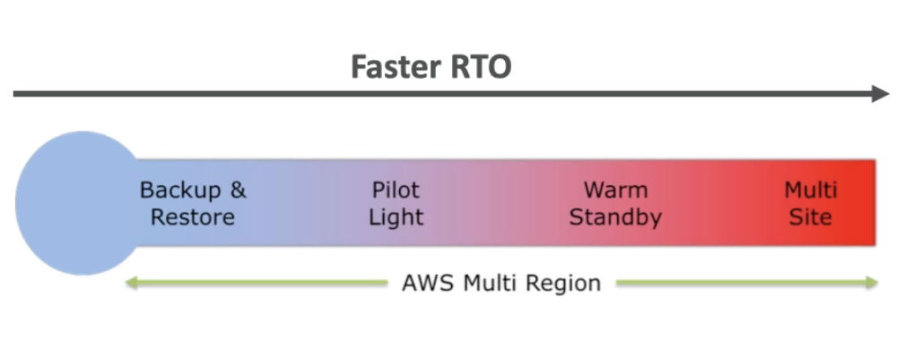
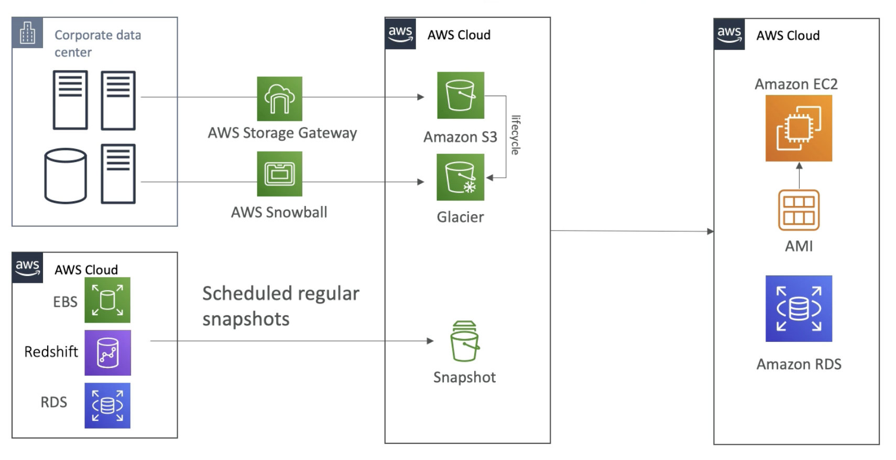
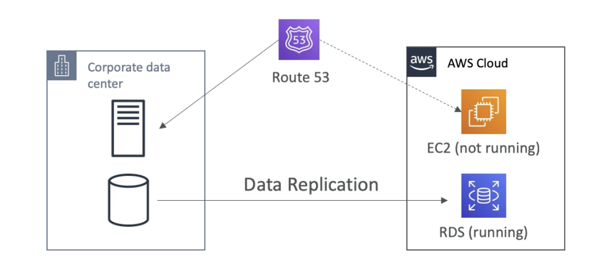
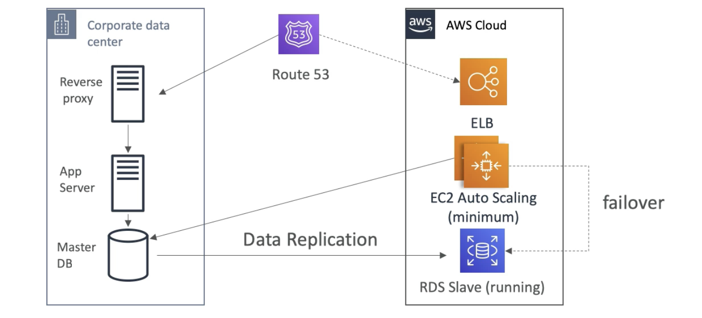
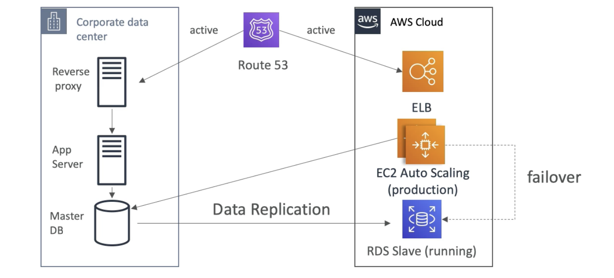
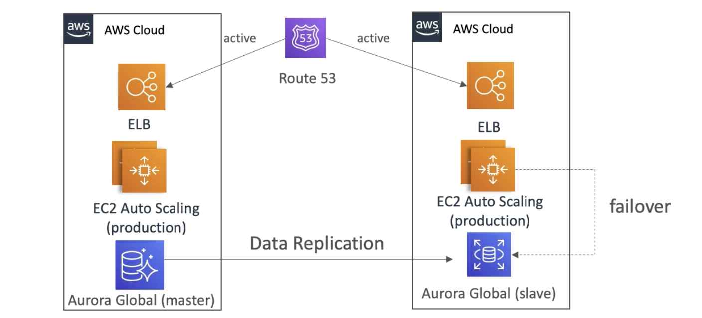

# Overview

  - Any event that has a negative impact on a company's business continuity or finances is a **disaster**
  - Disaster Recovery (DR) is about preparing for an recovering from a disaster
  - What kind of disaster recovery?
    - On-prem to On-prem: traditional DR very expensive
    - On-prem to AWS cloud: Hybrid recovery
    - AWS Cloud Region A to Region B: Full cloud discovery

- **RPO & RTO - Recovery Point Objective & Recovery Time Objective**
    - How often you run backups, how back in time you can recover when disaster strikes.
    - The time between RPO and disaster is going to be data loss.
    - RPO is how much of a data loss are you willing to accept in case of a disaster. Based on that you can take backup every hour or minute etc.
    - RTO is the amount of downtime you application has, so time between disaster and recovery.
    - Optimizing RPO and RTO drives the atchitecture for disaster recovery. (smaller these numbers higher the costs)
    

- **Disaster Recovery Strategies**
    - Backup and Restore
    - Pilot Light
    - Warm Standy
    - Hot Site / Multi-site approach

      
    (faster RTO costs more money)  

    - **Backup and Restore (High RPO)**

    
    (For S3 data backup, we can use AWS storage gateway and have some lifecycle policy put data into Glacier for cost optimization or once a week send a ton of data into Glacier using AWS Snowball)  
    (Here if you use Snowball your RPO is going to be 1 week, because you send a snowball device once a week. So 1 week data loss in case of disaster)  
    (Instead if you are using AWS Cloud, EBS, RedShift and RDS, and you schedule regular snapshots and back them up then RPO can be 24 hours or 1 hour based on how frequent you create the snapshot)  
    (Here if s disaster strikes and you need to restore all your data, then you can use AMIs to recreate the EC2 instances, spin up application or restore straight from a snapshot and recreate RDS or EBS or RedShift.)  
    (The restore in this case can take a while, and so RTO may be high)  
    (Benefit is that that its very cheap and we dont manage the infrastrucure, we just recreate it when the disaster strikes, and the cost hence is only for storing the backups)  

    - **Pilot Light**
        - A small version of the app is always running on the cloud.
        - Useful for the critical core (Pilot light)
        - Very similar to Backup and Restore
        - Faster than Backup and Restore because critical systems are already up and running so when you recover need to only add non-critical systems.

        
        (If your datacentre has a server and a database)  
        (Continuous data replication from your critical database into RDS, so this will be ready to go and running)  
        (But EC2 instances may be not running, as they are non-critical)  
        (When disaster strikes, Route 53 will allow you to fail over from your server on the data centre and recreate the EC2 instance in cloud)  
        (Here we get lower RPO and RTO and still manage cost.)  
        (Used only for Critical core assistance)  

    - **Warm Standby**
        - Full system is up and running, but at minimum size
        - Upon disaster, we can scale to production load

        
        (Route 53 is pointing the DNS to the corporate data centre)  
        (In the cloud, we have data replication to and RDS slave databse that is running)  
        (Also may be an EC2 auto scaling group running at minimum capacity talking to the datacenre DB + an ELB also ready to go in the cloud)  
        (In Warm standy, we can use Route 53 to failover to the ELB, and change where the application get the data, may be the RDS slave running on cloud, also may use the ASG to auto scale our application pretty quickly)  
        (We can with this approach decrease RPO and RTO but the cost is higher because we have ELB and EC2 ASG)  

    - **Multi Site / Hot Site Approach**
        - Very low RTO (minutes to seconds) - very expensive
        - Full production scale running in AWS and on-prem

          
        (A hot site already running, then Route 53 can route request both to corporate data centre and cloud and its called avtive-active setup)  
        (During failover, EC2 can failover to RDS slave if need be)

    - **All AWS Multi-Region**
        - Same architecture as above but in different region and we can uses Aurora instead, with Gobal database in the master region and then replicate to another region as a slave.
          