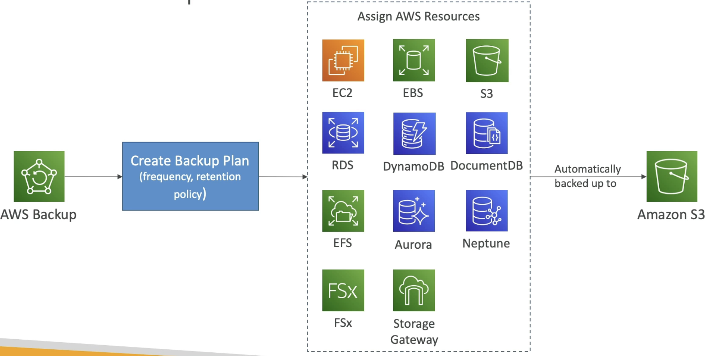
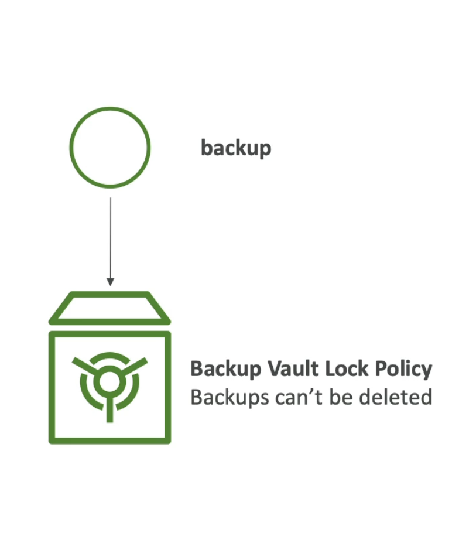
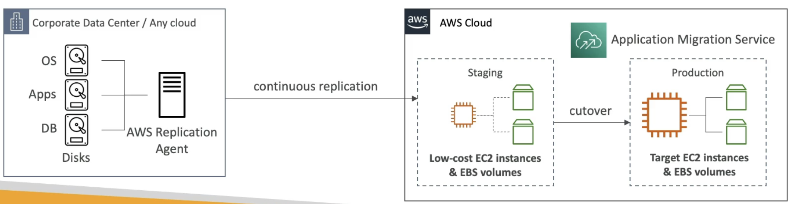
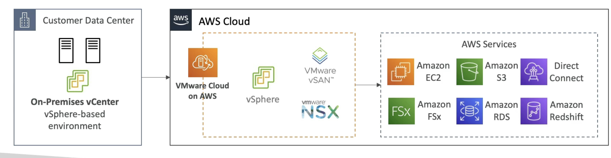

# Disaster Recovery Tips

  - **Backup**
    - EBS Snapshots, RDS automated Backups / Snapshots etc..
    - Regular pushes to S3 / S3 IA / Glacier, Lifecycle Policy, Cross Region Replication
    - From On-prem: Snowball or Storage Gateway
  - **High Availability**
    - Use Route 53 to migrate DNS over from Region to Region
    - RDS Multi-AZ, ElastiCache Multi-AZ, EFS, S3
    - Site-to-Site VPN as a recovery from Direct Connect
  - **Replication**
    - RDS Replication (Cross Region), AWS Aurora + Global Databases
    - Database replication from on-prem to RDS
    - Storage Gateway
  - **Automation**
    - CloudFormation / Eastic Beanstalk to re-create a whole new environment
    - Recover / Reboot EC2 instances with CloudWatch if alarm fails
    - AWS Lambda functions for customized automations
  - **Chaos Testing**
    - Netflix has "simian-army" randomly terminating EC2 instances and ALB in production. (run chaos monkeys)

# On-Premise strategy with AWS

  - Ability to download Amazon Linux 2 AMI as a VM (.iso format)
    - load this iso image into common software used to create VMs like VMWare, KVM, VirtualBox (Oracle VM), Microsoft Hyper-V (This allows to run Amazon Linux 2 on your on-prem infrastructure directly using that VM).
  - VM Import / Export
    - Migrate existing VM and applications into EC2 directly
    - Can create a DR repository strategy if you have lot of on-prem VMs and you want to back them on cloud.
    - Can export back the VMs from EC2 to on-prem
  - AWS Application Discovery Service
    - Gather information about your on-prem servers to plan a migration
    - Server utlization and dependency mappings (helpful for massive migration from on-prem to cloud)
    - Track with AWS Migration Hub
  - AWS Database Migration Service (DMS)
    - replicate on-prem->AWS, AWS->AWS, AWS->on-prem
    - Works with various database technologies (Oracle, MySQL, DynamoDB, etc..)
  - AWS Server Migration Service (SMS)
    - Incremental replication of on-prem live servers to AWS (replicate the volumes directly into AWS)

# AWS Backup

  - Fully managed service
  - Centrally manage and automate backups across AWS services
  - No need to create custom scripts and manual processes
  - Supported service: EC2, EBS, S3, RDS, Aurora, DynamoDB, DocumentDB, Neptune, EFS, FSx (Lustre and Widows File server), Storage GW (or Volume GW).
  - Support cross-region backups
  - Support cross-account backups
  - Support PITR (Point-In-Time-Recovery) for supported services
  - On-demand and scheduled backups
  - Tag based backup policies (ex production tag)
  - You create backup policies known as **Backup Plans**
    - Backup Frequency (every 12 hours, daily, weekly, monthly, cron expression)
    - Backup window
    - Transition to Cold Storage (Never, days, Weeks, Months, Years)
    - Retention period (Always, days, Weeks, Months, Years)

    
  (The S3 bucket is an internal bucket specific to the Backup service)

- **AWS Backup Vaull Lock**
  - Enforce s WORM (Write Once Read Many) state for all the backups that you store in your AWS Backup vault
  - Additional layer of defence to protect your backup against:
    - Inadvertent or malicious delete operations
    - Updates that alter or shorten retention periods.
  - Even the root user cannot delete backups when enabled.
  

# AWS Application Discovery Service

  - Plan migration projects by gathering information about on-prem data centre
  - Server utilization and dependency mapping are collected by the discovery service and are important for migrations
  - **Agentless Discovery(using a connector)**
    - Gives information around your VM inventory, configuration and performance history such as CPU, memeory and disk usage
  - **Agent-based Discovery(using an agent)**
    - Gives more updates and more information from within your VM, for ex system configuration, system performance, running processes and details of all network connections between your systems (to get dependency mapping).
  - All the resulting data can be viewed within another service called **AWS Migration Hub**
  - Discovery service helps you to map out what you need to move and how they are interconnected.

# AWS Application Migration service (MGN)

  - Used to be called CloudEndure Migration
  - Using MGN you can do lift-and-shift (rehost) solution which simipify **migrating** application to AWS.
  - Converts your physical, virtual and other clouds based servers to run natively on AWS
  - Supports wide range of platforms, Operating systems and databases.
  - Minimal downtime, reduced costs.

  
  (Corporate data centre has OS, Apps and DB on disks)  
  (Run the Application Migration service on AWS and install Replication agent on data centre)  
  (The replication agent will perform continuous replication of your disks so that you have for ex low cost EC2 instances and EBS volumes that gets this replication of data)  
  (The day you are ready to perform a cut-over, you can move from staging to production and have a bigger EC2 instance of the size you want, as well as EBS volumes that match your performance needs)

# Transfer large amount of data into AWS

- Example: transfer 200 TB of data into cloud. We have 100 Mbps internet connection.
  - Over the internet / Site-to-Site VPN (uses public internet)
    - Immediate to setup.
    - Can leverage our connection right away
    - Will take 200 (TB) X 1000 (GB) X 1000 (MB) X 8 (Mb) <- Convert 200 TB into Mega bits . Then Divide by 100 Mbps = 16,000,000 s(16 Million seconds) = 185 days to transfer the data.
  - Over Direct Connect 1 Gbps:
    - Long for one time setup (over a month)
    - Will take 200 (TB) X 1000 (GB) X 8 (Gb) / 1 Gbps = 1,600,000s = 18.5 days
  - Over Snowball:
    - First need to order the Snowball, take 2-3 snowballs in parallel.
    - Takes about 1 week for the end-to-end transfer of the device from loading, packing and sent back to AWS.
    - Can be combined with DMS if a DB is getting transferred and rest of the data can be transferred afterwards.
  - For on-going replication / transfers (after the first transfer): Site-to-Site VPN or DX with DMS, or DataSync (Does not support EBS)

# VMWare Cloud on AWS

- Some customers use VMWare cloud to manage their on-prem data centre
- They want to extend the data centre capacity to AWS, but keep using the VMWare Cloud Software
- ... Enter VMWare Cloud on AWS
- Use cases:
  - Migrate your VMWare vSphere based workloads to AWS
  - Run your production workloads across VMWare vSphere based private, public and hybrid cloud environments
  - Have a disaster recover strategy (now you can quickly go to clous using the same suite of s/w)
  - Once you are in AWS cloud, you can access other AWS service and start leveragin them like EC2, FSx, S3, RDS, Direct Connect, RedShift ...

