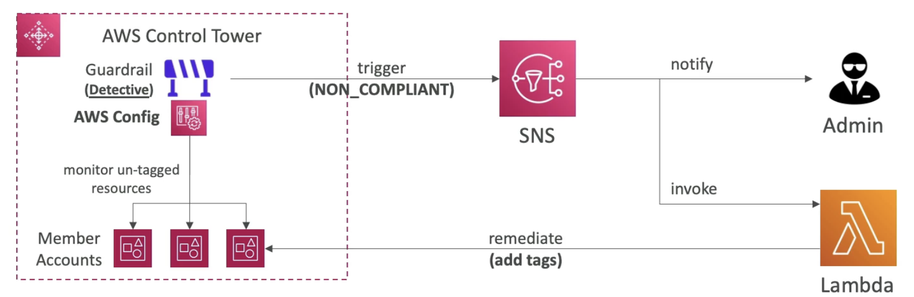

# Control Tower

  - Easy way to **setup and govern a secure and compliant <u>multi-account AWS environment</u> based on best practices.**
  - AWS Control Tower uses AWS Organzations to create accounts (service sits on top of Organizations)
  - **Benefits**
    - Automate the setup of your environment in a few clicks (have all the configs you want)
    - Automate ongoing policy management using guardrails
    - Detect policy violations and remediate them
    - Monitor compliance through an interactive dashboard.

- **Guardrails**
    - If you want to restrict all accounts at once for certain kind of things OR monitor the complaince of certain kind of things.
    - Provides ongoing governance for your Control Tower environment (AWS accounts)
    - **Preventive Guardrail - using SCP** (eg Restrict regions across all accounts, account should operate in a particular region only)
    - **Detective Guardrail - using AWS Config** (eg identify untagged resources)
    
    (Here Config is going to be deployed on all member accounts)  
    (Config will monitor any untagged resources using rules)  
    (In case anything is non-compliant then trigger an SNS topic)  
    (Admin is notified or it can also invoke a Lambda function to remediate by adding tags)  