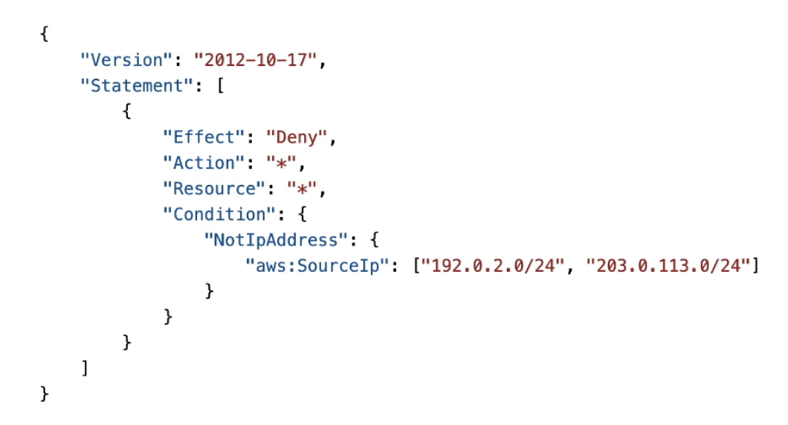
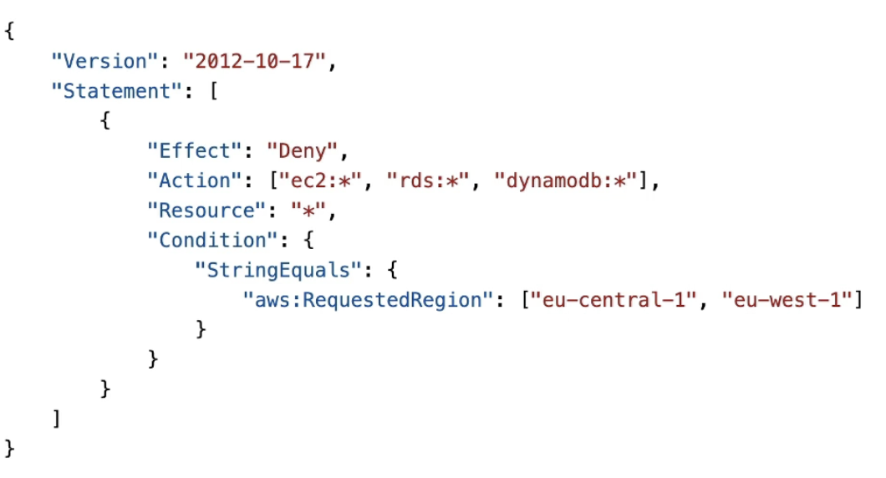
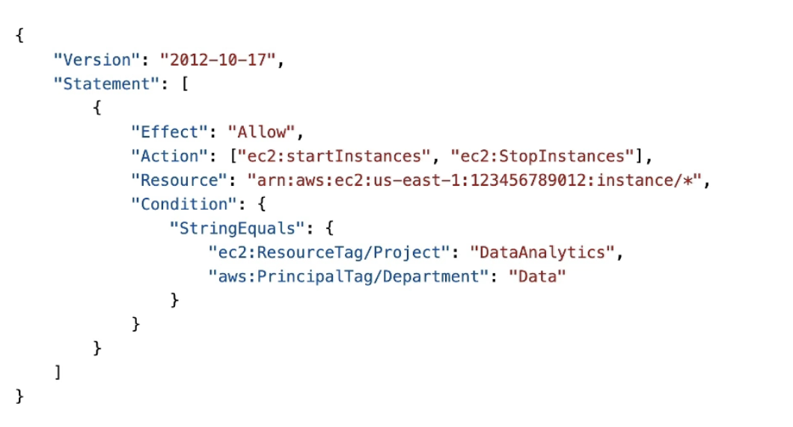
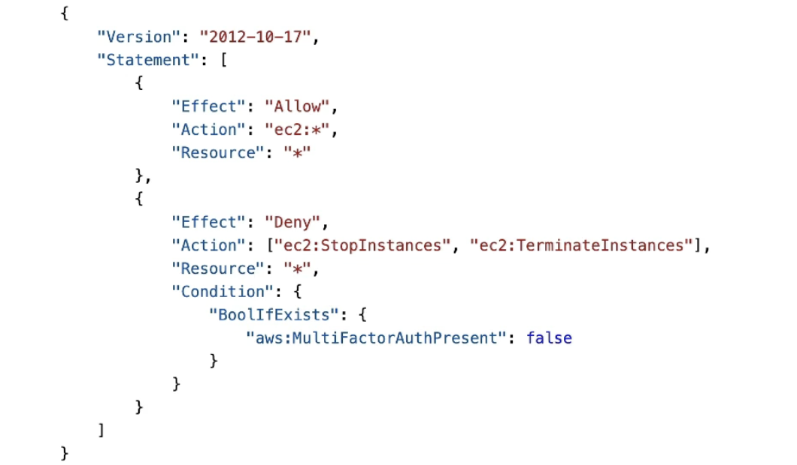
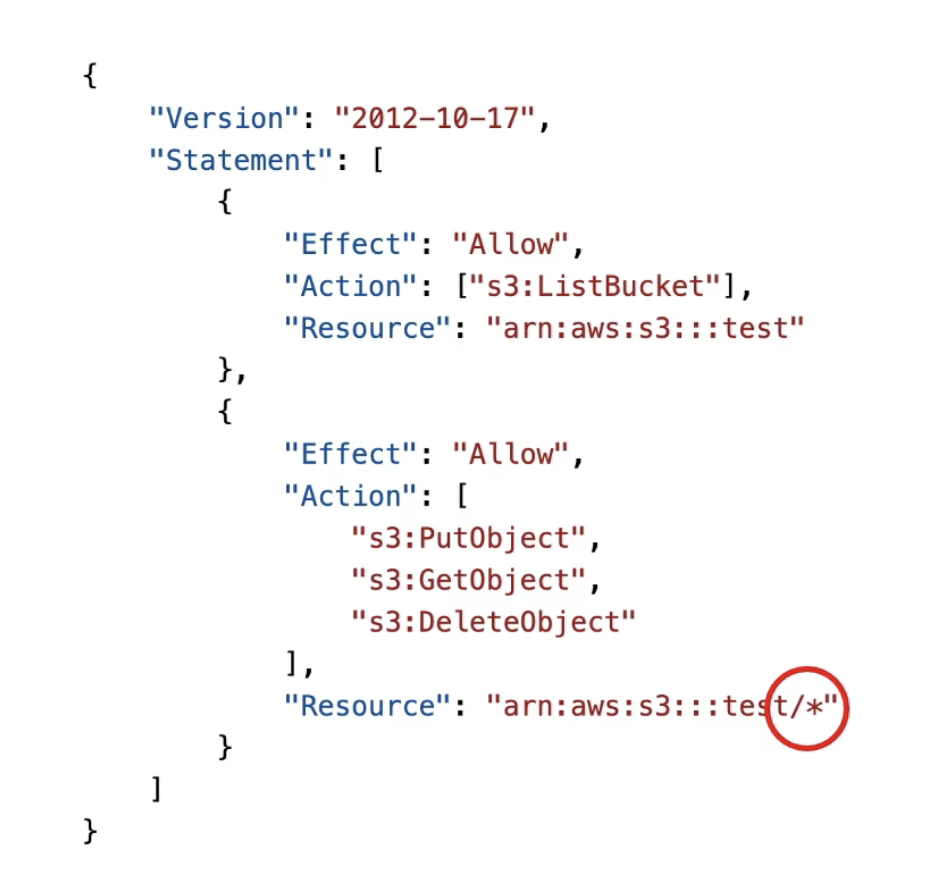

# IAM Advanced Policies

- **IAM Conditions**
    - Apply to policies within IAM. (like policies for users, resource policies, S3 buckets, endpoint policies ...)
    - **aws:SourceIp** restrict the client IP **from** which the API calls are being made.
    
    (This has Deny star on everything, unless the client makes API calls from within the specified IP address ranges.)  
    (For ex this can be used to restrict usage of AWS only to your company n/w)  
    - **aws:RequestedRegion** restricts the region the API calls are made **to**. This is also **global** because it has prefix AWS.
    
    (We deny anything on EC2, RDS, and DynamoDB if we are in region eu-central-1 or eu-west-1)
    - **ec2:ResourceTag** restricts based on tags. Here prefix is EC2 so it applies only to EC2 instances.
    
    (Here we allow start and stop instances, for any instance if the ResourceTag/Project equals DataAnalytics.)  
    (Another tag here is aws:PrincipalTag, this applies to the user tag and not on instances.)  
    (So here user should also be a part of department Data to perform the said actions)  
    - **aws:MultiFactorAuthPresent** to force MFA
    
    (User can do anything on EC2, but only stop and terminate instances if MFA is present. So this is **deny on the false.**)

- **IAM for S3**
    
    (Above is a bucket policy with 2 statements)  
    (First is the ListBucket which is a **bucket level permission**, so we need to specify the arn of the bucket itself arn:aws:s3:::test)  
    (Second applies to objects within a bucket **object level permissions**, so the arn will have /* to represent all the objects within your buckets. arn:aws:s3:::test/*)  

- **Resource Policies & aws:PrincipalOrgID**
    - aws:PrincipalOrgID can be used in any resource policies to restrict access to accounts that are member of an AWS Organization. 
