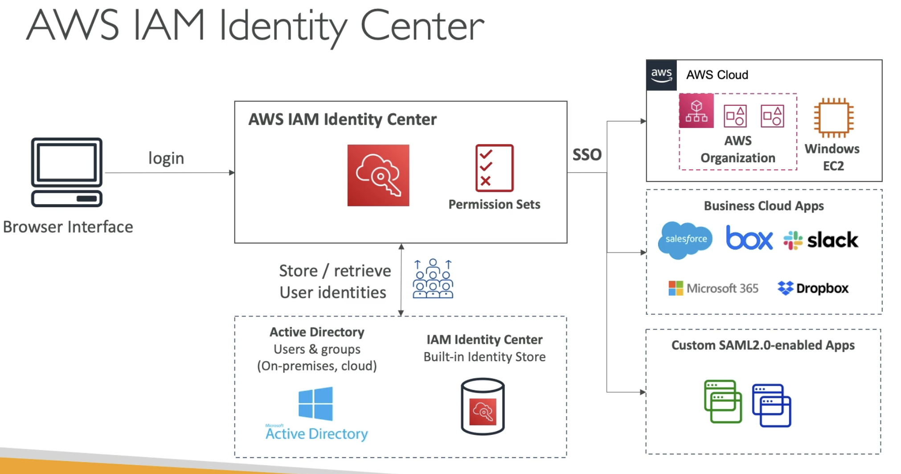
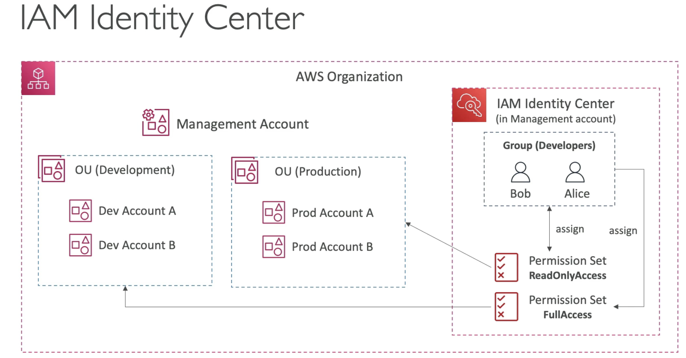
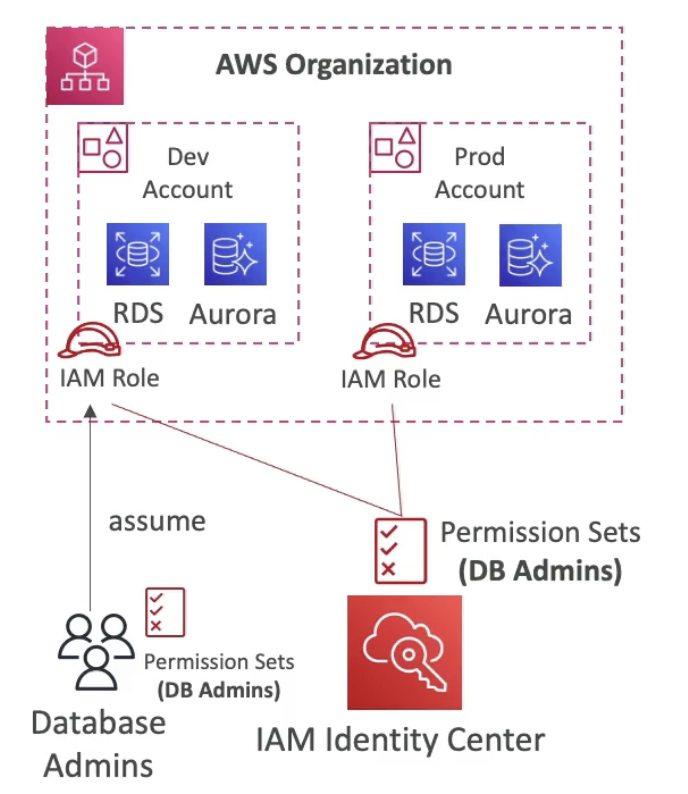

# Identity Centre

  - Successor to AWS Single Sign-on
  - One login (single sign-on) for all your
    - **AWS accounts in AWS Organizations**
    - Business cloud applications (eg Salesforce, Box, Microsoft 365, ..)
    - SAML 2.0 enabled applications
    - EC2 Windows Instances

  - Identity providers
    - Built-in identity store in IAM Identity Centre
    - 3rd party: Active Directory (AD), OneLogin, Okta ..

  - IAM Identity Centre working:
  
  (The Identity Centre needs to be integrated with user stores, like AD or the built in identity store, to manage users and groups)  
  (Next is integration with the SSO of your organization, or Windows EC2 instance, Business Cloud Apps or Custom SAML enabled apps)  
  (When you login, you dont have access to everything, you define **permission sets** to define which user has access to what.)  

  - How you relate user to groups to permission sets to assignment of specific accounts on Identity Centre.
    
  (Two developers Bob and Alice, we first create an IAM group for the developers)  
  (We want to make sure both have full access to development OU and read only access to Production OU)  
  (For development OU, we create a permission set to allow admin or FullAccess to it, and associate the permission set to the OU and assign to the developer group. This allows Bob and Alice to assume an **IAM role** which gives them admin access to the dev OU)  
  (We create another permission set with ReadOnlyAccess for Prod OU and assign this to developers)

  - **Fine Grained Permissions and Assignments** 
  

  (In the above example, there is an Identity Centre intgrated with your organization and you define permission sets for DB admins)  
  (In the permission set you define access to RDS and Aurora in dev account and same in prod account)  
  (**This automatically creates IAM role for your users**)  
  (If DB admins are a group, then users in this group when they login through Identity Centre and access console of Dev/Prod accounts, they will automatically assume IAM role in that specific account based on the permission sets assigned)  
  
    - **Multi-Account Permissions**
        - Manage access across AWS accounts in your AWS organization
        - Permission sets - **a collection of one or more IAM policies** assigned to users and groups to define AWS access.
    - **Application Assignments**
        - SSO access to many SAML 2.0 business applications (Salesforce, Box, Microsoft 365 ..)
        - Provide required URLs, certificates and metadata.
    - **Attribute-based Access Control (ABAC)**
        - Fine-grained permissions **based on user's attribute** stored in Identity Centre Identity store (like tags)
        - Example: assign a user to a cost centre, give them a title (like junior, senior), assign locale (access to specific region), ...
        - Use Case: Define the permission set once, then modify AWS access of users and groups, by **changing the attributes**.
        
